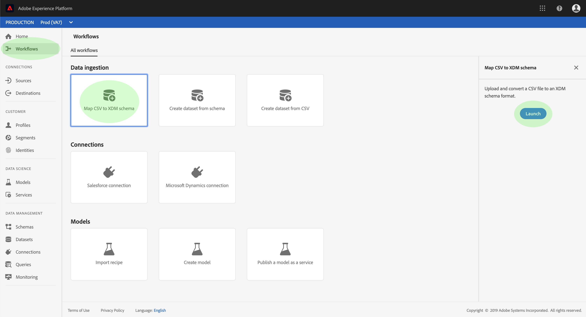
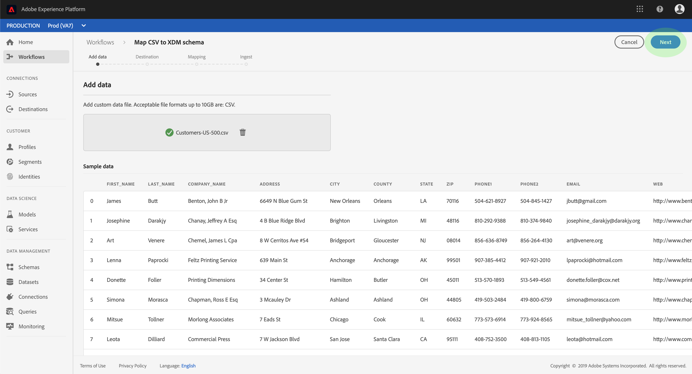
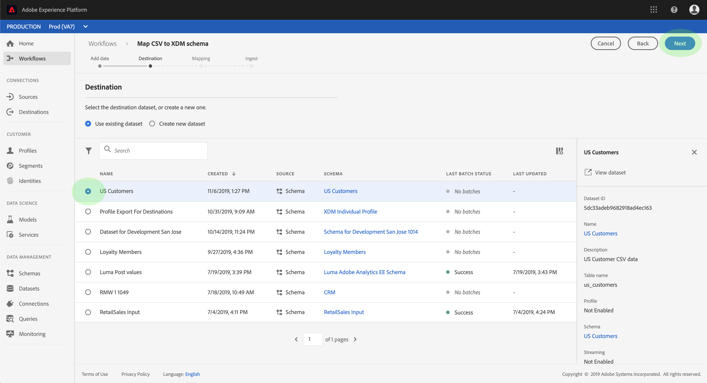
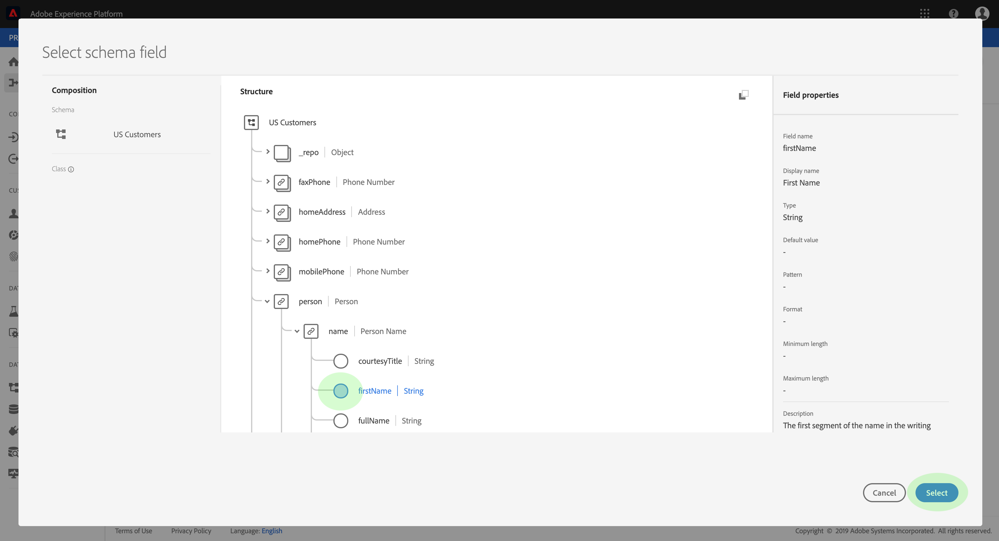
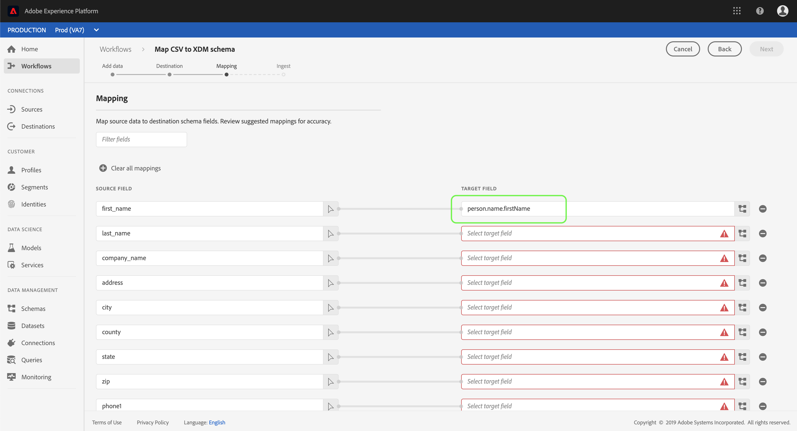
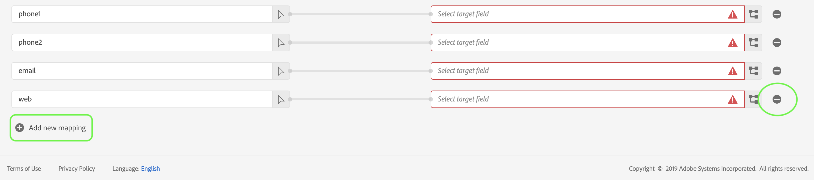
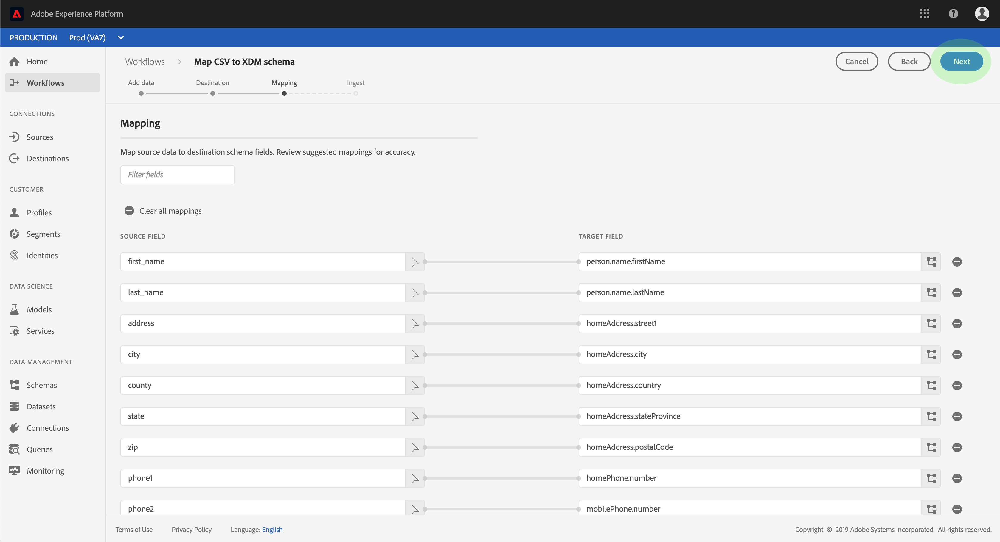
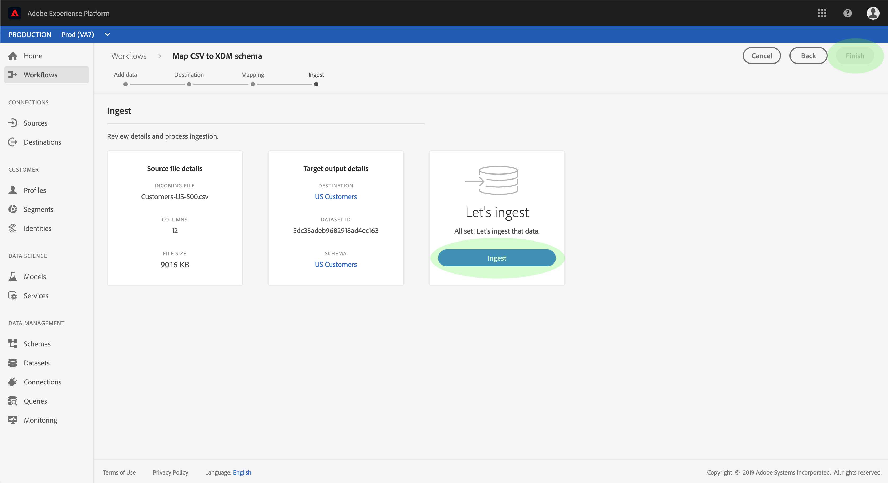

# Map a CSV file to an XDM schema

In order to ingest CSV data into Adobe Experience Platform, the data must be mapped to an Experience Data Model (XDM) schema. This tutorial covers how to map a CSV file to an XDM schema using the Experience Platform user interface.

In addition, the appendix to this tutorial provides further information regarding the use of [mapping functions](#mapping-functions).

## Getting started

This tutorial requires a working understanding of the following components of Adobe Experience Platform:

- [Experience Data Model (XDM System)](../../xdm/home.md): The standardized framework by which Experience Platform organizes customer experience data.
- [Batch ingestion](../batch-ingestion/overview.md): The method by which Platform ingests data from user-supplied datafiles.

This tutorial also requires that you have already created a dataset to ingest your CSV data into. For steps on creating a dataset in the UI, see the [data ingest tutorial](./ingest-batch-data.md).

## Add data

In the Experience Platform UI, click **Workflows** in the left navigation, then click **Map CSV to XDM schema**. In the right-hand rail that appears, click **Launch**.

The _Map CSV to XDM schema_ workflow appears, starting on the _Add data_ step. 

Drag-and-drop your CSV file into the space provided, or click **Browse** to select a file directly. A _Sample data_ section appears once the file is uploaded, showing the first ten rows of data. Once you have confirmed that the data has uploaded as expected, click **Next**.

## Choose a destination

The _Destination_ step appears. From the provided list, select the dataset that the CSV data will be ingested into, then click **Next**.

## Map CSV fields to XDM schema fields

The _Mapping_ step appears. The columns of the CSV file are listed under _Source Field_, with their corresponding XDM schema fields listed under _Target Field_. Unselected target fields are outlined in red.

To map a CSV column to an XDM field, click the schema icon next to the column's corresponding target field.

The _Select schema field_ window appears. Here you can navigate the structure of the XDM schema and locate the field you wish to map the CSV column to. Click an XDM field to select it, then click **Select**.

The _Mapping_ screen reappears, with the selected XDM field now appearing under _Target Field_.

If you do not wish to map a particular CSV column, you can remove the mapping by clicking the **remove icon** next to the target field. If you want to add a new mapping, click **Add new mapping** at the bottom of the list.

When mapping fields, you can also include functions to compute values based on input source fields. See the [mapping functions](#mapping-functions) section in the appendix for more information.

Repeat the above steps to continue mapping CSV columns to XDM fields. Once you are finished, click **Next**.

## Ingest data

The _Ingest_ step appears, allowing you to review the details of your source file and target dataset. Click **Ingest** to start ingesting the CSV data. Depending on the size of the CSV file, this process may take several minutes. The screen updates once ingestion is complete, indicating success or failure. Click **Finish** to complete the workflow.

## Next steps

By following this tutorial, you have successfully mapped a flat CSV file to an XDM schema and ingested it into Platform. This data can now be used by downstream Platform services such as Real-time Customer Profile. See the [Real-time Customer Profile overview](../../profile/home.md) for more information.

## Appendix

The following section provides additional information for mapping CSV columns to XDM fields.

### Mapping functions

Certain mapping functions can be used to compute and calculate values based on what is entered in source fields. To use a function, type it in under _Source Field_ with appropriate syntax and inputs.

For example, to concatenate **city** and **country** CSV fields and assign them to the **city** XDM field, set the source field as `concat(city, ", ", county)`.

The following table lists all supported mapping functions, including sample expressions and their resulting outputs.

| Function | Description | Sample expression | Sample output |
| -------- | ----------- | ----------------- | ------------- |
| concat | Concatenates given strings. | concat("Hi, ", "there", "!") | "Hi, there!" |
| explode | Splits the string based on a regex and returns an array of parts. | explode("Hi, there!", " ") | \["Hi,", "there"\] |
| instr | Returns the location/index of a substring. | instr("adobe.com", "com") | 6 |
| replacestr | Replaces the search string if present in original string. | replacestr("This is a string re test", "re", "replace") | "This is a string replace test" |
| substr| Returns a substring of a given length. | substr("This is a substring test", 7, 8) | " a subst" |
| lower / lcase | Converts a string to lowercase. | lower("HeLLo") lcase("HeLLo") | "hello" |
| upper / ucase | Converts a string to uppercase. | upper("HeLLo") ucase("HeLLo") | "HELLO" |
| split | Splits an input string on a separator. | split("Hello world", " ") | \["Hello", "world"\] |
| join | Joins a list of objects using the separator. | join(" ", \["Hello", "world"\]) | "Hello world" |
| coalesce | Returns the first non-null object in a given list. | coalesce(null, null, null, "first", null, "second") | "first" |
| decode | Given a key and a list of key value pairs flattened as an array, the function returns the value if key is found or return a default value if present in the array. | decode("k2", "k1", "v1", "k2", "v2", "default") | "v2" |
| iif | Evaluates a given boolean expression and returns the specified value based on the result. | iif("s".equalsIgnoreCase("S"), "True", "False") | "True" |
| min | Returns the minimum of the given arguments. Uses natural ordering. | min(3, 1, 4) | 1 |
| max | Returns the maximum of the given arguments. Uses natural ordering. | max(3, 1, 4) | 4 |
| first | Retrieves the first given argument. | first("1", "2", "3") | "1" |
| last | Retrieves the last given argument. | last("1", "2", "3") | "3" |
| uuid / guid | Generates a pseudo-random ID. | uuid() guid() | {UNIQUE_ID} |
| now | Retrieves the current time. | now() | "2019-10-23T10:10:24.556-07:00\[America/Los_Angeles\]" |
| timestamp | Retrieves the current Unix time. | timestamp() | 1571850624571 |
| format | Formats the input date according to a specified format. | format({DATE}, "yyyy-MM-dd HH:mm:ss") | "2019-10-23 11:24:35" |
| dformat | Converts a timestamp to a date string according to a specified format. | dformat(1571829875, "dd-MMM-yyyy hh:mm") | "23-Oct-2019 11:24" |
| date | Converts a date string into a ZonedDateTime object (ISO 8601 format). | date("23-Oct-2019 11:24") | "2019-10-23T11:24:00+00:00" |
| date_part | Retrieves the parts of the date. The following component values are supported:   "year" "yyyy" "yy"  "quarter" "qq" "q"  "month" "mm" "m"  "dayofyear" "dy" "y"  "day" "dd" "d"  "week" "ww" "w"  "weekday" "dw" "w"  "hour" "hh" "hh24" "hh12"  "minute" "mi" "n"  "second" "ss" "s"  "millisecond" "ms" | date_part(date("2019-10-17 11:55:12"), "MM") | 10 |
| set_date_part | Replaces a component in a given date. The following components are accepted:   "year" "yyyy" "yy"  "month" "mm" "m"  "day" "dd" "d"  "hour" "hh"  "minute" "mi" "n"  "second" "ss" "s" | set_date_part("m", 4, date("2016-11-09T11:44:44.797") | "2016-04-09T11:44:44.797" |
| make_date_time / make_timestamp | Creates a date from parts. | make_date_time(2019, 10, 17, 11, 55, 12, 999, "America/Los_Angeles") | "2019-10-17T11:55:12.0​00000999-07:00\[America/Los_Angeles\]" |
| current_timestamp | Returns the current timestamp. | current_timestamp() | 1571850624571 |
| current_date | Returns the current date without a time component. | current_date() | "18-Nov-2019" |