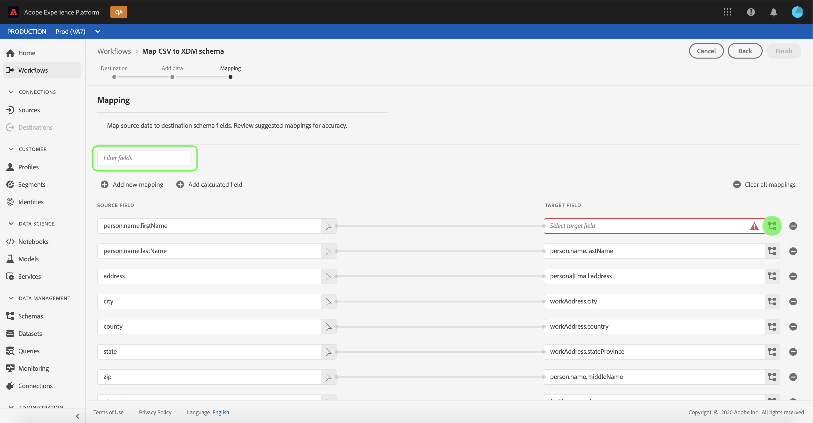
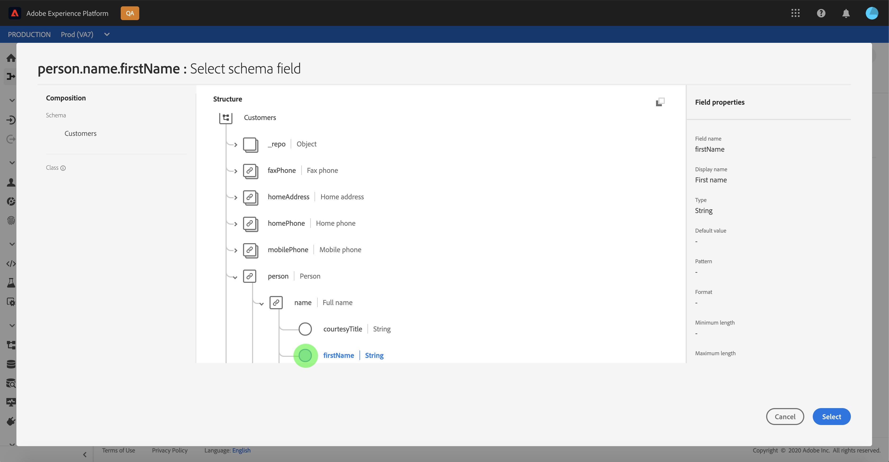
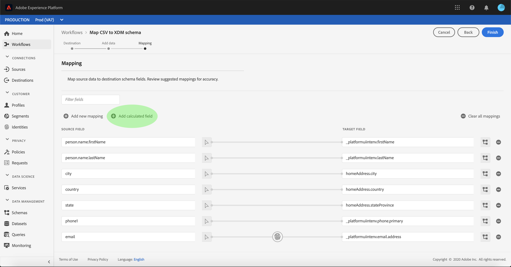
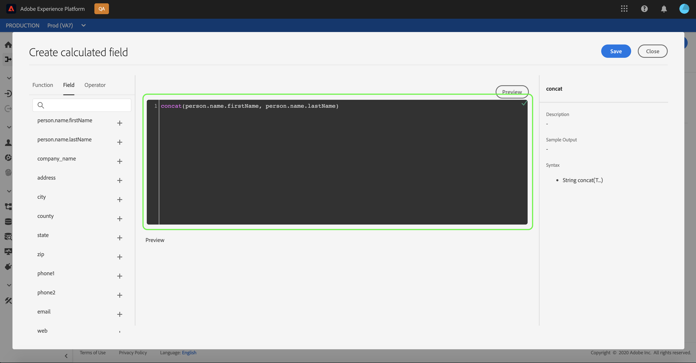
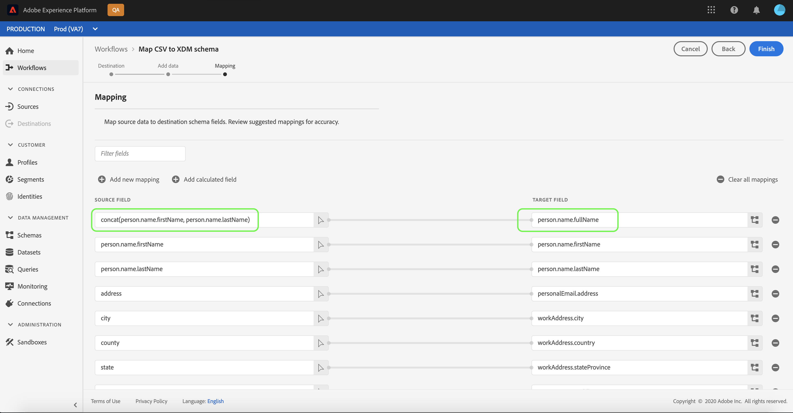
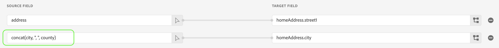

# Map a CSV file to an XDM schema

In order to ingest CSV data into [!DNL Adobe Experience Platform], the data must be mapped to an [!DNL Experience Data Model] (XDM) schema. This tutorial covers how to map a CSV file to an XDM schema using the [!DNL Platform] user interface.

In addition, the appendix to this tutorial provides further information regarding the use of [mapping functions](#mapping-functions).

## Getting started

This tutorial requires a working understanding of the following components of [!DNL Platform]:

- [[!DNL Experience Data Model (XDM System)]](../../xdm/home.md): The standardized framework by which [!DNL Platform] organizes customer experience data.
- [[!DNL Batch ingestion]](../batch-ingestion/overview.md): The method by which [!DNL Platform] ingests data from user-supplied datafiles.

This tutorial also requires that you have already created a dataset to ingest your CSV data into. For steps on creating a dataset in the UI, see the [data ingest tutorial](./ingest-batch-data.md).

## Choose a destination

Log in to [[!DNL Adobe Experience Platform]](https://platform.adobe.com) and then select **[!UICONTROL Workflows]** from the left navigation bar to access the **[!UICONTROL Workflows]** workspace.

From the **[!UICONTROL Workflows]** screen, select **[!UICONTROL Map CSV to XDM schema]** under the **[!UICONTROL Data ingestion]** section and then select **[!UICONTROL Launch]**.


The **[!UICONTROL Map CSV to XDM schema]** workflow appears, starting on the **[!UICONTROL Destination]** step. Choose a dataset for inbound data to be ingested into. You can either use an existing dataset or create a new one.

**Use an existing dataset**

To ingest your CSV data into an existing dataset, select **[!UICONTROL Use existing dataset]**. You can either retrieve an existing dataset using the search function or by scrolling through the list of existing datasets in the panel.


To ingest your CSV data into a new dataset, select **[!UICONTROL Create new dataset]** and enter a name and description for the dataset in the fields provided. Select a schema by using either the search function or by scrolling through the list of schemas provided. Select **[!UICONTROL Next]** to proceed.


## Add data

The **[!UICONTROL Add data]** step appears. Drag-and-drop your CSV file into the space provided, or select **[!UICONTROL Choose files]** to manually input your CSV file.


The **[!UICONTROL Sample data]** section appears once the file is uploaded, showing the first ten rows of data. Once you have confirmed that the data has uploaded as expected, select **[!UICONTROL Next]**.


## Map CSV fields to XDM schema fields

The **[!UICONTROL Mapping]** step appears. The columns of the CSV file are listed under **[!UICONTROL Source Field]**, with their corresponding XDM schema fields listed under **[!UICONTROL Target Field]**. Unselected target fields are outlined in red. You can use the filter fields option to narrow down the list of source fields available.

>[!TIP]
>
>[!DNL Platform] provides intelligent recommendations for auto-mapped fields based on the target schema or dataset that you selected. You can manually adjust mapping rules to suit your use cases.

To map a CSV column to an XDM field, select the schema icon next to the column's corresponding target field.



The **[!UICONTROL Select schema field]** window appears. Here you can navigate the structure of the XDM schema and locate the field you wish to map the CSV column to. Click an XDM field to select it, then click **[!UICONTROL Select]**.



After you complete the steps for the remaining unmapped source fields, the **[!UICONTROL Mapping]** screen reappears with the selected XDM field now appearing under **[!UICONTROL Target Field]**.


When mapping fields, you can also include functions to compute values based on input source fields. See the [mapping functions](#mapping-functions) section in the appendix for more information.

### Add calculated field

Calculated fields allow for values to be created based on the attributes in the input schema. These values can then be assigned to attributes in the target schema and be provided a name and description to allow for easier reference.

Select the **[!UICONTROL Add calculated field]** button to proceed.



The **[!UICONTROL Create calculated field]** panel appears. The left dialog box contains the fields, functions, and operators supported in calculated fields. Select one of the tabs to start adding functions, fields, or operators to the expression editor.


| Tab | Description |
| --------- | ----------- |
| Fields | The fields tab lists fields and attributes available in the source schema. |
| Functions | The functions tab lists the functions available to transform the data. |
| Operators | The operators tab lists the operators that are available to transform the data. |

You can manually add fields, functions, and operators using the expression editor at the center. Select the editor to start creating an expression.



Select **[!UICONTROL Save]** to proceed.

The mapping screen reappears with your newly created source field. Apply the appropriate corresponding target field and select **[!UICONTROL Finish]** to complete the mapping.



## Monitor your dataflow

Once your CSV file is mapped and created, you can monitor the data that is being ingested through it. For more information on monitoring dataflows, see the tutorial on [monitoring streaming dataflows](../../ingestion/quality/monitor-data-flows.md).

## Next steps

By following this tutorial, you have successfully mapped a flat CSV file to an XDM schema and ingested it into [!DNL Platform]. This data can now be used by downstream [!DNL Platform] services such as [!DNL Real-time Customer Profile]. See the overview for [[!DNL Real-time Customer Profile]](../../profile/home.md) for more information.

## Appendix

The following section provides additional information for mapping CSV columns to XDM fields.

### Supported date functions

When string fields from incoming data are mapped to date fields in XDM, the date format must be explicitly mentioned. When not specified, Platform will attempt to convert the input data by matching it to the following formats. Once a matching format is found, it wil stop evaluating any subsequent formats.

```console
"yyyy-MM-dd HH:mm:ssZ",
"yyyy-MM-dd HH:mm:ss.SSSZ",
"yyyy-MM-dd HH:mm:ss.SSS",
"yyyy-MM-dd'T'HH:mm:ss.SSSX",
"yyyy-MM-dd'T'HH:mm:ss'Z'",
"yyyy-MM-dd",
"yyyy/MM/dd",
"yyyy.MM.dd",
"yyyy-MMM-dd",
"yyyyMMdd",
"MM-dd-yyyy",
"MMddyyyy",
"M/dd/yyyy",
"dd.M.yyyy",
"M/dd/yyyy hh:mm:ss a",
"dd.M.yyyy hh:mm:ss a",
"dd.MMM.yyyy",
"dd-MMM-yyyy"
```

>[!IMPORTANT]
>
> Platform will try to convert strings to dates as best as possible. However, these conversions can lead to undesirable results. For example, the string value "11112020" 

### Mapping functions

Certain mapping functions can be used to compute and calculate values based on what is entered in source fields. To use a function, type it in under **[!UICONTROL Source Field]** with appropriate syntax and inputs.

For example, to concatenate **city** and **country** CSV fields and assign them to the **city** XDM field, set the source field as `concat(city, ", ", county)`.



The following tables list all supported mapping functions, including sample expressions and their resulting outputs.

**String functions**

| Function | Description | Parameters | Syntax | Expression | Sample output |
| -------- | ----------- | ---------- | -------| ---------- | ------------- |
| concat | Concatenates the given strings. | <ul><li>STRING: The strings that will be concatenated.</li></ul> | concat(STRING_1, STRING_2) | concat("Hi, ", "there", "!") | `"Hi, there!"` |
| explode | Splits the string based on a regex and returns an array of parts. Can optionally include regex to split the string. By default, the splitting resolves to ",". | <ul><li>STRING: **Required** The string that needs to be split.</li><li>REGEX: *Optional* The regular expression that can be used to split the string. | explode(STRING, REGEX) | explode("Hi, there!", " ") | `["Hi,", "there"]` |
| instr | Returns the location/index of a substring. </li></ul>| <ul><li>INPUT: **Required** The string that is being searched.</li><li>SUBSTRING: **Required** The substring that is being searched for within the string.</li><li>START_POSITION: *Optional* The location of where to start looking in the string.</li><li>OCCURRENCE: *Optional* The nth occurrence to look for from the start position. By default, it is 1. </li></ul> | instr(INPUT, SUBSTRING, START_POSITION, OCCURRENCE) | instr("adobe`<span>`.com", "com") | 6 |
| replacestr | Replaces the search string if present in original string. | <ul><li>INPUT: **Required** The input string.</li><li>TO_FIND: **Required** The string to look up within the input.</li><li>TO_REPLACE: **Required** The string that will replace the value within "TO_FIND".</li></ul> | replacestr(INPUT, TO_FIND, TO_REPLACE) | replacestr("This is a string re test", "re", "replace") | "This is a string replace test" |
| substr| Returns a substring of a given length. | <ul><li>INPUT: **Required** The input string.</li><li>START_INDEX: **Required** The index of the input string where the substring starts.</li><li>LENGTH: **Required** The length of the substring.</li></ul> | substr(INPUT, START_INDEX, LENGTH) | substr("This is a substring test", 7, 8) | " a subst" |
| lower /<br>lcase | Converts a string to lowercase. | <ul><li>INPUT: **Required** The string that will be converted to lowercase.</li></ul> | lower(INPUT) | lower("HeLLo")<br>lcase("HeLLo") | "hello" |
| upper /<br>ucase | Converts a string to uppercase. | <ul><li>INPUT: **Required** The string that will be converted to uppercase.</li></ul> | upper(INPUT) | upper("HeLLo")<br>ucase("HeLLo") | "HELLO" |
| split | Splits an input string on a separator. | <ul><li>INPUT: **Required** The input string that is going to be split.</li><li>SEPARATOR: **Required** The string that is used to split the input. | split(INPUT, SEPARATOR) | split("Hello world", " ") | `["Hello", "world"]` |
| join | Joins a list of objects using the separator. | <ul><li>SEPARATOR: **Required** The string that will be used to join the objects.</li><li>OBJECTS: **Required** An array of strings that will be joined.</li></ul> | join(SEPARATOR, [OBJECTS]) | `join(" ", ["Hello", "world"])` | "Hello world" |
| lpad | Pads the left side of a string with the other given string. | <ul><li>INPUT: **Required** The string that is going to be padded out. This string can be null.</li><li>COUNT: **Required** The size of the string to be padded out.</li><li>PADDING: **Required** The string to pad the input with. If null or empty, it will be treated as a single space.</li></ul> | lpad(INPUT, COUNT, PADDING) | lpad("bat", 8, "yz") | "yzyzybat" | 
| rpad | Pads the right side of a string with the other given string. | <ul><li>INPUT: **Required** The string that is going to be padded out. This string can be null.</li><li>COUNT: **Required** The size of the string to be padded out.</li><li>PADDING: **Required** The string to pad the input with. If null or empty, it will be treated as a single space.</li></ul> | rpad(INPUT, COUNT, PADDING) | rpad("bat", 8, "yz") | "batyzyzy" | 
| left | Gets the first "n" characters of the given string. | <ul><li>STRING: **Required** The string you are getting the first "n" characters for.</li><li>COUNT: **Required**The "n" characters you want to get from the string.</li></ul> | left(STRING, COUNT) | left("abcde", 2) | "ab" |
| right | Gets the last "n" characters of the given string. | <ul><li>STRING: **Required** The string you are getting the last "n" characters for.</li><li>COUNT: **Required**The "n" characters you want to get from the string.</li></ul> | right(STRING, COUNT) | right("abcde", 2) | "de" |
| ltrim | Removes the whitespace from the beginning of the string. | <ul><li>STRING: **Required** The string you want to remove the whitespace from.</li></ul> | ltrim(STRING) | ltrim(" hello") | "hello" |
| rtrim | Removes the whitespace from the end of the string. | <ul><li>STRING: **Required** The string you want to remove the whitespace from.</li></ul> | rtrim(STRING) | rtrim("hello ") | "hello" |
| trim | Removes the whitespace from the beginning and the end of the string. | <ul><li>STRING: **Required** The string you want to remove the whitespace from.</li></ul> | trim(STRING) | trim(" hello ") | "hello" |
| equals | Compares two strings to confirm if they are equal. This function is case sensitive. | <ul><li>STRING1: **Required** The first string you want to compare.</li><li>STRING2: **Required** The second string you want to compare.</li></ul> | STRING1.equals(STRING2) | "string1".equals("STRING1) | false |
| equalsIgnoreCase | Compares two strings to confirm if they are equal. This function is **not** case sensitive. | <ul><li>STRING1: **Required** The first string you want to compare.</li><li>STRING2: **Required** The second string you want to compare.</li></ul> | STRING1.equalsIgnoreCase(STRING2) | "string1".equalsIgnoreCase("STRING1) | true |

**Hashing functions**

| Function | Description | Parameters | Syntax | Expression | Sample output |
| -------- | ----------- | ---------- | -------| ---------- | ------------- |
| sha1 | Takes an input and produces a hash value using Secure Hash Algorithm 1 (SHA-1). | <ul><li>INPUT: **Required** The plain text to be hashed.</li><li>CHARSET: *Optional* The name of the character set. Possible values include UTF-8, UTF-16, ISO-8859-1, and US-ASCII.</li></ul> | sha1(INPUT, CHARSET) | sha1("my text", "UTF-8") | c3599c11e47719df18a2448690840c5dfcce3c80 |
| sha256 | Takes an input and produces a hash value using Secure Hash Algorithm 256 (SHA-256). | <ul><li>INPUT: **Required** The plain text to be hashed.</li><li>CHARSET: *Optional* The name of the character set. Possible values include UTF-8, UTF-16, ISO-8859-1, and US-ASCII.</li></ul> | sha256(INPUT, CHARSET) | sha256("my text", "UTF-8") | 7330d2b39ca35eaf4cb95fc846c21ee6a39af698154a83a586ee270a0d372104 |
| sha512 | Takes an input and produces a hash value using Secure Hash Algorithm 512 (SHA-512). | <ul><li>INPUT: **Required** The plain text to be hashed.</li><li>CHARSET: *Optional* The name of the character set. Possible values include UTF-8, UTF-16, ISO-8859-1, and US-ASCII.</li></ul> | sha512(INPUT, CHARSET) | sha512("my text", "UTF-8") | a3d7e45a0d9be5fd4e4b9a3b8c9c2163c21ef708bf11b4232bb21d2a8704ada2cdcd7b367dd0788a89a5c908cfe377aceb1072a7b386b7d4fd2ff68a8fd24d16 |
| md5 | Takes an input and produces a hash value using MD5. | <ul><li>INPUT: **Required** The plain text to be hashed.</li><li>CHARSET: *Optional* The name of the character set. Possible values include UTF-8, UTF-16, ISO-8859-1, and US-ASCII. </li></ul>| md5(INPUT, CHARSET) | md5("my text", "UTF-8") | d3b96ce8c9fb4e9bd0198d03ba6852c7 |
| crc32 | Takes an input uses a cyclic redundancy check (CRC) algorithm to produce a 32-bit cyclic code. | <ul><li>INPUT: **Required** The plain text to be hashed.</li><li>CHARSET: *Optional* The name of the character set. Possible values include UTF-8, UTF-16, ISO-8859-1, and US-ASCII.</li></ul> | crc32(INPUT, CHARSET) | crc32("my text", "UTF-8") | 8df92e80 |

**URL functions**

| Function | Description | Parameters | Syntax | Expression | Sample output |
| -------- | ----------- | ---------- | -------| ---------- | ------------- |
| get_url_protocol | Returns the protocol from the given URL. If the input is invalid, it returns null. | <ul><li>URL: **Required** The URL from which the protocol needs to be extracted.</li></ul> | get_url_protocol(URL) | get_url_protocol("https://platform.adobe.com/home") | https |
| get_url_host | Returns the host of the given URL. If the input is invalid, it returns null. | <ul><li>URL: **Required** The URL from which the host needs to be extracted.</li></ul> | get_url_host(URL) | get_url_host("https://platform.adobe.com/home") | platform.adobe.com |
| get_url_port | Returns the port of the given URL. If the input is invalid, it returns null. | <ul><li>URL: **Required** The URL from which the port needs to be extracted.</li></ul> | get_url_port(URL) | get_url_port("sftp://example.com//home/joe/employee.csv") | 22 |
| get_url_path | Returns the path of the given URL. By default, the full path is returned. | <ul><li>URL: **Required** The URL from which the path needs to be extracted.</li><li>FULL_PATH: *Optional* A boolean value that determines if the full path is returned. If set to false, only the end of the path is returned. | get_url_path(URL, FULL_PATH) | get_url_path("sftp://example.com//home/joe/employee.csv") | "//home/joe/employee.csv" |
| get_url_query_str | Returns the query string of a given URL. | <ul><li>URL: **Required** The URL that you are trying to get the query string from.</li><li>ANCHOR: **Required** Determines what will be done with the anchor in the query string. Can be one of three values: "retain", "remove", or "append".<br><br>If the value is "retain", the anchor will be attached to the returned value.<br>If the value is "remove", the anchor will be removed from the returned value.<br>If the value is "append", the anchor will be returned as a separate value.</li></ul> | get_url_query_str(URL, ANCHOR) | get_url_query_str("foo://example.com:8042/over/there?name=ferret#nose", "retain")<br>get_url_query_str("foo://example.com:8042/over/there?name=ferret#nose", "remove")<br>get_url_query_str("foo://example.com:8042/over/there?name=ferret#nose", "append") | `{"name": "ferret#nose"}`<br>`{"name": "ferret"}`<br>`{"name": "ferret", "_anchor_": "nose"}` |

**Date and time functions**

| Function | Description | Parameters | Syntax | Expression | Sample output |
| -------- | ----------- | ---------- | -------| ---------- | ------------- |
| now | Retrieves the current time. | | now() | now() | `2020-09-23T10:10:24.556-07:00[America/Los_Angeles]` |
| timestamp | Retrieves the current Unix time. | | timestamp() | timestamp() | 1571850624571 |
| format | Formats the input date according to a specified format. | <ul><li>DATE: **Required** The input date, as a ZonedDateTime object, that you want to format.</li><li>FORMAT: **Required** The format that you want the date to be changed to.</li></ul> | format(DATE, FORMAT)  | format(2019-10-23T11:24:00+00:00, "yyyy-MM-dd HH:mm:ss") | "2019-10-23 11:24:35" |
| dformat | Converts a timestamp to a date string according to a specified format. | <ul><li>TIMESTAMP: **Required** The timestamp you want to format. This is written in milliseconds.</li><li>FORMAT: **Required** The format that you want the timestamp to be changed to.</li></ul> | dformat(TIMESTAMP, FORMAT) | dformat(1571829875, "dd-MMM-yyyy hh:mm") | "23-Oct-2019 11:24" |
| date | Converts a date string into a ZonedDateTime object (ISO 8601 format). | <ul><li>DATE: **Required** The string that represents the date.</li><li>FORMAT: **Required** The string representing the format of the date.</li><li>DEFAULT_DATE: **Required** The default date returned, if the date provided is null.</li></ul> | date(DATE, FORMAT, DEFAULT_DATE) | date("23-Oct-2019 11:24", "yyyy/MM/dd", now()) | "2019-10-23T11:24:00+00:00" |
| date | Converts a date string into a ZonedDateTime object (ISO 8601 format). | <ul><li>DATE: **Required** The string that represents the date.</li><li>FORMAT: **Required** The string representing the format of the date.</li></ul> | date(DATE, FORMAT) | date("23-Oct-2019 11:24") | "2019-10-23T11:24:00+00:00" |
| date | Converts a date string into a ZonedDateTime object (ISO 8601 format). | <ul><li>DATE: **Required** The string that represents the date.</li></ul> | date(DATE) | date("23-Oct-2019 11:24", "yyyy/MM/dd") | "2019-10-23T11:24:00+00:00" |
| date_part | Retrieves the parts of the date. The following component values are supported: <br><br>"year"<br>"yyyy"<br>"yy"<br><br>"quarter"<br>"qq"<br>"q"<br><br>"month"<br>"mm"<br>"m"<br><br>"dayofyear"<br>"dy"<br>"y"<br><br>"day"<br>"dd"<br>"d"<br><br>"week"<br>"ww"<br>"w"<br><br>"weekday"<br>"dw"<br>"w"<br><br>"hour"<br>"hh"<br>"hh24"<br>"hh12"<br><br>"minute"<br>"mi"<br>"n"<br><br>"second"<br>"ss"<br>"s"<br><br>"millisecond"<br>"ms" | <ul><li>COMPONENT: **Required** A string representing the part of the date. </li><li>DATE: **Required** The date, in a standard format.</li></ul> | date_part(COMPONENT, DATE) | date_part("MM", date("2019-10-17 11:55:12")) | 10 |
| set_date_part | Replaces a component in a given date. The following components are accepted: <br><br>"year"<br>"yyyy"<br>"yy"<br><br>"month"<br>"mm"<br>"m"<br><br>"day"<br>"dd"<br>"d"<br><br>"hour"<br>"hh"<br><br>"minute"<br>"mi"<br>"n"<br><br>"second"<br>"ss"<br>"s" | <ul><li>COMPONENT: **Required** A string representing the part of the date. </li><li>VALUE: **Required** The value to set for the component for a given date.</li><li>DATE: **Required** The date, in a standard format.</li></ul> | set_date_part(COMPONENT, VALUE, DATE) | set_date_part("m", 4, date("2016-11-09T11:44:44.797") | "2016-04-09T11:44:44.797" |
| make_date_time | Creates a date from parts. This function can also be induced using make_timestamp. | <ul><li>YEAR: **Required** The year, written in four digits.</li><li>MONTH: **Required** The month. The allowed values are 1 to 12.</li><li>DAY: **Required** The day. The allowed values are 1 to 31.</li><li>HOUR: **Required** The hour. The allowed values are 0 to 23.</li><li>MINUTE: **Required** The minute. The allowed values are 0 to 59.</li><li>NANOSECOND: **Required** The nanosecond values. The allowed values are 0 to 999999999.</li><li>TIMEZONE: **Required** The timezone for the date time.</li></ul> | make_date_time(YEAR, MONTH, DAY, HOUR, MINUTE, SECOND, NANOSECOND, TIMEZONE) |make_date_time(2019, 10, 17, 11, 55, 12, 999, "America/Los_Angeles") | `2019-10-17T11:55:12.0​00000999-07:00[America/Los_Angeles]` |
| zone_date_to_utc | Converts a date in any timezone to a date in UTC. | <ul><li>DATE: **Required** The date that you are trying to convert.</li></ul> | zone_date_to_utc(DATE) | `zone_date_to_utc(2019-10-17T11:55:12.000000999-07:00[America/Los_Angeles])` | `2019-10-17T18:55:12.000000999Z[UTC]` |
| zone_date_to_zone | Converts a date from one timezone to another timezone. | <ul><li>DATE: **Required** The date that you are trying to convert.</li><li>ZONE: **Required** The timezone that you are trying to convert the date to.</li></ul> | zone_date_to_zone(DATE, ZONE) | `zone_date_to_utc(2019-10-17T11:55:12.000000999-07:00[America/Los_Angeles], "Europe/Paris")` | `2019-10-17T20:55:12.000000999+02:00[Europe/Paris]` |

**Hierarchies - Objects**

| Function | Description | Parameters | Syntax | Expression | Sample output |
| -------- | ----------- | ---------- | -------| ---------- | ------------- |
| size_of | Returns the size of the input. | <ul><li>INPUT: **Required** The object that you're trying to find the size of.</li></ul> | size_of(INPUT) | `size_of([1, 2, 3, 4])` | 4 |
| is_empty | Checks whether or not an object is empty. | <ul><li>INPUT: **Required** The object that you're trying to check is empty.</li></ul> | is_empty(INPUT) | `is_empty([1, 2, 3])` | false |
| arrays_to_object | Creates a list of objects. | <ul><li>INPUT: **Required** A grouping of key and array pairs.</li></ul> | arrays_to_object(INPUT) | need sample | need sample |
| to_object | Creates an object based on the flat key/value pairs given. | <ul><li>INPUT: **Required** A flat list of key/value pairs.</li></ul> | to_object(INPUT) | to_object("firstName", "John", "lastName", "Doe") | `{"firstName": "John", "lastName": "Doe"}` |
| str_to_object | Creates an object from the input string. | <ul><li>STRING: **Required** The string that is being parsed to create an object.</li><li>VALUE_DELIMITER: *Optional* The delimiter that separates a field from the value. The default delimiter is `:`.</li><li>FIELD_DELIMITER: *Optional* The delimiter that separates field value pairs. The default delimiter is `,`.</li></ul> | str_to_object(STRING, VALUE_DELIMITER, FIELD_DELIMITER) | str_to_object("firstName - John | lastName - | phone - 123 456 7890", "-", "|") | `{"firstName": "John", "lastName": "Doe", "phone": "123 456 7890"}` |
| is_set | Checks if the object exists within the source data. | <ul><li>INPUT: **Required** The path to be checked if it exists within the source data.</li></ul> | is_set(INPUT) | is_set("evars.evar.field1") | true |

**Hierarchies - Arrays**

| Function | Description | Parameters | Syntax | Expression | Sample output |
| -------- | ----------- | ---------- | -------| ---------- | ------------- |
| coalesce | Returns the first non-null object in a given array. | <ul><li>INPUT: **Required** The array you want to find the first non-null object of.</li></ul> | coalesce(INPUT) | coalesce(null, null, null, "first", null, "second") | "first" |
| first | Retrieves the first element of the given array. | <ul><li>INPUT: **Required** The array you want to find the first element of.</li></ul> | first(INPUT) |  first("1", "2", "3") | "1" |
| last | Retrieves the last element of the given array. | <ul><li>INPUT: **Required** The array you want to find the last element of.</li></ul> | last(INPUT) |  last("1", "2", "3") | "3" |
| to_array | Takes a list of inputs and converts it to an array. | <ul><li>INCLUDE_NULLS: **Required** A boolean value to indicate whether or not to include nulls in the response array.</li><li>VALUES: **Required** The elements that are to be converted to an array.</li></ul> | to_array(INCLUDE_NULLS, VALUES) | to_array(false, 1, null, 2, 3) | `[1, 2, 3]` |

**Logical operators**

| Function | Description | Parameters | Syntax | Expression | Sample output |
| -------- | ----------- | ---------- | -------| ---------- | ------------- |
| decode | Given a key and a list of key value pairs flattened as an array, the function returns the value if key is found or return a default value if present in the array. | <ul><li>KEY: **Required** The key to be matched.</li><li>OPTIONS: **Required** A flattened array of key/value pairs. Optionally, a default value can be put at the end.</li></ul> | decode(KEY, OPTIONS) | decode(stateCode, "ca", "California", "pa", "Pennsylvania", "N/A") | If the stateCode given is "ca", "California".<br>If the stateCode given is "pa", "Pennsylvania".<br>If the stateCode doesn't match the following, "N/A". |
| iif | Evaluates a given boolean expression and returns the specified value based on the result. | <ul><li>BOOLEAN_EXPRESSION: **Required** The boolean expression that is being evaluated.</li><li>TRUE_VALUE: **Required** The value that is returned if the expression evaluates to true.</li><li>FALSE_VALUE: **Required** The value that is returned if the expression evaluates to false.</li></ul> | iif(BOOLEAN_EXPRESSION, TRUE_VALUE, FALSE_VALUE) | iif("s".equalsIgnoreCase("S"), "True", "False") | "True" |

**Aggregation**

| Function | Description | Parameters | Syntax | Expression | Sample output |
| -------- | ----------- | ---------- | -------| ---------- | ------------- |
| min | Returns the minimum of the given arguments. Uses natural ordering. | <ul><li>OPTIONS: **Required** One or more objects that can be compared to each other.</li></ul> | min(OPTIONS) | min(3, 1, 4) | 1 |
| max | Returns the maximum of the given arguments. Uses natural ordering. | <ul><li>OPTIONS: **Required** One or more objects that can be compared to each other.</li></ul> | max(OPTIONS) | max(3, 1, 4) | 4 |

**Type conversions**

| Function | Description | Parameters | Syntax | Expression | Sample output |
| -------- | ----------- | ---------- | -------| ---------- | ------------- |
| to_bigint | Converts a string to a BigInteger. | <ul><li>STRING: **Required** The string that is to be converted to a BigInteger.</li></ul> | to_bigint(STRING) | to_bigint("1000000.34") | 1000000.34 |
| to_decimal | Converts a string to a Double. | <ul><li>STRING: **Required** The string that is to be converted to a Double.</li></ul> | to_decimal(STRING) | to_decimal("20.5") | 20.5 |
| to_float | Converts a string to a Float. | <ul><li>STRING: **Required** The string that is to be converted to a Float.</li></ul> | to_float(STRING) | to_float("12.3456") | 12.34566 |
| to_integer | Converts a string to an Integer. | <ul><li>STRING: **Required** The string that is to be converted to a Integer.</li></ul> | to_integer(STRING) | to_integer("12") | 12 |

**JSON functions**

| Function | Description | Parameters | Syntax | Expression | Sample output |
| -------- | ----------- | ---------- | -------| ---------- | ------------- |
| json_to_object | Deserialize JSON content from the given string. | <ul><li>STRING: **Required** The JSON string to be deserialized.</li></ul> | json_to_object(STRING) | json_to_object({"info":{"firstName":"John","lastName" : "Doe"}}) | An object representing the JSON. |

**Special operations**

| Function | Description | Parameters | Syntax | Expression | Sample output |
| -------- | ----------- | ---------- | -------| ---------- | ------------- |
| uuid /<br>guid | Generates a pseudo-random ID. | | uuid()<br>guid() | uuid()<br>guid() | 7c0267d2-bb74-4e1a-9275-3bf4fccda5f4<br>c7016dc7-3163-43f7-afc7-2e1c9c206333 |

**User agent functions**

| Function | Description | Parameters | Syntax | Expression | Sample output |
| -------- | ----------- | ---------- | -------| ---------- | ------------- |
| ua_os_name | Extracts the operating system name from the user agent string. | <ul><li>USER_AGENT: **Required** The user agent string.</li></ul> | ua_os_name(USER_AGENT) | ua_os_name("Mozilla/5.0 (iPhone; CPU iPhone OS 5_1_1 like Mac OS X) AppleWebKit/534.46 (KHTML, like Gecko) Version/5.1 Mobile/9B206 Safari/7534.48.3") | iOS |
| ua_os_version_major | Extracts the operating system's major version from the user agent string. | <ul><li>USER_AGENT: **Required** The user agent string.</li></ul> | ua_os_version_major(USER_AGENT) | ua_os_version_major("Mozilla/5.0 (iPhone; CPU iPhone OS 5_1_1 like Mac OS X) AppleWebKit/534.46 (KHTML, like Gecko) Version/5.1 Mobile/9B206 Safari/7534.48.3") | iOS 5 |
| ua_os_version | Extracts the operating system's version from the user agent string. | <ul><li>USER_AGENT: **Required** The user agent string.</li></ul> | ua_os_version(USER_AGENT) | ua_os_version("Mozilla/5.0 (iPhone; CPU iPhone OS 5_1_1 like Mac OS X) AppleWebKit/534.46 (KHTML, like Gecko) Version/5.1 Mobile/9B206 Safari/7534.48.3") | 5.1.1 |
| ua_os_name_version | Extracts the operating system's name and version from the user agent string. | <ul><li>USER_AGENT: **Required** The user agent string.</li></ul> | ua_os_name_version(USER_AGENT) | ua_os_name_version("Mozilla/5.0 (iPhone; CPU iPhone OS 5_1_1 like Mac OS X) AppleWebKit/534.46 (KHTML, like Gecko) Version/5.1 Mobile/9B206 Safari/7534.48.3") | iOS 5.1.1 |
| ua_agent_version | Extracts the agent version from the user agent string. | <ul><li>USER_AGENT: **Required** The user agent string.</li></ul> | ua_agent_version(USER_AGENT) | ua_agent_version("Mozilla/5.0 (iPhone; CPU iPhone OS 5_1_1 like Mac OS X) AppleWebKit/534.46 (KHTML, like Gecko) Version/5.1 Mobile/9B206 Safari/7534.48.3") | 5.1 |
| ua_agent_version_major | Extracts the agent name and major version from the user agent string. | <ul><li>USER_AGENT: **Required** The user agent string.</li></ul> | ua_agent_version_major(USER_AGENT) | ua_agent_version_major("Mozilla/5.0 (iPhone; CPU iPhone OS 5_1_1 like Mac OS X) AppleWebKit/534.46 (KHTML, like Gecko) Version/5.1 Mobile/9B206 Safari/7534.48.3") | Safari 5 |
| ua_agent_name | Extracts the agent name from the user agent string. | <ul><li>USER_AGENT: **Required** The user agent string.</li></ul> | ua_agent_name(USER_AGENT) | ua_agent_name("Mozilla/5.0 (iPhone; CPU iPhone OS 5_1_1 like Mac OS X) AppleWebKit/534.46 (KHTML, like Gecko) Version/5.1 Mobile/9B206 Safari/7534.48.3") | Safari |
| ua_device_class| Extracts the device class from the user agent string. | <ul><li>USER_AGENT: **Required** The user agent string.</li></ul> | ua_device_class(USER_AGENT) | ua_device_class("Mozilla/5.0 (iPhone; CPU iPhone OS 5_1_1 like Mac OS X) AppleWebKit/534.46 (KHTML, like Gecko) Version/5.1 Mobile/9B206 Safari/7534.48.3") | Phone |
