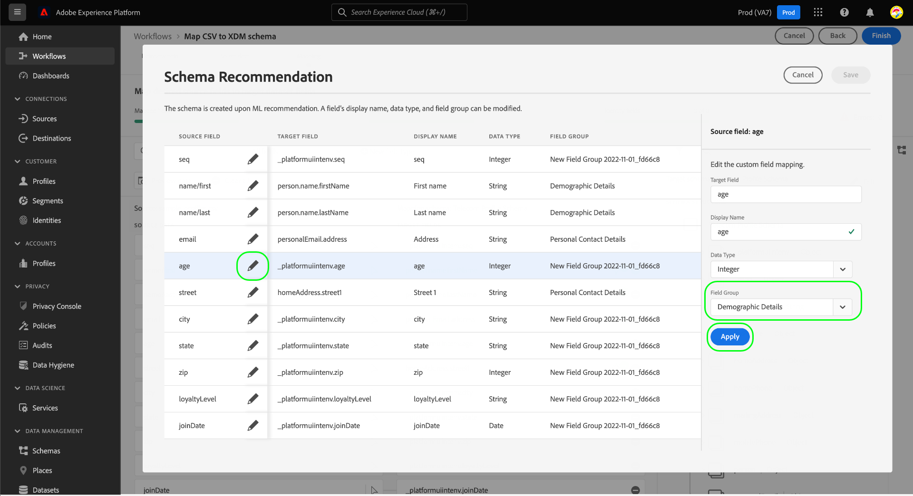

# Map a CSV file to an XDM schema using AI-generated recommendations (Beta)

>[!IMPORTANT]
>
>This feature is currently in beta and your organization may not have access to it yet. The documentation and functionality are subject to change.
>
>For information on generally available CSV mapping capabilities in Platform, see the document on [mapping a CSV file to an existing schema](./existing-schema.md).

In order to ingest CSV data into [!DNL Adobe Experience Platform], the data must be mapped to an [!DNL Experience Data Model] (XDM) schema. You can choose to map to [an existing schema](./existing-schema.md), but if you do not know exactly which schema to use or how it should be structured, you can instead use dynamic recommendations based on machine-learning (ML) models within the Platform UI.

## Getting started

This tutorial requires a working understanding of the following components of [!DNL Platform]:

* [[!DNL Experience Data Model (XDM System)]](../../../xdm/home.md): The standardized framework by which [!DNL Platform] organizes customer experience data.
    * At a minimum, you must understand the concept of [behaviors in XDM](../../../xdm/home.md#data-behaviors), so you can decide whether to map your data to a [!UICONTROL Profile] class (record behavior) or [!UICONTROL ExperienceEvent] class (time-series behavior).
* [Batch ingestion](../../batch-ingestion/overview.md): The method by which [!DNL Platform] ingests data from user-supplied datafiles.
* [Adobe Experience Platform Data Prep](../../batch-ingestion/overview.md): A suite of capabilities that allow you to map and transform ingested data to conform to XDM schemas. The documentation on [Data Prep functions](../../../data-prep/functions.md) is specifically relevant for schema mapping.

## Provide dataflow details

In the Experience Platform UI, select **[!UICONTROL Sources]** in the left navigation. On the **[!UICONTROL Catalog]** view, navigate to the **[!UICONTROL Local system]** category. Under **[!UICONTROL Local file upload]**, select **[!UICONTROL Add data]**.

![The [!UICONTROL Sources] catalog in the Platform UI, with [!UICONTROL Add data] under [!UICONTROL Local file upload] being selected](../../images/tutorials/map-csv-recommendations/local-file-upload.png)

The **[!UICONTROL Map CSV XDM schema]** workflow appears, starting on the **[!UICONTROL Dataflow detail]** step.

Select **[!UICONTROL Create a new schema using ML recommendations]**, causing new controls to appear. Choose the appropriate class for the CSV data you want to map ([!UICONTROL Profile] or [!UICONTROL ExperienceEvent]), and use the dropdown menu to select the relevant industry for your business. If your organization operates under a [business-to-business (B2B)](../../../xdm/tutorials/relationship-b2b.md) model, select the **[!UICONTROL B2B data]** checkbox.

![The [!UICONTROL Dataflow detail] step with the ML recommendation option selected. [!UICONTROL Profile] is selected for the class and [!UICONTROL Telecommunications] selected for the industry](../../images/tutorials/map-csv-recommendations/select-class-and-industry.png)

From here, provide a name for the schema that will be created from the CSV data, and a name for the output dataset that will contain the data ingested under that schema.

You can optionally configure the following additional features for the dataflow:

| Input name | Description |
| --- | --- |
| [!UICONTROL Description] | A description for the dataflow. |
| [!UICONTROL Error diagnostics] | When enabled, error messages are generated for newly ingested batches, which can be viewed when fetching the corresponding batch in the [API](../../batch-ingestion/api-overview.md). |
| [!UICONTROL Partial ingestion] | When enabled, valid records for new batch data will be ingested within a specified error threshold. This threshold allows you to configure the percentage of acceptable errors before the entire batch fails. |
| [!UICONTROL Dataflow details] | Provide a name and optional description for the dataflow that will bring the CSV data into Platform. The dataflow is automatically assigned a default name when starting this workflow. Changing the name is optional. |
| [!UICONTROL Alerts] | Select from a list of [in-product alerts](../../../observability/alerts/overview.md) that you want to receive regarding the status of the dataflow once it has been initiated. |

{style="table-layout:auto"}

When you are finished configuring the dataflow, select **[!UICONTROL Next]**.

![The [!UICONTROL Dataflow detail] section is completed](../../images/tutorials/map-csv-recommendations/dataflow-detail-complete.png)

## Select data

On the **[!UICONTROL Select data]** step, use the left column to upload your CSV file. You can select **[!UICONTROL Choose files]** to open a file explorer dialog to select the file from, or you can drag and drop the file onto the column directly.

![The [!UICONTROL Choose files] button and drag-and-drop area highlighted within the [!UICONTROL Select data] step](../../images/tutorials/map-csv-recommendations/upload-files.png)

After uploading the file, a sample data section appears that shows the first ten rows of the received data so you can verify it has uploaded correctly. Select **[!UICONTROL Next]** to continue.

## Configure schema mappings

The ML models are run to generate a new schema based on your dataflow configuration and your uploaded CSV file. When the process is complete, the [!UICONTROL Mapping] step populates to show the mappings for each individual field alongside fully navigable view of the generated schema structure.

![The [!UICONTROL Mapping] step in the UI, showing all CSV fields mapped and the resulting schema structure](../../images/tutorials/map-csv-recommendations/schema-generated.png)

From here, you can optionally [edit the field mappings](#edit-mappings) or [alter the field groups they are associated with](#edit-schema) according to your needs. When satisfied, select **[!UICONTROL Finish]** to complete the mapping and initiate the dataflow you configured earlier. The CSV data is ingested into the system and populates a dataset based on the generated schema structure, ready to be consumed by downstream Platform services.

![The [!UICONTROL Finish] button being selected, completing the CSV mapping process](../../images/tutorials/map-csv-recommendations/finish-mapping.png)

### Edit field mappings {#edit-mappings}

Use the field mapping preview to edit existing mappings or remove them entirely. For more information on how to manage a mapping set in the UI, refer to the [UI guide for Data Prep mapping](../../../data-prep/ui/mapping.md#mapping-interface).

### Edit field groups {#edit-field-groups}

The CSV fields are automatically mapped to existing XDM field groups using ML models. If you want to change the field group for any particular CSV field, select **[!UICONTROL Edit]** next to the schema tree.

![The [!UICONTROL Edit] button being selected next to the schema tree](../../images/tutorials/map-csv-recommendations/edit-schema-structure.png)

A dialog appears, allowing you to edit the display name, data type, and field group for any field in the mapping. Select the edit icon () next to a source field to edit its details in the right column before selecting **[!UICONTROL Apply]**.

When you are finished adjusting the schema recommendations for your source fields, select **[!UICONTROL Save]** to apply the changes.

## Next steps

This guide covered how to map a CSV file to an XDM schema using AI-generated recommendations, allowing you to bring that data into Platform through batch ingestion.

For steps on mapping a CSV file to an existing schema, refer to the [existing schema mapping workflow](./existing-schema.md). For information on streaming data to Platform in real time through prebuilt source connections, refer to the [sources overview](../../../sources/home.md).
