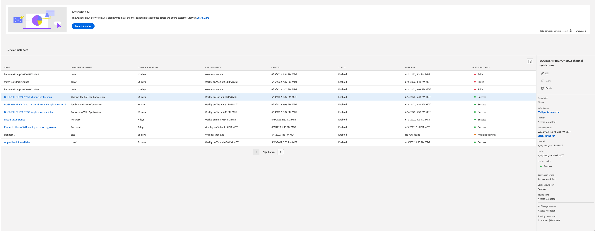
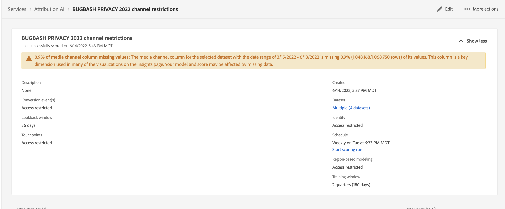
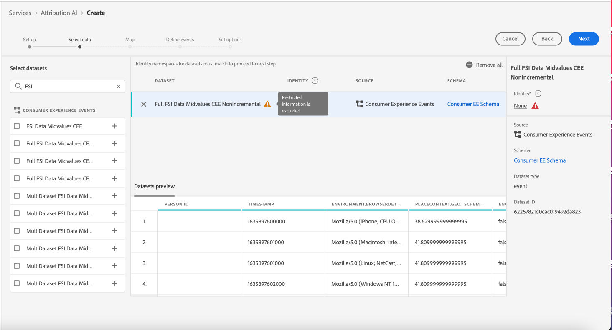
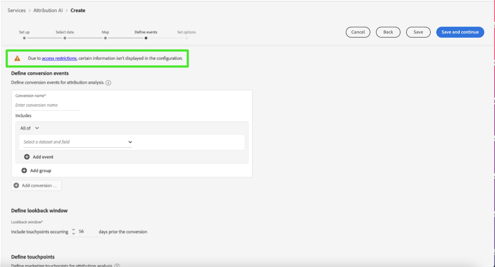

# Access Control in Attribution AI

Access control for Attribution AI is provided through Adobe Experience Platform in the [Adobe Admin Console](https://adminconsole.adobe.com/). This functionality leverages product profiles in Admin Console, which link users with permissions and sandboxes.

For more information on access control, see the [access control overview](../../../access-control/home.md).

## Attribute-based access control

>[!IMPORTANT]
>
>Attribute-based access control is currently available in a limited release only.

[Attribute-based access control](../../../access-control/abac/overview.md) is a capability of Adobe Experience Platform that enables administrators to control access to specific objects and/or capabilities based on attributes. Attributes can be metadata added to an object, such as a label added to a schema field or segment. An administrator defines access policies that include attributes to manage user access permissions.

This functionality allows you to label Experience Data Model (XDM) schema fields with labels that define organizational or data usage scopes. In parallel, administrators can use the user and role administration interface to define access policies surrounding XDM schema fields and better manage the access given to users or groups of users (internal, external, or third-party users). Additionally, attribute-based access control allows administrators to manage access to specific segments.

Through attribute-based access control, administrators can control users' access to both sensitive personal data (SPD) and personally identifiable information (PII) across all Experience Platform workflows and resources. Administrators can define user roles that have access only to specific fields and data that corresponds to those fields.

Due to attribute-based access control, some fields and functionalities might have access restricted and be unavailable for certain Attribution AI service models. Examples include, "Identity", "Score Definition", and "Clone."

At the top of the Attribution AI workspace **insights page**, the details that show in the sidebar have restricted access.

If you select datasets with restricted schemas on the **[!UICONTROL Create model workflow]** page, a warning sign appears next to the dataset name with the message: [!UICONTROL Restricted information is excluded].

When you preview datasets with restricted schema on the **[!UICONTROL Create model workflow]** page, a warning appears to let you know that [!UICONTROL Due to access restrictions, certain information isn't displayed in the dataset preview.]

After you create a model with restricted information and proceed to the **[!UICONTROL Define goal]** step, a warning is displayed at the top: [!UICONTROL Due to access restrictions, certain information isn't displayed in the configuration.]

## Next steps

By reading this guide, you have been introduced to the main principles of access control in [!DNL Experience Platform]. You can now continue to the [access control user guide](../overview.md) for detailed steps on how use the [!DNL Admin Console] to create product profiles and assign permissions for [!DNL Experience Platform].
