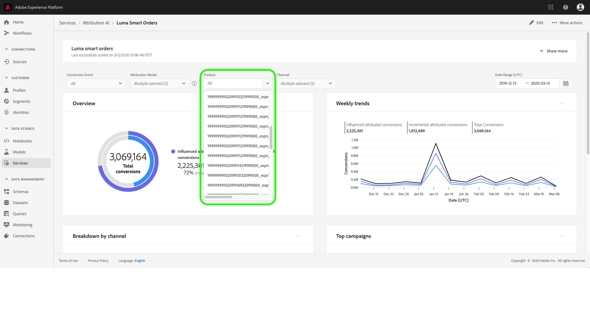
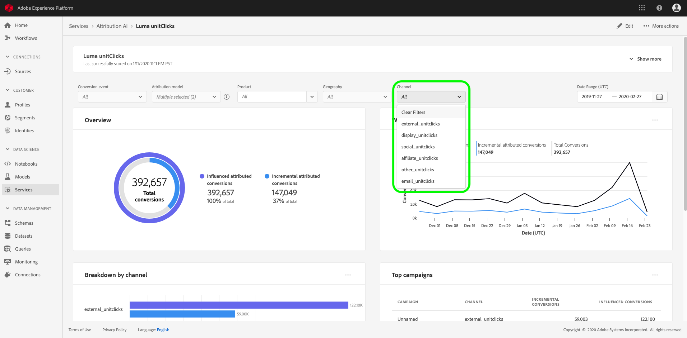
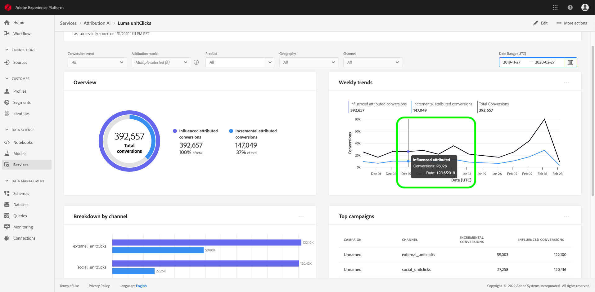
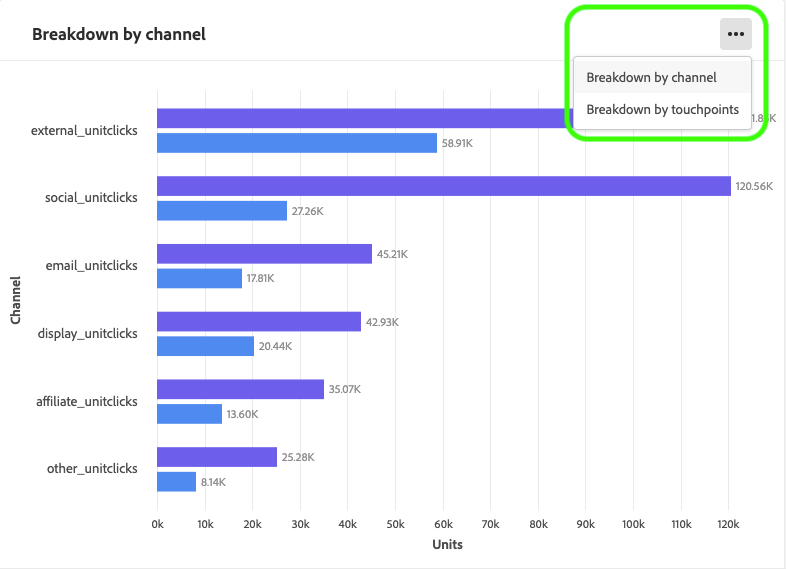

# Discovering insights in Attribution AI

Attribution AI service instances provide insights which can be used to assist in making and measuring marketing decisions related to marketing performance and return on investment. Selecting a service instance provides visualizations and filters to assist you in understanding the impact of every customer interaction in each phase of the customer journey.

This document serves as a guide for interacting with service instance insights in the Adobe Intelligent Services user interface. The following topics are covered:

- [Service instance overview](#service-instance-insights-overview)
  - [Service instance details](#service-instance-details)
  - [Edit an instance](#edit-an-instance)
  - [Delete an instance](#more-actions)
  - [Download summary data](#more-actions)
  - [Access scores](#more-actions)
  - [View run history](#more-actions)
- [Filter your data by](#filtering-your-data)
  - [Conversion event](#conversion-event)
  - [Attribution model](#attribution-model)
  - [Product](#product)
  - [Geography](#geography)
  - [Region](#region)
  - [Channel](#channel)
  - [Date Range](#date-range)
- [Overview of your data](#overview-of-your-data)
- [Weekly trends](#weekly-trends)
- [Breakdown by channel](#breakdown-by-channel)
- [Top campaigns](#top-campaigns)
- [Next steps](#next-steps)

## Getting started

In order to utilize insights for Attribution AI, you need to have a service instance with a successful run status available. To create a new service instance visit the [Attribution AI user interface guide](./user-guide.md). If you recently created a service instance and it is still training and scoring, please allow 24 hours for it to finish running.

## Service instance insights overview

In the Adobe Experience Platform UI, click **Services** in the left navigation. The *Services* browser appears and displays available Adobe Intelligent Services. In the container for Attribution AI, click **Open**.

The Attribution AI dashboard appears. The dashboard lists service instances of Attribution AI and displays information about them, including the name of the instance, conversion events, how often the instance is run, and the status of the last update. Click on a service instance name to begin.

> Note: Only service instances that have completed successful scoring runs can be clicked.

Next, the insights page for that service instance appears, where you are provided with visualizations and a number of filters to interact with your data. The visualizations and filters are explained in more detail throughout this guide.

### Service instance details

To view additional details for a service instance, click **Show more** in the top-right.

A detailed list appears. For more information on any of the properties listed, please visit the [Attribution AI user guide](./user-guide.md).

### Edit an instance

To edit an instance, click *Edit* in the top-right navigation.

The edit dialog box appears, allowing you to edit the description and scoring frequency of the instance. To confirm your changes and close the dialog, click *Edit* in the bottom-right corner.

### More actions

The *More actions* button is located in the top-right navigation next to *Edit*. Clicking **More actions** opens a dropdown that allows you to select one of the following operations:

- **Delete**: Deletes the instance.
- **Download summary data**: Downloads a CSV file containing the summary data.
- **Access scores**: Clicking *Access scores* redirects you to the [downloading scores for Attribution AI tutorial](./download-scores.md).
- **View run history**: A popover containing a list of all the scoring runs associated with the service instance appears.

## Filtering your data

Attribution AI insights allow you to filter your data and automatically update the UI visuals based on your selected filters.

> **Note:** By default, every filter is set to "All" except the *Attribution model* filter which is set to "Incremental attributed conversions".

### Conversion event

When you create a new instance in Attribution AI, one of the required fields is "Conversion events". From within the instance, the *Conversion events* dropdown allows you to select any of the events defined for your instance in order to filter your data. Selecting specific events changes the UI visualizations to only populate conversions belonging to those events.

### Attribution model

Clicking *Attribution model* opens a dropdown with all of the different attribution models available. You can select multiple models to compare results. For more information on the different attribution models and how they work, visit the [attribution ai overview](./overview.md) which contains a table with information on each model.

### Product

The *Product* filter allows you to select from any products that were initially ingested in the creation of your instance. Click the dropdown and use the search feature to quickly select all of the products you wish to compare.

### Geography

The *Geography* filter populates country codes based on region-based models. Depending on your data this filter may or may not be present.

> **Note:** Country codes are two characters long. A complete list can be found here [ISO 3166-1 alpha-2](https://datahub.io/core/country-list).

### Region

> **Note:** This filter is only present if you performed the optional step [region-based modeling](./user-guide.md#region-based-modeling-optional) in the Attribution AI user interface guide when creating your service instance. 

This filter allows you select any regions you set up in the instance creation process.

### Channel

Clicking the *Channel* filter reveals a dropdown containing all of your available marketing channels. You can select multiple channels to compare them. 

### Date Range

Click the calendar icon to open the date range popover. The beginning and end dates determine the amount of data populated in the UI. You can choose to narrow or broaden the date range in order to focus or expand the amount of data populated. 

## Overview of your data

The *Overview* card shows your total conversions by attribution model. The total number changes based on how specific you make your search using the filters outlined previously in this document. Selecting more models adds additional circles to the Overview, each with its own color corresponding to the legend.

## Weekly trends

The *Weekly trends* card breaks down your total conversion by the date range you set during the filtering process. 

Clicking the ellipses in the top-right of the *Weekly trends* card displays a drop down allowing you to select daily, weekly, or monthly trends.

Hovering over the data line of a specific attribution model creates a popover that shows the total number of conversions for that date.

## Breakdown by channel

The *Breakdown by channel* card is used to determine the total number of conversions in relation to each channel. This card can be used to help make decisions on the effectiveness of each channel and the return on investment.

Clicking the ellipses in the top-right of the *Breakdown by channel* card opens a drop down allowing you to populate data based on touchpoints.

## Top campaigns

The *Top campaigns* card displays an overview of your campaigns and how the campaign is performing in each channel. This card can help inform your team of the effectiveness of a specific campaign for a given channel and provide insight into where to further invest.

## Next steps

Once you have finished filtering the data and are able to display the appropriate information, you have the option to download the scores. For an in-depth guide on how to download your scores, visit the [downloading scores in Attribution AI](./download-scores.md) tutorial. Additionally, you can also download your summary data as indicated in [more actions](#more-actions). Selecting "Download summary data" downloads the summary data aggregated by dates.