# Discover insights in Attribution AI

Attribution AI service instances provide insights which can be used to assist in making and measuring marketing decisions related to marketing performance and return on investment. Selecting a service instance provides visualizations and filters to assist you in understanding the impact of every customer interaction in each phase of the customer journey.

This document serves as a guide for interacting with service instance insights in the Adobe Intelligent Services user interface.

## Getting started

In order to utilize insights for Attribution AI, you need to have a service instance with a successful run status available. To create a new service instance visit the [Attribution AI user interface guide](./user-guide.md). If you recently created a service instance and it is still training and scoring, please allow 24 hours for it to finish running.

## Service instance insights overview

In the [!DNL Adobe Experience Platform] UI, select **[!UICONTROL Services]** in the left navigation. The **[!UICONTROL Services]** browser appears and displays available Adobe Intelligent Services. In the container for Attribution AI, select **[!UICONTROL Open]**.

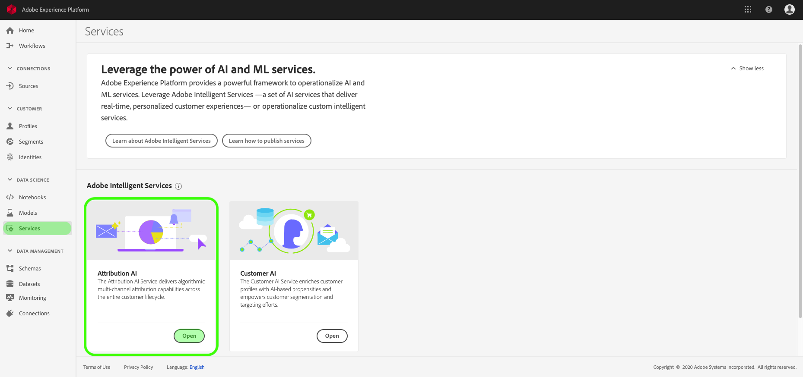

The Attribution AI service page appears. This page lists service instances of Attribution AI and displays information about them, including the name of the instance, conversion events, how often the instance is run, and the status of the last update. Select a service instance name to begin.

>[!NOTE]
>
>Only service instances that have completed successful scoring runs can be selected.

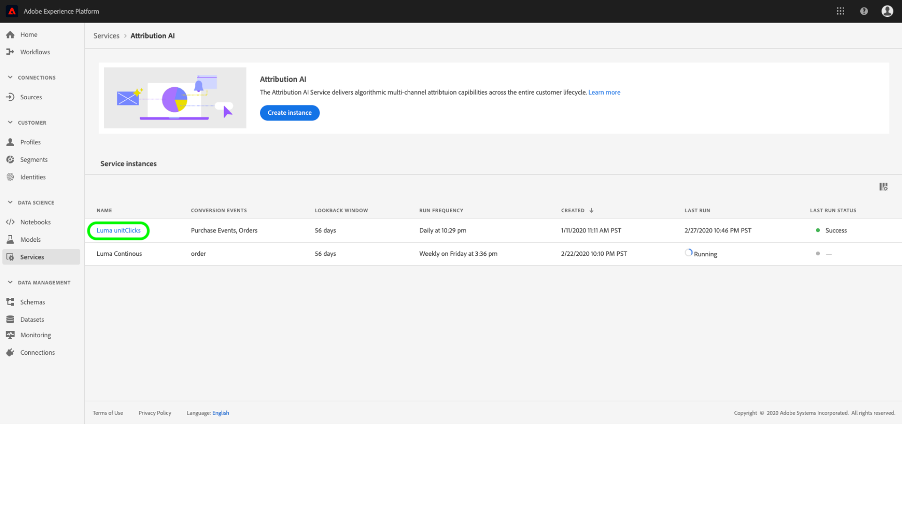

Next, the insights page for that service instance appears, where you are provided with visualizations and a number of filters to interact with your data. The visualizations and filters are explained in more detail throughout this guide.

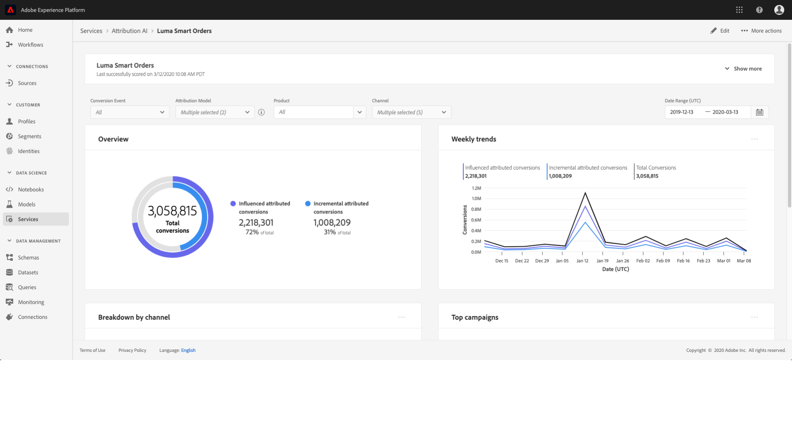

### Service instance details

To view additional details for a service instance, select **[!UICONTROL Show more]** in the top-right.

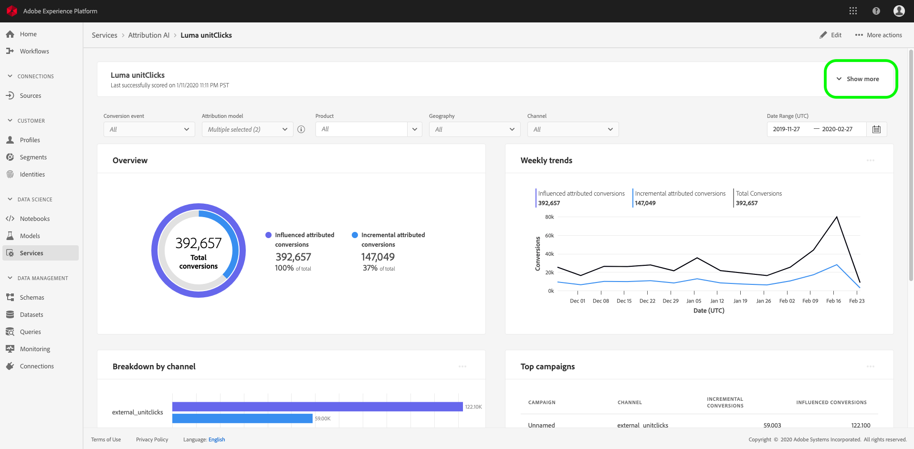

A detailed list appears. For more information on any of the properties listed, please visit the [Attribution AI user guide](./user-guide.md).

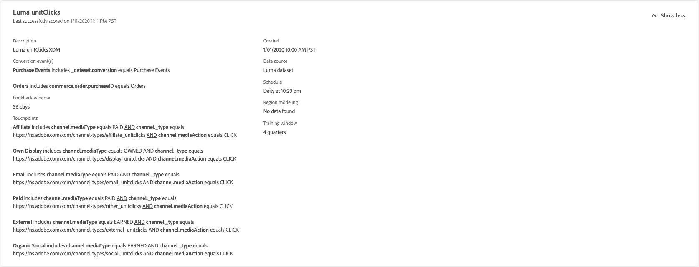

### Edit an instance

To edit an instance, select **[!UICONTROL Edit]** in the top-right navigation.

The edit dialog box appears, allowing you to edit the name, description, and scoring frequency of the instance. If the instance status is disabled, scoring frequency cannot be edited. To confirm your changes and close the dialog, select **[!UICONTROL Save]** in the bottom-right corner.

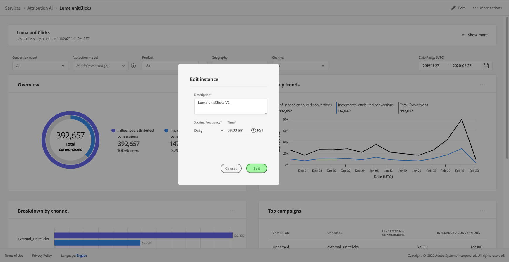

### More actions {#more-actions}

The **[!UICONTROL More actions]** button is located in the top-right navigation next to **[!UICONTROL Edit]**. Selecting **[!UICONTROL More actions]** opens a dropdown that allows you to select one of the following operations:

- **[!UICONTROL Clone]**: Clones the instance.
- **[!UICONTROL Delete]**: Deletes the instance.
- **[!UICONTROL Download summary data]**: Downloads a CSV file containing the summary data.
- **[!UICONTROL Access scores]**: Selecting **[!UICONTROL Access scores]** redirects you to the [access scores for Attribution AI tutorial](./download-scores.md).
- **[!UICONTROL View run history]**: A popover containing a list of all the scoring runs associated with the service instance appears.

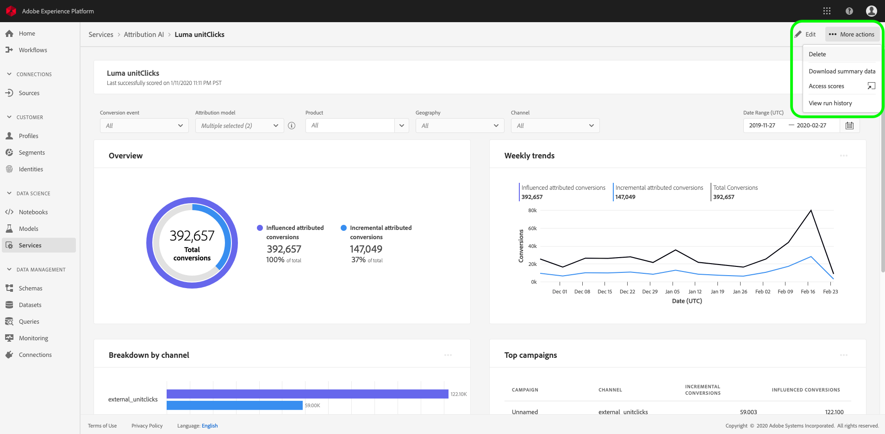

## Filtering your data

Attribution AI insights allow you to filter your data and automatically update the UI visuals based on your selected filters.

### Conversion event

When you create a new instance in Attribution AI, one of the required fields is "Conversion events". Conversion events are Business objectives that identify the impact of marketing activities, such as, e-commerce orders, in-store purchases, and website visits.

From within the instance, the **[!UICONTROL Conversion events]** dropdown allows you to select any of the events defined for your instance in order to filter your data. Selecting specific events changes the UI visualizations to only populate conversions belonging to those events.

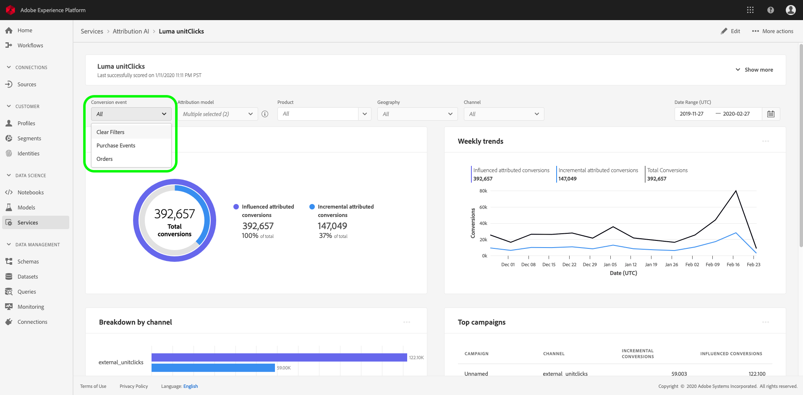

### Attribution model

Selecting **[!UICONTROL Attribution Model]** opens a dropdown with all of the different attribution models available. You can select multiple models to compare results. For more information on the different attribution models and how they work, visit the [Attribution AI](./overview.md) overview which contains a table with information on each model.

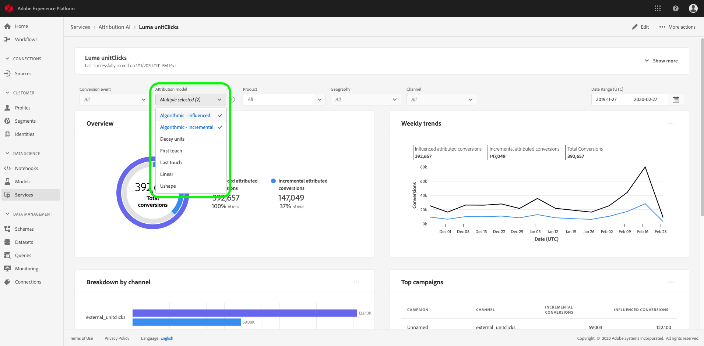

### Region

>[!NOTE]
>
>This filter is only present if you performed the optional step [region-based modeling](./user-guide.md#region-based-modeling-optional) in the Attribution AI user interface guide when creating your service instance. 

This filter allows you select any regions you set up in the instance creation process.

### Add filters

You can add additional filters by selecting the **filter** icon to open the **[!UICONTROL Add filters]** popover. The **[!UICONTROL Add filters]** popover allows you to filter by Channel, Geography, Media type, and Product. Only the applicable filters for a service instance are populated by the popover. For example, if you did not provide geographical data or a media type, those filter attributes are not going to be available for your instance.

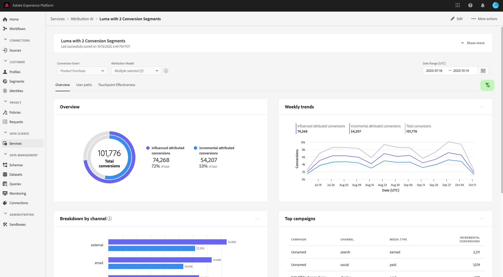

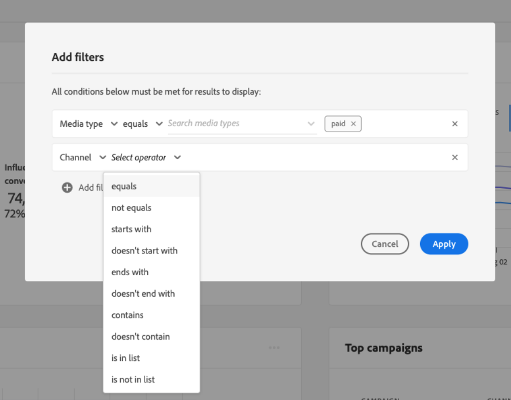

- **[!UICONTROL Channel]:** Selecting the channel attribute allows you to filter any of your available marketing channels. You can select multiple channels to compare them.
- **[!UICONTROL Geography]:** Selecting the geography attribute allows you to filter country codes based on region-based models. Depending on your data, this filter may or may not be present. Country codes are two characters long. See the complete country code list [here](https://datahub.io/core/country-list).
- **[!UICONTROL Media type]:** Selecting the media type attribute allows you to filter any of your defined media types.
- **[!UICONTROL Product]:** Selecting the product attribute allows you to filter from any products that were initially ingested in the creation of your instance.

### Date Range

Select the calendar icon to open the date range popover. The beginning and end conversion event dates determine the amount of data populated in the UI. You can choose to narrow or broaden the date range in order to focus or expand the amount of data populated.

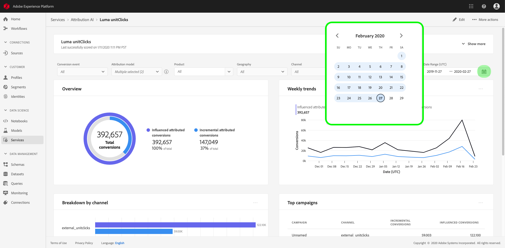

## Overview of your data

The **[!UICONTROL Overview]** card shows your total conversions by attribution model. The total number changes based on how specific you make your search using the filters outlined previously in this document. Selecting more models adds additional circles to the Overview, each with its own color corresponding to the legend.

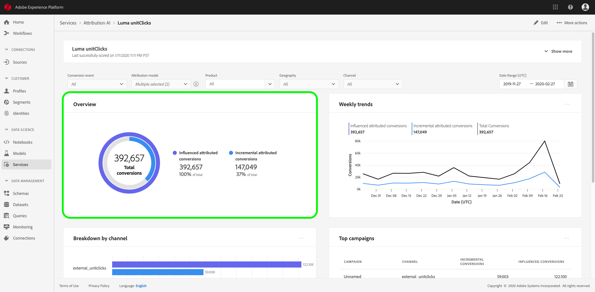

## Weekly trends

The **[!UICONTROL Weekly trends]** card breaks down your total conversion by the date range you set during the filtering process. 

Selecting the ellipses in the top-right of the **Weekly trends** card displays a drop down allowing you to select daily, weekly, or monthly trends.

Hovering over the data line of a specific attribution model creates a popover that shows the total number of conversions for that date.

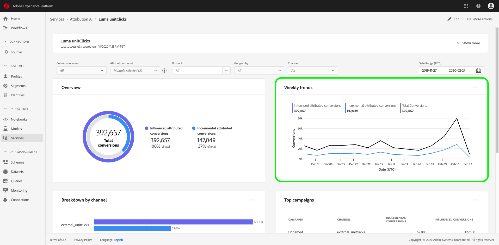

## Breakdown by channel

The **[!UICONTROL Breakdown by channel]** card is used to determine the total number of conversions in relation to each channel. This card can be used to help make decisions on the effectiveness of each channel and the return on investment.

Selecting the ellipses in the top-right of the **[!UICONTROL Breakdown by channel]** card opens a dropdown allowing you to populate data based on touchpoints.

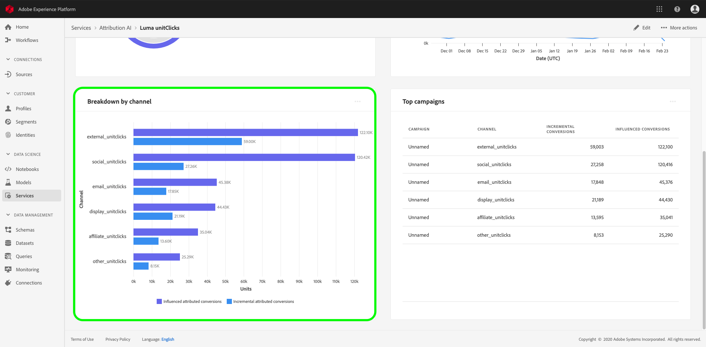

## Top campaigns

The **[!UICONTROL Top campaigns]** card displays an overview of your campaigns and how the campaign is performing in each channel. This card can help inform your team of the effectiveness of a specific campaign for a given channel and provide insights such as what campaigns you should further invest into.

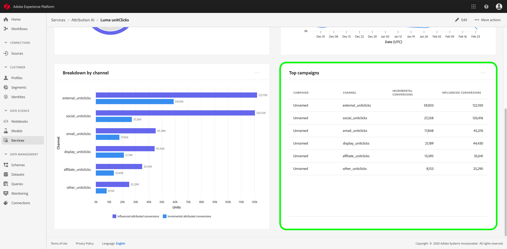

## Breakdown by touchpoint position

Selecting the **[!UICONTROL Path Analysis]** tab loads the **[!UICONTROL Breakdown by touchpoint position]** and **[!UICONTROL Top conversion paths]** graphs.

The **[!UICONTROL Breakdown by touchpoint position]** graph is a breakdown of attributed conversions by position of the touchpoint compared across all the conversion paths. This graph helps you understand what touchpoints are more effective in different stages of the conversion path. The stages are starter, player, and closer.

- **Starter:** Indicates the touchpoint was the first touch in a conversion path.
- **Player:** Indicates the touchpoint was not the first or the last touch leading to a conversion.
- **Closer:** Indicates the touchpoint was the last touch before a conversion.

>![NOTE]
>
> The sum of percentage contribution for an attribution model across all touchpoints and positions should be equal to 100.

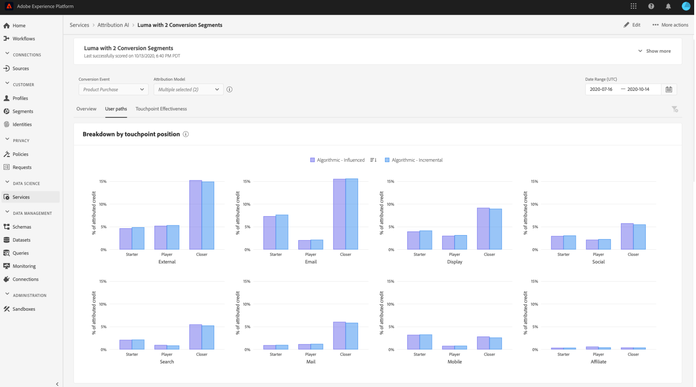

## Top conversion paths

The **[!UICONTROL Top conversion paths]** graph shows the influenced and algorithmic scores on the top conversion paths in the selected regions. This graph allows you to visualize what touchpoints contribute to conversions and what the attribution score is for each touchpoint. You can use this information to view the most frequent paths in a certain region and see if any patterns emerge between the different sets of touchpoints.

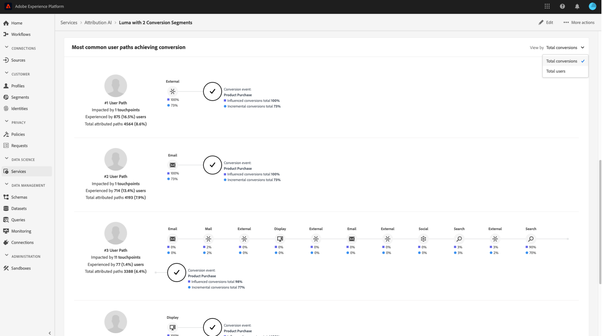

## Touchpoint effectiveness

Selecting the **[!UICONTROL Touchpoint Effectiveness]** tab loads the **[!UICONTROL Touchpoint effectiveness]** card. This card uses Attribution AI's distribution of data to display information for each touchpoint. The data for this table is only generated for specific periods of time as indicated by the **[!UICONTROL As of]** date in the top-right of the card.

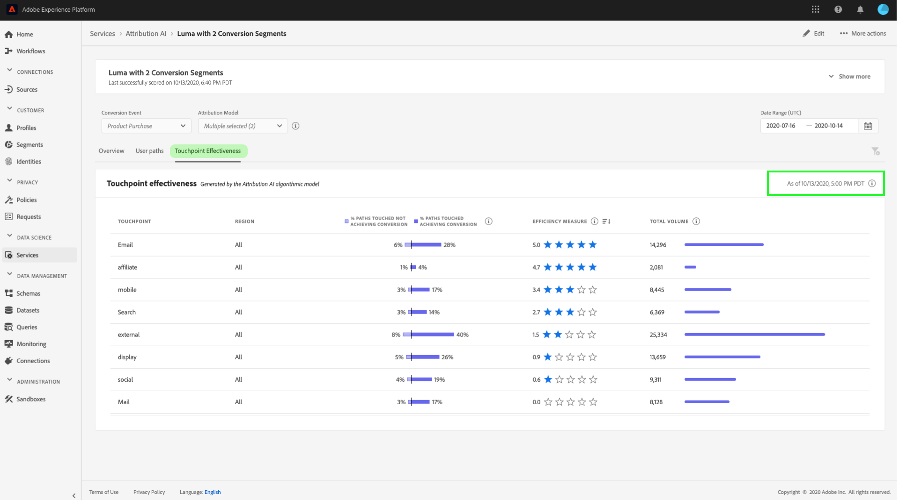

You can use the **[!UICONTROL Touchpoint effectiveness]** card information to understand how a touchpoint contributes to a conversion. You can also see how effective each touchpoint is with the following performance metrics:

**Paths touched**: This metric displays a percentage of paths achieving/not achieving conversion for the touchpoint. You will see higher attributed conversions if the ratio of paths (percentage) achieving conversion to paths not achieving conversion is high.

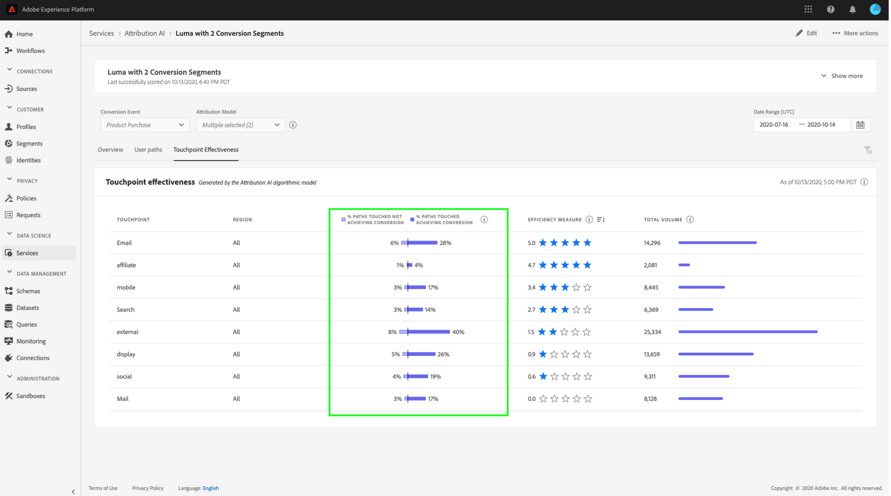

**Efficiency measure**: This metric displays stars on a scale of one to five. The scale indicates the relative importance of a touchpoint towards making a conversion.

>[!NOTE]
>
>Higher touchpoint volume does not guarantee higher efficiency measure.

**Total volume**: The aggregate number of times a touchpoint was touched by a user. This is inclusive of touchpoints that appear on a path achieving conversion as well as paths not resulting in a conversion.

## Next steps

Once you have finished filtering the data and are able to display the appropriate information, you have the option to access the scores. For an in-depth guide on how to access your scores, visit the [access scores in Attribution AI](./download-scores.md) tutorial. Additionally, you can also download your summary data as indicated in [more actions](#more-actions). Selecting "Download summary data" downloads the summary data aggregated by dates.

## Additional resources

The following video is designed to assist with learning how to use the Attribution AI insights page to understand the ROI of marketing channels and campaigns.

>[!VIDEO](https://video.tv.adobe.com/v/32669?learn=on&quality=12)
