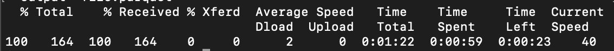
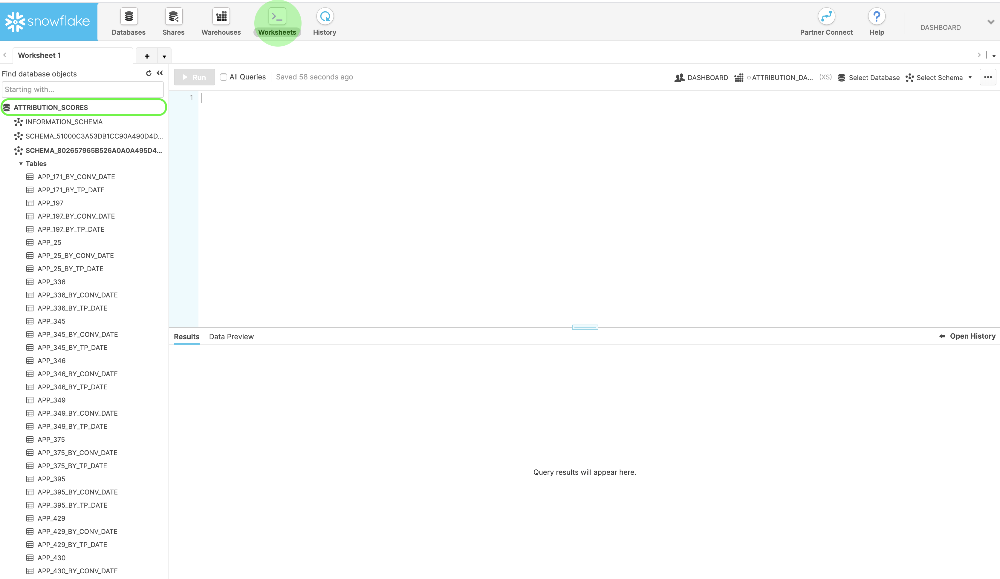
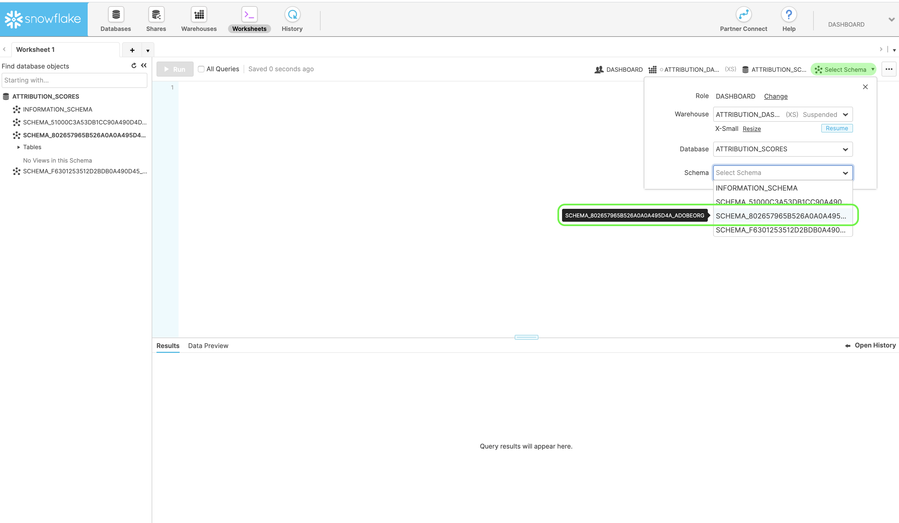
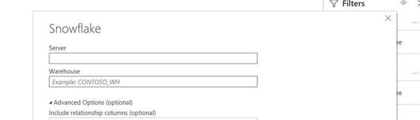

# Download scores in Attribution AI

This document serves as a guide for downloading scores for Attribution AI. 

## Getting started

Attribution AI allows you to download scores in the Parquet file format. This tutorial requires that you have read and finished the downloading Attribution AI scores section in the [getting started](./getting-started.md) guide.

Additionally, in order to access scores for Attribution AI, you need to have a service instance with a successful run status available. To create a new service instance, visit the [Attribution AI user guide](./user-guide.md). If you recently created a service instance and it is still training and scoring, please allow 24 hours for it to finish running.

## Find your dataset ID {#dataset-id}

Within your service instance for Attribution AI insights, click the *More actions* dropdown in the top-right navigation then select **[!UICONTROL Access scores]**.


A new dialog appears, containing a link to the downloading scores documentation and the dataset ID for your current instance. Copy the dataset ID to your clipboard and proceed to the next step.


## Retrieve your batch ID {#retrieve-your-batch-id}

Using your dataset ID from the previous step, you need to make a call to the Catalog API in order to retrieve a batch ID. Additional query parameters are used for this API call in order to return the latest successful batch instead of a list of batches belonging to your organization. To return additional batches, increase the number for the `limit` query parameter to the desired amount you wish to be returned. For more information on the types of query parameters available, visit the guide on [filtering Catalog data using query parameters](../../catalog/api/filter-data.md).

**API format**

```http
GET /batches?&dataSet={DATASET_ID}&createdClient=acp_foundation_push&status=success&orderBy=desc:created&limit=1
```

| Parameter | Description |
| --------- | ----------- |
| `{DATASET_ID}` | The dataset ID available in the "Access Scores" dialog. |

**Request**

```shell
curl -X GET 'https://platform.adobe.io/data/foundation/catalog/batches?&dataSet=5e8f81ce7a4ecb18a8d25b22&createdClient=acp_foundation_push&status=success&orderBy=desc:created&limit=1' \
  -H 'Authorization: Bearer {ACCESS_TOKEN}' \
  -H 'x-api-key: {API_KEY}' \
  -H 'x-gw-ims-org-id: {ORG_ID}' \
  -H 'x-sandbox-name: {SANDBOX_NAME}'
```

**Response**

A successful response returns a payload containing a batch ID object. In this example, the Key value to the object returned is the batch ID `01E5QSWCAASFQ054FNBKYV6TIQ`. Copy your batch ID to use in the next API call.

>[!NOTE]
>
> The following response has had the `tags` object reformated for readability.

```json
{
    "01E5QSWCAASFQ054FNBKYV6TIQ": {
        "status": "success",
        "tags": {
            "Tags": [ ... ],
        },
        "relatedObjects": [
            {
                "type": "dataSet",
                "id": "5e8f81cf7a4ecb28a8d85b22"
            }
        ],
        "id": "01E5QSWCAASFQ054FNBKYV6TIQ",
        "externalId": "01E5QSWCAASFQ054FNBKYV6TIQ",
        "replay": {
            "predecessors": [
                "01E5N7EDQQP4JHJ93M7C3WM5SP"
            ],
            "reason": "Replacing for 2020-04-09",
            "predecessorListingType": "IMMEDIATE"
        },
        "inputFormat": {
            "format": "parquet"
        },
        "imsOrg": "412657965Y566A4A0A495D4A@AdobeOrg",
        "started": 1586715571808,
        "metrics": {
            "partitionCount": 1,
            "outputByteSize": 2380339,
            "inputFileCount": -1,
            "inputByteSize": 2381007,
            "outputRecordCount": 24340,
            "outputFileCount": 1,
            "inputRecordCount": 24340
        },
        "completed": 1586715582735,
        "created": 1586715571217,
        "createdClient": "acp_foundation_push",
        "createdUser": "sensei_exp_attributionai@AdobeID",
        "updatedUser": "acp_foundation_dataTracker@AdobeID",
        "updated": 1586715583582,
        "version": "1.0.5"
    }
}
```

## Retrieve the next API call with your batch ID {#retrieve-the-next-api-call-with-your-batch-id}

Once you have your batch ID, you are able to make a new GET request to `/batches`. The request returns a link thats used as the next API request.

**API format**

```http
GET batches/{BATCH_ID}/files
```

| Parameter | Description |
| --------- | ----------- |
| `{BATCH_ID}` | The batch ID that was retrieved in the previous step [retrieve your batch ID](#retrieve-your-batch-id). |

**Request**

Using your own batch ID, make the following request.

```shell
curl -X GET 'https://platform.adobe.io/data/foundation/export/batches/01E5QSWCAASFQ054FNBKYV6TIQ/files' \
  -H 'Authorization: Bearer {ACCESS_TOKEN}' \
  -H 'x-api-key: {API_KEY}' \
  -H 'x-gw-ims-org-id: {ORG_ID}' \
  -H 'x-sandbox-name: {SANDBOX_NAME}'
```

**Response**

A successful response returns a payload containing a `_links` object. Within the `_links` object is an `href` with a new API call as its value. Copy this value to proceed to the next step.

```json
{
    "data": [
        {
            "dataSetFileId": "01E5QSWCAASFQ054FNBKYV6TIQ-1",
            "dataSetViewId": "5e8f81cf7a4ecb28a8d85b22",
            "version": "1.0.0",
            "created": "1586715582571",
            "updated": "1586715582571",
            "isValid": false,
            "_links": {
                "self": {
                    "href": "https://platform.adobe.io:443/data/foundation/export/files/01E5QSWCXXYFQ054FNBKYV2BAQ-1"
                }
            }
        }
    ],
    "_page": {
        "limit": 100,
        "count": 1
    }
}
```

## Retrieve your files {#retrieving-your-files}

Using the `href` value you got in the previous step as an API call, make a new GET request to retrieve your file directory.

**API format**

```http
GET files/{DATASETFILE_ID}
```

| Parameter | Description |
| --------- | ----------- |
| `{DATASETFILE_ID}` | The dataSetFile ID is returned in the `href` value from the [previous step](#retrieve-the-next-api-call-with-your-batch-id). It is also accessible in the `data` array under the object type `dataSetFileId`. |

**Request**

```shell
curl -X GET 'https://platform.adobe.io/data/foundation/export/files/01E5QSWCAASFQ054FNBKYV6TIQ-1' \
  -H 'Authorization: Bearer {ACCESS_TOKEN}' \
  -H 'x-api-key: {API_KEY}' \
  -H 'x-gw-ims-org-id: {ORG_ID}' \
  -H 'x-sandbox-name: {SANDBOX_NAME}'
```

**Response**

The response contains a data array that may have a single entry, or a list of files belonging to that directory. The example below contains a list of files and has been condensed for readability. In this scenario, you need to follow the URL of each file in order to access the file.

```json
{
    "data": [
        {
            "name": "part-00000-tid-5614147572541837832-908bd66a-d856-47fe-b7da-c8e7d22a4097-1370467-1.c000.snappy.parquet",
            "length": "2380211",
            "_links": {
                "self": {
                    "href": "https://platform.adobe.io:443/data/foundation/export/files/01E5QSWCXXYFQ054FNBKYV2BAQ-1?path=part-00000-trd-5714147572541837832-938bd66a-d556-41fe-b7da-c8e7d22a4097-1320467-1.c000.snappy.parquet"
                }
            }
        }
    ],
    "_page": {
        "limit": 100,
        "count": 1
    }
}
```

| Parameter | Description |
| --------- | ----------- |
| `_links.self.href` | The GET request URL used to download a file in your directory. |


Copy the `href` value for any file object in the `data` array, then proceed to the next step.

## Download your file data

To download your file data, make a GET request to the `"href"` value you copied in the previous step [retrieving your files](#retrieving-your-files).

>[!NOTE]
>
>If you are making this request directly in command line, you might be prompted to add an output after your request headers. The following request example uses `--output {FILENAME.FILETYPE}`.

**API format**

```http
GET files/{DATASETFILE_ID}?path={FILE_NAME}
```

| Parameter | Description |
| --------- | ----------- |
| `{DATASETFILE_ID}` | The dataSetFile ID is returned in the `href` value from a [previous step](#retrieve-the-next-api-call-with-your-batch-id).|
| `{FILE_NAME}` | The name of the file. |

**Request**

```shell
curl -X GET 'https://platform.adobe.io:443/data/foundation/export/files/01E5QSWCXXYFQ054FNBKYV2BAQ-1?path=part-00000-trd-5714147572541837832-938bd66a-d556-41fe-b7da-c8e7d22a4097-1320467-1.c000.snappy.parquet' \
  -H 'Authorization: Bearer {ACCESS_TOKEN}' \
  -H 'x-api-key: {API_KEY}' \
  -H 'x-gw-ims-org-id: {ORG_ID}' \
  -H 'x-sandbox-name: {SANDBOX_NAME}' \
  -O 'file.parquet'
```

>[!TIP]
>
>Make sure you are in the correct directory or folder you want your file saved to before you make the GET request.

**Response**

The response downloads the file you requested in in your current directory. In this example the filename is "file.parquet".



The scores downloaded will be in Parquet format and will either need a [!DNL Spark]-shell or Parquet reader to view the scores. For raw score viewing, you can use [Apache Parquet tools](https://parquet.apache.org/docs/). Parquet tools can analyze the data with [!DNL Spark].

## Next steps

This document outlined the steps required for downloading Attribution AI scores. For more information on the score outputs, please visit the [Attribtuion AI input and output](./input-output.md) documentation.

## Accessing scores using Snowflake

>[!IMPORTANT]
>
>Please contact attributionai-support@adobe.com for more details on accessing scores using SnowFlake.

You can access aggregated Attribution AI scores through Snowflake. Currently, you need to email Adobe support at attributionai-support@adobe.com in order to set up and receive the credentials to your reader account for Snowflake. 

Once Adobe support has processed your request, you are provided a URL for the reader account to Snowflake and the corresponding credentials below:

- Snowflake URL
- Username
- Password

>[!NOTE]
>
>The reader account is for querying the data using sql clients, worksheet, and BI solutions which supports JDBC connector.

Once you have your credentials and URL, you can query the model tables, aggregated by touchpoint date, or conversion date.

### Finding your schema in Snowflake

Using the provided credentials, log in to Snowflake. Click the **Worksheets** tab in the top-left main navigation, then navigate to your database directory in the left panel.



Next, click **Select Schema** in the top-right corner of the screen. In the popover that appears, confirm you have the right database selected. Next, click the *Schema* dropdown and select one of your listed schemas. You are able to directly query from the score tables listed under the selected schema.



## Connecting PowerBI to Snowflake (optional)

Your Snowflake credentials can be used to set up a connection between PowerBI Desktop and Snowflake databases. 

First, under the *Server* box, type in your Snowflake URL. Next, under *Warehouse*, type in "XSMALL". Then, type in your username and password.



After the connection is established, select your Snowflake database, then select the appropriate schema. You are now able to load all the tables.
