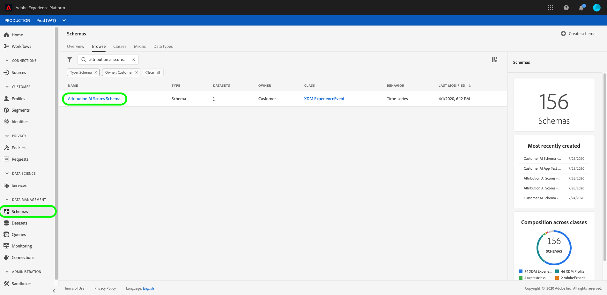
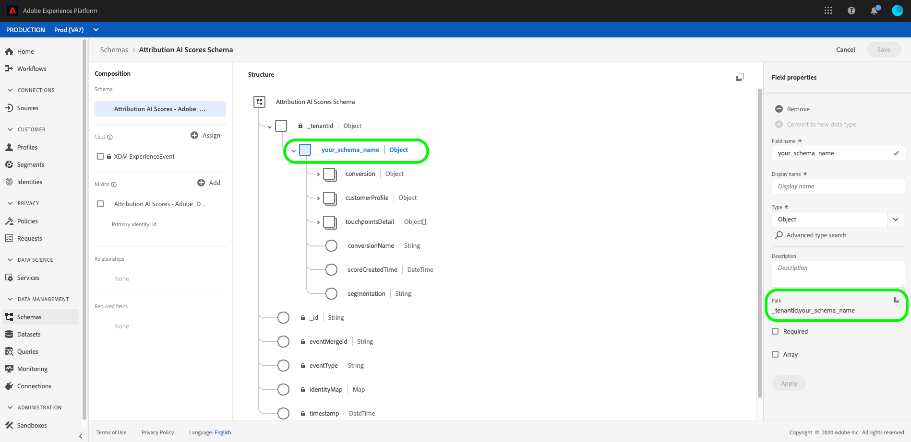
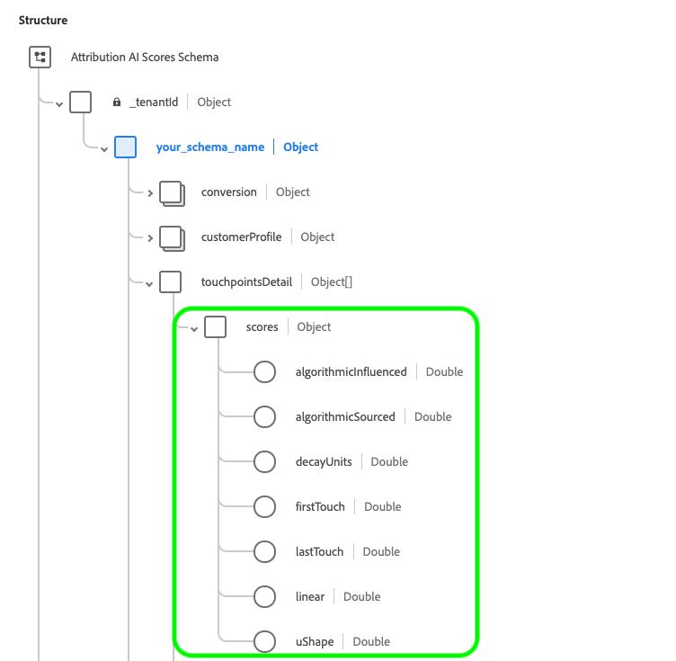

# Input and output in [!DNL Attribution AI]

The following document outlines the different input and outputs utilized in [!DNL Attribution AI].

## [!DNL Attribution AI] input data

Attribution AI works by analyzing the following datasets to calculate algorithmic scores:

- Adobe Analytics datasets using the [Analytics source connector](../../sources/tutorials/ui/create/adobe-applications/analytics.md)
- Experience Event (EE) datasets in general from Adobe Experience Platform schema
- Consumer Experience Event (CEE) datasets

You can now add multiple datasets from different sources based on the **identity map** (field) if each of the datasets shares the same identity type (namespace) such as an ECID. After you select an identity and a namespace, ID Column completeness metrics appear which indicate the volume of data being stitched. To learn more about adding multiple datasets, visit the [Attribution AI user guide](./user-guide.md#identity).

The channel information is not always mapped by default. In some cases, if the mediaChannel (field) is blank, you would not be able to  "continue" until you map a field to mediaChannel as it is a required column. If the channel is detected in the dataset, it is mapped to mediaChannel by default. The other columns such as **media type** and **media action** are still optional.

After you map the channel field, continue to the 'Define events' step where you can select the conversion events, touchpoint events, and choose specific fields from individual datasets.

>[!IMPORTANT]
>
>The Adobe Analytics source connector can take up to four weeks to backfill data. If you recently set up a connector, you should verify that the dataset has the minimum length of data required for Attribution AI. Please review the [historical data](#data-requirements) section to verify you have enough data to calculate accurate algorithmic scores.

For more details on setting up the [!DNL Consumer Experience Event] (CEE) schema, please refer to the [Intelligent Services data preparation](../data-preparation.md) guide. For more information on mapping Adobe Analytics data, visit the [Analytics field mappings](../../sources/connectors/adobe-applications/analytics.md) documentation.

Not all the columns in the [!DNL Consumer Experience Event] (CEE) schema are mandatory for Attribution AI. 

You can configure the touch points using any fields recommended below in the schema or selected dataset.

| Recommended columns | Needed for |
| --- | --- |
| Primary Identity Field | Touchpoint / Conversion |
| Timestamp | Touchpoint / Conversion |
| Channel._type | Touchpoint |
| Channel.mediaAction | Touchpoint |
| Channel.mediaType | Touchpoint |
| Marketing.trackingCode | Touchpoint |
| Marketing.campaignname | Touchpoint |
| Marketing.campaigngroup | Touchpoint |
| Commerce | Conversion |

Typically, attribution is run on conversion columns such as order, purchases, and checkouts under "commerce". The columns for "channel" and "marketing" are used to define touchpoints for Attribution AI (for example, `channel._type = 'https://ns.adobe.com/xdm/channel-types/email'`). For optimal results and insights, it is highly recommended that you include as many conversion and touchpoint columns as possible. Additionally, you are not limited to just the above columns. You can include any other recommended or custom columns as a conversion or touchpoint definition.

Experience event (EE) Datasets do not need to explicitly have Channel and Marketing mixins as long as the channel or campaign information relevant to configure a touchpoint is present in one of mixin or pass through fields.

>[!TIP]
>
>If you are using Adobe Analytics data in your CEE schema, the touchpoint information for Analytics is typically stored in `channel.typeAtSource` (for example, `channel.typeAtSource = 'email'`).

## Historical data {#data-requirements}

>[!IMPORTANT]
>
> The minimum amount of data that is needed for Attribution AI to function is as follows:
> - You need to provide at least 3 months (90 days) of data to run a good model.
> - You need at least 1000 conversions.

Attribution AI requires historical data as input for model training. The data duration required is mainly determined by two key factors: training window and look-back window. Input with shorter training windows are more sensitive to recent trends, while longer training windows help produce more stable and accurate models. It's important to model the objective with historical data that best represents your business goals.

The [training window configuration](./user-guide.md#training-window) filters conversion events set to be included for model training based on occurrence time. Currently, the minimum training window is 1 quarter (90 days). The [lookback window](./user-guide.md#lookback-window) provides a time frame indicating how many days prior to the conversion event touchpoints related to this conversion event should be included. These two concepts together determine the amount of input data (measured by days) that is required for an application.

By default, Attribution AI defines the training window as the most recent 2 quarters (6 months) and lookback window as 56 days. In other words, the model will take into consideration all of the defined conversion event(s) that have occurred in the past 2 quarters and look for all the touchpoints that have occurred within 56 days prior to the associated conversion event(s).

**Formula**:

Minimum length of data required = training window + lookback window

>[!TIP]
>
> The minimum length of data required for an application with default configurations is: 2 quarters (180 days) + 56 days = 236 days.

Example: 

- You want to attribute conversion events that have happened within the last 90 days (3 months) and track all the touchpoints that have happened within 4 weeks prior the conversion event. The input data duration should span over the past 90 days + 28 days (4 weeks). The training window is 90 days and the lookback window is 28 days totaling 118 days.

## Attribution AI output data

Attribution AI outputs the following:

- [Raw granular scores](#raw-granular-scores)
- [Aggregated Scores](#aggregated-attribution-scores)

**Example output schema:**

### Raw granular scores {#raw-granular-scores}

Attribution AI outputs attribution scores in the most granular level possible so that you can slice and dice the scores by any score column. To view these scores in the UI, read the section on [viewing raw score paths](#raw-score-path). To download the scores using the API visit the [downloading scores in Attribution AI](./download-scores.md) document.

>[!NOTE]
>
> You are able to see any desired reporting column from the input dataset in the score output dataset only if either of the following are true:
> - The reporting column is included in the configuration page either as part of touchpoint or conversion definition configuration.
> - The reporting column is included in additional score dataset columns.

The following table outlines the schema fields in the raw scores example output:

| Column Name (DataType) | Nullable | Description |
| --- | --- | --- |
| timestamp (DateTime) | False | The time when an conversion event or observation occurred.   **Example:** 2020-06-09T00:01:51.000Z |
| identityMap (Map) | True | identityMap of the user similar to the CEE XDM format. |
| eventType (String) | True | The primary event type for this time-series record.   **Example:** "Order", "Purchase", "Visit" |
| eventMergeId (String) | True | An ID to correlate or merge multiple [!DNL Experience Events] together that are essentially the same event or should be merged. This is intended to be populated by the data producer prior to ingestion.   **Example:** 575525617716-0-edc2ed37-1aab-4750-a820-1c2b3844b8c4 |
| _id (String) | False | A unique identifier for the time-series event.   **Example:** 4461-edc2ed37-1aab-4750-a820-1c2b3844b8c4 |
| _tenantId (Object) | False | The top level object container corrisponding to your tentant ID.   **Example:** _atsdsnrmmsv2 |
| your_schema_name (Object) | False | Score row with conversion event all the touchpoint events associated with it and their metadatas.   **Example:** Attribution AI Scores -  Model Name__2020 |
| segmentation (String) | True | Conversion segment such as geo segmentation which the model is built against. In case of the absence of segments, segment is same as conversionName.   **Example:** ORDER_US |
| conversionName (String) | True | Name of the conversion that was configured during setup.   **Example:** Order, Lead, Visit |
| conversion (Object) | False | Conversion metadata columns. |
| dataSource (String) | True | Globally unique identification of a data source.   **Example:** Adobe Analytics |
| eventSource (String) | True | The source when the actual event happened.   **Example:** Adobe.com |
| eventType (String) | True | The primary event type for this time-series record.   **Example:** Order |
| geo (String) | True | The geographic location where the conversion was delivered `placeContext.geo.countryCode`.   **Example:** US |
| priceTotal (Double) | True | Revenue obtained through the conversion   **Example:** 99.9 |
| product (String) | True | The XDM identifier of the product itself.   **Example:** RX 1080 ti |
| productType (String) | True | The display name for the product as presented to the user for this product view.   **Example:** Gpus |
| quantity (Integer) | True | Quantity purchased during the conversion.   **Example:** 1 1080 ti |
| receivedTimestamp (DateTime) | True | Received timestamp of the conversion.   **Example:** 2020-06-09T00:01:51.000Z |
| skuId (String) | True | Stock keeping unit (SKU), the unique identifier for a product defined by the vendor.   **Example:** MJ-03-XS-Black |
| timestamp (DateTime) | True | Timestamp of the conversion.   **Example:** 2020-06-09T00:01:51.000Z |
| passThrough (Object) | True | Additional Score dataset Columns specified by user while configuring the model. |
| commerce_order_purchaseCity (String) | True | Additional Score dataset Column.   **Example:** city: San Jose |
| customerProfile (Object) | False | Identity details of the user used to build the model. |
| identity (Object) | False | Contains the details of the user used to build the model such as `id` and `namespace`. |
| id (String) | True | Identity ID of the user such as cookie ID, Adobe Analytics ID (AAID), or Experience Cloud ID (ECID, also known as MCID or as visitor ID) etc.   **Example:** 17348762725408656344688320891369597404 |
| namespace (String) | True | Identity namespace used to build the paths and thereby the model.   **Example:** aaid |
| touchpointsDetail (Object Array) | True | The list of touchpoint details leading to the conversion ordered by | touchpoint occurrence or timestamp. |
| touchpointName (String) | True | Name of the touchpoint that was configured during setup.   **Example:** PAID_SEARCH_CLICK |
| scores (Object) | True | Touchpoint contribution to this conversion as score. For more information on the scores produced within this object, see the [aggregated attribution scores](#aggregated-attribution-scores) section. |
| touchPoint (Object) | True | Touchpoint Metadata. For more information on the scores produced within this object, see the [aggregated scores](#aggregated-scores) section. |

### Viewing raw score paths (UI) {#raw-score-path}

You can view the path to your raw scores in the UI. Start by selecting **[!UICONTROL Schemas]** in the Platform UI then search for and select your attribution AI scores schema from within the **[!UICONTROL Browse]** tab.

Next, select a field within the **[!UICONTROL Structure]** window of the UI, the **[!UICONTROL Field properties]** tab opens. Within **[!UICONTROL Field properties]** is the path field that maps to your raw scores.

### Aggregated attribution scores {#aggregated-attribution-scores}

Aggregated scores can be downloaded in CSV format from the Platform UI if the date range is less than 30 days.

Attribution AI supports two categories of attribution scores, algorithmic and rule-based scores.

Attribution AI produces two different types of algorithmic scores, incremental and influenced. An influenced score is the fraction of the conversion that each marketing touchpoint is responsible for. An incremental score is the amount of marginal impact directly caused by the marketing touchpoint. The main difference between the incremental score and the influenced score is that the incremental score takes the baseline effect into account. It does not assume that a conversion is caused purely by the preceding marketing touchpoints.

Here is a quick look at an Attribution AI schema output example from the Adobe Experience Platform UI:

See the table below for more details about each of these attribution scores:

| Attribution scores | Description |
| ----- | ----------- |
| Influenced (algorithmic) | Influenced score is the fraction of the conversion that each marketing touchpoint is responsible for. |
| Incremental (algorithmic) | Incremental score is the amount of marginal impact directly caused by a marketing touchpoint.|
| First Touch | Rule-based attribution score that assigns all credits to the initial touchpoint on a conversion path. |
| Last Touch | Rule-based attribution score that assigns all credit to the touchpoint closest to the conversion. |
| Linear | Rule-based attribution score that assigns equal credit to each touchpoint on a conversion path. |
| U-Shaped | Rule-based attribution score that assigns 40% of the credit to the first touchpoint and 40% of the credit to the last touchpoint, with the other touchpoints splitting the remaining 20% equally. |
| Time Decay | Rule-based attribution score where touchpoints closer to the conversion receive more credit than touchpoints that are farther away in time from the conversion. |

**Raw Score reference (attribution scores)**

The table below maps the attribution scores to the raw scores. If you wish to download your raw scores, visit the [downloading scores in Attribution AI](./download-scores.md) documentation.

| Attribution scores | Raw score reference column |
| --- | --- |
Influenced (algorithmic) | _tenantID.your_schema_name.element.touchpoint.algorithmicInfluenced |
Incremental (algorithmic) | _tenantID.your_schema_name.touchpointsDetail.element.touchpoint.algorithmicInfluenced |
First Touch | _tenantID.your_schema_name.touchpointsDetail.element.touchpoint.firstTouch |
Last Touch | _tenantID.your_schema_name.touchpointsDetail.element.touchpoint.lastTouch |
Linear | _tenantID.your_schema_name.touchpointsDetail.element.touchpoint.linear |
U-Shaped | _tenantID.your_schema_name.touchpointsDetail.element.touchpoint.uShape |
Time Decay | _tenantID.your_schema_name.touchpointsDetail.element.touchpoint.decayUnits |

### Aggregated Scores {#aggregated-scores}

Aggregated scores can be downloaded in CSV format from the Platform UI if the date range is less than 30 days. See the table below for more details about each of these aggregate columns.

| Column Name | Constraint | Nullable | Description |
| --- | --- | --- | --- |
customerevents_date (DateTime) | User defined & fixed format | False | Customer Event Date in YYYY-MM-DD format.   **Example**: 2016-05-02 |
mediatouchpoints_date (DateTime) | User defined & fixed format | True | Media Touchpoint Date in YYYY-MM-DD format   **Example**: 2017-04-21 |
segment (String) | Calculated | False | Conversion Segment such as geo segmentation which the model is built against. In case of absence of segments, segment is same as conversion_scope.   **Example**: ORDER_AMER |
conversion_scope (String) | User defined | False | Name of the Conversion as configured by the user.   **Example**: ORDER |
touchpoint_scope (String) | User defined | True | Name of the Touchpoint as configured by the user   **Example**: PAID_SEARCH_CLICK |
product (String) | User defined | True | The XDM identifier of the product.   **Example**: CC |
product_type (String) | User defined | True | The display name for the product as presented to the user for this product view.   **Example**: gpus, laptops |
geo (String) | User defined | True | The geographic location where the conversion was delivered (placeContext.geo.countryCode)   **Example**: US |
event_type (String) | User defined | True | The primary event type for this time-series record   **Example**: Paid Conversion |
media_type (String) | ENUM | False | Describes whether the media type is paid,owned or earned.   **Example**: PAID, OWNED |
channel (String) | ENUM | False | The `channel._type` property that is used to provide a rough classification of channels with similar properties in [!DNL Consumer Experience Event] XDM.   **Example**: SEARCH |
action (String) | ENUM | False | The `mediaAction` property is used to provide a type of experience event media action.   **Example**: CLICK |
campaign_group (String) | User defined | True | Name of the campaign group where multiple campaigns are grouped together like '50%_DISCOUNT'.   **Example**: COMMERCIAL |
campaign_name (String) | User defined | True | Name of the campaign used to identify marketing campaign like '50%_DISCOUNT_USA' or '50%_DISCOUNT_ASIA'.   **Example**: Thanksgiving Sale |

**Raw Score reference (aggregated)**

The table below maps the aggregated scores to the raw scores. If you wish to download your raw scores, visit the [downloading scores in Attribution AI](./download-scores.md) documentation. To view the raw score paths from within the UI, visit the section on [viewing raw score paths](#raw-score-path) within this document.

| Column Name | Raw Score reference column |
| --- | --- |
| customerevents_date | timestamp |
| mediatouchpoints_date | _tenantID.your_schema_name.touchpointsDetail.element.touchpoint.timestamp |
| segment | _tenantID.your_schema_name.segmentation |
| conversion_scope | _tenantID.your_schema_name.conversion.conversionName |
| touchpoint_scope | _tenantID.your_schema_name.touchpointsDetail.element.touchpointName |
| product | _tenantID.your_schema_name.conversion.product |
| product_type | _tenantID.your_schema_name.conversion.product_type |
| geo | _tenantID.your_schema_name.conversion.geo |
| event_type | eventType |
| media_type | _tenantID.your_schema_name.touchpointsDetail.element.touchpoint.mediaType |
| channel | _tenantID.your_schema_name.touchpointsDetail.element.touchpoint.mediaChannel |
| action | _tenantID.your_schema_name.touchpointsDetail.element.touchpoint.mediaAction |
| campaign_group | _tenantID.your_schema_name.touchpointsDetail.element.touchpoint.campaignGroup |
| campaign_name | _tenantID.your_schema_name.touchpointsDetail.element.touchpoint.campaignName |

>[!IMPORTANT]
>
> - Attribution AI uses only updated data for further training and scoring. Likewise, when you request to delete data, Customer AI refrains from using the deleted data.
> - Attribution AI leverages Platform datasets. To support consumer rights requests a brand may receive, brands should use Platform Privacy Service to submit consumer requests of access and delete to remove their data across the data lake, Identity Service, and Real-time Customer Profile. 
> - All datasets we use for input/output of models will follow Platform guidelines. Platform Data Encryption applies for data at-rest and in-transit. See the documentation to learn more about [data encryption](../../../help/landing/governance-privacy-security/encryption.md)

## Next steps {#next-steps}

Once you have prepared your data and have all your credentials and schemas in place, start by following the [Attribution AI user guide](./user-guide.md). This guide walks you through creating an instance for Attribution AI.
