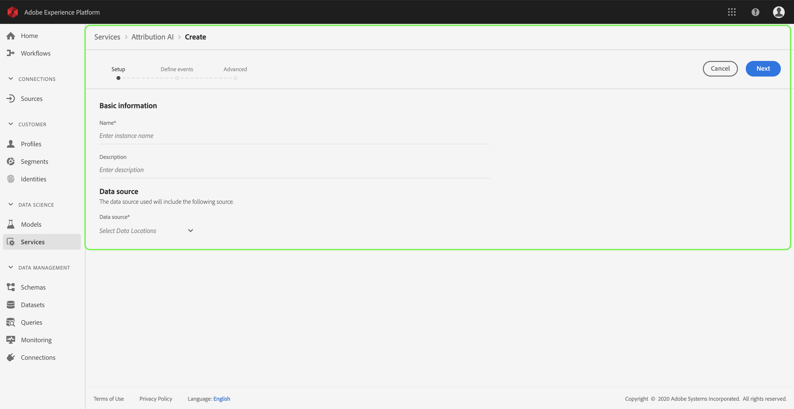
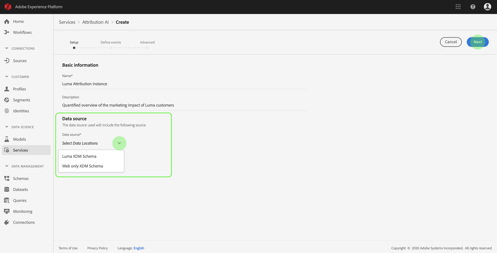
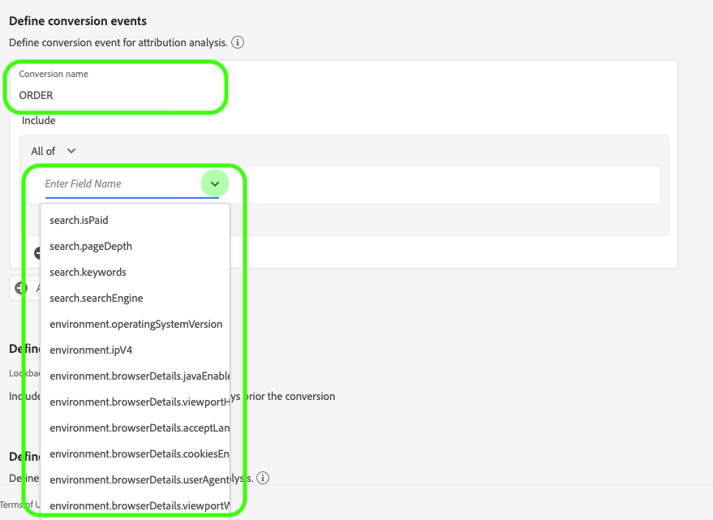
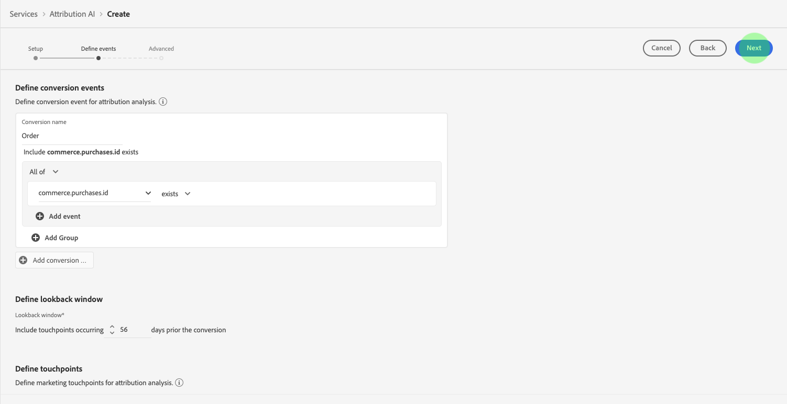
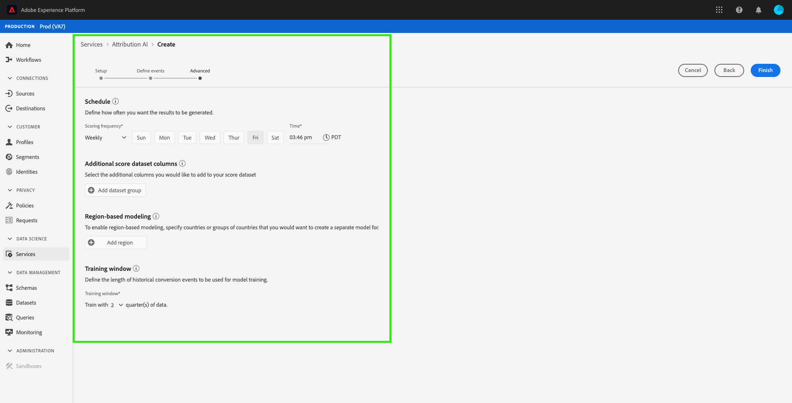

# Attribution AI user guide

>   **Note**: The Attribution AI functionality outlined in this document is in beta. The documentation and the functionality are subject to change.

Attribution AI in Adobe Experience Platform Intelligence Services is a multi-channel, algorithmic attribution service that calculates the influence and incremental impact of customer interactions against specified outcomes. With Attribution AI, you can measure and optimize your customers' experiences by understanding the impact of every individual customer interaction in each phase of your customers' journeys.

This document serves as a guide for interacting with Attribution AI in the Adobe Experience Platform Intelligence Services user interface. The following topics are covered:

- [Create an instance](#create-an-instance)
  - [Name the instance](#name-the-instance)
  - [Select a data source](#select-a-data-source)
- [Defining events](#defining-events)
  - [Define conversion events](#define-conversion-events)
  - [Define the lookback window](#define-lookback-window)
  - [Define touchpoints](#define-touchpoints)
- [Advanced training and scoring setup](#advanced-training-and-scoring-setup)
  - [Schedule training](#schedule-training)
  - [Region-based modeling](#region-based-modeling-optional)
  - [Training window](#training-window)
- [Next steps](#next-steps)

## Getting started

This guide requires an understanding of the various Platform services involved with using Attribution AI. Before beginning this tutorial, please review the following documents:

- [XDM System overview](https://www.adobe.io/apis/experienceplatform/home/xdm/xdmservices.html#!api-specification/markdown/narrative/technical_overview/schema_registry/xdm_system/xdm_system_in_experience_platform.md): XDM is the foundational framework that allows Adobe Experience Cloud, powered by Experience Platform, to deliver the right message to the right person, on the right channel, at exactly the right moment. The methodology on which Experience Platform is built, XDM System, operationalizes Experience Data Model schemas for use by Platform services.
- [Basics of schema composition](https://www.adobe.io/apis/experienceplatform/home/xdm/xdmservices.html#!api-specification/markdown/narrative/technical_overview/schema_registry/schema_composition/schema_composition.md): This document provides an introduction to Experience Data Model (XDM) schemas and the building blocks, principles, and best practices for composing schemas to be used in Adobe Experience Platform.
- [Building schemas](https://www.adobe.io/apis/experienceplatform/home/tutorials/alltutorials.html#!api-specification/markdown/narrative/tutorials/schema_editor_tutorial/schema_editor_tutorial.md): This tutorial covers the steps for creating a schema using the Schema Editor within Experience Platform.

Attribution AI requires touchpoint and customer events data. Please contact Adobe services in order to implement or make changes to this data. If media spend data is present, you can do further analysis such as incremental revenue and ROI. If customer profile data is available, you can further attribute credits to the customer profile level.

The following terminology is used in this document:

- **Conversion event:** Any digital event or digital interaction that customers do to indicate a milestone towards a goal, such as abandoning a cart before making a final purchase. Additional examples include registering as a user but not yet signing up for a conference, the indication of a final goal (making a purchase or signing up for a conference), or qualifying for a trait.

- **Touchpoint:** Any digital event or digital interaction that customers do in the path towards a goal. Examples include before-purchase-related marketing efforts, display advertising impressions viewed, and paid search clicks.

## Create an instance

In the Adobe Experience Platform UI, click **Services** in the left navigation. The *Services* browser appears and displays available Adobe Intelligence services. In the container for Attribution AI, click **Open**.

The Attribution AI dashboard appears. The dashboard lists service instances of Attribution AI and displays information about them, including the name of the instance, conversion events, how often the instance is run, and the status of the last update. Click **Create instance** to begin.

Next, the setup page for Attribution AI appears, where you can provide basic information and specify a data source for the instance.

### Name the instance

Under *Basic information*, provide a name and optional description for your service instance.

### Select a data source

After filling out the basic information, click the dropdown labeled **Select Data Locations** to select your data source. The data source is used to train the model and score the subsequent data it produces. Once a data source is chosen, click **Next** in the top-right corner to proceed to the define events page.

## Defining events

There are three different types of input data used for defining events:

- **Conversion events:** Business objectives that identify the impact of marketing activities, such as, e-commerce orders, in-store purchases, and website visits.
- **Lookback window:** Provides a time frame indicating how many days prior to the conversion event touchpoints should be included.
- **Touchpoints:** recipient, individual, and or cookie-level marketing events used to evaluate the numeric or revenue-based impact of conversions.

### Define conversion events

In order to define a conversion event, you need to give the event a name and select the event type by clicking the **Enter Field Name** dropdown menu. 

Once an event is selected, a new dropdown appears to its right. The second dropdown is used to provide further context to your event through the use of operations. For this conversion event, the default operation *exists* is used.

> **Note:** A string under your *conversion name* is updated as you define your event.

The *Add event* and *Add Group* buttons are used to further define your conversion. Depending on the conversion you are defining, you may need to use the *Add event* and *Add group* buttons to provide further context.

Clicking **Add event** creates additional fields which can be filled using the same method as outlined above. Click the **x** to remove an event that has been added.

Clicking **Add Group** gives the option to create additional fields separate from the original. With the addition of groups, a blue *And* button appears. Clicking **And** gives an option to change the parameter to contain "Or". "Or" is used to define multiple successful conversion paths. "And" extends the conversion path to include additional conditions.

If you require more than one conversion, click **Add conversion** to create a new conversion card. You can repeat the process above to define multiple conversions.

### Define lookback window

After you have finished defining your conversion, you need to confirm your lookback window. Using the arrow keys or by clicking the default value (56), specify how many days prior to your conversion event you wish to include touchpoints from. Touchpoints are defined in the next step.

### Define touchpoints

Defining touchpoints follows a similar workflow to [defining conversions](#define-conversion-events). Initially you need to name your touchpoint and select a touchpoint value from the *Enter Field Name* dropdown menu. Once selected, the operator dropdown appears with the default value "exists". Click the dropdown to reveal a list of operators.

For the purpose of this touchpoint, select **equals**.

Once an operator for a touchpoint is selected, *Enter Field Value* is made available. The dropdown values for *Enter Field Value* populate based on the operator and touchpoint value you previously selected. If a value does not populate in the dropdown, you can type that value in manually. Click the dropdown and select **CLICK**.

> **Note:** The operators "exists" and "not exists" do not have field values associated with them.
 

The *Add event* and *Add Group* buttons are used to further define your touchpoint. Due to the complex nature surrounding touchpoints, it is not uncommon to have multiple events and groups for a single touchpoint.

When clicked, **Add event** allows for additional fields to be added. Click the **x** to remove an event that has been added. 

Clicking **Add group** gives you the option to create additional fields separate from the original. With the addition of groups, a blue *And* button appears. Click **And** to change the parameter, the new parameter "Or" is used to define multiple successful paths. This particular touchpoint only has one successful path, therefore "Or" is not needed.

> **Note:** Use the string under *Touchpoint name* for a quick overview of your touchpoint. Notice that the string matches the name of the touchpoint.

You can add additional touchpoints by clicking **Add touchpoint** and repeating the process above.

Once you have finished defining all necessary touchpoints, scroll up and click **Next** in the top-right corner to proceed to the final step.

## Advanced training and scoring setup

The final page in Attribution AI is the *Advanced* page used for setting up training and scoring.

### Schedule training

Using the *Schedule*, you can select a day and time of the week you want scoring to take place. 

Click the dropdown under *Scoring Frequency* to select between daily, weekly, and monthly scoring. Next, select the days of the week you want the scoring to take place. Multiple days can be selected. Click a day a second time to deselect it.

To change the time of day you want scoring to occur, click the clock icon. In the new overlay that appears, enter the time of day you want scoring to take place. Click outside the overlay to close it.

> **Note:** It can take up to 24 hours for each prediction scoring process to complete.

### Region-based modeling (optional)

Your customers' behaviors might differ significantly by country and geographic region. For global businesses, using country-based or region-based models can increase attribution accuracy. Each region added creates a new model with that region's data.

To define a new region, start by clicking **Add region**. In the container that appears, provide a name for the region. Only one value ("placeContext.geo.countryCode") populates from the *Enter Field Name* dropdown. Select this value.

Next, select an operator. 

Lastly, type in the country code in the *Enter Field Value* dropdown.

> **Note:** Country codes are two characters long. A complete list can be found here [ISO 3166-1 alpha-2](https://datahub.io/core/country-list).

### Training window

To ensure that you get the most accurate predictions possible, it is important to train your model with historical data that represents your business. By default, the model is trained using 2 quarters (6 months) of data. Select the dropdown to change the default. You can choose to train with one to four quarters of data (3-12 months).

> **Note:** A shorter training window is more sensitive to recent trends, whereas a longer training window creates a more robust model and is less sensitive to recent trends.

Once you have selected your training window, click **Finish** in the top-right corner. Allow some time for the data to process. Once complete, a popover dialog appears confirming that the instance setup is complete. Click **Ok** to be redirected to the *Service instances* page where you can see your service instance.

## Next steps

By following this tutorial, you have successfully created a service instance in Attribution AI. Once the instance has finished scoring (allow up to 24 hours), you are ready to [discover  Attribution AI insights](./discover-insights.md). Additionally, if you wish to download your scoring results, visit the [downloading raw scores](./download-scores.md) documentation.