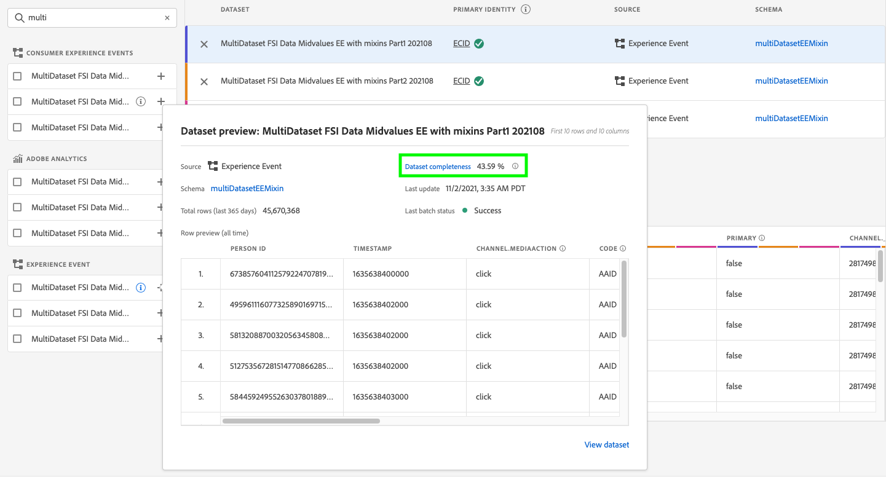

# Attribution AI UI guide

Attribution AI, as part of Intelligent Services is a multi-channel, algorithmic attribution service that calculates the influence and incremental impact of customer interactions against specified outcomes. With Attribution AI, marketers can measure and optimize marketing and advertising spend by understanding the impact of every individual customer interaction across each phase of the customers' journeys.

This document serves as a guide for interacting with Attribution AI in the Intelligent Services user interface.

## Create an instance

In the [!DNL Adobe Experience Platform] UI, select **[!UICONTROL Services]** in the left navigation. The **[!UICONTROL Services]** browser appears and displays available Adobe intelligent services. In the container for Attribution AI, select **[!UICONTROL Open]**.

The Attribution AI service page appears. This page lists service instances of Attribution AI and displays information about them, including the name of the instance, conversion events, how often the instance is run, and the status of the last update.

You can find the **[!UICONTROL Total conversion events scored]** metric located in the bottom-right side of the **[!UICONTROL Create instance]** container. This metric tracks the total number of conversion events scored by Attribution AI for the current calendar year including all sandbox environments and any deleted service instances.

Service instances can be edited, cloned, and deleted by using the controls on the right-hand side of the UI. To display these controls, select an instance from your existing **[!UICONTROL Service instances]**. The controls contain the following information:

- **[!UICONTROL Edit]**: Selecting **[!UICONTROL Edit]** allows you to modify an existing service instance. You can edit the name, description, status, scoring frequency of the instance, and additional score dataset columns.
- **[!UICONTROL Clone]**: Selecting **[!UICONTROL Clone]** copies the selected service instance. You can then modify the workflow to make minor tweaks and rename it as a new instance.
- **[!UICONTROL Delete]**: You can delete a service instance including any historical runs. The corresponding output dataset will be deleted from Platform. However, scores that were synced to Real-Time Customer Profile are not deleted.
- **[!UICONTROL Data source]**: A link to the dataset being used. If more than one dataset is being used by Attribution AI, "Multiple" followed by the number of datasets is displayed. Upon selecting the hyperlink, the datasets preview popover is shown.
- **[!UICONTROL Last run details]**: This is only displayed when a run fails. Information on why the run failed such as error codes are displayed here.

- **[!UICONTROL Conversion events]**: A quick overview of the conversion events configured for this instance.
- **[!UICONTROL Lookback window]**: The time frame you defined indicating how many days prior to the conversion event touchpoints are included.
- **[!UICONTROL Touchpoints]**: A list of all the touchpoints you defined while creating this instance.

Select **[!UICONTROL Create instance]** to begin.

Next, the set up page for Attribution AI appears where you can provide a name and optional description for your service instance.

## Select data {#select-data}

<!-- https://www.adobe.com/go/aai-select-data -->

By design, Attribution AI can use Adobe Analytics, Experience event, and Consumer Experience Event data to calculate attribution scores. When selecting a dataset only ones that are compatible with Attribution AI are listed. To select a dataset, select the (**+**) symbol next to the dataset name or select the checkbox to add multiple datasets at once. You can also use the search option to quickly find the datasets you're interested in.

After selecting the datasets you wish to use, select the **[!UICONTROL Add]** button to add the datasets to the the dataset preview pane.

Selecting the info icon  next to a dataset opens the dataset preview popover.

The dataset preview contains data such as the last update time, source schema, and a preview of the first ten columns.

Select **[!UICONTROL Save]** to save your drafts as you move along the workflow. You can also save draft model configurations and move to the next step in the workflow. Use **[!UICONTROL Save and continue]** to create and save drafts during model configurations. The feature enables you to create and save drafts of the model configuration and is particularly useful when you have to define many fields in the configuration workflow.

### Dataset completeness {#dataset-completeness}

<!-- https://www.adobe.com/go/aai-dataset-completeness -->

In the dataset preview is a dataset completeness percentage value. This value provides a quick snapshot of how many columns in your dataset are empty/null. If a dataset contains a lot of missing values and these values are captured elsewhere, it is highly recommended you include the dataset containing the missing values.

>[!NOTE]
>
>Dataset completeness is calculated using the maximum training window for Attribution AI (one year). This means data that is more than a year old is not taken into account when displaying your dataset completeness value.

### Select an identity {#identity}

You can now join multiple datasets to one another based on the identity map (field). You must select an identity type (also known as an "identity namespace") and an identity value within that namespace. If you have assigned more than one field as an identity within your schema under the same namespace, all the assigned identity values appear in the identity dropdown prepended by the namespace such as `EMAIL (personalEmail.address)` or `EMAIL (workEmail.address)`.

>[!IMPORTANT]
>
>The same identity type (namespace) must be used for every dataset you select. A green checkmark appears next to the identity type within the identity column indicating datasets are compatible. For example, when using the Phone namespace and `mobilePhone.number` as the identifier, all identifiers for the remaining datasets must contain and use the Phone namespace.

To select an identity, select the underlined value located in the identity column. The select an identity popover appears.

In the event that more than one identity is available within a namespace, make sure to select the correct identity field for your use case. For example, two email identities are available within the email namespace, a work and personal email. Depending on the use case, a personal email is more likely to be filled in and be more useful in individual predictions. This means you would select `EMAIL (personalEmail.address)` as your identity.

>[!NOTE]
>
> If no valid identity type (namespace) exists for a dataset, you must set a primary identity and assign it to an identity namespace using the [schema editor](../../xdm/schema/composition.md#identity). To learn more about namespaces and identities, visit the [Identity Service namespaces](../../identity-service/namespaces.md) documentation.

## Mapping media channel and campaign fields {#aai-mapping}

<!-- https://www.adobe.com/go/aai-mapping -->

After you have finished selecting and adding datasets, the **Map** configuration step appears. Attribution AI requires that you map the Media channel field for each dataset you selected in the previous step. This is because without the Media channel mapping between datasets, insights derived from Attribution AI may not show up properly making the insights page difficult to interpret. Although only the Media channel is required, it is highly recommended that you map some of the optional fields such as Media action, Campaign name, Campaign group, and Campaign tag. Doing so allows Attribution AI to provide clearer insights and optimal results.

## Defining events {#define-events}

<!-- https://www.adobe.com/go/aai-define-events -->

There are three different types of input data used for defining events:

- **Conversion events:** Business objectives that identify the impact of marketing activities, such as, e-commerce orders, in-store purchases, and website visits.
- **Lookback window:** Provides a time frame indicating how many days prior to the conversion event touchpoints should be included.
- **Touchpoints:** recipient, individual, and or cookie-level marketing events used to evaluate the numeric or revenue-based impact of conversions.

### Define conversion events {#define-conversion-events}

In order to define a conversion event, you need to give the event a name and select the event type by selecting the dataset and field from the **Select a dataset and field** dropdown menu. 

Once an event is selected, a new dropdown appears to its right. The second dropdown is used to provide further context to your event through the use of operations. For this conversion event, the default operation *exists* is used.

>[!NOTE]
>
>A string under your *conversion name* is updated as you define your event.

Next, you can select a combined dataset which is generated by combining all input datasets in the previous step. Alternatively, you can select a column based on individual datasets from the **Select a dataset and field** dropdown menu.

The **[!UICONTROL Add event]** and **[!UICONTROL Add Group]** buttons are used to further define your conversion. Depending on the conversion you are defining, you may need to use the **[!UICONTROL Add event]** and **[!UICONTROL Add group]** buttons to provide further context.

Selecting **[!UICONTROL Add event]** creates additional fields which can be filled using the same method as outlined above. Doing so adds an AND statement to the string definition below the conversion name. Select the **x** to remove an event that has been added.

Selecting **[!UICONTROL Add Group]** gives the option to create additional fields separate from the original. With the addition of groups, a blue *And* button appears. Selecting **And** gives an option to change the parameter to contain "Or". "Or" is used to define multiple successful conversion paths. "And" extends the conversion path to include additional conditions.

If you require more than one conversion, select **Add conversion** to create a new conversion card. You can repeat the process above to define multiple conversions.

### Define lookback window {#lookback-window}

After you have finished defining your conversion, you need to confirm your lookback window. Using the arrow keys or by selecting the default value (56), specify how many days prior to your conversion event you wish to include touchpoints from. Touchpoints are defined in the next step.

### Define touchpoints

Defining touchpoints follows a similar workflow to [defining conversions](#define-conversion-events). Initially you need to name your touchpoint and select a touchpoint value from the *Enter Field Name* dropdown menu. Once selected, the operator dropdown appears with the default value "exists". Select the dropdown to reveal a list of operators.

For the purpose of this touchpoint, select **equals**.

Once an operator for a touchpoint is selected, *Enter Field Value* is made available. The dropdown values for *Enter Field Value* populate based on the operator and touchpoint value you previously selected. If a value does not populate in the dropdown, you can type that value in manually. Select the dropdown and select **CLICK**.

>[!NOTE]
>
>The operators "exists" and "not exists" do not have field values associated with them.
 

The **Add event** and **Add Group** buttons are used to further define your touchpoint. Due to the complex nature surrounding touchpoints, it is not uncommon to have multiple events and groups for a single touchpoint.

When selected, **Add event** allows for additional fields to be added. select the **x** to remove an event that has been added. 

Selecting **Add group** gives you the option to create additional fields separate from the original. With the addition of groups, a blue *And* button appears. Select **And** to change the parameter, the new parameter "Or" is used to define multiple successful paths. This particular touchpoint only has one successful path, therefore "Or" is not needed.

>[!NOTE]
>
>Use the string under *Touchpoint name* for a quick overview of your touchpoint. Notice that the string matches the name of the touchpoint.

You can add additional touchpoints by selecting **Add touchpoint** and repeating the process above.

Once you have finished defining all necessary touchpoints, scroll up and select **Next** in the top-right corner to proceed to the final step.

## Advanced training and scoring setup

The final page in Attribution AI is the **[!UICONTROL Advanced]** page used for setting up training and scoring.

### Schedule training

Using the *Schedule*, you can select a day and time of the week you want scoring to take place. 

Select the dropdown under *Scoring Frequency* to select between daily, weekly, and monthly scoring. Next, select the days of the week you want the scoring to take place. Multiple days can be selected. Selecting the same day again de-selects it.

To change the time of day you want scoring to occur, select the clock icon. In the new overlay that appears, enter the time of day you want scoring to take place. Select outside the overlay to close it.

>[!NOTE]
>
>It can take up to 24 hours for each scoring process to complete.

### Additional score dataset columns (optional)

By default, a score dataset is created for each service instance in a standard schema. You can choose to add additional columns based on your Conversion Event and Touchpoint configurations to the scoring dataset output. Start by selecting columns from your input dataset, you can then drag and drop them to change the order by holding down the left mouse button over the hamburger icon.

### Region-based modeling (optional) {#region-based-modeling-optional}

Your customers' behaviors might differ significantly by country and geographic region. For global businesses, using country-based or region-based models can increase attribution accuracy. Each region added creates a new model with that region's data.

To define a new region, start by selecting **[!UICONTROL Add region]**. In the container that appears, provide a name for the region. Only one value ("placeContext.geo.countryCode") populates from the **[!UICONTROL Enter Field Name]** dropdown. Select this value.

Next, select an operator. 

Lastly, type in the country code in the **[!UICONTROL Enter Field Value]** dropdown.

>[!NOTE]
>
>Country codes are two characters long. A complete list can be found here [ISO 3166-1 alpha-2](https://datahub.io/core/country-list).

### Training window {#training-window}

To ensure that you get the most accurate model possible, it is important to train your model with historical data that represents your business. By default, the model is trained using 2 quarters (6 months) of conversion events data. Select the dropdown to change the default. You can choose to train with one to four quarters of data (3-12 months).

>[!NOTE]
>
>A shorter training window is more sensitive to recent trends, whereas a longer training window creates a more robust model and is less sensitive to recent trends.

Once you have selected your training window, select **[!UICONTROL Finish]** in the top-right corner. Allow some time for the data to process. Once complete, a popover dialog appears confirming that the instance setup is complete. Select **[!UICONTROL Ok]** to be redirected to the **[!UICONTROL Service instances]** page where you can see your service instance.

## Next steps

By following this tutorial, you have successfully created a service instance in Attribution AI. Once the instance has finished scoring (allow up to 24 hours), you are ready to [discover Attribution AI insights](./discover-insights.md). Additionally, if you wish to download your scoring results, visit the [downloading scores](./download-scores.md) documentation.

## Additional resources

The following video outlines an end-to-end workflow for creating a new instance in Attribution AI.

>[!VIDEO](https://video.tv.adobe.com/v/32668?learn=on&quality=12)
