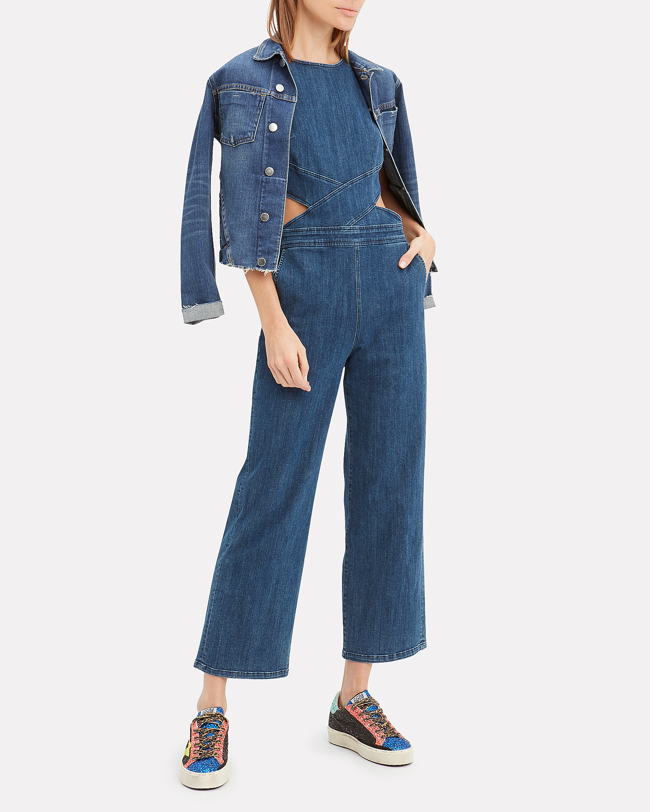

# Color extraction API endpoint

The color extraction service when given an image can compute the histogram of pixel colors and sort them by dominant colors into buckets. The colors in the image pixels are bucketed into 40 predominant colors. The colors shown are representative of the color spectrum. Next, the histogram of color values is computed among the 40 colors. The service has two variants:

**Color Extraction (full image)**

This method simplistically extracts the color histogram across the entire image.

**Color Extraction (with mask)**

This method uses a deep-learning based foreground extractor to identify objects in the foreground. The deep-learning based model is trained on a catalog of e-commerce images. Once the foreground object is extracted, the histogram is computed over the dominant colors as previously described.

The following image was used in the example below:



**API format**

The following example request uses the color extraction (full image) method.

```http
POST /sensei-core/v1/predict
```

**Request**

The request to extract colors (POST) must include certain input parameters. See the table below for more information on the mandatory input parameters.

```SHELL
curl -i -X POST https://sensei-stage-ew1.adobe.io/sensei-core/v1/predict \
  -H 'Authorization: Bearer {ACCESS_TOKEN}' \
  -H 'Content-Type: multipart/form-data' \
  -H 'x-api-key: {API_KEY}' \
  -H 'cache-control: no-cache,no-cache' \
  -F file=@test_image.jpg \
  -F 'contentAnalyzerRequests={
   "enable_diagnostics":"true",
   "requests":[
     {
         "analyzer_id": "Feature:image-color-histogram:Service-6fe52999293e483b8e4ae9a95f1b81a7",
         "parameters": {
          "application-id": "1234", 
          "content-type": "inline", 
          "encoding": "jpeg", 
          "threshold": "0", 
          "top-N": "0", 
          "custom": {}, 
          "data": [{
            "content-id": "0987", 
            "content": "inline-image", 
            "content-type": "inline", 
            "encoding": "jpeg", 
            "threshold": "0", 
            "top-N": "0", 
            "historic-metadata": [], 
            "custom": {"exclude_mask": 1}
            }]
          }
      }
    ]
}'
```

**Mandatory input parameters**

| Property | Description | Mandatory |
| --- | --- | --- |
| `application-id` | The ID of application created. | Yes |
| `data` | A List of JSON objects with each object in the list representing an image. Any parameters passed as part of this list overrides the global parameters specified outside the list for the corresponding list object. To view a list of parameters that can be overridden, see the optional input parameters table below.  | Yes |
| `content-id` | something | Yes |
| `content` | In the event that the image is part of request-body, use `-F file=@<filename>` in the curl command to pass the image, leaving this parameter as an empty string. <br> If the image is a file on s3, pass the signed url. When content is part of request-body, the list of data elements should have only one object. If more than one object is passed, only the first object is processed. | Yes |
| `content-type` | Used to indicate whether the input is part of the request body or a signed url for an s3 bucket. The default for this property is `inline`. | Yes |
| `encoding` | The file format of the input image. Currently only JPEG and PNG images can be processed. The default for this property is `inline`. | Yes |
| `threshold` | The threshold of score (0 to 1) above which the results need to be returned. Use the value 0, to return all results. The default for this property is `0`. | Yes |
| `top-N` | The number of results to be returned (cannot be a negative integer). Use the value 0, to return all results. When used in conjunction with `threshold`, the number of results returned is the lesser of either limit set. The default for this property is `0`. | Yes |
| `custom` | Any custom parameters to be passed. This can be an empty object if unused. | Yes |
| `historic-metadata` | An array that can be passed metadata. | No |

The following parameters can be overridden in the `data` object:

- `content-id`
- `content`
- `content-type`
- `encoding`
- `threshold`
- `top-N`
- `historic-metadata`
- `custom`

**Response**

A successful response returns an array housing each colors data in an object with `feature_name` and `feature_value`. The `feature_value` key contains a string with a color name, a percentage this color appears in relation to the image sent, and the rgb value of the color.

In the first example object below `"feature_value": "White,0.82,239,239,239"`, means the color found was White, this color was found in 82% of the image, and the RGB value is 239,239,239.

```json
{
  "status": 200,
  "content_id": "test_image.jpg",
  "cas_responses": [
    {
      "status": 200,
      "analyzer_id": "Feature:image-color-histogram:Service-e952f4acd7c2425199b476a2eb459635",
      "content_id": "test_image.jpg",
      "result": {
        "response_type": "feature",
        "response": [
          {
            "feature_value": [
              {
                "feature_name": "color_name_and_rgb",
                "feature_value": "White,0.82,239,239,239"
              },
              {
                "feature_value": "Dark_Blue,0.11,41,60,86",
                "feature_name": "color_name_and_rgb"
              },
              {
                "feature_name": "color_name_and_rgb",
                "feature_value": "Royal_Blue,0.08,63,91,123"
              }
            ],
            "feature_name": "color"
          }
        ]
      }
    }
  ],
  "error": []
}
```

| Property | Description |
| --- | --- |
| `content_id` | The name of the image that was uploaded in your POST request. |
| `feature_value` | An array that contains keys with the same property name. These keys contain a list that has the color name, a percentage this color appears in relation to the image sent in the `content_id`, and the rgb value of the color. |
