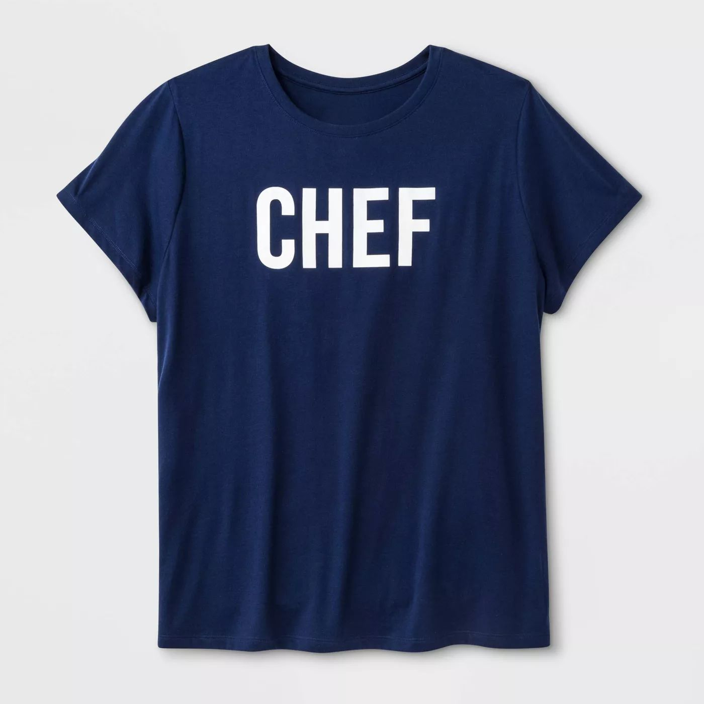

# Text Presence and Optical Character Recognition

>[!NOTE]
>
>Content and Commerce AI is in beta. The documentation is subject to change.

The Text Presence / Optical Character Recognition (OCR) service, when given an image, can indicate if text is present in the image. If text is present, OCR can return the text.

The following image was used in the example request shown in this document:



**API format**

```http
POST /services/v1/predict
```

**Request**

The following request checks if text is present based on the input image provided in the payload. See the table below the example payload for more information on the input parameters shown.

>[!CAUTION]
>
>`analyzer_id` determines which [!DNL Sensei Content Framework] is used. Please check that you have the proper `analyzer_id` before making your request. Contact the Content and Commerce AI beta team to receive your `analyzer_id` for this service.

```SHELL
curl -w'\n' -i -X POST https://sensei.adobe.io/services/v1/predict \
  -H "Authorization: Bearer {ACCESS_TOKEN}" \
  -H "Content-Type: multipart/form-data" \
  -H "cache-control: no-cache,no-cache" \
  -H "x-api-key: {API_KEY}" \
  -F file=@TestImage.jpg \
  -F 'contentAnalyzerRequests={
    "enable_diagnostics":"true",
    "requests":[{
    "analyzer_id": "Feature:image-text-extractor-ocr:Service-b0675160421e404ca3c7ca60f46a5b29",
    "parameters": {
      "application-id": "1234",
      "content-type": "inline",
      "encoding": "jpeg",
      "threshold": "0",
      "top-N": "0",
      "custom": {},
      "data": [{
        "content-id": "0987",
        "content": "inline-image",
        "content-type": "inline",
        "encoding": "jpeg",
        "threshold": "0",
        "top-N": "0",
        "historic-metadata": [],
        "custom": {}
        }]
      }
    }]
  }'
```

| Property | Description | Mandatory |
| --- | --- | --- |
| `analyzer_id` | The [!DNL Sensei] service ID that your request is deployed under. This ID determines which of the [!DNL Sensei Content Frameworks] are used. For custom services, please contact the Content and Commerce AI team to set up a custom ID. | Yes |
| `application-id` | The ID of the application created. | Yes |
| `data` | An array that contains a JSON object with each object in the array representing one image passed. Any parameters passed as part of this array overrides the global parameters specified outside the `data` array. Any of the remaining properties outlined below in this table can be overridden from within `data`. | Yes |
| `language` | Language of input text. The default value is `en`. | No |
| `content-type` | Used to indicate whether the input is part of the request body or a signed url for an S3 bucket. The default for this property is `inline`. | No |
| `encoding` | The file format of the input image. Currently only JPEG and PNG images can be processed. The default for this property is `jpeg`. | No |
| `threshold` | The threshold of score (0 to 1) above which the results need to be returned. Use the value `0` to return all results. The default for this property is `0`. | No |
| `top-N` | The number of results to be returned (cannot be a negative integer). Use the value `0` to return all results. When used in conjunction with `threshold`, the number of results returned is the lesser of either limit set. The default for this property is `0`. | No |
| `custom` | Any custom parameters to be passed. This property requires a valid JSON object to function. | No |
| `content-id` | The unique ID for the data element thats returned in the response. If this is not passed, an auto-generated ID is assigned. | No |
| `content` | The content can be raw image ('inline' content-type). <br> If the content is a file on S3 ('s3-bucket' content-type), pass the signed URL. | Yes |

**Response**

A successful response returns the text that was detected in the `feature_value` array. The text is read and returned top down from left to right. This means that if "I love Adobe" was detected, your payload returns "I", "love", and "Adobe" in separate objects. In the object you are given a `feature_name` that contains the word and a `feature_value` that contains a confidence metric for that text.

```json
{
  "status": 200,
  "content_id": "TestImage.jpg",
  "cas_responses": [
    {
      "status": 200,
      "analyzer_id": "Feature:image-text-extractor-ocr:Service-b0675160421e404ca3c7ca60f46a5b29",
      "content_id": "TestImage.jpg",
      "result": {
        "response_type": "feature",
        "response": [
          {
            "feature_value": [
              {
                "feature_value": "yes",
                "feature_name": "has_text"
              },
              {
                "feature_value": "0.977",
                "feature_name": "CHEF"
              },
              {
                "feature_value": "success",
                "feature_name": "text_processing_status"
              }
            ],
            "feature_name": "ocr"
          }
        ]
      }
    }
  ],
  "error": []
}
```
