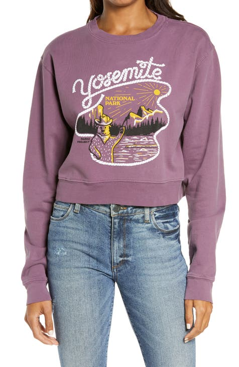

# Text Presence and Optical Character Recognition

The Text Presence/Optical Character Recognition (OCR) service, when given an image, can indicate if text is present in the image. If text is present, OCR can return the text.

The following image was used in the example request shown in this document:



**API format**

```http
POST /services/v2/predict
```

**Request**

The following request checks if text is present based on the input image provided in the payload. See the table below the example payload for more information on the input parameters shown.

Execution with inline image:

```SHELL
curl -w'\n' -i -X POST https://sensei.adobe.io/services/v2/predict \
-H 'Prefer: respond-async, wait=59' \
-H "x-api-key: $API_KEY" \
-H "content-type: multipart/form-data" \
-H "authorization: Bearer $API_TOKEN" \
-F file=@sample_image.png \
-F 'contentAnalyzerRequests={
  "sensei:name": "Feature:cintel-object-detection:Service-b9ace8b348b6433e9e7d82371aa16690",
  "sensei:invocation_mode": "asynchronous",
  "sensei:invocation_batch": false,
  "sensei:engines": [
    {
      "sensei:execution_info": {
        "sensei:engine": "Feature:cintel-object-detection:Service-b9ace8b348b6433e9e7d82371aa16690"
      },
      "sensei:inputs": {
        "documents": [
        {
          "sensei:multipart_field_name": "file",
          "dc:format": "image/jpg"
        }
        ]
      },
      "sensei:params": {
        "correct_with_dictionary": true,
        "min_probability": 0.2,
        "min_relevance": 0.01,
        "filter_with_dictionary": true
      },
      "sensei:outputs":{
        "result" : {
          "sensei:multipart_field_name" : "result",
          "dc:format": "application/json"
        }
      }
    }
  ]
}'

```

**Response**

A successful response returns the text that was detected in the `tags` list for each image that was passed in the request. If there is no text in a certain image, `is_text_present` is 0 and `tags` is an empty list.

[result0, result1, ...]: list of responses for each input document. Each result is a dict with keys:

1. request_element_id: corresponding index to the input file for this response, 0 for the first image in the request’s documents list, 1 for the next one, and so on.
2. tags: list of dictionaries, each dictionary has two keys : text, which is a recognized word from the image, and relevance, which is computed as the fraction of the area of the extracted text’s bounding box in comparison to the full image. 0.01 would translate to a text occupying at least 1% of the image.
3.  is_text_present: 0 or 1 depending on if text is present in the image. If tags is 0, the list is empty.

```json
{
  "contentAnalyzerResponse": {
    "statuses": [
      {
        "sensei:engine": "Feature:cintel-object-detection:Service-b9ace8b348b6433e9e7d82371aa16690",
        "invocations": [
          {
            "sensei:outputs": {
              "result": {
                "sensei:multipart_field_name": "result",
                "dc:format": "application/json"
              }
            },
            "message": null,
            "status": "200"
          }
        ]
      }
    ],
    "request_id": "dttklFR7DPtMtEmjlRSx5BYP5WGg3tTx"
  },
  "result": [
    {
      "is_text_present": 1,
      "tags": [
        {
          "text": "yosemite",
          "relevance": 0.05604639115920341
        }
      ],
      "request_element_id": 0
    }
  ]
}

```

**Request**

The following request checks if text is present based on the input image provided in the payload. See the table below the example payload for more information on the input parameters shown.

Execution with URL:

```SHELL
curl -w'\n' -i -X POST https://sensei.adobe.io/services/v2/predict \
-H 'Prefer: respond-async, wait=59' \
-H "x-api-key: $API_KEY" \
-H "content-type: multipart/form-data" \
-H "authorization: Bearer $API_TOKEN" \
-F 'contentAnalyzerRequests={
  "sensei:name": "Feature:cintel-object-detection:Service-b9ace8b348b6433e9e7d82371aa16690",
  "sensei:invocation_mode": "asynchronous",
  "sensei:invocation_batch": false,
  "sensei:engines": [
    {
      "sensei:execution_info": {
        "sensei:engine": "Feature:cintel-object-detection:Service-b9ace8b348b6433e9e7d82371aa16690"
      },
      "sensei:inputs": {
        "documents": [
        {
          "repo:path": <IMG_URL_PATH>,
          "sensei:repoType": "HTTP",
          "dc:format": "image/jpg"
        }
        ]
      },
      "sensei:params": {
        "correct_with_dictionary": true
      },
      "sensei:outputs":{
        "result" : {
          "sensei:multipart_field_name" : "result",
          "dc:format": "application/json"
        }
      }
    }
  ]
}'
```

```json
{
  "contentAnalyzerResponse": {
    "statuses": [
      {
        "sensei:engine": "Feature:cintel-object-detection:Service-b9ace8b348b6433e9e7d82371aa16690",
        "invocations": [
          {
            "sensei:outputs": {
              "result": {
                "sensei:multipart_field_name": "result",
                "dc:format": "application/json"
              }
            },
            "message": null,
            "status": "200"
          }
        ]
      }
    ],
    "request_id": "ZbdhcK0JqS4Wg1wGdlEHGR3JOm530YNn"
  },
  "result": [
    {
      "is_text_present": 0,
      "tags": [],
      "request_element_id": 0
    }
  ]
}

```

| Property | Description | Mandatory |
| --- | --- | --- |
| `documents` | List of JSON elements with each item in the list representing one image. Any parameters passed as part of this list, override the global parameter specified outside the list, for the corresponding list element. | Yes |
| `sensei:multipart_field_name` | field_name to read the input file path from. | Yes |
| `repo:path` | Presigned url to image asset. | Yes |
| `sensei:repoType` | “HTTP” (for presigned-url). | No |
| `dc:format` | Encoded format of input image. Only image formats like jpeg, jpg, png and tiff are allowed for image encoding. The dc:format is matched against allowed formats. | No |
| `correct_with_dictionary` | Whether to correct the words with an English dictionary? If this is not turned on, you could potentially have non-English words recognized. Default is True: turned on.) Note that when the dictionary is turned on, it is not necessary that you always get an English word. We try to correct it, but if it is not possible within a certain edit distance, we return the original word. | No |
| `filter_with_dictionary` | Whether to filter the words to contain only the words from the English dictionary? If this is turned on, the returned words will always belong to the large English , which comprises 470k words. | No |
| `min_probability` | What is the minimum probability for the recognized words? Only the words that are extracted from the image and have a greater probability than min_probability are returned by the service. The default value is set at 0.2. | No |
| `min_relevance` | What is the minimum relevance for the recognized words? Only the words that are extracted from the image and have greater relevance than min_relevance are returned by the service. The default value is set at 0.01. The relevance is computed as the fraction of the area of the extracted text’s bounding box in comparison to the full image. 0.01 would translate to a text occupying at least 1% of the image. | No |

| Name | Data Type | Required | Default | Values | Description |
| -----| --------- | -------- | ------- | ------ | ----------- |
| `repo:path` | string | - | - | - | Presigned url of the image from which text needs to be extracted. |
| `sensei:repoType` | string | - | - | HTTPS | Type of repo where the image is being stored. |
| `sensei:multipart_field_name` | string | - | - | - | Use this when passing the image as a multipart argument instead of using presigned urls. |
| `dc:format` | string | Yes | - | “image/jpg”, <br>“image/jpeg”, <br>“image/png”, <br>“image/tiff” | Image encoding is checked against allowed input encoding types before being processed.|