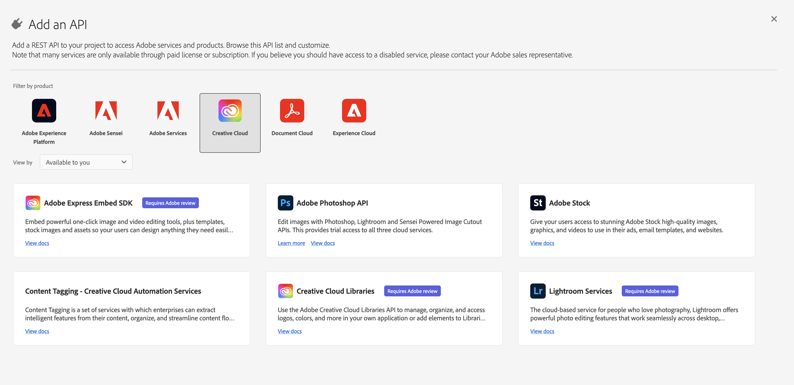
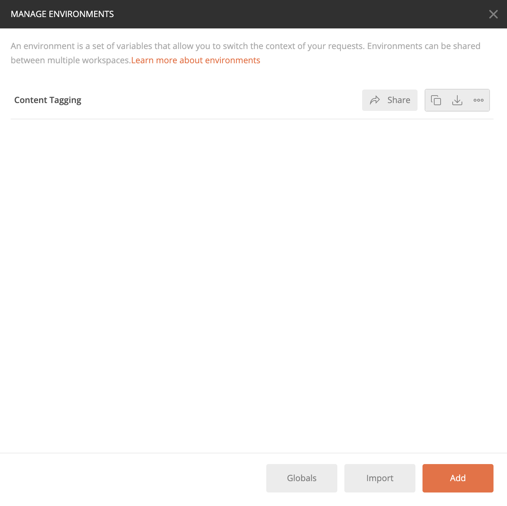
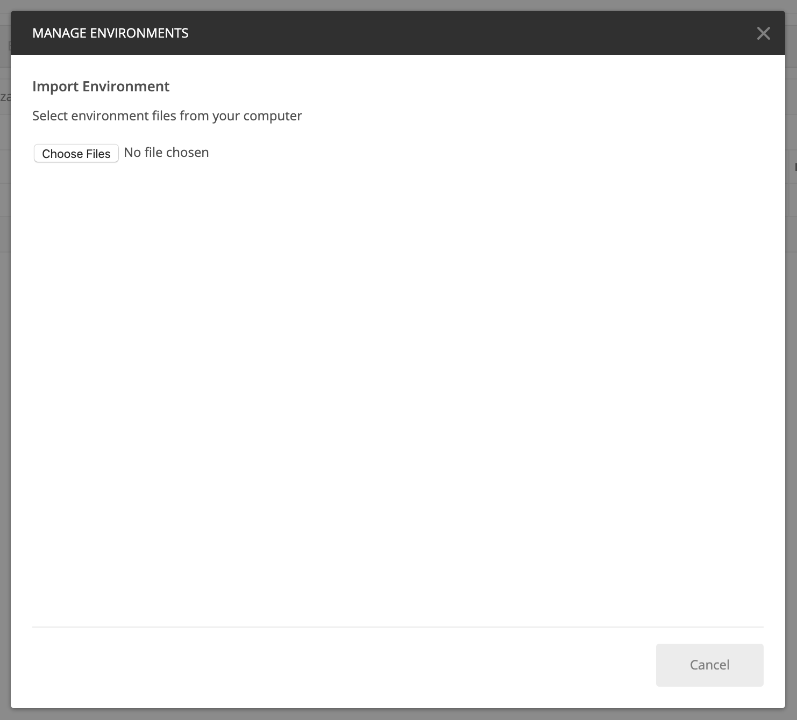
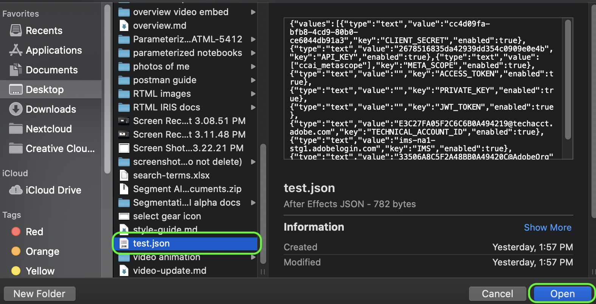
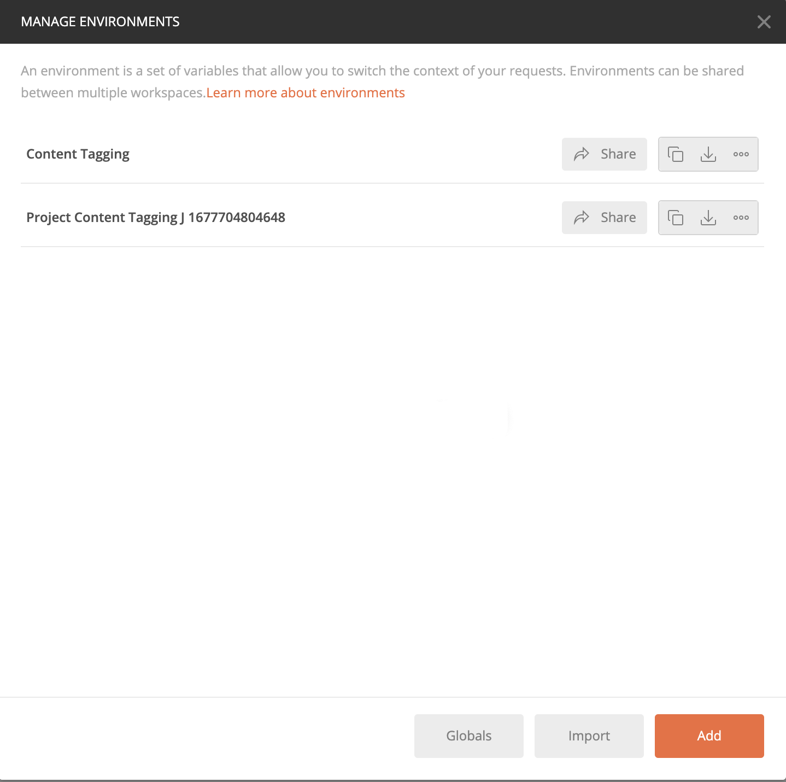
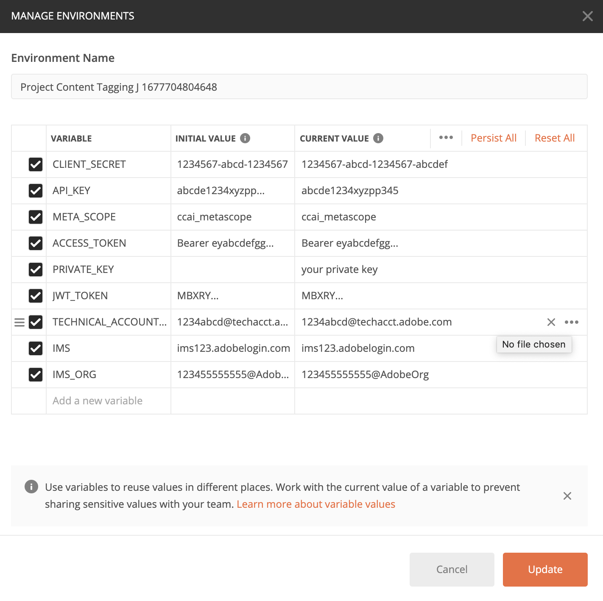
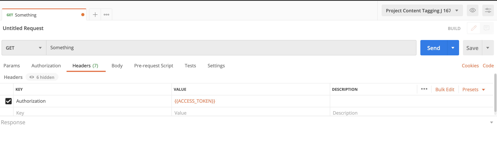

# Getting started with Content Tagging

[!DNL Content tagging] utilizes Adobe I/O APIs. In order to make calls to Adobe I/O APIs and the I/O Console Integration, you must first complete the [authentication tutorial](https://www.adobe.com/go/platform-api-authentication-en).

However, when you get to the **Add API** step, the API is located under Creative Cloud instead of Adobe Experience Platform, as shown in the following screenshot: 

 Completing the authentication tutorial provides the values for each of the required headers in all the Adobe I/O API calls, as shown below:

- `Authorization: Bearer {ACCESS_TOKEN}`
- `x-api-key: {API_KEY}`
- `x-gw-ims-org-id: {ORG_ID}`

## Create a Postman environment (optional)

Once you have set up your project and API within Adobe Developer Console, you have the option to download an environment file for Postman. Under **[!UICONTROL APIs]** the left rail of your project, select **[!UICONTROL Content tagging]**. A new tab opens, containing a card labeled "[!DNL Try it out]". Select **Download for Postman** to download a JSON file used to configure your postman environment. 

Once you have downloaded the file, open Postman and select the **gear icon** in the top right to open up the **manage environments** dialog. 

Next, select **Import** from within the **Manage environments** dialog.

You are redirected and asked to select an environment file from your computer. Select the JSON file you downloaded earlier, then select **Open** to load the environment.

You are redirected back to the *Manage environments* tab with a new environment name populated. Select the environment name to view and edit the variables available in Postman. You still need to manually populate the `JWT_TOKEN` and `ACCESS_TOKEN`. These values should have been obtained while completing the [authentication tutorial](https://www.adobe.com/go/platform-api-authentication-en).

Once complete, your variables should look something like the screenshot below. Select **Update** to finish setting up your environment.

You can now select your environment from the dropdown menu in the top-right corner and auto-populate any values saved. Simply re-edit the values at any time to update all of your API calls.

For more information on working with Adobe I/O APIs using Postman, see the Medium post on [using Postman for JWT authentication on Adobe I/O](https://medium.com/adobetech/using-postman-for-jwt-authentication-on-adobe-i-o-7573428ffe7f).

## Reading sample API calls

This guide provides example API calls to demonstrate how to format your requests. These include paths, required headers, and properly formatted request payloads. Sample JSON returned in API responses is also provided. For information on the conventions used in documentation for sample API calls, see the section on [how to read example API calls](../../landing/troubleshooting.md) in the Experience Platform troubleshooting guide.

## Next steps {#next-steps}

Once you have all your credentials, you are ready to set up a custom worker for [!DNL Content tagging]. The following documents assist with understanding the Extensibility Framework and environment setup.

To learn more about the Extensibility Framework, start by reading the [introduction to extensibility](https://experienceleague.adobe.com/docs/asset-compute/using/extend/understand-extensibility.html) document. This document outlines the prerequisites and provisioning requirements.

To learn more about setting up an environment for [!DNL Content tagging], start by reading the guide for [setting up a developer environment](https://experienceleague.adobe.com/docs/asset-compute/using/extend/setup-environment.html). This document provides setup instructions that allow you to develop for the Asset Compute Service.
