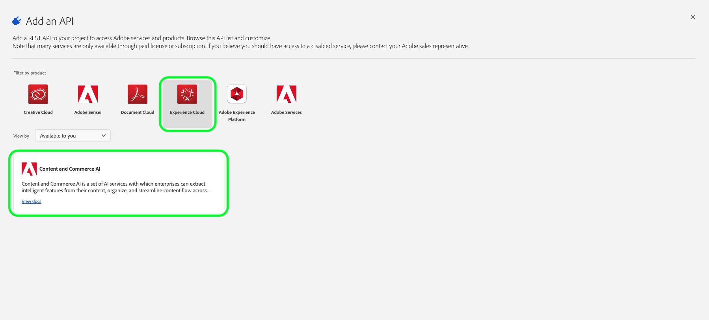
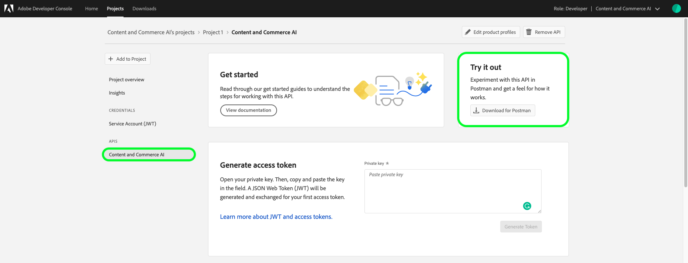
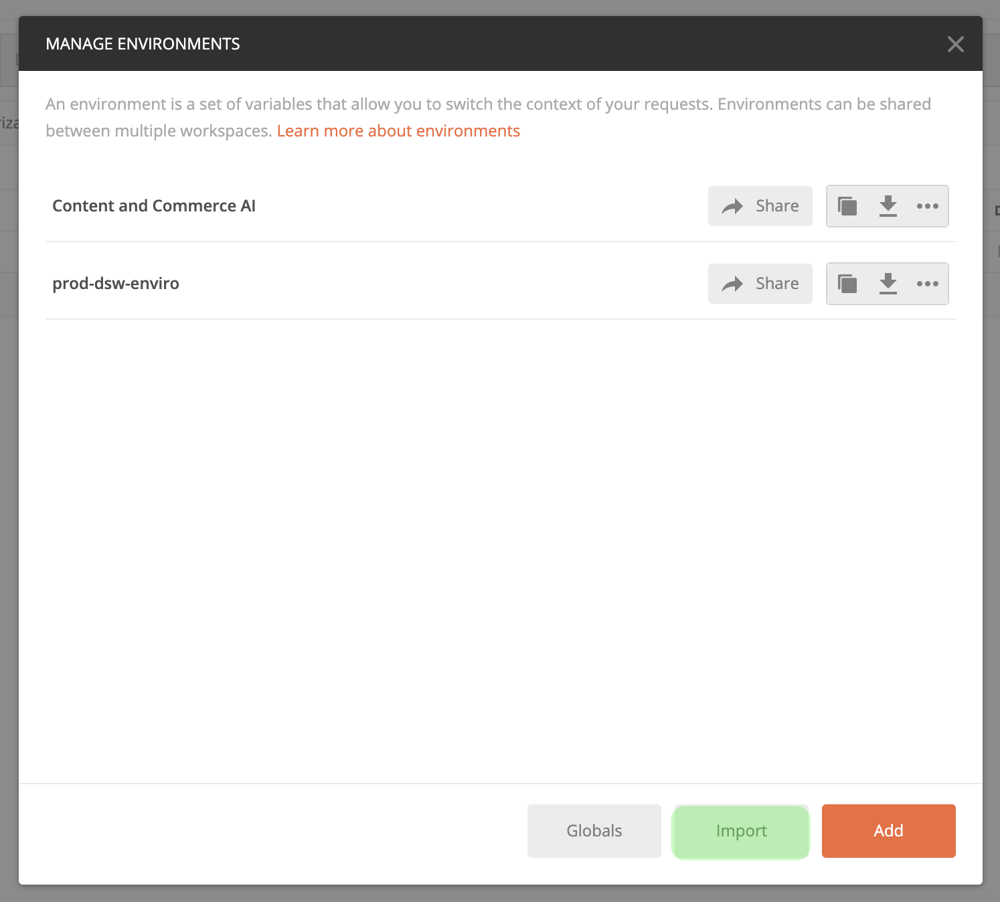
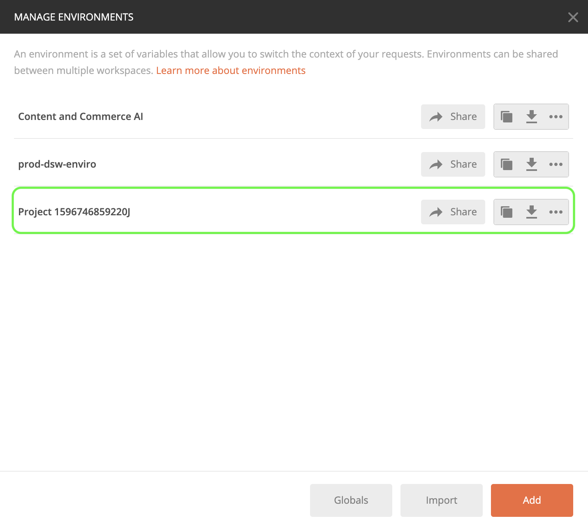
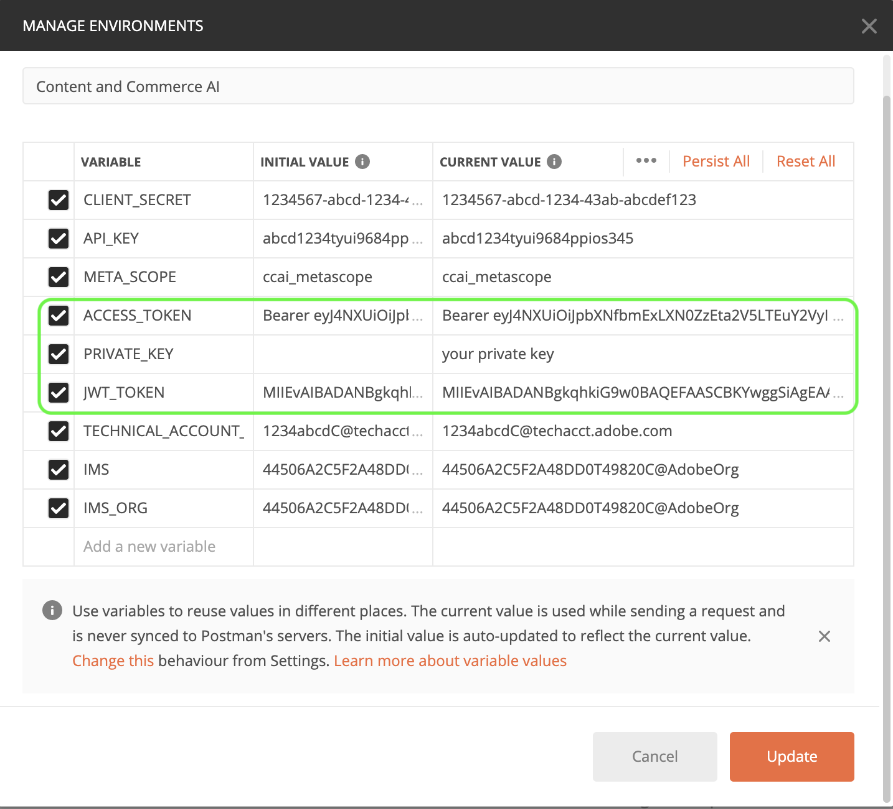
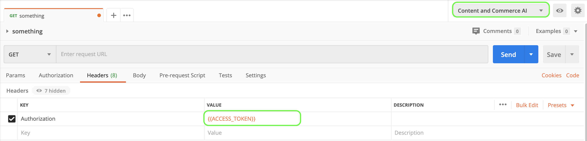

# Getting started with [!DNL Content and Commerce AI]

>[!NOTE]
>
>Content and Commerce AI is in beta. The documentation is subject to change.

[!DNL Content and Commerce AI] utilizes Adobe I/O APIs. In order to make calls to Adobe I/O APIs and the I/O Console Integration, you must first complete the [authentication tutorial](../../tutorials/authentication.md).

However, when you get to the **Add API** step, the API is located under Experience Cloud instead of Adobe Experience Platform, as shown in the following screenshot: 

 Completing the authentication tutorial provides the values for each of the required headers in all the Adobe I/O API calls, as shown below:

- `Authorization: Bearer {ACCESS_TOKEN}`
- `x-api-key: {API_KEY}`
- `x-gw-ims-org-id: {IMS_ORG}`

## Creating a Postman environment (optional)

Once you have set up your project and API within the Adobe Developer Console, you have the option to download an environment file for Postman. Within your project, in the left rail under APIS select **Content and Commerce AI**. A new tab opens and within this tab is a card labeled Try it out. Click **Download for Postman** to download a JSON file used to configure your postman environment. 

Once you have downloaded the file, open up Postman and select the gear icon in the top right to open up the *manage environments* dialog. 

Next, click **Import** from within the *Manage environments* dialog.

You are redirected and asked to select an environment file from your computer. This is the JSON file you downloaded. Select the file and click open to load the environment.

You are redirected back to the *Manage environments* tab with a new environment name populated. Click the environment name to edit and see the variables available in Postman. You still need to manually populate the `JWT_TOKEN` and `ACCESS_TOKEN`. These values should have been obtained while completing the [authentication tutorial](../../tutorials/authentication.md).

Once complete, it should look something like the following example. Click **Update** to finish setting up your environment.

You can now select your environment from the environment dropdown menu in the top-right corner and auto-populate any values saved. Simply re-edit the values at any time to update all of your API calls.

If you want to learn more about Postman, see the Medium post on [using Postman for JWT authentication on Adobe I/O](https://medium.com/adobetech/using-postman-for-jwt-authentication-on-adobe-i-o-7573428ffe7f).

## Reading sample API calls

This guide provides example API calls to demonstrate how to format your requests. These include paths, required headers, and properly formatted request payloads. Sample JSON returned in API responses is also provided. For information on the conventions used in documentation for sample API calls, see the section on [how to read example API calls](../../landing/troubleshooting.md) in the Experience Platform troubleshooting guide.

## Next steps {#next-steps}

Once you have all your credentials ready, start by following the [[!DNL Content and Commerce AI] API guide](./api/color-extraction.md). 