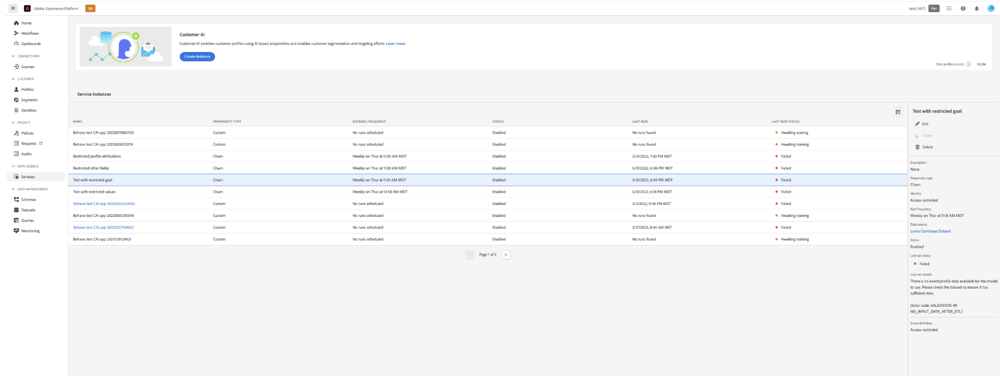
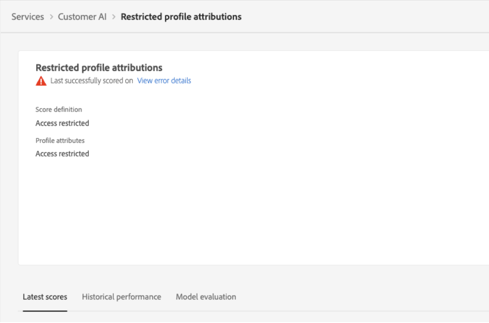
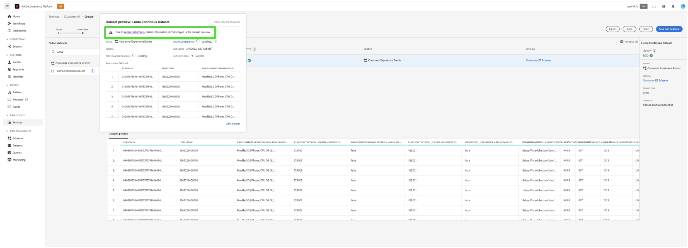
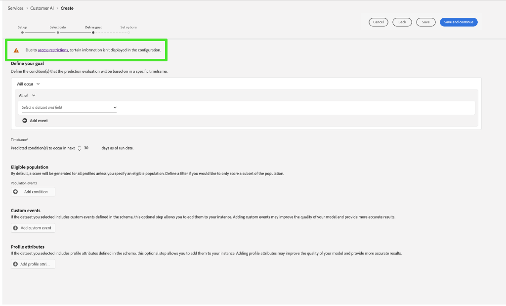

# Attribute-based access control in Customer AI

>[!IMPORTANT]
>
>Attribute-based access control is currently available in a limited release only.

[Attribute-based access control](../../../access-control/abac/overview.md) is a capability of Adobe Experience Platform that enables administrators to control access to specific objects and/or capabilities based on attributes. Attributes can be metadata added to an object, such as a label added to a schema field or segment. An administrator defines access policies that include attributes to manage user access permissions.

This functionality allows you to label Experience Data Model (XDM) schema fields with labels that define organizational or data usage scopes. In parallel, administrators can use the user and role administration interface to define access policies surrounding XDM schema fields and better manage the access given to users or groups of users (internal, external, or third-party users). Additionally, attribute-based access control allows administrators to manage access to specific segments.

Through attribute-based access control, administrators of your organization can control users' access to both sensitive personal data (SPD) and personally identifiable information (PII) across all Experience Platform workflows and resources. Administrators can define user roles that have access only to specific fields and data that correspond to those fields.

Due to attribute-based access control, some fields and functionalities would have access restricted and be unavailable for certain Customer AI service models. Examples include, "Identity", "Score Definition", and "Clone."

At the top of the Customer AI workspace **insights page**, notice that the details in the sidebar, score definition, identity, and profile attributes all show "Access Restricted."

When you preview datasets with restricted schema on the **[!UICONTROL Create model workflow]** page, a warning appears to let you know that [!UICONTROL Due to access restrictions, certain information isn't displayed in the dataset preview.]

After you create an model with restricted information and proceed to the **[!UICONTROL Define goal]** step, a warning is displayed at the top: [!UICONTROL Due to access restrictions, certain information isn't displayed in the configuration.]

When using access control, the **View Customer AI** and **Manage Customer AI** privileges grant access to different functionalities of Customer AI. The **Manage Customer AI** permission lets you **create**,**update**, **delete**, **enable**, or **disable** a model while **View Customer AI** lets you read or view it. The **create**, **update** and **delete** actions are recorded by audit logs.

See the documentation to learn [assigning permissions for access control](../../../access-control/home.md) or how to [use audit logs to monitor access and activity](../../../landing/governance-privacy-security/audit-logs/overview.md).

## Next steps

By reading this guide, you have been introduced to the main principles of access control in [!DNL Experience Platform]. You can now continue to the [access control user guide](../overview.md) for detailed steps on how use the [!DNL Admin Console] to create product profiles and assign permissions for [!DNL Experience Platform].
