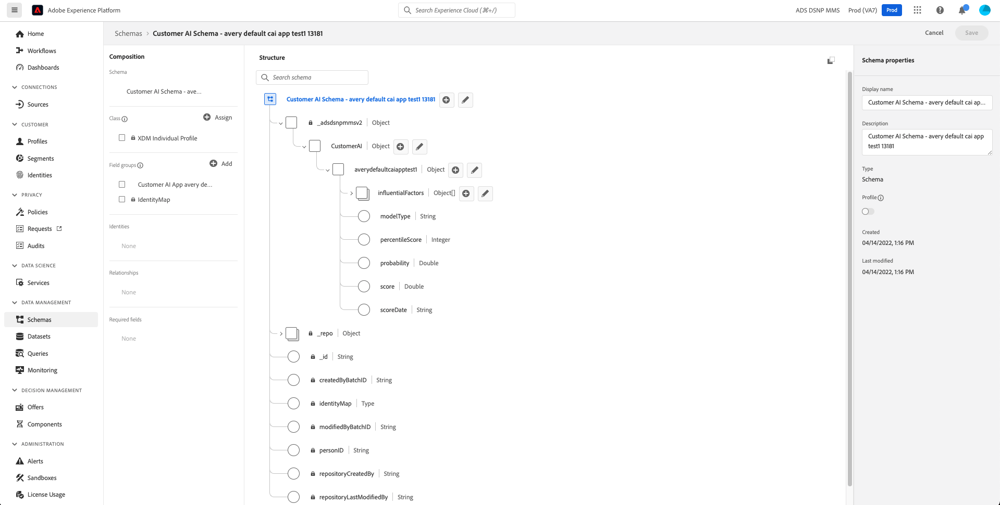

# Input and output in Customer AI

The following document outlines the different required events, inputs, and outputs utilized in Customer AI. 

## Getting started

Customer AI works by analyzing one of the following datasets to predict churn or conversion propensity scores:

- Adobe Analytics data using the [Analytics source connector](../../sources/tutorials/ui/create/adobe-applications/analytics.md)
- Adobe Audience Manager data using the [Audience Manager source connector](../../sources/tutorials/ui/create/adobe-applications/audience-manager.md)
- Experience Event (EE) dataset
- Consumer Experience Event (CEE) dataset

You can add multiple datasets from different sources if each of the datasets shares the same identity type (namespace) such as an ECID. For more information on adding multiple datasets, visit the [Customer AI user guide](./user-guide/configure.md#select-data)

>[!IMPORTANT]
>
>Source connectors take up to four weeks to backfill data. If you recently set up a connector you should verify that the dataset has the minimum length of data required for Customer AI. Please review the [historical data](#data-requirements) section to verify you have enough data for your prediction goal.

This document requires a basic understanding of the CEE schema. Please review the [Intelligent Services data preparation](../data-preparation.md) documentation before continuing.

The following table outlines some common terminology used in this document:

| Term | Definition |
| --- | --- |
| [Experience Data Model (XDM)](../../xdm/home.md) | XDM is the foundational framework that allows Adobe Experience Cloud, powered by Adobe Experience Platform, to deliver the right message to the right person, on the right channel, at exactly the right moment. The methodology on which Experience Platform is built, XDM System, operationalizes Experience Data Model schemas for use by Platform services. |
| XDM Schema | Experience Platform uses schemas to describe the structure of data in a consistent and reusable way. By defining data consistently across systems, it becomes easier to retain meaning and therefore gain value from data. Before data can be ingested into Platform, a schema must be composed to describe the data’s structure and provide constraints to the type of data that can be contained within each field. Schemas consist of a base XDM class and zero or more schema field groups. |
| XDM class | All XDM schemas describe data that can be categorized as record or time series. The data behavior of a schema is defined by the schema’s class, which is assigned to a schema when it is first created. XDM classes describe the smallest number of properties a schema must contain in order to represent a particular data behavior. |
| [Field groups](../../xdm/schema/composition.md) | A component that define one or more fields in a schema. Field groups enforce how their fields appear in the schema’s hierarchy, and therefore exhibit the same structure in every schema that they are included in. Field groups are only compatible with specific classes, as identified by their `meta:intendedToExtend` attribute. |
| [Data type](../../xdm/schema/composition.md) | A component that can also provide one or more fields for a schema. However, unlike field groups, data types are not constrained to a particular class. This makes data types a more flexible option to describe common data structures that are reusable across multiple schemas with potentially different classes. The data types outlined in this document are supported by both the CEE and Adobe Analytics schemas. |
| Churn | A measurement of the percentage of accounts that cancel or choose not to renew their subscriptions. A high churn rate can negatively impact Monthly Recurring Revenue (MRR) and can also indicate dissatisfaction with a product or service. |
| [Real-Time Customer Profile](../../profile/home.md) | Real-Time Customer Profile provides a centralized consumer profile for targeted and personalized experience management. Each profile contains data that is aggregated across all systems, as well as actionable timestamped accounts of events involving the individual that have taken place in any of the systems you use with Experience Platform. |

## Customer AI input data

>[!TIP]
>
> Customer AI automatically determines which events are useful for predictions and raises a warning if the available data is not sufficient to generate quality predictions.

Customer AI supports Adobe Analytics, Adobe Audience Manager, Experience Event (EE), and Consumer Experience event (CEE) datasets. The CEE schema requires you to add field groups during the schema creation process. If you are using Adobe Analytics or Adobe Audience Manager datasets, the source connector directly maps the standard events (Commerce, Web page details, Application, and Search) listed below during the connection process. You can add multiple datasets from different sources if each of the datasets shares the same identity type (namespace) such as an ECID.

For more information on mapping Adobe Analytics data or Audience Manager data, visit the [Analytics field mappings](../../sources/connectors/adobe-applications/analytics.md) or [Audience Manager field mappings](../../sources/connectors/adobe-applications/mapping/audience-manager.md) guide.

### Standard events used by Customer AI {#standard-events}

XDM Experience Events are used for determining various customer behaviors. Depending on how your data is structured, the event types listed below may not encompass all of your customer's behaviors. It is up to you to determine what fields have the necessary data that is needed to clearly and unambiguously identify web user activity. Depending on your prediction goal, the required fields that are needed can change.

Customer AI relies on different event types for building model features. These event types are automatically added to your schema using multiple XDM field groups.

>[!NOTE]
>
>If you are using Adobe Analytics or Adobe Audience Manager data, the schema is created automatically with the required standard events that are needed to capture your data. If you are creating your own custom CEE schema to capture data, you need to consider what field groups are needed to capture your data.

It is not necessary to have data for each of the standard events listed below but certain events are required for certain scenarios. If you have any of the standard events data available, it is recommended that you include it in your schema. For example, if you wanted to create a Customer AI application for predicting purchase events, it would be useful to have data from the `Commerce` and `Web page details` data types.

To view a field group in the Platform UI, select the **[!UICONTROL Schemas]** tab on the left-rail followed by selecting the **[!UICONTROL Field groups]** tab.

| Field group | Event type | XDM field path |
| --- | --- | --- |
| [!UICONTROL Commerce Details] | order | <li> commerce.order.purchaseID </li> <li> productListItems.SKU </li> |
|  | productListViews | <li> commerce.productListViews.value </li> <li> productListItems.SKU </li>  |
|  | checkouts | <li> commerce.checkouts.value </li> <li> productListItems.SKU </li> |
|  | purchases | <li> commerce.purchases.value </li> <li> productListItems.SKU </li> |
|  | productListRemovals | <li> commerce.productListRemovals.value </li> <li> productListItems.SKU </li> |
|  | productListOpens | <li> commerce.productListOpens.value </li> <li> productListItems.SKU </li> |
|  | productViews | <li> commerce.productViews.value </li> <li> productListItems.SKU </li> |
| [!UICONTROL Web Details] | webVisit | web.webPageDetails.name |
|  | webInteraction | web.webInteraction.linkClicks.value |
| [!UICONTROL Application Details] | applicationCloses | <li> application.applicationCloses.value </li> <li> application.name </li> |
|  | applicationCrashes | <li> application.crashes.value </li> <li> application.name </li> |
|  | applicationFeatureUsages | <li> application.featureUsages.value </li> <li> application.name </li> |
|  | applicationFirstLaunches | <li> application.firstLaunches.value </li> <li> application.name </li> |
|  | applicationInstalls | <li> application.installs.value </li> <li> application.name </li> |
|  | applicationLaunches | <li> application.launches.value </li> <li> application.name </li> |
|  | applicationUpgrades | <li> application.upgrades.value </li> <li> application.name </li> |
| [!UICONTROL Search Details] | search | search.keywords |

Additionally, Customer AI can use subscription data to build better churn models. Subscription data is needed for each profile using the [[!UICONTROL Subscription]](../../xdm/data-types/subscription.md) data type format. Most of the fields are optional, however, for an optimal churn model it is highly recommended that you provide data for as many fields as possible such as, `startDate`, `endDate`, and any other relevant details.

### Adding custom events and profile attributes

If you have information you wish to include in addition to the [standard event fields](#standard-events) used by Customer AI, a custom event and custom profile attribute option is provided during your [instance configuration](./user-guide/configure.md#custom-events). 

If the dataset you selected includes custom events or profile attributes such as a "hotel reservation" or "employee of X company" defined in your schema, you can add them to your instance. These additional custom events and profile attributes are used by Customer AI to improve the quality of your model and provide more accurate results.

### Historical data {#data-requirements}

Customer AI requires historical data for model training but the amount of data required is based on two key elements: outcome window and eligible population. 

By default, Customer AI looks for a user to have had activity in the last 120 days if no eligible population definition is provided during the application configuration. Additionally, Customer AI requires a minimum of 500 qualifying and 500 non-qualifying events (1000 total) of historical data based on a predicted goal definition.

The following examples provided use a simple formula to help you determine the minimum amount of data required. If you have more than the minimum requirement, your model is likely to provide more accurate results. If you have less than the minimum amount required, the model will fail as there is not a sufficient amount of data for model training. 

**Formula**:

Minimum length of data required = eligible population + outcome window

>[!NOTE]
>
> 30 is the minimum number of days required for eligible population. If this is not provided the default is 120 days.

Examples: 

- You want to predict whether a customer is likely to purchase a watch in the next 30 days. You also want to score users who have some web activity in the last 60 days. In this case the minimum length of data required = 60 days + 30 days. The eligible population is 60 days and the outcome window is 30 days totaling 90 days.

- You want to predict whether the user is likely to purchase a watch in the next 7 days. In this case the minimum length of data required = 120 days + 7 days. The eligible population defaults to 120 days and the outcome window is 7 days totaling 127 days.

- You want to predict whether the customer is likely to purchase a watch in the next 7 days. You also want to score users who have some web activity in the last 7 days. In this case the minimum length of data required = 30 days + 7 days. The eligible population requires a minimum of 30 days and the outcome window is 7 days totaling 37 days.

Apart from the minimum data required, Customer AI also works best with recent data. In this use case, Customer AI is doing a prediction for the future based on a user's recent behavioral data. In other words, more recent data is likely to yield a more accurate prediction.

### Example scenarios

In this section, different scenarios for Customer AI instances are described as well as the required and recommended event types. Refer to the [standard events table](#standard-events) above for more information on the field group and its field path.

>[!NOTE]
>
> Required event types are used to clearly and unambiguously identify web user activity. The number of required event types will change based on the prediction goal and structure of your schema. If you are unsure a particular event type is needed, it is recommended to include that event type while building your CEE schema. If you are using Adobe Analytics or Adobe Audience Manager data, the required standard events should be available depending on the data you are streaming.

### Scenario 1: Purchase conversion on an e-commerce retail website

**Prediction goal:** Predict the conversion propensity for the eligible profiles to purchase a certain article of clothing on a website.

**Required standard event types:**

The event types listed below are required for an optimal Customer AI output with this particular prediction goal. It is possible to exclude a required event depending on your prediction goal, however, excluding multiple events can lead to poor results.

- order
- checkouts
- purchases
- webVisit
- search

**Additional recommended standard event types:**

Any of the remaining [event types](#standard-events) may be required based on the complexity of your goal and eligible population while configuring your Customer AI instance. It is recommended that if the data is available for a particular data type, that this data is included in your schema.

### Scenario 2: Subscription conversion on a media streaming service website

**Prediction goal:** Predict the subscription conversion propensity for the eligible profiles to commit to a certain level of subscription such as a standard or premium plan.

**Required standard event types:**

The event types listed below are required for an optimal Customer AI output with this particular prediction goal. It is possible to exclude a required event depending on your prediction goal, however, excluding multiple events can lead to poor results.

- order
- checkouts
- purchases
- webVisit
- search

In this example, `order`, `checkouts`, and `purchases` are used to indicate that a subscription was purchased and its type.

Additionally, for an accurate model it is suggested that you make use of some of the available properties in the [subscription data type](../../xdm/data-types/subscription.md).

**Additional recommended standard event types:**

Any of the remaining [event types](#standard-events) may be required based on the complexity of your goal and eligible population while configuring your Customer AI instance. It is recommended that if the data is available for a particular data type, that this data is included in your schema.

### Scenario 3: Churn on an e-commerce retail website

**Prediction goal:** Predict the likelihood that a purchase event will not occur.

**Required standard event types:**

The event types listed below are required for an optimal Customer AI output with this particular prediction goal. It is possible to exclude a required event depending on your prediction goal, however, excluding multiple events can lead to poor results.

- order
- checkouts
- purchases
- webVisit
- search

**Additional recommended standard event types:**

Any of the remaining [event types](#standard-events) may be required based on the complexity of your goal and eligible population while configuring your Customer AI instance. It is recommended that if the data is available for a particular data type, that this data is included in your schema.

### Scenario 4: Upsell conversion on an e-commerce retail website

**Prediction goal:** Predict the purchase propensity of the population that has purchased a specific product to purchase a new related product.

**Required standard event types:**

The event types listed below are required for an optimal Customer AI output with this particular prediction goal. It is possible to exclude a required event depending on your prediction goal, however, excluding multiple events can lead to poor results.

- order
- checkouts
- purchases
- webVisit
- search

**Additional recommended standard event types:**

Any of the remaining [event types](#standard-events) may be required based on the complexity of your goal and eligible population while configuring your Customer AI instance. It is recommended that if the data is available for a particular data type, that this data is included in your schema.

### Scenario 5: Unsubscribe (churn) on an online news outlet

**Prediction goal:** Predict the propensity of the eligible population to unsubscribe from a service next month. 

**Required standard event types:**

The event types listed below are required for an optimal Customer AI output with this particular prediction goal. It is possible to exclude a required event depending on your prediction goal, however, excluding multiple events can lead to poor results.

- webVisit
- search

Additionally, for an accurate model it is suggested that you make use of some of the available properties in the [subscription data type](../../xdm/data-types/subscription.md).

**Additional recommended standard event types:**

Any of the remaining [event types](#standard-events) may be required based on the complexity of your goal and eligible population while configuring your Customer AI instance. It is recommended that if the data is available for a particular data type, that this data is included in your schema.

### Scenario 6: Launch mobile application

**Prediction goal:** Predict the propensity of eligible profiles to launch a paid mobile application in the next X days. This is similar to predicting the Key Performance Indicator (KPI) of "Monthly Active Users".

**Required standard event types:**

The event types listed below are required for an optimal Customer AI output with this particular prediction goal. It is possible to exclude a required event depending on your prediction goal, however, excluding multiple events can lead to poor results.

- order
- checkouts
- purchases
- webVisit
- applicationCloses
- applicationCrashes
- applicationFeatureUsages
- applicationFirstLaunches
- applicationInstalls
- applicationLaunches
- applicationUpgrades

In this example, `order`, `checkouts`, and `purchases` are used when a mobile application needs to be  purchased.

**Additional recommended standard event types:**

Any of the remaining [event types](#standard-events) may be required based on the complexity of your goal and eligible population while configuring your Customer AI instance. It is recommended that if the data is available for a particular data type, that this data is included in your schema.

### Scenario 7: Traits realized (Adobe Audience Manager)

**Prediction goal:** Predict the propensity for some traits to be realized. 

**Required standard event types:**

In order to use traits from Adobe Audience Manager, you need to create a source connection using the [Audience Manager source connector](../../sources/tutorials/ui/create/adobe-applications/audience-manager.md). The source connector automatically creates the schema with the proper field group(s). You do not need to manually add additional event types for the schema to work with Customer AI.

When you are configuring a new customer AI instance, `audienceName` and `audienceID` can be used to select a particular trait for scoring while defining your goal.

## Customer AI output data

Customer AI generates several attributes for individual profiles that are deemed eligible. There are two ways to consume the score (output) based on what you have provisioned. If you have a Real-Time Customer Profile-enabled dataset, you can consume insights from Real-Time Customer Profile in the [Segment Builder](../../segmentation/ui/segment-builder.md). If you don't have a Profile-enabled dataset, you can [download the Customer AI output](./user-guide/download-scores.md) dataset available on the data lake.

You can find the output dataset under **Datasets** in Platform. All Customer AI output datasets start with the name **Customer AI Scores - Name_of_app**. Similarly, all Customer AI output schemas start with the name **Customer AI Schema - Name_of_app**.

>[!NOTE]
>
> Output values are consumed by Real-Time Customer Profile which can be used to create and define segments.

 The table below describes the various attributes found in the output of Customer AI:

| Attribute | Description |
| ----- | ----------- |
| Score | The relative likelihood for a customer to achieve the predicted goal within the defined time frame. This value is not to be treated as a probability percentage but rather the likelihood of an individual compared to the overall population. This score ranges from 0 to 100. |
| Probability | This attribute is the true probability of a profile for achieving the predicted goal within the defined time frame. When comparing outputs across different goals, it is recommended that you consider probability over percentile or score. Probability should always be used when determining the average probability across the eligible population, as the probability tends to be on the lower side for events that do not occur frequently. Values for probability range between 0 and 1. |
| Percentile | This value provides information regarding the performance of a profile relative to other similarly scored profiles. For example, a profile with a percentile rank of 99 for churn indicates that it is at a higher risk of churning compared to 99% of all other profiles that were scored. Percentiles range from 1 to 100. |
| Propensity type | The selected propensity type. |
| Score date | The date on which scoring occurred. |
| Influential factors | Predicted reasons on why a profile is likely to convert or churn. Factors are comprised of the following attributes:<ul><li>Code: The profile or behavioral attribute which positively influences a profile's predicted score. </li><li>Value: The value of the profile or behavioral attribute.</li><li>Importance: Indicates the weight of the profile or behavioral attribute has on the predicted score (low, medium, high)</li></ul> |

>[!NOTE]
>
> - Customer AI uses only updated data for further training and scoring. Likewise, when you request to delete data, Customer AI refrains from using the deleted data.
> - Customer AI leverages Platform datasets. To support consumer rights requests a brand may receive, brands should use Platform Privacy Service to submit consumer requests of access and delete to remove their data across the data lake, Identity Service, and Real-Time Customer Profile. 
> - All datasets we use for input/output of models will follow Platform guidelines. Platform Data Encryption applies for data at-rest and in-transit. See the documentation to learn more about [data encryption](../../../help/landing/governance-privacy-security/encryption.md)

## Next steps {#next-steps}

Once you have prepared your data and have all your credentials and schemas in place, start by following the [Configure a Customer AI Instance](./user-guide/configure.md) guide. This guide walks you through creating an instance for Customer AI.

