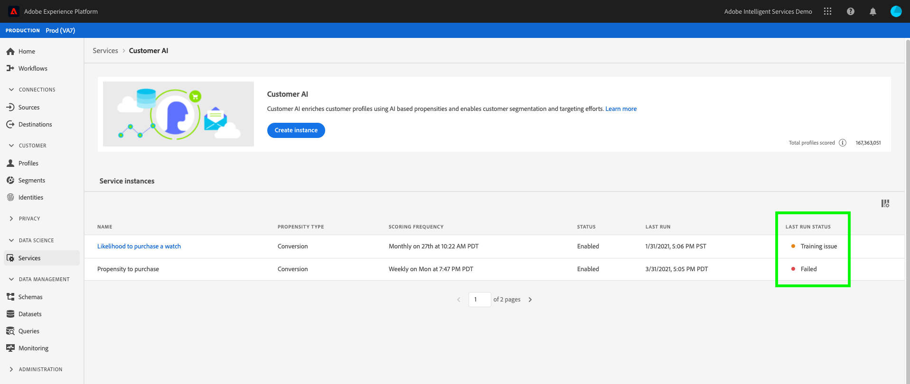
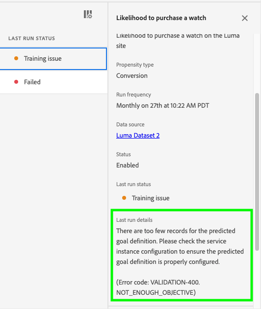
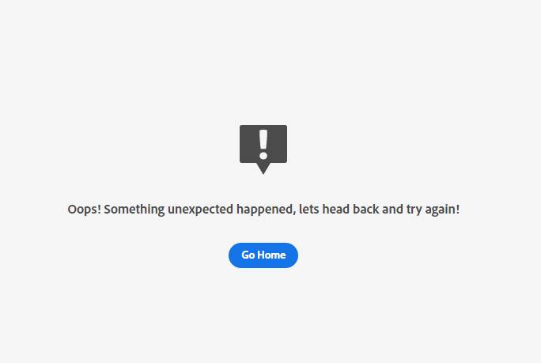
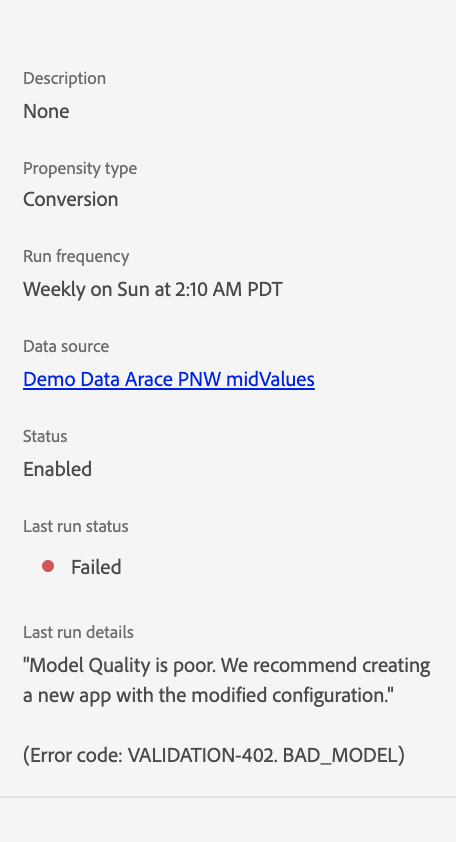

# Customer AI error troubleshooting

Customer AI displays errors when model training, scoring, and configuration fails. In the **[!UICONTROL Service instances]** section, a column for **[!UICONTROL LAST RUN STATUS]** displays one of the following messages: **[!UICONTROL Success]**, **[!UICONTROL Training issue]**, and **[!UICONTROL Failed]**.

In the event that **[!UICONTROL Failed]** or **[!UICONTROL Training issue]** is displayed, you can select the run status to open a side panel. The side panel  contains your **[!UICONTROL Last run status]** and **[!UICONTROL Last run details]**. **[!UICONTROL Last run details]** contains information on why the run failed. In the event that Customer AI is not able to provide details on your error, contact support with the error code thats provided.

 

## Unable to access Customer AI in Chrome incognito

Loading errors in Google Chrome's incognito mode are present because of updates in Google Chrome's incognito mode security settings. The issue is actively being worked on with Chrome to make experience.adobe.com a trusted domain.

 

### Recommended fix

To workaround this issue you need to add experience.adobe.com as a site that can always use cookies. Start by navigating to **chrome://settings/cookies**. Next, scroll down to the **Customized behaviors** section followed by selecting the **Add** button next to "sites that can always use cookies". In the popover that appears, copy and paste `[*.]experience.adobe.com` then select the **Including third-party cookies** on this site checkbox. Once complete, select **Add** and reload Customer AI in incognito.

## Model quality is poor

If you receive the error "[!UICONTROL Model Quality is poor. We recommend creating a new app with the modified configuration]". Follow the recommended steps below to help troubleshoot.

 

### Recommended fix

"Model quality is poor" means that the model accuracy is not within an acceptable range. Customer AI was unable to build a reliable model and AUC (Area under the ROC curve) < 0.65 after training. To fix the error, it is recommended that you change one of the configuration parameters and rerun the training.

Start by checking the accuracy of your data. It is important that your data contains the necessary fields needed for your predictive outcome.

- Check whether your dataset has the latest dates. Customer AI always assumes that the data is up-to-date when the model is triggered.
- Check for missing data within your defined prediction and eligibility window. Your data needs to be complete with no gaps. Also make sure your dataset meets the [Customer AI historical data requirements](./data-requirements.md#data-requirements).
- Check for missing data in commerce, application, web, and search, within your schema field properties.

If your data does not seem to be the problem, try changing the eligibility population condition to restrict the model to certain profiles (for example, `_experience.analytics.customDimensions.eVars.eVar142` exists in last 56 Days). This restricts the population and size of the data used in the training window.

If restricting the eligibility population did not work or is not possible, change your prediction window.

- Try changing your prediction window to 7 days and see if the error continues to occur. If the error no longer occurs, this indicates that you may not have enough data for your defined prediction window.

### Errors

| Error code | Title | Message template | Message example |
| ---------- | ----- | ---------------- | --------------- |
| 400 | NOT ENOUGH OBJECTIVE | There are too few users ({{actual_num_samples}} in total) meeting the prediction goal definition from {{outcome_window_start}} to {{outcome_window_end}}. We require at least {{min_num_samples}} users with qualifying events to build a model.   Suggested solutions:   1. Check data availability  2. Decrease the prediction goal timeframe  3. Modify the prediction goal definition to include more users (Error code: VALIDATION-400 NOT_ENOUGH_OBJECTIVE)| There are too few users (200 in total) meeting the prediction goal definition from 2020-04-01 to 2021-04-01. We require at least 500 users with qualifying events to build a model.   Suggested solutions:  1. Check data availability  2. Decrease the prediction goal timeframe  3. Modify the prediction goal definition to include more users. (Error code: VALIDATION-400 NOT_ENOUGH_OBJECTIVE)|
| 401 | NOT ENOUGH POPULATION |  There are too few eligible users ({{actual_num_samples}} in total) from {{eligibility_window_start}} to {{eligibility_window_end}}. We require at least {{min_num_samples}} eligible users to build a model.   Suggested solutions:  1. Check data availability  2. If an Eligible population definition is provided, decrease the eligibility filter timeframe 3. If an Eligible population definition is not provided, try adding one (Error code: VALIDATION-401 NOT_ENOUGH_POPULATION)| There are too few eligible users (200 in total) from 2020-04-01 to 2021-04-01. We require at least 500 eligible users to build a model.  Suggested solutions: 1. Check data availability 2. If an Eligible population definition is provided, decrease the eligibility filter timeframe. 3. If an Eligible population definition is not provided, try adding one. (Error code: VALIDATION-401 NOT_ENOUGH_POPULATION)|
| 402 | BAD MODEL |  We cannot produce a quality model with the current input dataset and configuration.   Some suggestions include:  1. Modify your configuration to add an eligible population definition.  2. Use additional data sources to improve model quality  3. Add custom events to include more data in the model (Error code: VALIDATION-402 BAD_MODEL)| We cannot produce a quality model with the current input dataset and configuration.   Some suggestions include:  1. Please consider modifying your configuration to add an eligible population definition.  2. Please consider using additional data sources to improve model quality. (Error code: VALIDATION-402 BAD_MODEL)|
| 403 | INELIGIBLE SCORES | The score distribution deviates too much from expected.   Some suggestions include:  1. Please make sure the model is trained with recent data, if not, consider retrain your model.  2. Please make sure there is no data issue (such as missing data/data delay) in scoring tasks. (Error code: VALIDATION-403 INELIGIBLE_SCORES)| The score distribution deviates too much from expected.   Some suggestions include:  1. Please make sure the model is trained with recent data, if not, consider retrain your model.  2. Please make sure there is no data issue (such as missing data/data delay) in scoring tasks. (Error code: VALIDATION-403 INELIGIBLE_SCORES)|
| 405 | NO SCORING DATA | There is no user behavior or profile data available for scoring from {{eligibility_window_start}} to {{eligibility_window_end}}.Please check the data to ensure it is being updated regularly. (Error code: VALIDATION-405 NO_SCORING_DATA)| There is no user behavior or profile data available for scoring from 2020-04-01 to 2021-04-01. Please check the data to ensure it is being updated regularly. (Error code: VALIDATION-405 NO_SCORING_DATA)|
| 407 | NOT ENOUGH HISTORICAL EVENT DATA | There is not enough data to build a model. From 2020-04-01 to 2021-04-01, there are only 90 days of data.   We require 120 days of recent data. For more information, please check the data requirement documentation.   Suggested solutions:  1. Check data availability  2. Decrease the prediction goal timeframe  3. If an Eligible population definition is provided, decrease the eligibility filter timeframe  4. If an Eligible population definition is not provided, try adding one (Error code: VALIDATION-407 NOT_ENOUGH_HISTORICAL_EVENT_DATA)| There is not enough data to build a model. From 2020-04-01 to 2021-04-01, there there are only 90 days of data.  We require 120 days of recent data. For more information, please check the data requirement documentation.  Suggested solutions: 1. Check data availability. 2. Decrease the prediction goal timeframe. 3. If an Eligible population definition is provided, decrease the eligibility filter timeframe. 4. If an Eligible population definition is not provided, try adding one. (Error code: VALIDATION-407 NOT_ENOUGH_HISTORICAL_EVENT_DATA)|
| 408 | NO RECENT DATA FOR ELIGIBLE | There is no user behavior data for eligible users in the {{data_days}} days prior to {{etl_window_end}}. Please check the dataset to ensure it is being updated on a regular basis. (Error code: VALIDATION-408 NO_RECENT_DATA_FOR_ELIGIBLE_POPULATION)| There is no user behavior data for eligible users in the 60 days prior to 2021-04-01. Please check the dataset to ensure it is being updated on a regular basis. (Error code: VALIDATION-408 NO_RECENT_DATA_FOR_ELIGIBLE_POPULATION)|
| 409 | NO OBJECTIVE | There are no users meeting the prediction goal definition from {{outcome_window_start}} to {{outcome_window_end}}. We require at least {{min_num_samples}} users with qualifying events to build a model.   Suggested solutions:  1. Check data availability  2. Modify the prediction goal definition (Error code: VALIDATION-409 NO_OBJECTIVE)| There are no users meeting the prediction goal definition from 2020-04-01 to 2021-04-01. We require at least 500 users with qualifying events to build a model.   Suggested solutions: 1. Check data availability. 2. Modify the prediction goal definition. (Error code: VALIDATION-409 NO_OBJECTIVE)|
| 410 | NO POPULATION |  There are no eligible users from {{eligibility_window_start}} to {{eligibility_window_end}}. We require at least {{min_num_samples}} eligible users to build a model.   Suggested solutions:  1. Check data availability  2. If an Eligible population definition is provided, modify the condition or increase the eligibility filter timeframe (Error code: VALIDATION-410 NO_POPULATION)| There are no eligible users from 2020-04-01 to 2021-04-01. We require at least 500 eligible users to build a model.   Suggested solutions: 1. Check data availability.   2. If an Eligible population definition is provided, modify the condition or increase the eligibility filter timeframe. (Error code: VALIDATION-410 NO_POPULATION)|                          
| 411 | NO INPUT DATA AFTER ETL | There is no user behavior or profile data available for the model to use between {{etl_start_date}} and {{etl_end_date}}. Please make sure the dataset has sufficient data. (Error code: VALIDATION-411 NO_INPUT_DATA_AFTER_ETL)| There is no user behavior or profile data available for the model to use between 2020-04-01 and 2021-04-01. Please make sure the dataset has sufficient data. (Error code: VALIDATION-411 NO_INPUT_DATA_AFTER_ETL)|
| 412 | NO EVENT AFTER ETL | There is no user behavior data available for the model to use between {{etl_start_date}} and {{etl_end_date}}. Please make sure the dataset has sufficient data.| There is no user behavior data available for the model to use between 2020-04-01 and 2021-04-01. Please make sure the dataset has sufficient data. (Error code: VALIDATION-412 NO_EVENT_DATA_AFTER_ETL)|
| 413 | SINGLE VALUE IN OBJECTIVE | CustomerAI requires the dataset to have both qualifying and non-qualifying events for the prediction goal definition. The input dataset contains only qualifying events between {{etl_window_start}} and {{etl_window_end}}.   Suggested solutions:  1. Modify the prediction goal definition  2. Verify data completeness or use a different that includes examples of non-qualifying events for the prediction goal (Error code: VALIDATION-413 SINGLE_VALUE_IN_OBJECTIVE)| CustomerAI requires the dataset to have both qualifying and non-qualifying events for the prediction goal definition. The input dataset contains only qualifying events between 2020-04-01 and 2021-04-01.  Suggested solutions: 1. Modify the prediction goal definition. 2. Verify data completeness or use a different that includes examples of non-qualifying events for the prediction goal. (Error code: VALIDATION-413 SINGLE_VALUE_IN_OBJECTIVE)|
| 414 | NO INFLUENTIAL FACTORS | The influential factor model generated unexpected output. We recommend creating a new app with a modified configuration. (Error code: VALIDATION-414 NO_INFLUENTIAL_FACTORS)| The influential factor model generated unexpected output. We recommend creating a new app with a modified configuration. (Error code: VALIDATION-414 NO_INFLUENTIAL_FACTORS)|