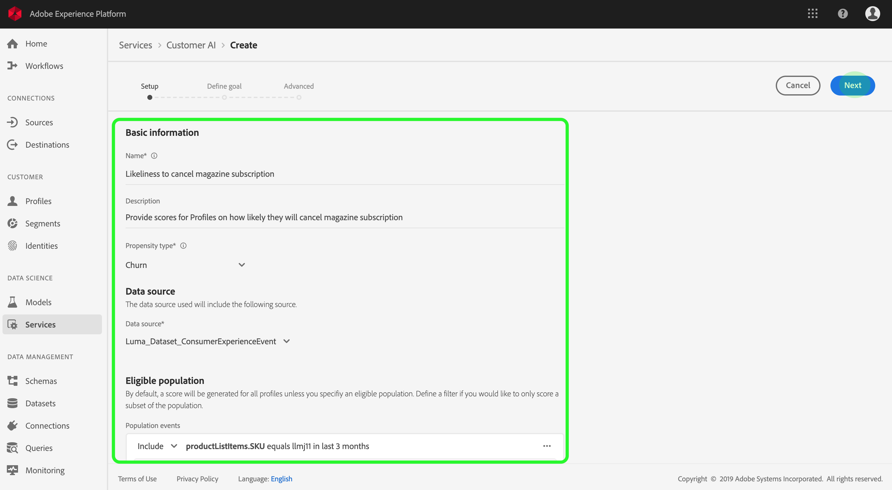
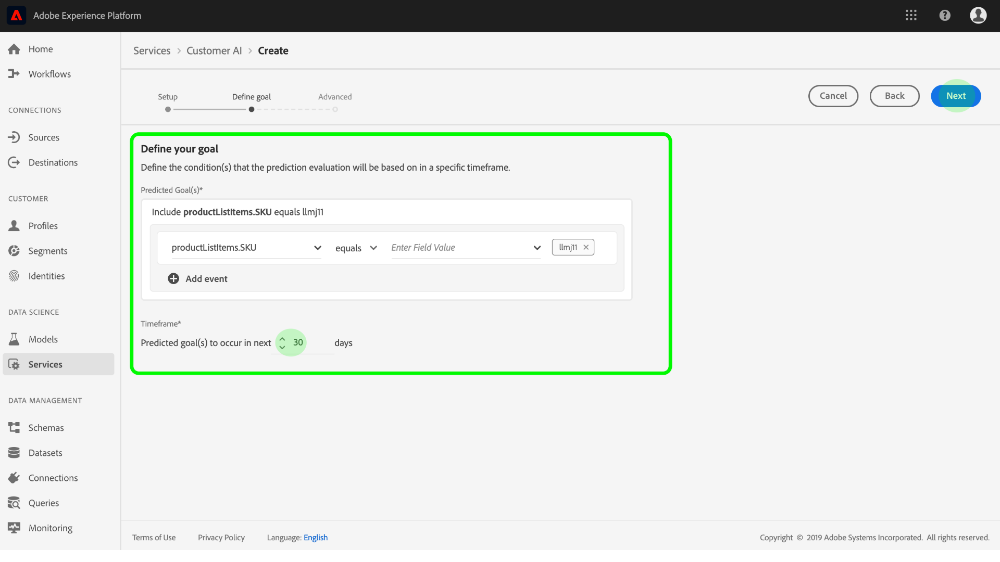
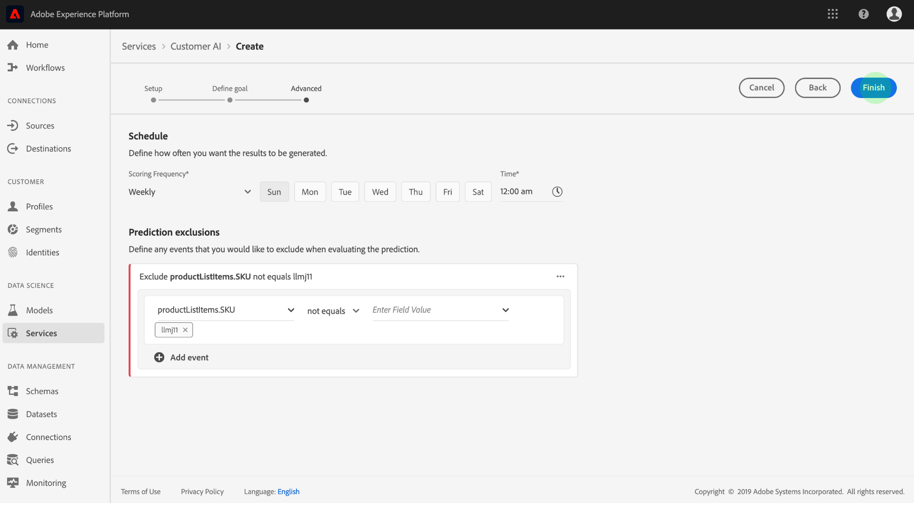

# Configuring a Customer AI instance

Customer AI, as part of Intelligent Services enables you to generate custom propensity scores without having to worry about machine learning.

Intelligent Services provide Customer AI as a simple-to-use Adobe Sensei service that can be configured for different use cases. The following sections provide steps for configuring an instance of Customer AI.

## Set up your instance {#set-up-your-instance}

In the Platform UI, click **[!UICONTROL Services]** in the left navigation. The **[!UICONTROL Services]** browser appears and displays all available services at your disposal. In the container for Customer AI, click **[!UICONTROL Open]**.

The *Customer AI* screen displays all existing Customer AI instances. Click **[!UICONTROL Create instance]**.

The instance creation workflow appears, starting on the *Setup* step.

Below is important information on values that you must provide the instance with:

*   The instance's name is be used in all places where Customer AI score is displayed. Hence, names should describe what the prediction scores represent, for example, "Likelihood to cancel magazine subscription".

*   The propensity type determines the intent of the score and metric polarity. You can either choose "[!UICONTROL Churn]" or "[!UICONTROL Conversion]". Please see the note under [scoring summary](./discover-insights.md#scoring-summary) in the discovering insights document for more information on how the propensity type affects your instance.

*   Data source is where the data is located. Dataset is the input dataset which is used to predict scores. By design, Customer AI uses Consumer Experience Event data to calculate propensity scores. When selecting a dataset from the dropdown selector, only ones that are compatible with Customer AI are listed.

*   By default, propensity scores are generated for all profiles unless an eligible population is specified. You can specify an eligible population by defining conditions to include or exclude profiles based on events.

Provide the required values and then click **[!UICONTROL Next]**.

### Define a goal {#define-a-goal}

The **[!UICONTROL Define goal]** step appears and it provides an interactive environment for you to visually define a goal. A goal is composed of one or more events, where each event's occurrence is based on the condition it holds. The objective of a Customer AI instance is to determine the likeliness of achieving its goal within a given time frame.

Click **[!UICONTROL Enter Field Name]** and select a field from the dropdown list. Click the second input and select a clause for the event's condition, then provide target value to complete the event. Additional events can be configured by clicking **[!UICONTROL Add event]**. Lastly, complete the goal by applying a prediction time frame in number of days, then click **[!UICONTROL Next]**.

### Configure a schedule *(optional)* {#configure-a-schedule}

The **[!UICONTROL Advanced]** step appears. This optional step allows you to configure a schedule to automate prediction runs, define prediction exclusions to filter certain events, or click **[!UICONTROL Finish]** if nothing is needed. 

Setup a scoring schedule by configuring the *Scoring Frequency*. Automated prediction runs can be scheduled to run on either a weekly or a monthly basis.

Below the schedule configuration, you have the ability to define prediction exclusions to prevent events that meet certain conditions from being evaluated when generating scores. This feature can be used to filter out irrelevant data inputs.

To exclude certain events, click **[!UICONTROL Add exclusion]** and define the event in the same fashion as to how the goal is defined. To remove an exclusion, click the ellipses (**[!UICONTROL ...]**) to the top-right of the event container and then click **[!UICONTROL Remove Container]**.

Exclude events as needed and then click **[!UICONTROL Finish]** to create the instance.

If the instance is created successfully, a prediction run is immediately triggered and subsequent runs execute according to your defined schedule.

>[!NOTE]
>
>Depending on the size of the input data, prediction runs can take up to 24 hours to complete.

By following this section, you have configured an instance of Customer AI and a prediction run was executed. Upon the run's successful completion, scored insights automatically populate profiles with predicted scores. Please wait up to 24 hours before continuing to the next section of this tutorial.

## Next steps {#next-steps}

By following this tutorial, you have successfully configured an instance of Customer AI and generated propensity scores. You can now choose to use the Segment builder to [create customer segments with predicted scores](./create-segment.md) or [discover insights with Customer AI](./discover-insights.md).

## Additional resources

The following video is designed to support your understanding of the configuration workflow for Customer AI. Additionally, best practices and use case examples are provided.

>[!VIDEO](https://video.tv.adobe.com/v/32665?learn=on&quality=12)

