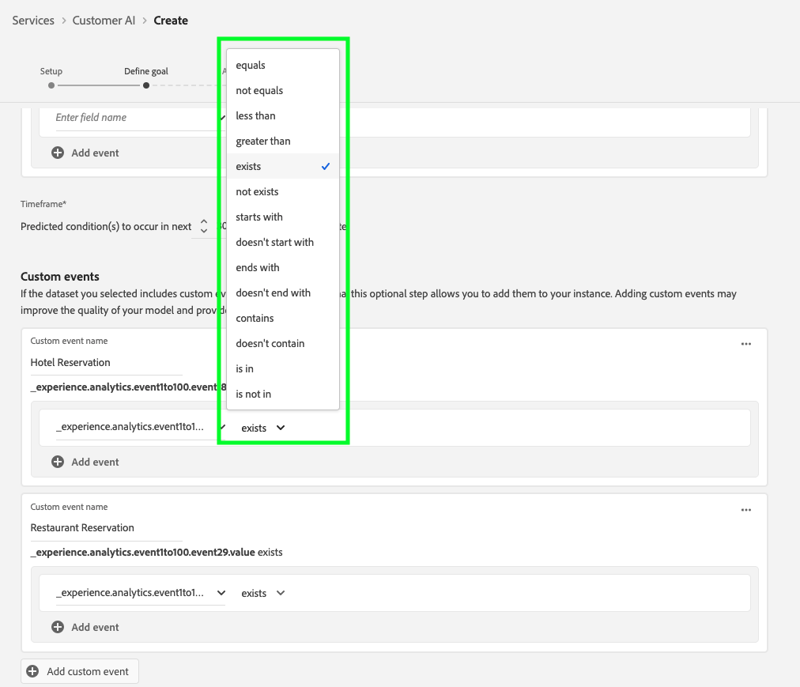
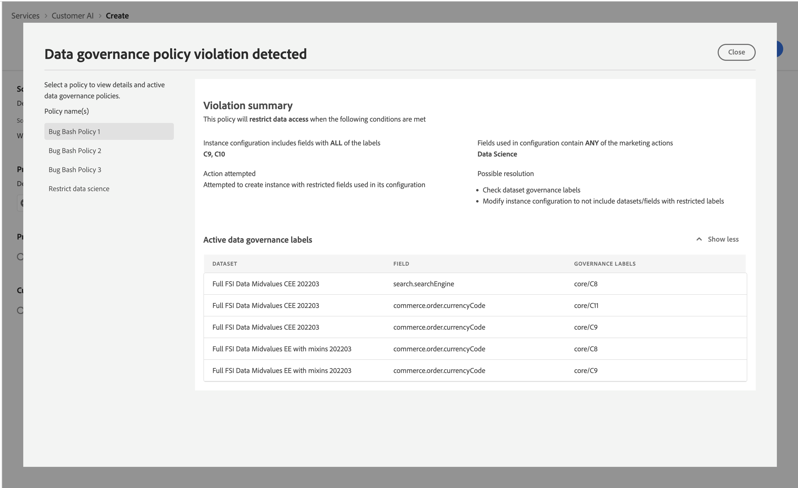

# Configure a Customer AI instance

Customer AI, as part of AI/ML Services enables you to generate custom propensity scores without having to worry about machine learning.

AI/ML Services provide Customer AI as a simple-to-use Adobe Sensei service that can be configured for different use cases. The following sections provide steps for configuring an instance of Customer AI.

## Create an instance {#set-up-your-instance}

In the Platform UI, select **[!UICONTROL Services]** in the left navigation. The **[!UICONTROL Services]** browser appears and displays all available services at your disposal. In the container for Customer AI, select **[!UICONTROL Open]**.

The **Customer AI** UI appears and displays all your service instances.

- You can find the **[!UICONTROL Total profiles scored]** metric located in the bottom-right side of the **[!UICONTROL Create instance]** container. This metric tracks the total number of profiles scored by Customer AI for the current calendar year including all sandbox environments and any deleted service instances. 

Service instances can be edited, cloned, and deleted by using the controls on the right-hand side of the UI. To display these controls, select an instance from your existing **[!UICONTROL Service instances]**. The controls contain the following:

- **[!UICONTROL Edit]**: Selecting **[!UICONTROL Edit]** allows you to modify an existing service instance. You can edit the name, description, and scoring frequency of the instance.
- **[!UICONTROL Clone]**: Selecting **[!UICONTROL Clone]** copies the currently selected service instance setup. You can then modify the workflow to make minor tweaks and rename it as a new instance.
- **[!UICONTROL Delete]**: You can delete a service instance including any historical runs. The corresponding output dataset will be deleted from Platform. However, scores that were synced to Real-Time Customer Profile are not deleted.
- **[!UICONTROL Data source]**: A link to the dataset used by this instance. If multiple datasets are being used, selecting the hyperlink text opens the dataset preview popover.
- **[!UICONTROL Last run details]**: This is only displayed when a run fails. Information on why the run failed, such as error codes are displayed here.
- **[!UICONTROL Score definition]**: A quick overview of the goal you configured for this instance.

To create a new instance, select **[!UICONTROL Create instance]**.

## Set up

The instance creation workflow appears, starting on the **[!UICONTROL Set up]** step.

Below is important information on values that you must provide the instance with:

-   **[!UICONTROL Name]:** The instance's name is used in all places where Customer AI scores are displayed. Hence, names should describe what the prediction scores represent. For example, "Likelihood to cancel magazine subscription".

-   **[!UICONTROL Description]:** A description indicating what you are trying to predict.

-   **[!UICONTROL Propensity type]:** The propensity type determines the intent of the score and metric polarity. You can either choose **[!UICONTROL Churn]** or **[!UICONTROL Conversion]**. Please see the note under [scoring summary](./discover-insights.md#scoring-summary) in the discovering insights document for more information on how the propensity type affects your instance.

Provide the required values and then select **[!UICONTROL Next]** to continue.

## Select data {#select-data}

By design, Customer AI uses Adobe Analytics, Adobe Audience Manager, Experience Events in general, and Consumer Experience Event data to calculate propensity scores. When selecting a dataset, only ones that are compatible with Customer AI are listed. To select a dataset, select the (**+**) symbol next to the dataset name or select the checkbox to add multiple datasets at once. Use the search option to quickly find the datasets you're interested in.

After selecting the datasets you wish to use, select the **[!UICONTROL Add]** button to add the datasets to the the dataset preview pane.

Selecting the info icon  next to the dataset opens the dataset preview popover.

The dataset preview contains data such as the last update time, source schema, and a preview of the first ten columns.

Select **[!UICONTROL Save]** to save your drafts as you move along the workflow. You can also save draft model configurations and move to the next step in the workflow. Use **[!UICONTROL Save and continue]** to create and save drafts during model configurations. The feature enables you to create and save drafts of the model configuration and is particularly useful when you have to define many fields in the configuration workflow.

### Dataset completeness {#dataset-completeness}

There is a dataset completeness percentage value in the dataset preview. This value provides a quick snapshot of how many columns in your dataset are empty/null. If a dataset contains a lot of missing values and these values are captured elsewhere, it is highly recommended you include the dataset containing the missing values. In this example Person ID is empty, however, Person ID is captured in a separate dataset that can be included.

>[!NOTE]
>
>Dataset completeness is calculated using the maximum training window for Customer AI (one year). This means data that is more than one year old is not taken into account when displaying your dataset completeness value.

### Select an identity {#identity}

You can now join multiple datasets to one another based on the identity map (field). You must select an identity type (also known as an "identity namespace") and an identity value within that namespace. If you have assigned more than one field as an identity within your schema under the same namespace, all the assigned identity values appear in the identity dropdown prepended by the namespace such as `EMAIL (personalEmail.address)` or `EMAIL (workEmail.address)`.

[select same namespace](../images/user-guide/cai-identity-map.png)

>[!IMPORTANT]
>
>The same identity type (namespace) must be used for every dataset you select. A green checkmark appears next to the identity type within the identity column indicating datasets are compatible. For example, when using the Phone namespace and `mobilePhone.number` as the identifier, all identifiers for the remaining datasets must contain and use the Phone namespace.

To select an identity, select the underlined value located in the identity column. The select an identity popover appears.

<!--  -->
[select same namespace](../images/user-guide/cai-identity-namespace.png)

In the event that more than one identity is available within a namespace, make sure to select the correct identity field for your use case. For example, two email identities are available within the email namespace, a work and personal email. Depending on the use case, a personal email is more likely to be filled in and be more useful in individual predictions. This means that `EMAIL (personalEmail.address)` would be selected as the identity.

>[!NOTE]
>
> If no valid identity type (namespace) exists for a dataset, you must set a primary identity and assign it to an identity namespace using the [schema editor](../../../xdm/schema/composition.md#identity). To learn more about namespaces and identities, visit the [Identity Service namespaces](../../../identity-service/namespaces.md) documentation.

## Define goal {#define-a-goal}

<!-- https://www.adobe.com/go/cai-define-a-goal -->

The **[!UICONTROL Define goal]** step appears and it provides an interactive environment for you to visually define a prediction goal. A goal is composed of one or more events, where each event's occurrence is based on the condition it holds. The objective of a Customer AI instance is to determine the likeliness of achieving its goal within a given time frame.

To create a goal, select **[!UICONTROL Enter Field Name]** and followed by a field from the dropdown list. Select the second input, a clause for the event's condition, then optionally provide the target value to complete the event. Additional events can be configured by selecting **[!UICONTROL Add event]**. Lastly, complete the goal by applying a prediction time frame in number of days, then select **[!UICONTROL Next]**.

<!--  -->

### Will occur and will not occur

While defining your goal, you have the option to select **[!UICONTROL Will occur]** or **[!UICONTROL Will not occur]**. Selecting **[!UICONTROL Will occur]** means that the event conditions you define need to be met for a customer's event data to be included in the insights UI. 

For example, if you would like to set up an app to predict whether a customer will make a purchase, you can select **[!UICONTROL Will occur]** followed by **[!UICONTROL All of]** and then enter **commerce.purchases.id** (or a similar field) and **[!UICONTROL exists]** as the operator.

<!--  -->

However, there may be cases when you are interested in predicting whether some event will not happen in a certain timeframe. To configure a goal with this option, select **[!UICONTROL Will not occur]** from the top-level dropdown.

For example, if you are interested in predicting which customers become less engaged and do not visit your account login page in the next month. Select **[!UICONTROL Will not occur]** followed by **[!UICONTROL All of]** and then enter **web.webInteraction.URL** (or a similar field) and **[!UICONTROL equals]** as the operator with **account-login** as the value.

### All of and any of

In some cases, you may want to predict whether a combination of events will occur and in other cases, you may want to predict the occurrence of any event from a pre-defined set. In order to predict whether a customer will have a combination of events, select the **[!UICONTROL All of]** option from the second-level drop-down on the **[!UICONTROL Define Goal]** page.

For example, you may want to predict whether a customer purchases a particular product. This prediction goal is defined by two conditions: a `commerce.order.purchaseID` **exists** and the `productListItems.SKU` **equals** some specific value.

In order to predict whether a customer will have any event from a given set, you can use the **[!UICONTROL Any of]** option.

For example, you may want to predict whether a customer visits a certain URL or a web page with a particular name. This prediction goal is defined by two conditions: `web.webPageDetails.URL` **starts with** a particular value and `web.webPageDetails.name` **starts with** a particular value.

### Eligible population *(optional)*

By default, propensity scores are generated for all profiles unless an eligible population is specified. You can specify an eligible population by defining conditions to include or exclude profiles based on events.

### Custom events (*optional*) {#custom-events}

If you have additional information in addition to the [standard event fields](../input-output.md#standard-events) used by Customer AI to generate propensity scores, a custom events option is provided. Using this option allows you add additional events that you deem influential which may improve the quality of your model and help to provide more accurate results. If the dataset you selected includes custom events defined in your schema, you can add them to your instance.

>[!NOTE]
>
> For an in depth explanation on how custom events effect Customer AI scoring results, visit the [Custom event example](#custom-event) section.

To add a custom event, select **[!UICONTROL Add custom event]**. Next, input a custom event name then map it to the event field in your schema. Custom event names are displayed in place of the fields value when looking at influential factors and other insights. This means that the custom event name will be used instead of the ID/value of the event. For more information on how custom events are displayed, see the [custom event example section](#custom-event). These additional custom events are used by Customer AI to improve the quality of your model and provide more accurate results.

Next, select the operator you wish to use from the available operators drop-down. Only operators compatible with the event are listed.

Lastly, enter the field value(s) if the operator selected requires one. In this example, we only need to see if a hotel or restaurant reservation exists. However, if we wanted to be more exact we could use the equals operator and enter an exact value in the value prompt.

Once complete, select **[!UICONTROL Next]** in the top-right to continue.

### Custom profile attributes (*optional*)

You can define important Profile dataset fields (with timestamps) in your data in addition to the [standard event fields](../input-output.md#standard-events) used by Customer AI to generate propensity scores. Using this option allows you to add additional profile attributes that you deem influential which may improve the quality of your model and provide more accurate results. Additionally, adding custom profile attributes allows Customer AI to better showcase how particular profiles ended up in a propensity bucket.

>[!NOTE]
>
>Adding a custom Profile attribute follows the same workflow as adding a custom event. Similar to custom events, custom profile attributes affect your model scoring in the same way. For an in-depth explanation, visit the [Custom event example](#custom-event) section.

#### Select profile attributes from the Profile snapshot export

You can also choose to include profile attributes from the daily Profile snapshot export. These attributes are synced to the Profile snapshot export and display the most recently available value. 

>[!WARNING]
>
> Be careful not to select a profile attribute that is updated as a result of the prediction goal or highly correlated with the prediction goal. This causes data leakage and over-fitting of the model. An example of such an attribute is `total_purchases_in_the_last_3_months` that predicts purchase conversion. 

>[!NOTE]
>
>Support for using profile attributes from the UPS snapshot export is available in the UI upon request. 

### Adding a custom event example {#custom-event}

In the following example, a custom event and profile attribute is added to a Customer AI instance. The goal of the Customer AI instance is to predict the likelihood of a customer to buy another Luma product in the next 60 days. Normally, product data is linked to a product SKU. In this case, the SKU is `prd1013`. After the Customer AI model is trained/scored, this SKU can be linked to an event and displayed as an influential factor for a propensity bucket.

Customer AI automatically applies feature generation such as "Days since" or "Counts of" against custom events such as **Watch purchase**. If this event was considered an influential factor on why customers are high, medium, or low propensity, Customer AI displays it as `Days since prd1013 purchase` or `Count of prd1013 purchase`. By creating this as a Custom event, you can give the event a new name making the results much easier to read. For example, `Days since Watch purchase`. Additionally, Customer AI uses this event in its training and scoring even if the event is not a standard event. This means you can add multiple events that you think might be influential and customize your model further by including data such as reservations, visitor logs, and other events. Adding these data points further increases the accuracy and precision of your Customer AI model.

## Set options

The set options step allows you to configure a schedule to automate prediction runs, define prediction exclusions to filter certain events, and toggle **[!UICONTROL Profile]** on/off.

### Configure a schedule *(optional)* {#configure-a-schedule}

To set up a scoring schedule, start by configuring the **[!UICONTROL Scoring Frequency]**. Automated prediction runs can be scheduled to run on either a weekly or a monthly basis.

### Prediction exclusions *(optional)*

If your dataset contained any columns added as test data, you can add that column or event to an exclusion list by selecting **[!UICONTROL Add Exclusion]** followed by entering the field you wish to exclude. This prevents events that meet certain conditions from being evaluated when generating scores. This feature can be used to filter out irrelevant data inputs or promotions.

To exclude an event, select **[!UICONTROL Add exclusion]** and define the event. To remove an exclusion, select the ellipses (**[!UICONTROL ...]**) to the top-right of the event container, then select **[!UICONTROL Remove Container]**.

### Profile toggle

The Profile toggle allows Customer AI to export the scoring results into Real-Time Customer Profile. Disabling this toggle prevents the models scoring results from being added to Profile. Customer AI scoring results are still available with this feature disabled.

When using Customer AI for the first time you can toggle this feature off until you are satisfied with the model output results. This prevents you from uploading multiple scoring datasets to your Customer Profiles while fine tuning your model. Once you have finished calibrating your model, you can clone the model using the [clone option](#set-up-your-instance) from the **Service instances** page. This allows you to create a copy of your model and toggle profile on.

Once you have your scoring schedule set, prediction exclusions included, and the profile toggle where you want it to be, select **[!UICONTROL Finish]** in the top-right to create your Customer AI instance.

If the instance is created successfully, a prediction run is immediately triggered and subsequent runs execute according to your defined schedule.

>[!NOTE]
>
>Depending on the size of the input data, prediction runs can take up to 24 hours to complete.

By following this section, you have configured an instance of Customer AI and executed a prediction run. Upon the run's successful completion, scored insights automatically populate profiles with predicted scores if the profile toggle is enabled. Please wait up to 24 hours before continuing to the next section of this tutorial.

## Governance policies

Once you go through the workflow to create an instance and submit the model's configuration, the [policy enforcement](/help/data-governance/enforcement/auto-enforcement.md) checks to see if there are any violations. If a policy violation occurs, a popover appears indicating that one or more policies have been violated. This is to ensure that your data operations and marketing actions within Platform are compliant with data usage policies. 

The popover provides specific information about the violation. You can resolve these violations through policy settings and other measures that aren't directly related to the configuration workflow. For example, you could change the labels so that certain fields are allowed to be used for data science purposes. Alternatively, you could also modify the model configuration itself so that it doesn't use anything with a label on it. See the documentation to learn more about how to set up [policies](/help/data-governance/policies/overview.md).

## Attribute-based access control

>[!IMPORTANT]
>
>Attribute-based access control is currently available in a limited release only.

[Attribute-based access control](../../../access-control/abac/overview.md) is a capability of Adobe Experience Platform that enables administrators to control access to specific objects and/or capabilities based on attributes. Attributes can be metadata added to an object, such as a label added to a schema field or segment. An administrator defines access policies that include attributes to manage user access permissions.

This functionality allows you to label Experience Data Model (XDM) schema fields with labels that define organizational or data usage scopes. In parallel, administrators can use the user and role administration interface to define access policies surrounding XDM schema fields and better manage the access given to users or groups of users (internal, external, or third-party users). Additionally, attribute-based access control allows administrators to manage access to specific segments.

Through attribute-based access control, administrators of your organization can control users’ access to both sensitive personal data (SPD) and personally identifiable information (PII) across all Platform workflows and resources. Administrators can define user roles that have access only to specific fields and data that correspond to those fields.

Due to attribute-based access control, some fields and functionalities would have access restricted and be unavailable for certain Customer AI service instances. Examples include, "Identity", "Score Definition", and "Clone."

At the top of the Customer AI workspace **insights page**, notice that the details in the sidebar, score definition, identity, and profile attributes all show "Access Restricted."

<!-- If you select datasets with restricted schemas on the **[!UICONTROL Create instance workflow]** page, a warning sign appears next to the dataset name with the message: [!UICONTROL Restricted information is excluded].

 -->

When you preview datasets with restricted schema on the **[!UICONTROL Create instance workflow]** page, a warning appears to let you know that [!UICONTROL Due to access restrictions, certain information isn't displayed in the dataset preview.]

After you create an instance with restricted information and proceed to the **[!UICONTROL Define goal]** step, a warning is displayed at the top: [!UICONTROL Due to access restrictions, certain information isn't displayed in the configuration.]

## Next steps {#next-steps}

By following this tutorial, you have successfully configured an instance of Customer AI and generated propensity scores. You can now choose to use the Segment builder to [create customer segments with predicted scores](./create-segment.md) or [discover insights with Customer AI](./discover-insights.md).

## Additional resources

The following video is designed to support your understanding of the configuration workflow for Customer AI. Additionally, best practices and use case examples are provided.

>[!IMPORTANT]
>
> The following video is out of date. For the most up-to-date information refer to the documentation.

>[!VIDEO](https://video.tv.adobe.com/v/32665?learn=on&quality=12)
