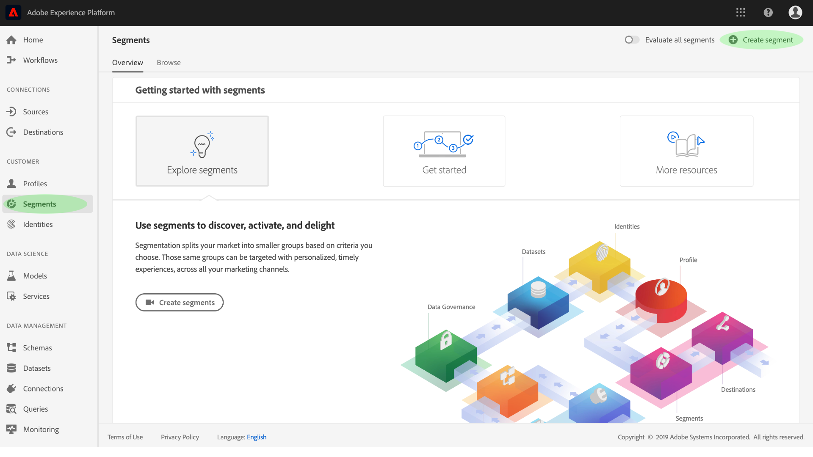
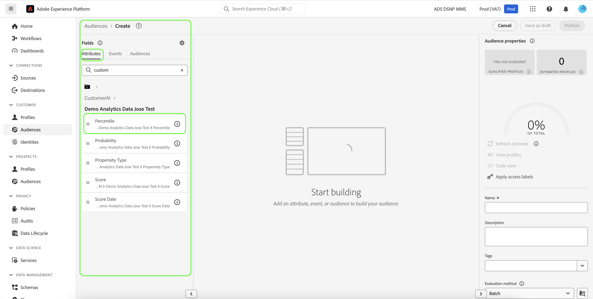
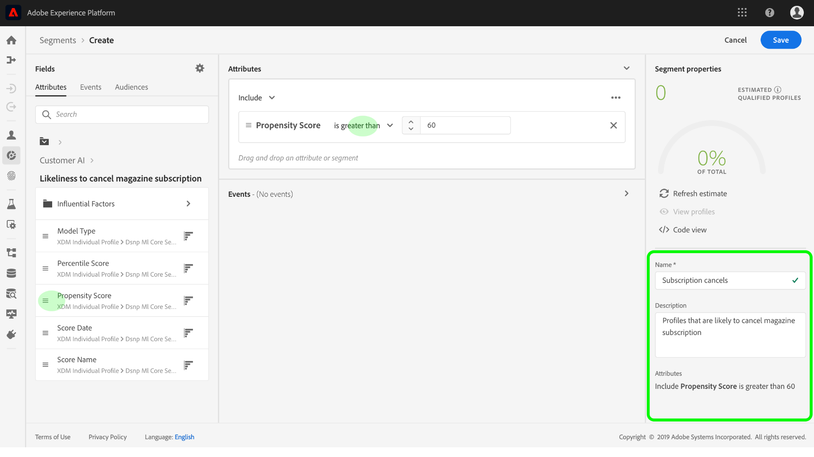
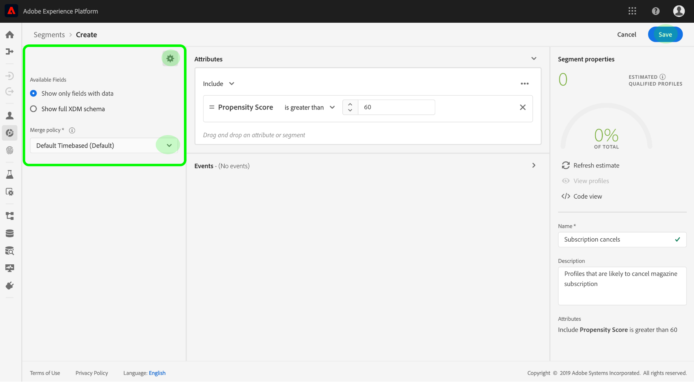

# Create customer segments with predicted scores

When a prediction run completes, predicted propensity scores are automatically consumed by Profiles. Enriching Profiles with Customer AI scores allows for the creation of customer segments to find audiences based on their propensity scores. This section provides steps for creating segments using the Segment Builder. For a more robust tutorial on creating segments, please see the [Segment Builder user guide](../../../segmentation/ui/segment-builder.md).

>[!IMPORTANT]
>
>In order to utilize this method, Real-Time Customer Profile needs to be enabled for the dataset.

In the Platform UI, click **[!UICONTROL Segments]** in the left navigation, and then click **[!UICONTROL Create segment]**. 

The **Segment Builder** appears. From the left **[!UICONTROL Fields]** column and under the **[!UICONTROL Attributes]** tab, click the folder named **[!UICONTROL XDM Individual Profile]** and then click the folder with the namespace of your organization. The folder named **[!UICONTROL Customer AI]** contains the results of prediction runs and are named after the instance the scores belong to. Click an instance folder to access its results of the desired instance.

Located in the center of Segment Builder, drag and drop the **[!UICONTROL Score]** attribute onto the *rule builder canvas* to define a rule.

Under the right-hand *Segment properties* column, provide a name for the segment.

Above the left-hand *Fields* column, click the **gear** icon and select a *Merge policy* from the drop-down. Click **[!UICONTROL Save]** to create the segment.

## Next steps

By following this tutorial, you have successfully found audiences based on their propensity scores using the Segment Builder. You can now target your audiences by activating them to destinations. See the [destinations overview](../../../destinations/home.md) for more information.
