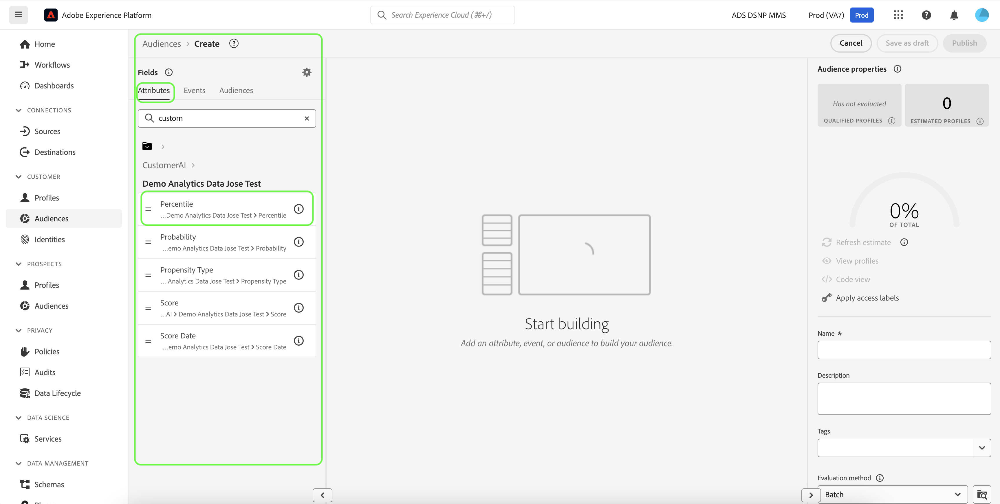
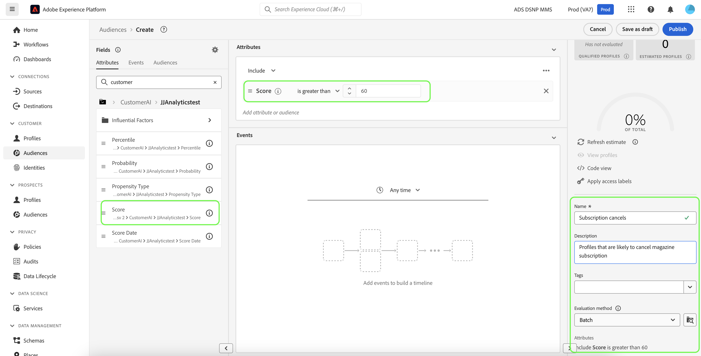
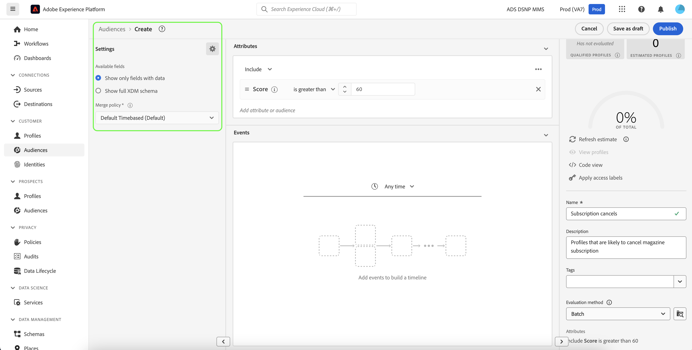

# Create audiences with predicted scores

When a prediction run completes, predicted propensity scores are automatically consumed by Profiles. Enriching Profiles with Customer AI scores allows for the creation of audiences to find audiences based on their propensity scores. This section provides steps for creating audiences using Audience Builder. For a more robust tutorial on creating audiences, please see the [Audience Builder user guide](../../../segmentation/ui/segment-builder.md).

>[!IMPORTANT]
>
>In order to utilize this method, Real-Time Customer Profile needs to be enabled for the dataset.

In the Experience Platform UI, select **[!UICONTROL Audiences]** in the left navigation, followed by **[!UICONTROL Create audience]**. 

**Segment Builder** appears. From the left **[!UICONTROL Fields]** column and under the **[!UICONTROL Attributes]** tab, select the folder named **[!UICONTROL XDM Individual Profile]** and then select the folder with the namespace of your organization. The folder named **[!UICONTROL Customer AI]** contains the results of prediction runs and are named after the instance the scores belong to. Click an instance folder to access its results of the desired instance.

Located in the center of Segment Builder, drag and drop the **[!UICONTROL Score]** attribute onto the *rule builder canvas* to define a rule.

Under the right-hand *Audience properties* column, provide a name for the audience.

Above the left-hand *Fields* column, select the **gear** icon and select a *Merge policy* from the drop-down. Select **[!UICONTROL Save]** to create the audience.

## Next steps

By following this tutorial, you have successfully found audiences based on their propensity scores using Segment Builder. You can now target your audiences by activating them to destinations. See the [destinations overview](../../../destinations/home.md) for more information.
