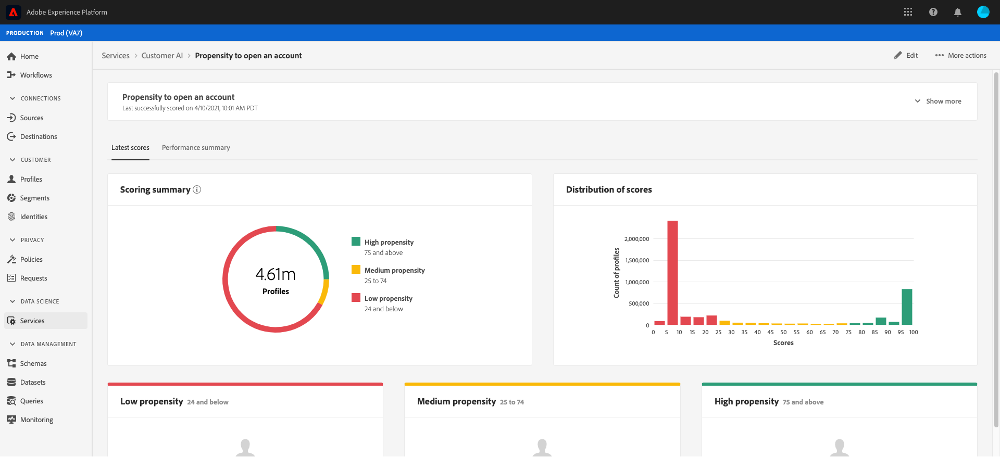
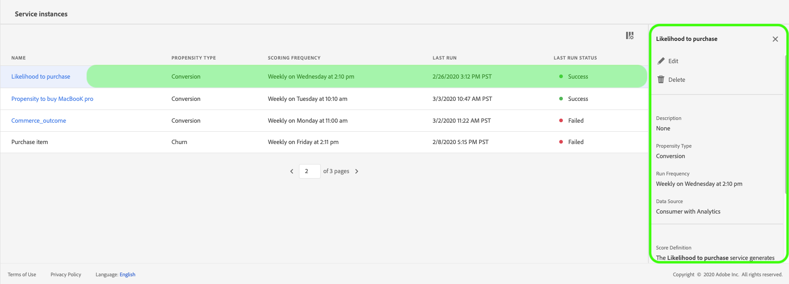

# Discovering insights with Customer AI

Customer AI, as part of Intelligent Services provides marketers with the power to leverage Adobe Sensei to anticipate what your customers next action is going to be. Customer AI is used to generate custom propensity scores such as churn and conversion for individual profiles at-scale. This is accomplished without having to transform the business needs to a machine learning problem, picking an algorithm, training, or deployment.

This document serves as a guide for interacting with service instance insights in the Intelligent Services Customer AI user interface.

## Getting started

In order to utilize insights for Customer AI, you need to have a service instance with a successful run status available. To create a new service instance visit [Configuring a Customer AI instance](./configure.md). If you recently created a service instance and it is still training and scoring, please allow 24 hours for it to finish running.

## Service instance overview

In the [!DNL Adobe Experience Platform] UI, click **[!UICONTROL Services]** in the left navigation. The *Services* browser appears and displays available Intelligent Services. In the container for Customer AI, click **[!UICONTROL Open]**.

The Customer AI service page appears. This page lists service instances of Customer AI and displays information about them, including the name of the instance, propensity type, how often the instance is run, and the status of the last update.

>[!NOTE]
>
>Only service instances that have completed successful scoring runs have insights.

Click on a service instance name to begin.

Next, the insights page for that service instance appears, where you are provided with visualizations of your data. The visualizations and what you can do with the data are explained in more detail throughout this guide.

### Service instance details

There are two ways to view service instance details, the first is from the dashboard and the second from within the service instance. 

To view details from within the dashboard, click on a service instance container avoiding the hyperlink that is attached to the name. This opens a right rail that provides additional details such as the description, scoring frequency, the prediction goal, and eligible population. Additionally, you can choose to edit and delete the instance by clicking **[!UICONTROL Edit]** or **[!UICONTROL Delete]**.

>[!NOTE]
>
>In the event that a scoring run fails, an error message is provided. The error message is listed under *Last run details* in the right rail which is only visible to failed runs.

The second way to view additional details for a service instance is located within the insights page. You can click **[!UICONTROL Show more]** in the top-right to populate a drop down. Details are listed such as the score definition, when it was created, and the propensity type. For more information on any of the properties listed, please visit [Configuring a Customer AI instance](./configure.md).

### Edit an instance

To edit an instance, click **[!UICONTROL Edit]** in the top-right navigation.

The edit dialog box appears, allowing you to edit the *Description* and *Scoring Frequency* of the instance. To confirm your changes and close the dialog, click **[!UICONTROL Edit]** in the bottom-right corner.

### More actions

The **[!UICONTROL More actions]** button is located in the top-right navigation next to **[!UICONTROL Edit]**. Clicking **[!UICONTROL More actions]** opens a dropdown that allows you to select one of the following operations:

- **[!UICONTROL Delete]**: Deletes the instance.
- **[!UICONTROL Access scores]**: Clicking *Access scores* opens a dialog providing a link to the [downloading scores for Customer AI](./download-scores.md) tutorial, the dialog also provides the dataset id required for making API calls.
- **[!UICONTROL View run history]**: A dialog containing a list of all the scoring runs associated with the service instance appears.

## Scoring Summary {#scoring-summary}

Scoring Summary displays the total number of profiles scored and categorizes them into buckets containing high, medium, and low propensity. The propensity buckets are determined based on score range, low is less than 24, medium is 25 to 74, and high is above 74. Each bucket has a color corresponding to the legend. 

>[!NOTE]
>
>If it is a conversion propensity score, the high scores show in green and the low scores in red. If you are predicting churn propensity this is flipped, the high scores are in red and the low scores are green. The medium bucket remains yellow regardless of what propensity type you choose.

## Distribution of Scores

The **Distribution of Scores** card gives you a visual summary of the population based on the score. The colors that you see in the *Distribution of Scores* card represent the type of propensity score generated. 

## Influential factors

For each score bucket, a card is generated that shows the top 10 influential factors for that bucket. The influential factors give you additional details on why your customers belong to various score buckets.

### Create a segment

Clicking the **[!UICONTROL Create Segment]** button in any of the buckets for Low, Medium, and High propensity redirects you to the segment builder.

>[!NOTE]
>
>The **[!UICONTROL Create Segment]** button is only available if Real-time Customer Profile is enabled for the dataset. For more information on how to enable Real-time Customer Profile, visit the [Real-time Customer Profile overview](../../../rtcdp/overview.md).

The segment builder is used to define a segment. When selecting **[!UICONTROL Create Segment]** from the Insights page, Customer AI automatically adds the selected buckets information to the segment. To finish creating your segment, simply fill in the *Name* and *Description* containers located in the right rail of the segment builder user interface. After you have given the segment a name and description, click **[!UICONTROL Save]** in the top-right.

>[!NOTE]
>
>Since the propensity scores are written to the individual profile, they are available in the Segment builder like any other profile attributes. When you navigate to the segment builder to create new segments you can see all the various propensity scores under your namespace Customer AI.

 To view your new segment in the Platform UI, click **[!UICONTROL Segments]** in the left navigation. The **Browse** page appears and displays all available segments. 

 

## Next steps

This document outlined the insights provided by a Customer AI service instance. You can now continue to the tutorial on [downloading scores in Customer AI](./download-scores.md) or browse the other [Adobe Intelligent Services](../../home.md) guides that are offered.

## Additional resources

The following video outlines how to use Customer AI to see the output of the models and influential factors.

>[!VIDEO](https://video.tv.adobe.com/v/32666?learn=on&quality=12)