# Discover insights with Customer AI

Customer AI, as part of Intelligent Services provides marketers with the power to leverage Adobe Sensei to anticipate what your customers next action is going to be. Customer AI is used to generate custom propensity scores such as churn and conversion for individual profiles at-scale. This is accomplished without having to transform the business needs to a machine learning problem, picking an algorithm, training, or deployment.

This document serves as a guide for interacting with service instance insights in the Intelligent Services Customer AI user interface.

## Getting started

In order to utilize insights for Customer AI, you need to have a service instance with a successful run status available. To create a new service instance visit [Configuring a Customer AI instance](./configure.md). If you recently created a service instance and it is still training and scoring, please allow 24 hours for it to finish running.

## Service instance overview

In the [!DNL Adobe Experience Platform] UI, click **[!UICONTROL Services]** in the left navigation. The *Services* browser appears and displays available Intelligent Services. In the container for Customer AI, click **[!UICONTROL Open]**.

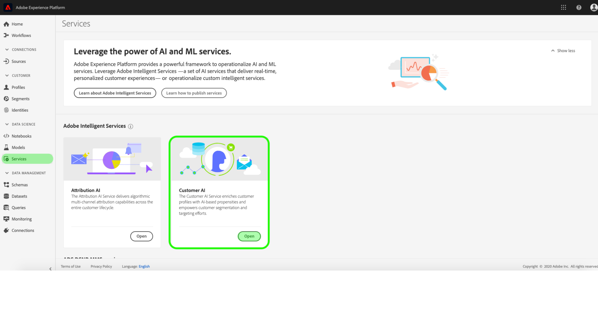

The Customer AI service page appears. This page lists service instances of Customer AI and displays information about them, including the name of the instance, propensity type, how often the instance is run, and the status of the last update.

>[!NOTE]
>
>Only service instances that have completed successful scoring runs have insights.

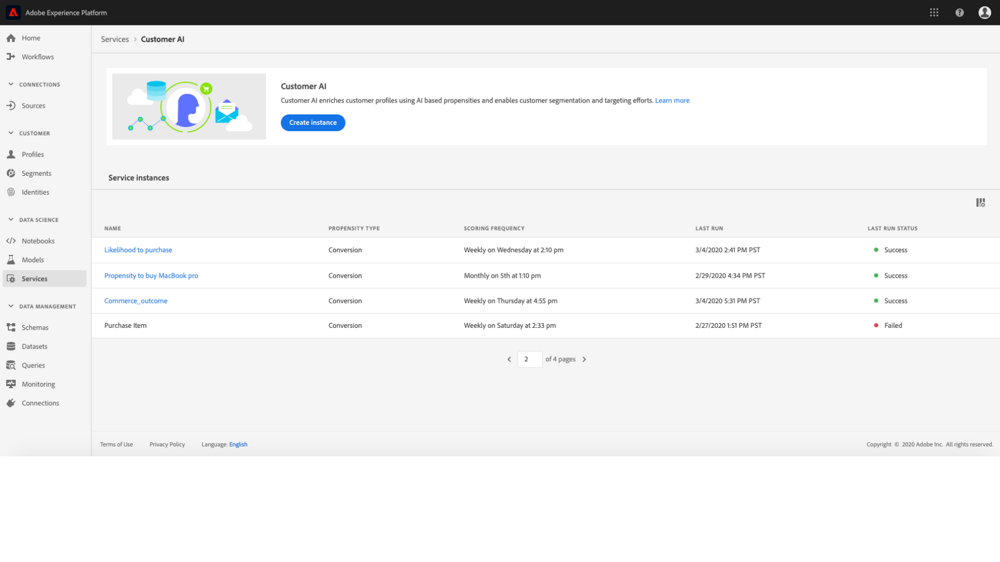

Select a service instance name to begin.

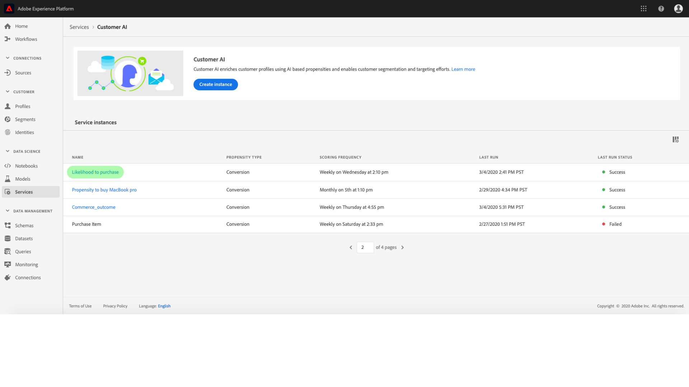

Next, the insights page for that service instance appears with the option to select **[!UICONTROL Latest scores]** or **[!UICONTROL Performance summary]**. The default tab **[!UICONTROL Latest scores]** provides visualizations of your data. The visualizations and what you can do with the data are explained in more detail throughout this guide.

 The **[!UICONTROL Performance summary]** tab contains information on the churn or conversion results of your model. To learn more, see the section on [performance summary metrics](#performance-metrics).

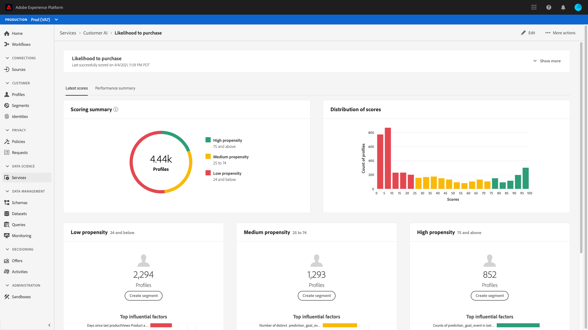

### Service instance details

There are two ways to view service instance details: from the dashboard or within the service instance. 

To view an overview of the service instance details within the dashboard, select a service instance container, avoiding the hyperlink that is attached to the name. This opens a right rail that provides additional details. The controls contain the following:

- **[!UICONTROL Edit]**: Selecting **[!UICONTROL Edit]** allows you to modify an existing service instance. You can edit the name, description, and scoring frequency of the instance.
- **[!UICONTROL Clone]**: Selecting **[!UICONTROL Clone]** copies the currently selected service instance set up. You can then modify the workflow to make minor tweaks and rename it as a new instance.
- **[!UICONTROL Delete]**: You can delete a service instance, including any historical runs.
- **[!UICONTROL Data source]**: A link to the dataset used by this instance.
- **[!UICONTROL Run Frequency]**: How often a scoring run takes place and when.
- **[!UICONTROL Score definition]**: A quick overview of the goal you configured for this instance.

>[!NOTE]
>
>In the event that a scoring run fails, an error message is provided. The error message is listed under **Last run details** in the right rail which is only visible to failed runs.

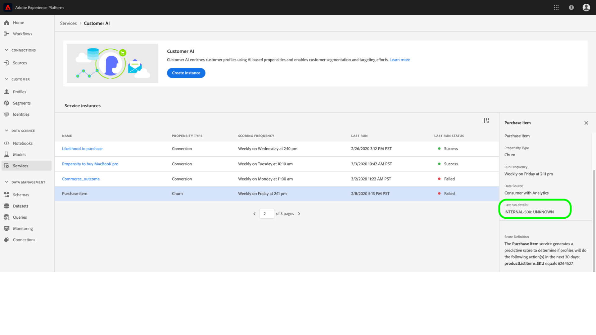

The second way to view additional details for a service instance is located within the insights page. You can click **[!UICONTROL Show more]** in the top-right to populate a drop down. Details are listed such as the score definition, when it was created, and the propensity type. For more information on any of the properties listed, please visit [Configuring a Customer AI instance](./configure.md).

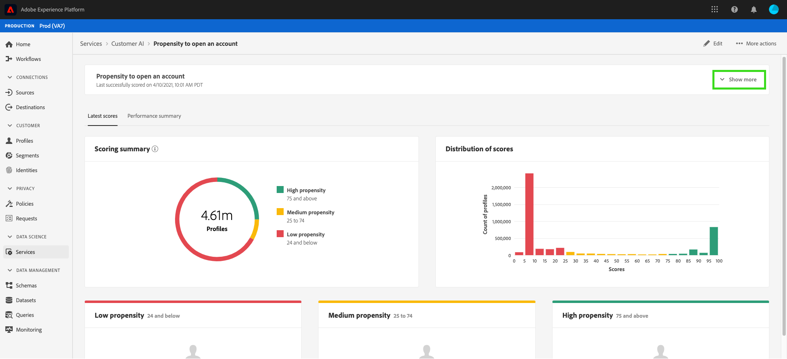

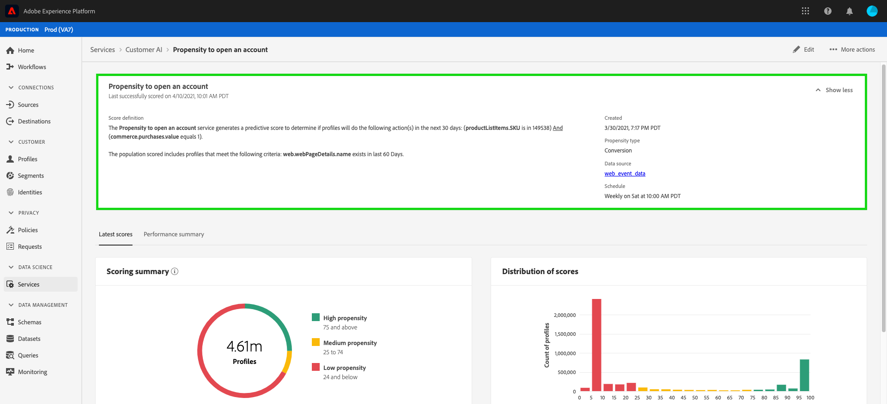

### Edit an instance

To edit an instance, click **[!UICONTROL Edit]** in the top-right navigation.

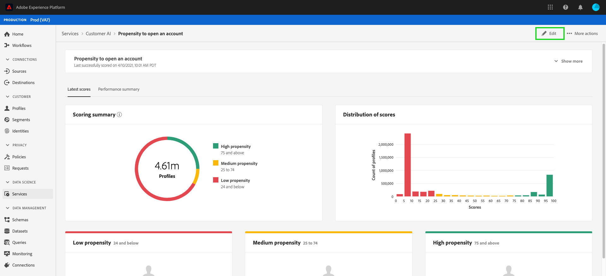

The edit dialog box appears, allowing you to edit the name, description, status, and scoring frequency of the instance. To confirm your changes and close the dialog, select **[!UICONTROL Save]** in the bottom-right corner.

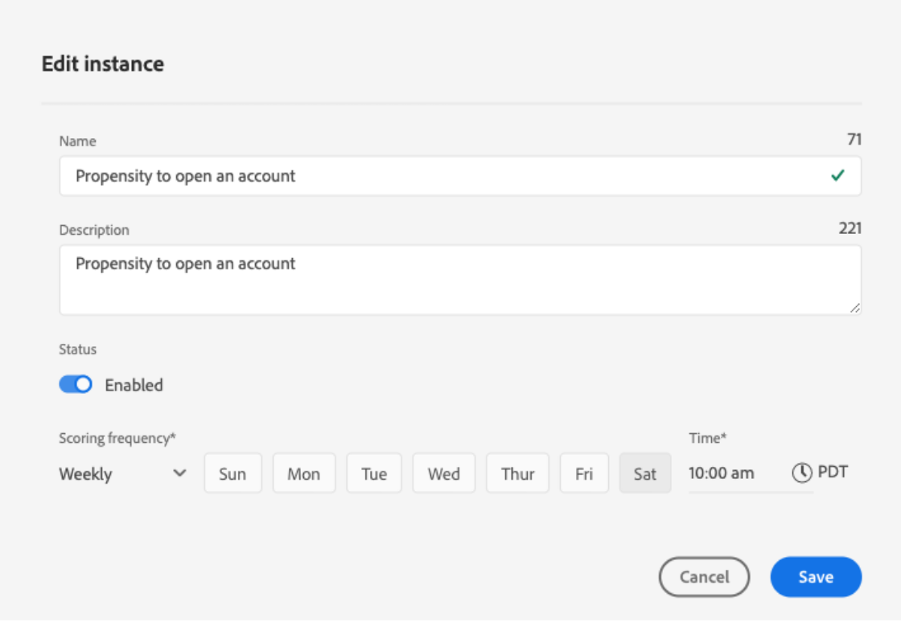

### More actions

The **[!UICONTROL More actions]** button is located in the top-right navigation next to **[!UICONTROL Edit]**. Clicking **[!UICONTROL More actions]** opens a dropdown that allows you to select one of the following operations:

- **[!UICONTROL Clone]**: Selecting **[!UICONTROL Clone]** copies the service instance set up. You can then modify the workflow to make minor tweaks and rename it as a new instance.
- **[!UICONTROL Delete]**: Deletes the instance.
- **[!UICONTROL Access scores]**: Selecting **[!UICONTROL Access scores]** opens a dialog providing a link to the [downloading scores for Customer AI](./download-scores.md) tutorial, the dialog also provides the dataset id required for making API calls.
- **[!UICONTROL View run history]**: A dialog containing a list of all the scoring runs associated with the service instance appears.

## Scoring summary {#scoring-summary}

Scoring summary displays the total number of profiles scored and categorizes them into buckets containing high, medium, and low propensity. The propensity buckets are determined based on score range, low is less than 24, medium is 25 to 74, and high is above 74. Each bucket has a color corresponding to the legend. 

>[!NOTE]
>
>If it is a conversion propensity score, the high scores show in green and the low scores in red. If you are predicting churn propensity this is flipped, the high scores are in red and the low scores are green. The medium bucket remains yellow regardless of what propensity type you choose.

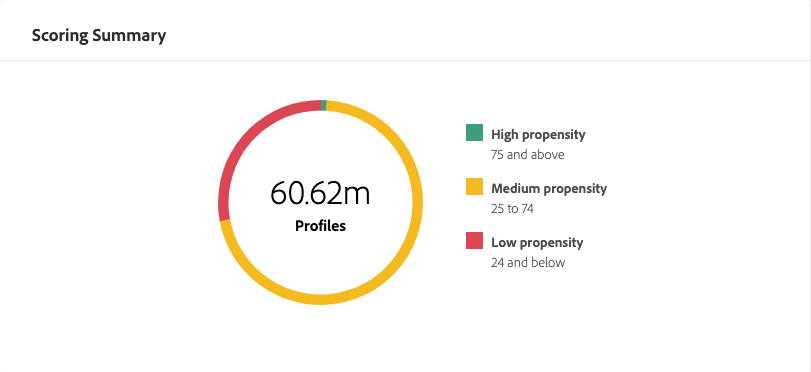

You can hover over any color on the ring to view additional information, such as a percentage and total number of profiles belonging to a bucket.

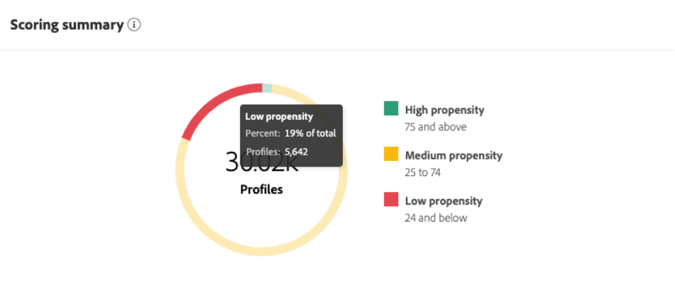

## Distribution of Scores

The **[!UICONTROL Distribution of Scores]** card gives you a visual summary of the population based on the score. The colors that you see in the [!UICONTROL Distribution of Scores] card represent the type of propensity score generated. Hovering over any of the scoring distributions provides the exact count belonging to that distribution.

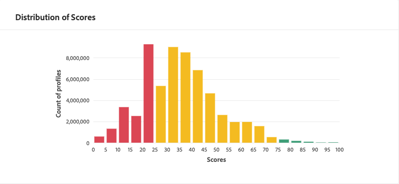

## Influential factors

For each score bucket, a card is generated that shows the top 10 influential factors for that bucket. The influential factors give you additional details on why your customers belong to various score buckets.

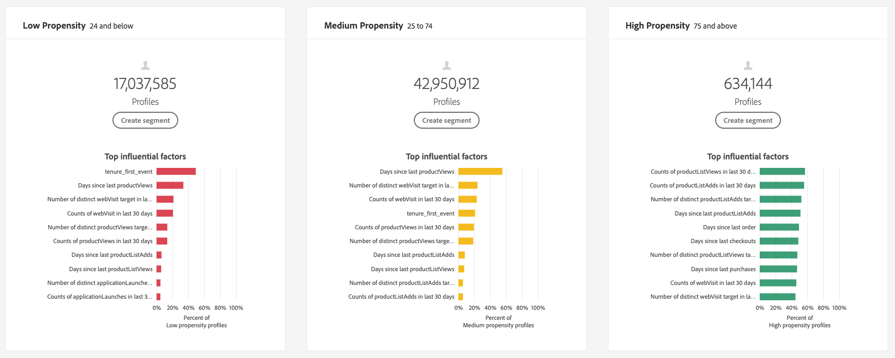

### Influential factor drilldowns

Hovering over any of the top influential factors further breaks down the data. You are provided an overview as to why certain profiles belong to a propensity bucket. Depending on the factor, you may be given number, categorical, or boolean values. The example below displays categorical values by region.

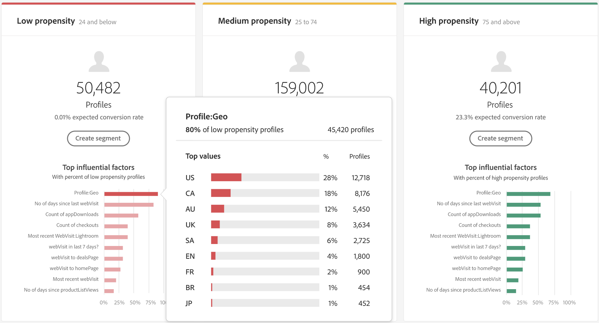

Additionally, using drilldowns, you are able to compare a distribution factor if it occurs in two or more propensity buckets and create more specific segments with these values. The following example illustrates the first use case:

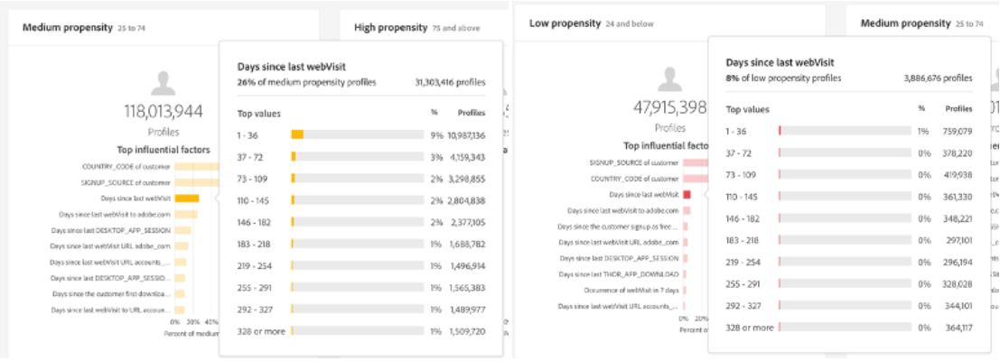

You can see that profiles with low propensity to convert are less likely to have made a recent visit to the adobe.com webpages. The "Days since last webVisit" factor has only 8% coverage compared to 26% in medium propensity profiles. Using these numbers, you can compare the distribution within each bucket for the factor. This information can be used to infer that the recency in webvisit is not as influential in the low propensity bucket, as it is in medium propensity bucket.

### Create a segment

Selecting the **[!UICONTROL Create Segment]** button in any of the buckets for low, medium, and high propensity redirects you to the segment builder.

>[!NOTE]
>
>The **[!UICONTROL Create Segment]** button is only available if Real-time Customer Profile is enabled for the dataset. For more information on how to enable Real-time Customer Profile, visit the [Real-time Customer Profile overview](../../../rtcdp/overview.md).

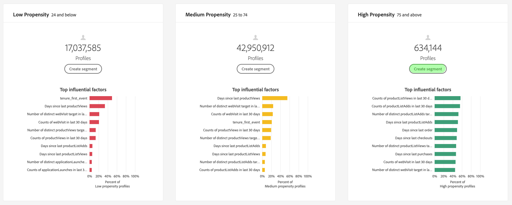

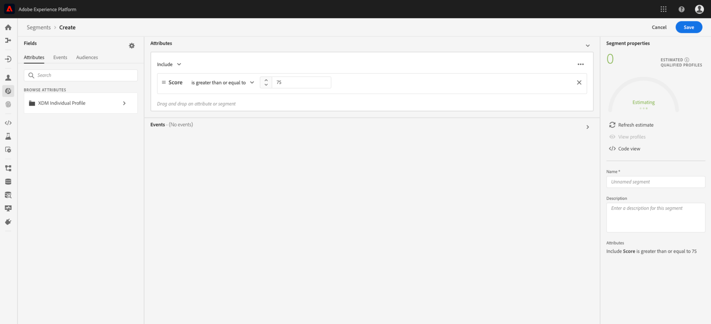

The segment builder is used to define a segment. When selecting **[!UICONTROL Create Segment]** from the Insights page, Customer AI automatically adds the selected buckets information to the segment. To finish creating your segment, simply fill in the *Name* and *Description* containers located in the right rail of the segment builder user interface. After you have given the segment a name and description, click **[!UICONTROL Save]** in the top-right.

>[!NOTE]
>
>Since the propensity scores are written to the individual profile, they are available in the Segment builder like any other profile attributes. When you navigate to the segment builder to create new segments you can see all the various propensity scores under your namespace Customer AI.

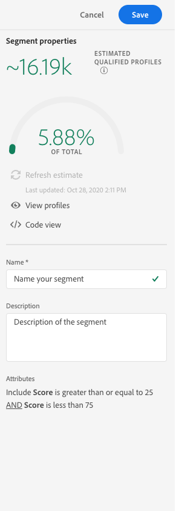

 To view your new segment in the Platform UI, click **[!UICONTROL Segments]** in the left navigation. The **[!UICONTROL Browse]** page appears and displays all available segments. 

 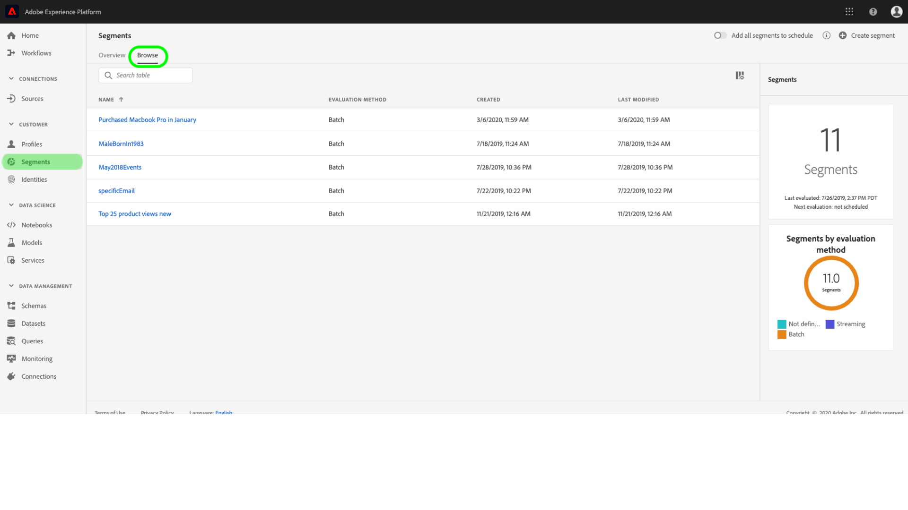

## Performance summary metrics {#performance-metrics}

The **[!UICONTROL Performance summary]** tab contains the churn or conversion results of your model. The results displayed are separated into each of the propensity buckets scored by Customer AI.

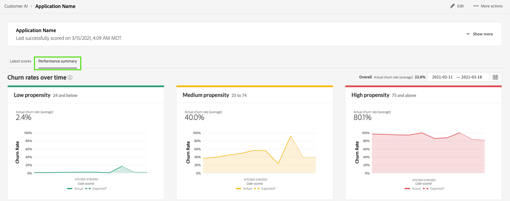

Initially only expected rates (dotted lines) are displayed. However, once an outcome window has passed, the expected result is replaced with an actual result (solid line). Hovering over the lines displays the date and actual/expected result for that day in that bucket.

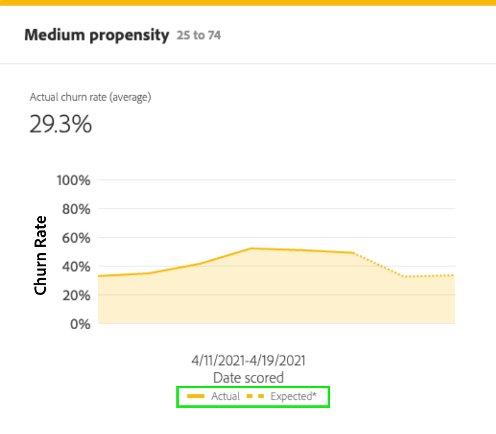

You can filter the timeframe for the expected and actual results being displayed. Select the **calendar icon** then select a new date range. The results in each of the buckets are updated to display within the new date range.

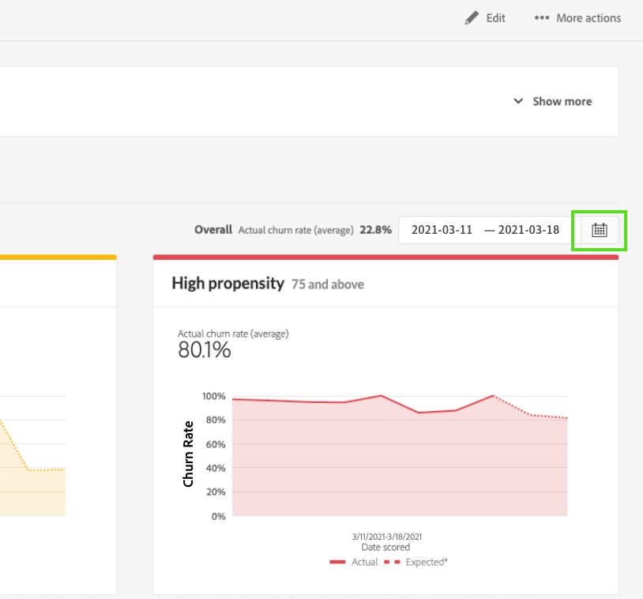

### Individual scoring run results

The bottom half of the **[!UICONTROL Performance summary]** tab displays the results for each individual scoring run. Select the dropdown date in the top-right to display results for a different scoring run.

Depending on if you are predicting churn or conversion, the [!UICONTROL Distribution of Scores] graph displays the distribution of profiles churned/converted and not churned/not converted in each increment.

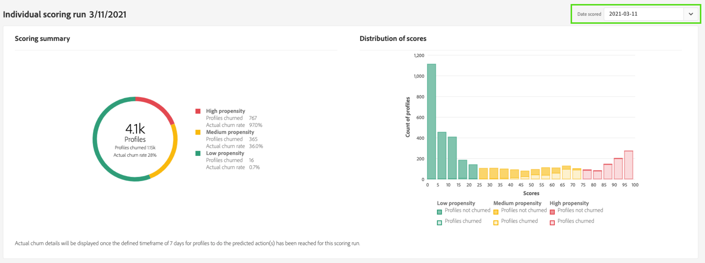

## Next steps

This document outlined the insights provided by a Customer AI service instance. You can now continue to the tutorial on [downloading scores in Customer AI](./download-scores.md) or browse the other [Adobe Intelligent Services](../../home.md) guides that are offered.

## Additional resources

The following video outlines how to use Customer AI to see the output of the models and influential factors.

>[!VIDEO](https://video.tv.adobe.com/v/32666?learn=on&quality=12)
