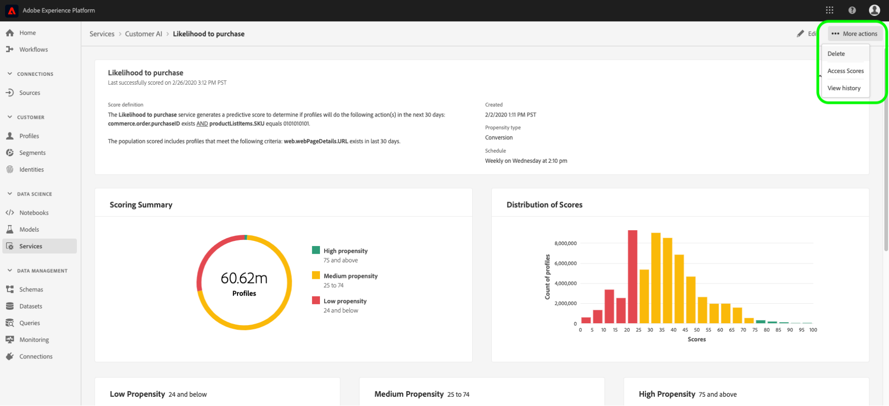
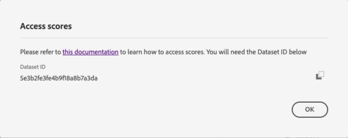
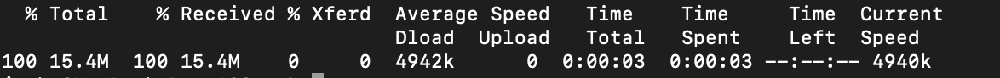

# Download scores in Customer AI

This document serves as a guide for downloading scores for Customer AI. 

## Getting started

Customer AI allows you to download scores in the Parquet file format. This tutorial requires that you have read and finished the downloading Customer AI scores section in the [getting started](../getting-started.md) guide.

Additionally, in order to access scores for Customer AI, you need to have a service instance with a successful run status available. To create a new service instance, visit [Configuring a Customer AI instance](./configure.md). If you recently created a service instance and it is still training and scoring, please allow 24 hours for it to finish running.

Currently, there are two ways to download Customer AI scores:

1. If you want to download the scores at the individual level and/or do not have Real-Time Customer Profile enabled, start by navigating to [finding your dataset ID](#dataset-id).
2. If you have Profile enabled and want to download segments that you have configured using Customer AI, please navigate to [download a segment configured with Customer AI](#segment).

## Find your dataset ID {#dataset-id}

Within your service instance for Customer AI insights, click the *More actions* dropdown in the top-right navigation then select **[!UICONTROL Access scores]**.



A new dialog appears, containing a link to the downloading scores documentation and the dataset ID for your current instance. Copy the dataset ID to your clipboard and proceed to the next step.



## Retrieve your batch ID {#retrieve-your-batch-id}

Using your dataset ID from the previous step, you need to make a call to the Catalog API in order to retrieve a batch ID. Additional query parameters are used for this API call in order to return the latest successful batch instead of a list of batches belonging to your organization. To return additional batches, increase the number for the limit query parameter to the desired amount you wish to be returned. For more information on the types of query parameters available, visit the guide on [filtering Catalog data using query parameters](../../../catalog/api/filter-data.md).

**API format**

```http
GET /batches?&dataSet={DATASET_ID}&createdClient=acp_foundation_push&status=success&orderBy=desc:created&limit=1
```

| Parameter | Description |
| --------- | ----------- |
| `{DATASET_ID}` | The dataset ID available in the "Access Scores" dialog. |

**Request**

```shell
curl -X GET 'https://platform.adobe.io/data/foundation/catalog/batches?dataSet=5cd9146b31dae914b75f654f&createdClient=acp_foundation_push&status=success&orderBy=desc:created&limit=1' \
  -H 'Authorization: Bearer {ACCESS_TOKEN}' \
  -H 'x-api-key: {API_KEY}' \
  -H 'x-gw-ims-org-id: {ORG_ID}' \
  -H 'x-sandbox-name: {SANDBOX_NAME}'
```

**Response**

A successful response returns a payload containing a batch ID object. In this example, the key value to the object returned is the batch ID `01E5QSWCAASFQ054FNBKYV6TIQ`. Copy your batch ID to use in the next API call.

```json
{
    "01E5QSWCAASFQ054FNBKYV6TIQ": {
        "status": "success",
        "tags": {
            "Tags": [ ... ],
        },
        "relatedObjects": [
            {
                "type": "dataSet",
                "id": "5cd9146b31dae914b75f654f"
            }
        ],
        "id": "01E5QSWCAASFQ054FNBKYV6TIQ",
        "externalId": "01E5QSWCAASFQ054FNBKYV6TIQ",
        "replay": {
            "predecessors": [
                "01E5N7EDQQP4JHJ93M7C3WM5SP"
            ],
            "reason": "Replacing for 2020-04-09",
            "predecessorListingType": "IMMEDIATE"
        },
        "inputFormat": {
            "format": "parquet"
        },
        "imsOrg": "412657965Y566A4A0A495D4A@AdobeOrg",
        "started": 1586715571808,
        "metrics": {
            "partitionCount": 1,
            "outputByteSize": 2380339,
            "inputFileCount": -1,
            "inputByteSize": 2381007,
            "outputRecordCount": 24340,
            "outputFileCount": 1,
            "inputRecordCount": 24340
        },
        "completed": 1586715582735,
        "created": 1586715571217,
        "createdClient": "acp_foundation_push",
        "createdUser": "sensei_exp_attributionai@AdobeID",
        "updatedUser": "acp_foundation_dataTracker@AdobeID",
        "updated": 1586715583582,
        "version": "1.0.5"
    }
}
```

## Retrieve the next API call with your batch ID {#retrieve-the-next-api-call-with-your-batch-id}

Once you have your batch ID, you are able to make a new GET request to `/batches`. The request returns a link thats used as the next API request.

**API format**

```http
GET batches/{BATCH_ID}/files
```

| Parameter | Description |
| --------- | ----------- |
| `{BATCH_ID}` | The batch ID that was retrieved in the previous step [retrieve your batch ID](#retrieve-your-batch-id). |

**Request**

Using your own batch ID, make the following request.

```shell
curl -X GET 'https://platform.adobe.io/data/foundation/export/batches/035e2520-5e69-11ea-b624-51evfeba55d1/files' \
  -H 'Authorization: Bearer {ACCESS_TOKEN}' \
  -H 'x-api-key: {API_KEY}' \
  -H 'x-gw-ims-org-id: {ORG_ID}' \
  -H 'x-sandbox-name: {SANDBOX_NAME}'
```

**Response**

A successful response returns a payload containing a `_links` object. Within the `_links` object is an `href` with a new API call as its value. Copy this value to proceed to the next step.

```json
{
    "data": [
        {
            "dataSetFileId": "035e2520-5e69-11ea-b624-51ecfeba55d0-1",
            "dataSetViewId": "5e3b2fe3fe4b9f18a8b7a3db",
            "version": "1.0.0",
            "created": "1583361894479",
            "updated": "1583361894479",
            "isValid": false,
            "_links": {
                "self": {
                    "href": "https://platform.adobe.io:443/data/foundation/export/files/035e2520-5e69-11ea-b624-51ecfeba55d0-1"
                }
            }
        }
    ],
    "_page": {
        "limit": 100,
        "count": 1
    }
}
```

## Retrieve your files {#retrieving-your-files}

Using the `href` value you got in the previous step as an API call, make a new GET request to retrieve your file directory.

**API format**

```http
GET files/{DATASETFILE_ID}
```

| Parameter | Description |
| --------- | ----------- |
| `{DATASETFILE_ID}` | The dataSetFile ID is returned in the `href` value from the [previous step](#retrieve-the-next-api-call-with-your-batch-id). It is also accessible in the `data` array under the object type `dataSetFileId`. |

**Request**

```shell
curl -X GET 'https://platform.adobe.io:443/data/foundation/export/files/035e2520-5e69-11ea-b624-51ecfeba55d0-1' \
  -H 'Authorization: Bearer {ACCESS_TOKEN}' \
  -H 'x-api-key: {API_KEY}' \
  -H 'x-gw-ims-org-id: {ORG_ID}' \
  -H 'x-sandbox-name: {SANDBOX_NAME}'
```

**Response**

The response contains a data array that may have a single entry, or a list of files belonging to that directory. The example below contains a list of files and has been condensed for readability. In this scenario, you need to follow the URL of each file in order to access the file.

```json
{
    "data": [
        {
            "name": "part-00000-tid-7597930103898538622-a25f1890-efa9-40eb-a2cb-1b378e93d582-528-1-c000.snappy.parquet",
            "length": "16214531",
            "_links": {
                "self": {
                    "href": "https://platform.adobe.io:443/data/foundation/export/files/035e2520-5e69-11ea-b624-51ecfeba55d0-1?path=part-00000-tid-7597930103898538622-a25f1890-efa9-40eb-a2cb-1b378e93d582-528-1-c000.snappy.parquet"
                }
            }
        },
        {
            "name": "...",
            "length": "16235375",
            "_links": {
                "self": {
                    "href": "..."
                }
            }
        }
    ],
    "_page": {
        "limit": 100,
        "count": 100
    },
    "_links": {
        "next": {
            "href": "..."
        },
        "page": {
            "href": "...",
            "templated": true
        }
    }
}
```

| Parameter | Description |
| --------- | ----------- |
| `_links.self.href` | The GET request URL used to download a file in your directory. |


Copy the `href` value for any file object in the `data` array, then proceed to the next step.

## Download your file data

To download your file data, make a GET request to the `"href"` value you copied in the previous step [retrieving your files](#retrieving-your-files).

>[!NOTE]
>
>If you are making this request directly in command line, you might be prompted to add an output after your request headers. The following request example uses `--output {FILENAME.FILETYPE}`.

**API format**

```http
GET files/{DATASETFILE_ID}?path={FILE_NAME}
```

| Parameter | Description |
| --------- | ----------- |
| `{DATASETFILE_ID}` | The dataSetFile ID is returned in the `href` value from a [previous step](#retrieve-the-next-api-call-with-your-batch-id).|
| `{FILE_NAME}` | The name of the file. |

**Request**

```shell
curl -X GET 'https://platform.adobe.io:443/data/foundation/export/files/035e2520-5e69-11ea-b624-51ecfeba55d0-1?path=part-00000-tid-7597930103898538622-a25f1890-efa9-40eb-a2cb-1b378e93d582-528-1-c000.snappy.parquet' \
  -H 'Authorization: Bearer {ACCESS_TOKEN}' \
  -H 'x-api-key: {API_KEY}' \
  -H 'x-gw-ims-org-id: {ORG_ID}' \
  -H 'x-sandbox-name: {SANDBOX_NAME}' \
  -O 'filename.parquet'
```

>[!TIP]
>
>Make sure you are in the correct directory or folder you want your file saved to before you make the GET request.

**Response**

The response downloads the file you requested in in your current directory. In this example the filename is "filename.parquet".



## Download a segment configured with Customer AI {#segment}

An alternative way to download your score data is by exporting your audience to a dataset. After a segmentation job has successfully completed (the value of the `status` attribute is "SUCCEEDED"), you can export your audience to a dataset where it can be accessed and acted upon. To learn more about segmentation, visit the [segmentation overview](../../../segmentation/home.md).

>[!IMPORTANT]
>
>In order to utilize this method of exporting, Real-Time Customer Profile needs to be enabled for the dataset.

The [export a segment](../../../segmentation/tutorials/evaluate-a-segment.md) section in the segment evaluation guide covers the required steps to export an audience dataset. The guide outlines and provides examples of the following:

- **Create a target dataset:** Create the dataset to hold audience members.
- **Generate audience profiles in the dataset:** Populate the dataset with XDM Individual Profiles based on the results of a segment job.
- **Monitor export progress:** Check the current progress of the export process.
- **Read audience data:** Retrieve the resulting XDM Individual Profiles representing the members of your audience.

## Next steps

This document outlined the steps required for downloading Customer AI scores. You can now continue to browse the other [Intelligent Services](../../home.md) and guides that are offered.
