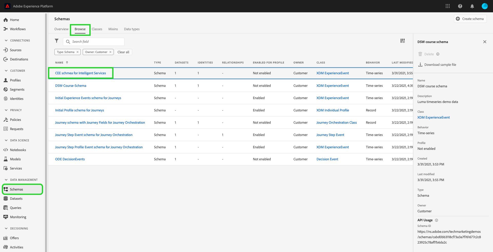
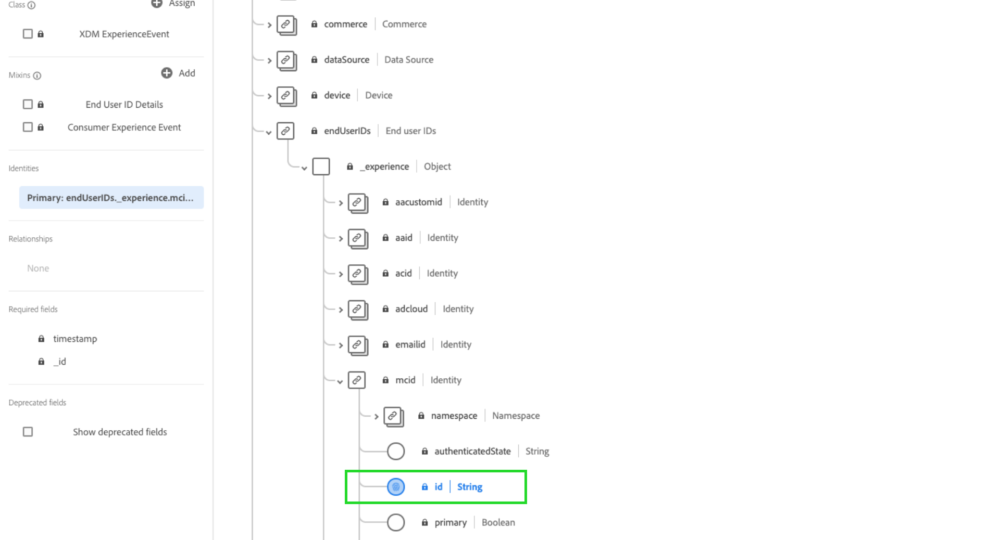
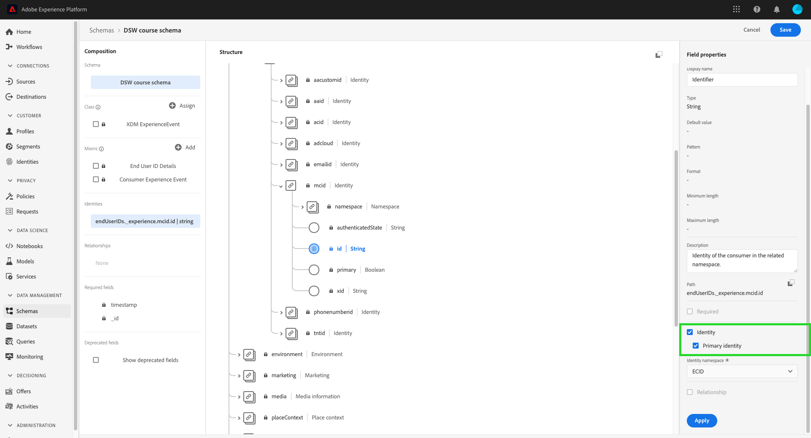
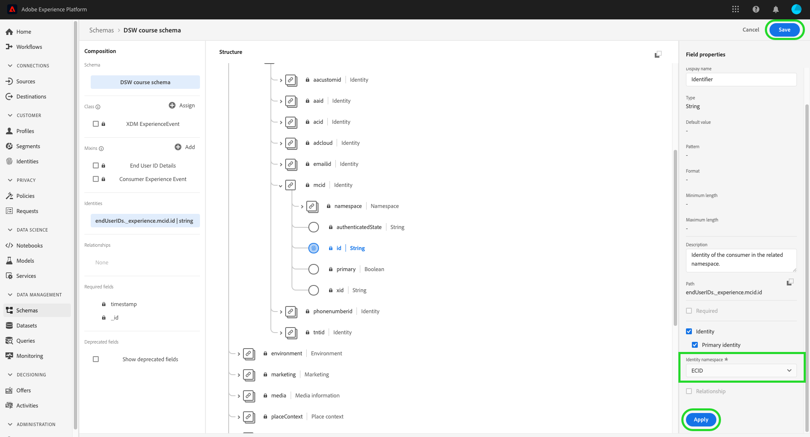
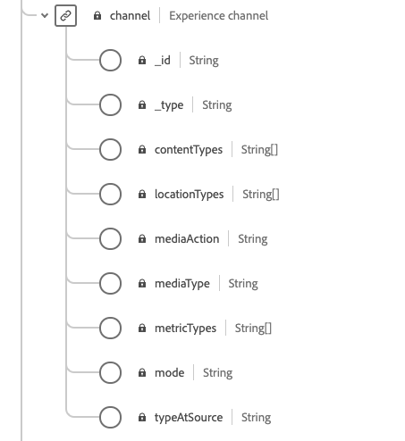
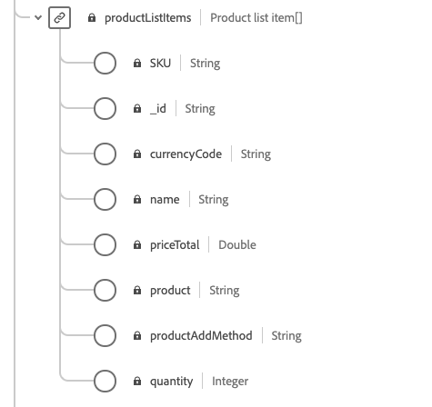
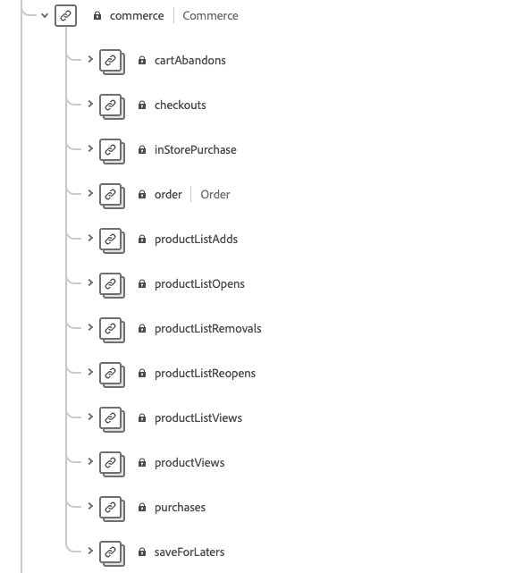
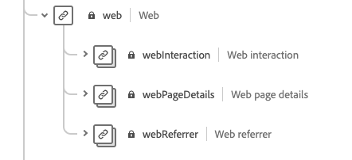
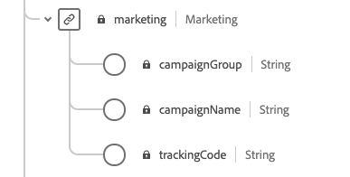
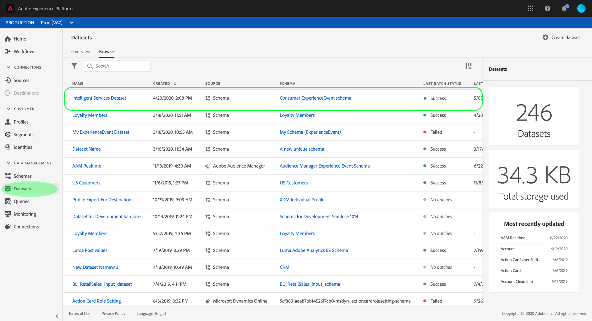

# Prepare data for use in [!DNL Intelligent Services]

In order for [!DNL Intelligent Services] to discover insights from your marketing events data, the data must be semantically enriched and maintained in a standard structure. [!DNL Intelligent Services] leverage [!DNL Experience Data Model] (XDM) schemas in order to achieve this. Specifically, all datasets that are used in [!DNL Intelligent Services] must conform to the Consumer ExperienceEvent (CEE) XDM schema or use the Adobe Analytics connector. Additionally, Customer AI supports the Adobe Audience Manager connector.

This document provides general guidance on mapping your marketing events data from multiple channels to the CEE schema, outlining information on important fields within the schema to help you determine how to effectively map your data to its structure. If you plan on using Adobe Analytics data, please view the section for [Adobe Analytics data preparation](#analytics-data). If you plan on using Adobe Audience Manager data (Customer AI only), please view the section for [Adobe Audience Manger data preparation](#AAM-data).

## Data Requirements

[!DNL Intelligent Services] require different amounts of historical data depending on the goal you create. Regardless, the data you prepare for **all** [!DNL Intelligent Services] must include both positive and negative customer journeys / events. Having both negative and positive events improves model precision and accuracy. 

For example, if you are using Customer AI to predict the propensity to buy a product, the model for Customer AI needs both examples of successful purchase paths and examples of unsuccessful paths. This is because during model training, Customer AI looks to understand what events and journeys lead to a purchase. This also includes the actions taken by customers who did not purchase, such as an individual who stopped their journey at adding an item to the cart. These customers may exhibit similar behaviors however, Customer AI can provide insights and drilldown the major differences and factors that lead to a higher propensity score. Similarly, Attribution AI requires both types of events and journeys in order to display metrics such as touchpoint effectiveness, top conversion paths, and breakdowns by touchpoint position.

For more examples and information on historical data requirements, visit the [Customer AI](./customer-ai/input-output.md#data-requirements) or [Attribution AI](./attribution-ai/input-output.md#data-requirements) historical data requirements section in the input / output documentation.

### Guidelines for stitching data

It is recommend that you stitch the events of a user across a common id when possible. For example, you may have user data with "id1" across 10 events. Later, the same user deleted the cookie id and is recorded as "id2" across next 20 events. If you know that id1 and id2 correspond to same user, the best practice is to stitch all 30 events with a common id. 

If this is not possible, you should treat each set of events as a different user when creating your model input data. This ensures the best results during model training and scoring.

## Workflow summary

The preparation process varies depending on whether your data is stored in Adobe Experience Platform or externally. This section summarizes the necessary steps you need to take, given either scenario.

### External data preparation

If your data is stored outside of Experience Platform, you need to map your data to the required and relevant fields in a [Consumer ExperienceEvent schema](#cee-schema). This schema can be augmented with custom field groups to better capture your customer data. Once mapped, you can create a dataset using your Consumer ExperienceEvent schema and [ingest your data to Platform](../ingestion/home.md). The CEE dataset can then be selected when configuring an [!DNL Intelligent Service].

Depending on the [!DNL Intelligent Service] you wish to use, different fields may be required. Note that it is a best practice to add data to a field if you have the data available. To learn more about the required fields, visit the [Attribution AI](./attribution-ai/input-output.md) or [Customer AI](./customer-ai/input-output.md) input / output guide.

### Adobe Analytics data preparation {#analytics-data}

Customer AI and Attribution AI natively support Adobe Analytics data. To use Adobe Analytics data, follow the steps outlined in the documentation to set up an [Analytics source connector](../sources/tutorials/ui/create/adobe-applications/analytics.md). 

Once the source connector is streaming your data into Experience Platform, you are able to select Adobe Analytics as a data source followed by a dataset during your instance configuration. All of the required schema field groups and individual fields are automatically created during the connection set up. You do not need to ETL (Extract, Transform, Load) the datasets into the CEE format.

If you compare the data flown through the Adobe Analytics source connector onto Adobe Experience Platform with Adobe Analytics data, you may notice some discrepancies. The Analytics Source connector might drop rows during the transformation to an Experience Data Model (XDM) schema. There can be multiple reasons for the whole row to be unfit for transformation which include missing timestamps, missing personIDs, invalid or large person IDs, invalid analytic values, and more.

For more information and examples, visit the documentation for [comparing Adobe Analytics and Customer Journey Analytics data](https://www.adobe.com/go/compare-aa-data-to-cja-data). This article is designed to help you diagnose and solve for those differences so that you and your team can use Adobe Experience Platform data for Intelligent Services unimpeded by concerns about data integrity.

In Adobe Experience Platform Query Services, run the following Total Records between start and end timestamp by channel.typeAtSource query to find the count by marketing channels.

```SELECT channel.typeAtSource as typeAtSource, 
       Count(_id) AS Records 
FROM  df_hotel
WHERE timestamp>=from_utc_timestamp('2021-05-15','UTC')
        AND timestamp<from_utc_timestamp('2022-01-10','UTC')
        AND timestamp IS NOT NULL
        AND enduserids._experience.aaid.id IS NOT NULL
GROUP BY channel.typeAtSource
```        

>[!IMPORTANT]
>
>The Adobe Analytics connector takes up to four weeks to backfill data. If you recently set up a connection you should verify that the dataset has the minimum length of data required for Customer or Attribution AI. Please review the historical data sections in [Customer AI](./customer-ai/input-output.md#data-requirements) or [Attribution AI](./attribution-ai/input-output.md#data-requirements), and verify you have enough data for your prediction goal.

### Adobe Audience Manager data preparation (Customer AI only) {#AAM-data}

Customer AI natively supports Adobe Audience Manager data. To use Audience Manager data, follow the steps outlined in the documentation to set up an [Audience Manager source connector](../sources/tutorials/ui/create/adobe-applications/audience-manager.md).

Once the source connector is streaming your data into Experience Platform, you are able to select Adobe Audience Manager as a data source followed by a dataset during your Customer AI configuration. All of the schema field groups and individual fields are automatically created during the connection set up. You do not need to ETL (Extract, Transform, Load) the datasets into the CEE format.

>[!IMPORTANT]
>
>If you recently set up a connector you should verify that the dataset has the minimum length of data required. Please review the historical data section in the [input/output documentation](./customer-ai/input-output.md) for Customer AI, and verify you have enough data for your prediction goal.

### [!DNL Experience Platform] data preparation

If your data is already stored in [!DNL Platform] and not streaming through the Adobe Analytics or Adobe Audience Manager (Customer AI only) source connectors, follow the steps below. It is still recommended you understand the CEE schema.

1. Review the structure of the [Consumer ExperienceEvent schema](#cee-schema) and determine whether your data can be mapped to its fields.
2. Contact Adobe Consulting Services to help map your data to the schema and ingest it into [!DNL Intelligent Services], or [follow the steps in this guide](#mapping) if you want to map the data yourself.

## Understanding the CEE schema {#cee-schema}

The Consumer ExperienceEvent schema describes the behavior of an individual as it relates to digital marketing events (web or mobile) as well as online or offline commerce activity. The use of this schema is required for [!DNL Intelligent Services] because of its semantically well-defined fields (columns), avoiding any unknown names that would otherwise make the data less clear.

The CEE schema, like all XDM ExperienceEvent schemas, captures the time-series-based state of the system when an event (or set of events) occurred, including the point in time and the identity of the subject involved. Experience Events are fact records of what occurred, and thus they are immutable and represent what happened without aggregation or interpretation.

[!DNL Intelligent Services] utilize several key fields within this schema to generate insights from your marketing events data, all of which can be found at the root level and expanded to show their required subfields.


Like all XDM schemas, the CEE schema field group is extensible. In other words, additional fields can be added to the CEE field group, and different variations can be included in multiple schemas if necessary.

A complete example of the field group can be found in the [public XDM repository](https://github.com/adobe/xdm/blob/797cf4930d5a80799a095256302675b1362c9a15/docs/reference/context/experienceevent-consumer.schema.md). In addition, you can view and copy the following [JSON file](https://github.com/AdobeDocs/experience-platform.en/blob/master/help/intelligent-services/assets/CEE_XDM_sample_rows.json) for an example of how data can be structured to comply with the CEE schema. Refer to both of these examples as you learn about the key fields outlined in the section below, in order to determine how you can map your own data to the schema.

## Key fields

There are several key fields within the CEE field group which should be utilized in order for [!DNL Intelligent Services] to generate useful insights. This section describes the use case and expected data for these fields, and provides links to reference documentation for further examples.

### Mandatory fields

While the use of all key fields is strongly recommended, there are two fields that are **required** in order for [!DNL Intelligent Services] to work:

* [A primary identity field](#identity)
* [xdm:timestamp](#timestamp)
* [xdm:channel](#channel) (mandatory only for Attribution AI)

#### Primary identity {#identity}

One of the fields in your schema must be set as a primary identity field, which allows [!DNL Intelligent Services] to link each instance of time-series data to an individual person.

You must determine the best field to use as a primary identity based on the source and nature of your data. An identity field must include an **identity namespace** that indicates the type of identity data the field expects as a value. Some valid namespace values include:

>[!NOTE]
>
>The Experience Cloud ID (ECID) is also known as MCID and continues to be used in namespaces.

* "email"
* "phone"
* "mcid" (for Adobe Audience Manager IDs)
* "aaid" (for Adobe Analytics IDs)

If you are unsure which field you should use as a primary identity, contact Adobe Consulting Services to determine the best solution. If a primary identity is not set, the Intelligent Service application uses the following default behavior:

| Default | Attribution AI | Customer AI |
| --- | --- | --- |
| Identity column | `endUserIDs._experience.aaid.id` | `endUserIDs._experience.mcid.id` |
| Namespace | AAID | ECID |

To set a primary identity, navigate to your schema from the **[!UICONTROL Schemas]** tab and select the schema name hyperlink to open the **[!DNL Schema Editor]**.



Next, navigate to the field you wish to as a primary identity and select it. The **[!UICONTROL Field properties]** menu opens for that field.



In the **[!UICONTROL Field properties]** menu, scroll down until you find the **[!UICONTROL Identity]** checkbox. After checking the box, the option to set the selected identity as the **[!UICONTROL Primary identity]** appears. Select this box as well.



Next, you must provide an **[!UICONTROL Identity namespace]** from the list of pre-defined namespaces in the dropdown. In this example, the ECID namesapce is selected since an Adobe Audience Manager ID `mcid.id` is being used. Select **[!UICONTROL Apply]** to confirm the updates then select **[!UICONTROL Save]** in the top-right corner to save the changes to your schema.



#### xdm:timestamp {#timestamp}

This field represents the datetime at which the event occurred. This value must be provided as a string, as per the ISO 8601 standard.

#### xdm:channel {#channel}

>[!NOTE]
>
>This field is only mandatory when using Attribution AI.

This field represents the marketing channel related to the ExperienceEvent. The field includes information about the channel type, media type, and location type.



**Example schema**

```json
{
  "@id": "https://ns.adobe.com/xdm/channels/facebook-feed",
  "@type": "https://ns.adobe.com/xdm/channel-types/social",
  "xdm:mediaType": "earned",
  "xdm:mediaAction": "clicks"
}
```

For complete information regarding each of the required sub-fields for `xdm:channel`, please refer to the [experience channel schema](https://github.com/adobe/xdm/blob/797cf4930d5a80799a095256302675b1362c9a15/docs/reference/channels/channel.schema.md) spec. For some example mappings, see the [table below](#example-channels).

#### Example channel mappings {#example-channels}

The following table provides some examples of marketing channels mapped to the `xdm:channel` schema:

| Channel | `@type` | `mediaType` | `mediaAction` |
| --- | --- | --- | --- |
| Paid Search | https:/<span>/ns.adobe.com/xdm/channel-types/search | paid | clicks |
| Social - Marketing | https:/<span>/ns.adobe.com/xdm/channel-types/social | earned | clicks |
| Display | https:/<span>/ns.adobe.com/xdm/channel-types/display | paid | clicks |
| Email | https:/<span>/ns.adobe.com/xdm/channel-types/email | paid | clicks |
| Internal Referrer | https:/<span>/ns.adobe.com/xdm/channel-types/direct | owned | clicks |
| Display ViewThrough | https:/<span>/ns.adobe.com/xdm/channel-types/display | paid | impressions |
| QR Code Redirect | https:/<span>/ns.adobe.com/xdm/channel-types/direct | owned | clicks |
| Mobile | https:/<span>/ns.adobe.com/xdm/channel-types/mobile | owned | clicks |

### Recommended fields

The remainder of the key fields are outlined in this section. While these fields aren't necessarily required for [!DNL Intelligent Services] to work, it is strongly recommended that you use as many of them as possible in order to gain richer insights.

#### xdm:productListItems

This field is an array of items which represent products selected by a customer, including the product SKU, name, price, and quantity.



**Example schema**

```json
[
  {
    "xdm:SKU": "1002352692",
    "xdm:name": "24-Watt 8-Light Chrome Integrated LED Bath Light",
    "xdm:currencyCode": "USD",
    "xdm:quantity": 1,
    "xdm:priceTotal": 159.45
  },
  {
    "xdm:SKU": "3398033623",
    "xdm:name": "16ft RGB LED Strips",
    "xdm:currencyCode": "USD",
    "xdm:quantity": 1,
    "xdm:priceTotal": 79.99
  }
]
```

For complete information regarding each of the required sub-fields for `xdm:productListItems`, please refer to the [commerce details schema](https://github.com/adobe/xdm/blob/797cf4930d5a80799a095256302675b1362c9a15/docs/reference/context/experienceevent-commerce.schema.md) spec.

#### xdm:commerce

This field contains commerce-specific information about the ExperienceEvent, including the purchase order number and payment information.



**Example schema**

```json
{
    "xdm:order": {
      "xdm:purchaseID": "a8g784hjq1mnp3",
      "xdm:purchaseOrderNumber": "123456",
      "xdm:payments": [
        {
          "xdm:transactionID": "transactid-a111",
          "xdm:paymentAmount": 59,
          "xdm:paymentType": "credit_card",
          "xdm:currencyCode": "USD"
        },
        {
          "xdm:transactionId": "transactid-a222",
          "xdm:paymentAmount": 100,
          "xdm:paymentType": "gift_card",
          "xdm:currencyCode": "USD"
        }
      ],
      "xdm:currencyCode": "USD",
      "xdm:priceTotal": 159
    },
    "xdm:purchases": {
      "xdm:value": 1
    }
  }
```

For complete information regarding each of the required sub-fields for `xdm:commerce`, please refer to the [commerce details schema](https://github.com/adobe/xdm/blob/797cf4930d5a80799a095256302675b1362c9a15/docs/reference/context/experienceevent-commerce.schema.md) spec.

#### xdm:web

This field represents web details relating to the ExperienceEvent, such as the interaction, page details, and referrer.



**Example schema**

```json
{
  "xdm:webPageDetails": {
    "xdm:siteSection": "Shopping Cart",
    "xdm:server": "example.com",
    "xdm:name": "Purchase Confirmation",
    "xdm:URL": "https://www.example.com/orderConf",
    "xdm:errorPage": false,
    "xdm:homePage": false,
    "xdm:pageViews": {
      "xdm:value": 1
    }
  },
  "xdm:webReferrer": {
    "xdm:URL": "https://www.example.com/checkout",
    "xdm:referrerType": "internal"
  }
}
```

For complete information regarding each of the required sub-fields for `xdm:productListItems`, please refer to the [ExperienceEvent web details schema](https://github.com/adobe/xdm/blob/797cf4930d5a80799a095256302675b1362c9a15/docs/reference/context/experienceevent-web.schema.md) spec.

#### xdm:marketing

This field contains information related to marketing activities that are active with the touchpoint.



**Example schema**

```json
{
  "xdm:trackingCode": "marketingcampaign111",
  "xdm:campaignGroup": "50%_DISCOUNT",
  "xdm:campaignName": "50%_DISCOUNT_USA"
}
```

For complete information regarding each of the required sub-fields for `xdm:productListItems`, please refer to the [marketing sechma](https://github.com/adobe/xdm/blob/797cf4930d5a80799a095256302675b1362c9a15/docs/reference/context/marketing.schema.md) spec.

## Mapping and ingesting data {#mapping}

Once you have determined whether your marketing events data can be mapped to the CEE schema, the next step is to determine which data you to bring into [!DNL Intelligent Services]. All historical data used in [!DNL Intelligent Services] must fall within the minimum time window of four months of data, plus the number of days intended as a lookback period.

After deciding the range of data you want to send, contact Adobe Consulting Services to help map your data to the schema and ingest it into the service.

If you have an [!DNL Adobe Experience Platform] subscription and want to map and ingest the data yourself, follow the steps outlined in the section below.

### Using Adobe Experience Platform

>[!NOTE]
>
>The steps below require a subscription to Experience Platform. If you do not have access to Platform, skip ahead to the [next steps](#next-steps) section.

This section outlines the workflow for mapping and ingesting data into Experience Platform for use in [!DNL Intelligent Services], including links to tutorials for detailed steps.

#### Create a CEE schema and dataset

When you are ready to start preparing your data for ingestion, the first step is to create a new XDM schema that employs the CEE field group. The following tutorials walk through the process of creating a new schema in the UI or API:

* [Create a schema in the UI](../xdm/tutorials/create-schema-ui.md)
* [Create a schema in the API](../xdm/tutorials/create-schema-api.md)

>[!IMPORTANT]
>
>The tutorials above follow a generic workflow for creating a schema. When choosing a class for the schema, you must use the **XDM ExperienceEvent class**. Once this class has been chosen, you can then add the CEE field group to the schema.

After adding the CEE field group to the schema, you can add other field groups as required for additional fields within your data.

Once you have created and saved the schema, you can create a new dataset based on that schema. The following tutorials walk through the process of creating a new dataset in the UI or API:

* [Create a dataset in the UI](../catalog/datasets/user-guide.md#create) (Follow the workflow for using an existing schema)
* [Create a dataset in the API](../catalog/datasets/create.md)

After the dataset is created, you can find it in the Platform UI within the **[!UICONTROL Datasets]** workspace.



#### Add identity fields to the dataset

If you are bringing in data from [!DNL Adobe Audience Manager], [!DNL Adobe Analytics], or another external source, then you have the option to set a schema field as an identity field. To set a schema field as an identity field, view the section on setting identity fields within the [UI tutorial](../xdm/tutorials/create-schema-ui.md#identity-field) or [API tutorial](../xdm/tutorials/create-schema-api.md#define-an-identity-descriptor) for creating a schema.

If you are ingesting data from a local CSV file, you can skip ahead to the next section on [mapping and ingesting data](#ingest).

#### Map and ingest data {#ingest}

After creating a CEE schema and dataset, you can start mapping your data tables to the schema and ingest that data into Platform. See the tutorial on [mapping a CSV file to an XDM schema](../ingestion/tutorials/map-a-csv-file.md) for steps on how to perform this in the UI. You can use the following [sample JSON file](https://github.com/AdobeDocs/experience-platform.en/blob/master/help/intelligent-services/assets/CEE_XDM_sample_rows.json) to test the ingestion process before using your own data.

Once a dataset has been populated, the same dataset can be used to ingest additional data files.

If your data is stored in a supported third-party application, you can also choose to create a [source connector](../sources/home.md) to ingest your marketing events data into [!DNL Platform] in real time.

## Next steps {#next-steps}

This document provided general guidance on preparing your data for use in [!DNL Intelligent Services]. If you require additional consulting based on your use case, please contact Adobe Consulting Support.

Once you have successfully populated a dataset with your customer experience data, you can use [!DNL Intelligent Services] to generate insights. Refer to the following documents to get started:

* [Attribution AI overview](./attribution-ai/overview.md)
* [Customer AI overview](./customer-ai/overview.md)
