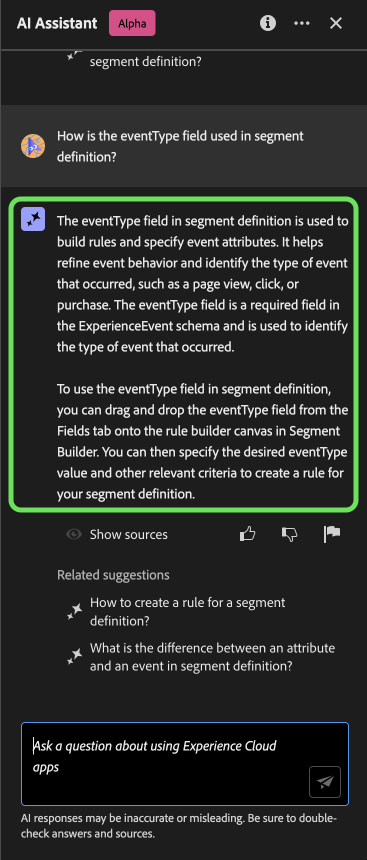
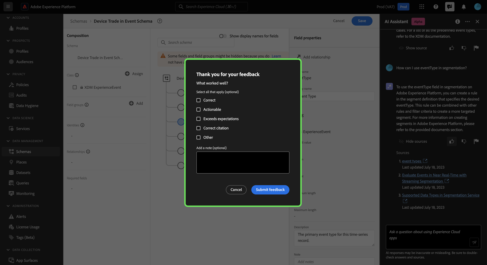
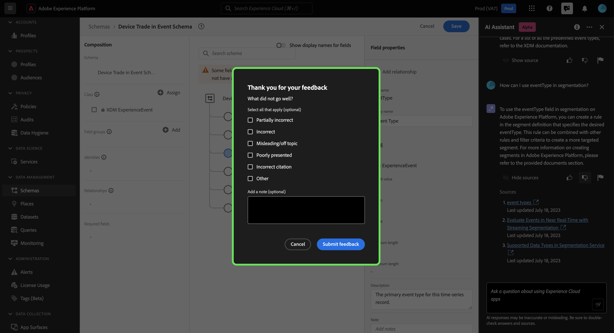
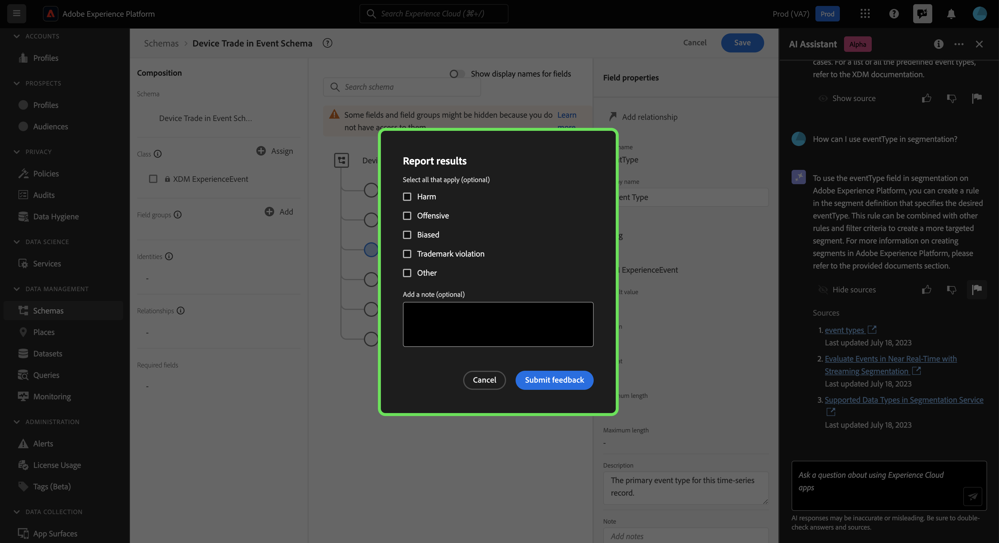
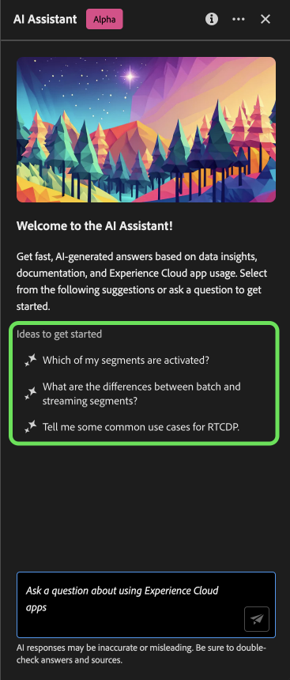

# AI Assistant for Adobe Experience Platform

>[!NOTE]
>
>The AI Assistant for Adobe Experience Platform is currently in Alpha. The feature and documentation are subject to change.

The AI Assistant for Adobe Experience Platform is a UI feature that you can use to navigate and understand Experience Platform and Real-Time Customer Data Platform concepts, and usage information about your objects.

You can query the AI Assistant for information such as:

* Guidance on how to perform tasks pertaining to data and audiences.
* Statuses and metrics of the existing data objects in your organization.
* Use case examples and nuances to better understand your data objects, including attributes, datasets, destinations, schemas, segments, and sources.

This document provides information on how you can access and use the AI Assistant to ask questions and receive answers about Experience Platform and Real-Time CDP concepts.

>[!BEGINSHADEBOX]

**How does the AI Assistant work?**

The AI Assistant responds to your submitted questions by querying a database and then translating data from the database into a human-readable answer.

This internal representation of underlying data is also known as the Knowledge Graph - a comprehensive web of concepts, data, and metadata for a given answer. 

The Knowledge Graph consists of sub-graphs that are referenced whenever queries submitted:

* Customer usage data.
* Customer usage data across various meta-stores.
* Experience League documentation.

There are two classes of questions to consider before querying the AI Assistant:

* **Concept Questions**: Concept questions are about Adobe concepts related to data or audiences. Some examples of concept questions include:
  * What is the difference between batch and streaming segmentation?
  * Are there industry data models and how do I use them?
  * What is Real-Time CDP best used for?
* **Usage Questions**: Usage questions are about the data objects inside your organization. Some examples of usage questions include:
  * How many datasets do I have?
  * How many schema attributes have never been used?
  * Which segments have been activated?

>[!ENDSHADEBOX]

## Access the AI Assistant for Experience Platform in the UI

You can access the AI Assistant from the header navigation in the Experience Platform UI.

Select the **[!UICONTROL AI Assistant icon]** from the header to launch the AI Assistant panel.

From here, you can input your question in the text box and query the AI Assistant for concepts regarding data or audiences. You can also ask questions about your data objects to better understand how you can use them for your respective use case. 

### Example use case: Use the AI Assistant to expedite your schema creation process

>[!NOTE]
>
>The following example workflow uses the ExperienceEvent schema creation process to illustrate how you can use the AI Assistant when using the Experience Platform UI.

Consider a use case in which you are creating a **Device Trade in Event Schema**. During the ExperienceEvent schema creation process, you come across the `eventType` field. At this point, you can either leave your workflow and refer to the the documentation on the [basics of a schema composition](../xdm/schema/composition.md), or you can use the AI Assistant to retrieve immediate answers for your questions. 

To begin, input your question in the text box provided. In the example below, the AI Assistant is provided the question: "**What is the eventType field in an Experience Event schema?**"

The AI Assistant then queries its knowledge base and computes an answer. After a few moments, the AI Assistant returns an answer and related suggestions that you can use as follow up prompts.

You can further learn more about a particular topic by asking a follow up question. In the next example, the AI Assistant is asked how the eventType can be used in segmentation.

You can also ask the AI Assistant questions regarding your data usage. When inquiring about data usage, you must be in an active sandbox in order for the AI Assistant to answer your query.

With every answer the AI assistant provides you with a way to validate your answer by viewing its source. Links to the documentation are provided for concept questions, while data usage questions can be verified with an SQL query that demonstrates how the answer was computed.

>[!BEGINSHADEBOX]

**Your feedback is requested**

During this Alpha stage, you are invited to provide feedback on the responses that you receive from the AI Assistant. All responses and submitted feedback are reviewed in order to continue to improve the AI Assistant experience.

To provide feedback, select either thumbs up or thumbs down after receiving a response from the AI Assistant, and then input your feedback in the provided text box. Next, select **[!UICONTROL Submit feedback]** to submit.

>[!ENDSHADEBOX]

>[!BEGINTABS]

>[!TAB Show source]

Select **[!UICONTROL Show source]** for a list of links to the documentation that the AI Assistant references to compute its response.

>[!TAB Thumbs up]

Select the thumbs up icon to provide feedback on what went well with your experience with the AI Assistant.

>[!TAB Thumbs down]

Select the thumbs down icon to provide feedback on what could be improved upon based on your experience with the AI Assistant. During this step, you can also provide specific comments regarding your experience. Feedback provided in the comments is reviewed daily.

>[!TAB Flag]

Select the flag icon to provide further reports on your experience using the AI Assistant.

>[!ENDTABS]

### Ideas to get started

You can also use the pre-set prompts that the AI Assistant provides to get started.

## Additional information 

Refer to this section for additional information on the AI Assistant for Experience Platform.

### Scope

The AI Assistant can answer queries based on the documentation and your data usage.

#### Documentation

You can ask documentation questions based on Real-Time Customer Data Platform and Audiences. Currently, the documentation index covers Adobe Experience Platform (Real-Time CDP and Audiences). The index is updated periodically.

The documentation retrieval model is trained on Experience Platform (Real-Time CDP and Audiences). Questions outside the scope of Adobe Experience Platform such as, questions about other Adobe products like Adobe Target and the Creative Cloud suite cannot be answered.

#### Data usage

You can also ask the AI Assistant questions about your data usage in the following domains: 

* Attributes
* Datasets
* Destinations (Questions regarding accounts and some questions about dataflow cannot be answered at this time.)
* Schemas (Questions regarding field groups cannot be answered at this time.)
* Segments
* Sources (Questions regarding accounts cannot be answered at this time.)

For usage data queries, answers may not reflect the current state of the UI. The data backing these questions is updated once every 24 hours. For example, changes that users make in Real-Time CDP during the daytime are synced with the data stores at night, and then they become available for user questions in the morning. You may need to format your questions as: "When was the segment with the title {TITLE} created?" instead of, "When was the {TITLE} segment created?"

You will need to log into a sandbox to inquire about specific data related to objects like schemas, datasets, attributes, destinations and segments.

+++Select for a list of supported data usage questions

The following is a list of currently supported data usage questions grouped by domain. 

* List the attributes used for this segment?
* How many segments are there in total?
* Show me a list of segments that were last modified in the last month.
* Which segments have been modified in the last week?
* What is the profile count for {SEGMENT_NAME} segment?
* List all duplicate segments. 
* Show me segments created or updated in last 7 days.
* What is the distribution of the number of profiles across segments?
* How many fields are used in segmentation?
* What is the total count of activated segments?
* Which segments are activated?
* How many duplicate segments are activated?
* List segments that were created in the last year.
* Show me segments that were last modified before {DATE}.
* How many unique segment names are associated with the {SCHEMA_NAME} schema?
* Which schemas are most commonly used across segments?
* How many schemas do I have?
* Which dataset(s) use {SCHEMA_NAME} schema?
* List all schemas modified in the last week.
* How many schemas are profile enabled?
* List all the experience event class schemas?
* Which datasets are ingested into the {SCHEMA_NAME} schema?
* How many datasets have been ingested using the same schema?
* How many datasets do I have?
* Which datasets are used in each segment?
* Which segments use {ATTRIBUTE_NAME} attribute? 
* Which schemas have {ATTRIBUTE_NAME} attribute in them?
* How many XDM schema attributes are not used in any segments?
* In which dataset(s) is/are {ATTRIBUTE_NAME} XDM fields populated?
* Which datasets have data for {ATTRIBUTE_NAME} attribute?
* How many segments are activated for each destination?
* Which segments are activated to the most number of destinations?
* Do any of my segments have 0 profiles? 
* How many dataflows do I have?

+++

### Conversational experience

You must consider several nuances regarding the conversational experience when querying the AI Assistant.

>[!NOTE]
>
>These limitations are temporary and are being improved upon throughout the course of the alpha.

>[!BEGINTABS]

>[!TAB Unable to infer context from prior discussion]

The AI Assistant currently cannot reference prior discussions as context for a given question. See the table below for examples:

| Ambiguous question | Clear question | Note |
| --- | --- | --- |
| <ul><li>First question: "What is a segment?"</li><li>Follow up question: "Are there different types of them?"</li></ul>| <ul><li>First question: "What is a segment?"</li><li>Follow up question: "Are there different types of **segments**?"</li></ul> | The AI Assistant cannot infer what "them" means. |
| <ul><li>First question: "What is a segment?"</li><li>Follow up question: "Can you elaborate more?"</li></ul> | <ul><li>First question: "What is a segment?"</li><li>Follow up question: "Explain what a segment is in depth"</li></ul> | The AI Assistant cannot intelligently reference documentation based on "more". |
| <ul><li>First question: "What is a segment?"</li><li>Follow up question: "Can you give me an example of one?"</li></ul> | <ul><li>First question: "What is a segment?"</li><li>Follow up question: "Can you give me an example of a segment?"</li></ul> | The AI Assistant cannot infer what you want an example of.|
| <ul><li>First question: "What is a batch segment?"</li><li>Follow up question: "How does it compare to a streaming segment?"</li></ul> | <ul><li>First question: "What is a batch segment?"</li><li>Follow up question: "Can you compare a streaming segment to a batch segment?"</li></ul> | The AI Assistant cannot infer what "it" is referring to and thus cannot compare the streaming segment. |
| <ul><li>First question: "How many segments do I have?"</li><li>Follow up question: "How many of them use Facebook as a destination?"</li></ul> | <ul><li>First question: "How many segments do I have?"</li><li>Follow up question: "How many of the segments that I have are using Facebook as a destination?"</li></ul> | The AI Assistant is cannot infer what "them" is referring to. |

{style="table-layout:auto"}

>[!TAB Unable to infer context from a page]

When asking the AI Assistant about a particular element of the Experience Platform UI page that you are on, you must clearly define the specific element within your question. 

| Ambiguous question | Clear question | Note |
| --- | --- | --- |
| "What does this do?" | "What does {PAGE_NAME} do? | The AI Assistant cannot infer what "this" is referring to. You must provide the specific page element that you are querying about. |
| "Why won't it save?" | "Why can't I save a new sandbox called {NAME}?" | The AI Assistant cannot infer what "it" is referring to and cannot know that you are having issues with an entity. |

{style="table-layout:auto"}

Furthermore, the AI Assistant can only answer questions regarding error messages, given that the error is documented in Experience League.

>[!TAB Ambiguity]

You must phrase your questions clearly and scope them within a product, application, or domain, as the AI Assistant currently cannot disambiguate questions.

| Ambiguous question | Clear question | Note |
| --- | --- | --- |
| "How do I create a filter? | How do I create a filter in Profile Query Language? | You must specify the feature that which you are filtering for because a variety of Experience Platform features support filtering. |
| "How do I get started? | How do I get started using destinations? | You must provide clarity on your goals and use case because overly broad concepts may result in generic or unnecessarily specific answers. |

{style="table-layout:auto"}

>[!ENDTABS]

### Limited small talk

You can engage in small talk with the AI Assistant, but this capacity is currently limited.

### Capability questions

The AI Assistant may give an inaccurate impression of what it can do. It may answer the following types of questions incorrectly:

| Example question | Note |
| --- | --- |
| "Can you answer questions on {ENTITY}?" | As long as the AI Assistant is able to find a single page referencing a given entity in its index, then it will respond yes. |
| "Do you know **x** language?" | The AI Assistant currently only supports English, but may answer "yes" due to the underlying model being able to support it. |
| "Can you do...?" | The AI Assistant may answer yes, even though it cannot. |

### Tips

#### Questions may be answered with the wrong information source

There are instances when your question about your usage data can result in an answer based on the documentation. This is because the AI Assistant can incorrectly route your question to the wrong information source. You can prevent this by:

* Rephrasing your question to use more SQL-like language
* Explicitly calling out the information source to use.

Read the table below for examples:

| Bad question | Good question | Notes |
| --- | --- | --- |
| What is my biggest segment? | What is my biggest segment? Using data. | Explicitly tell the AI Assistant that you want the answer to be based on data. |
| What is my biggest segment? | List my biggest segment. | There are instances where a "what..." question can be mistaken for a documentation-based question. Using a command like "list" is a stronger indicator that you are asking a question with data in context. |
| How many datasets do I have? | Count my datasets. | The original question works for segments, but it may not work with datasets. |

