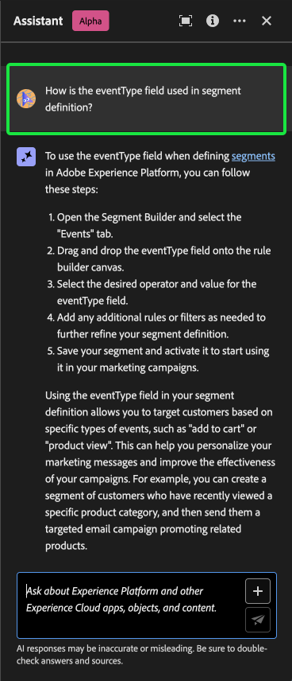
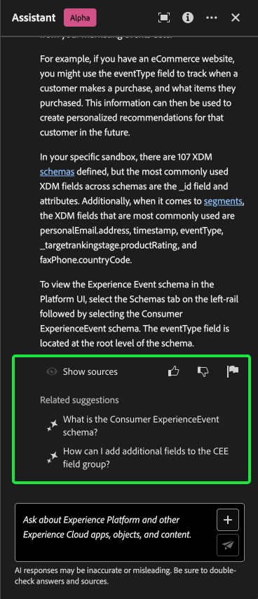
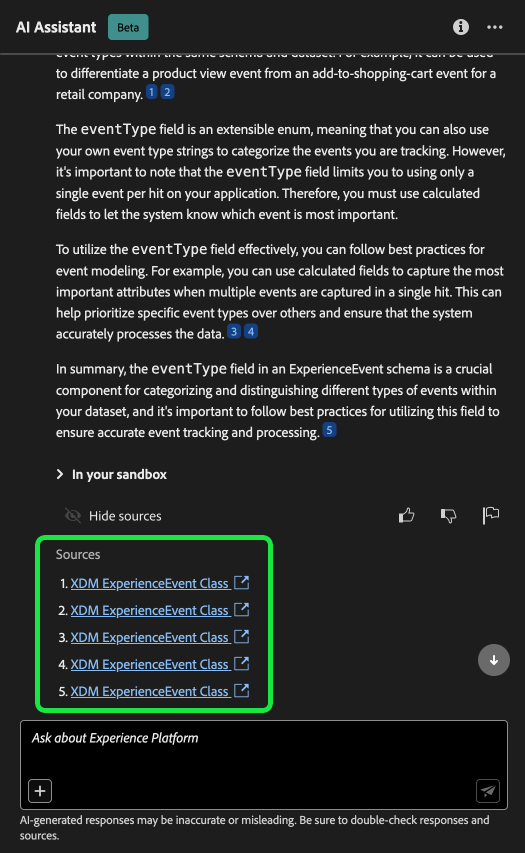
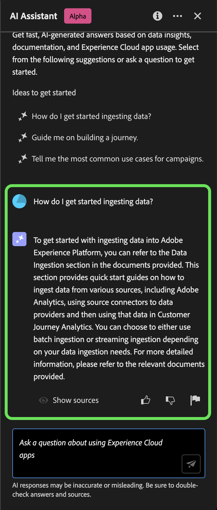
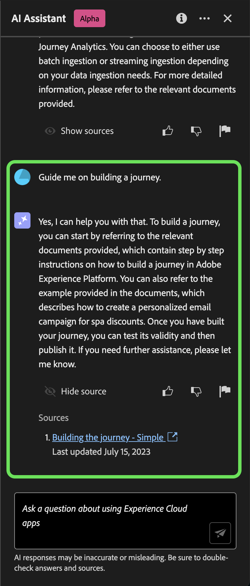
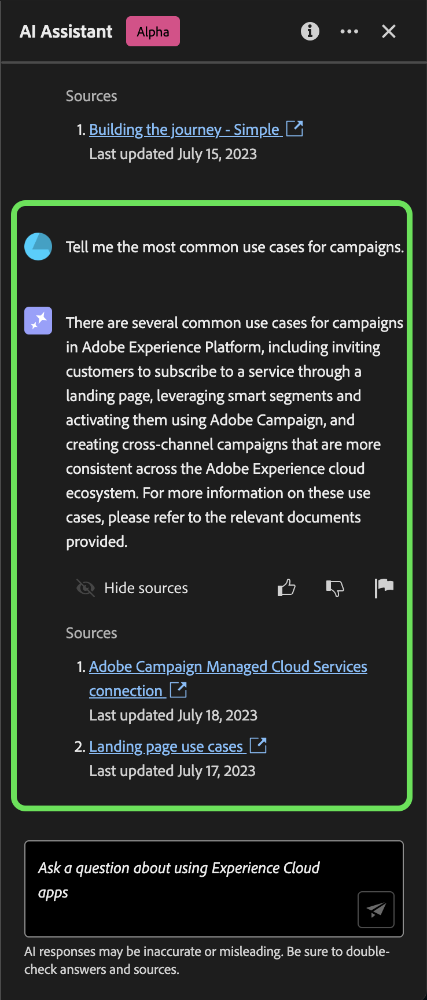

# AI Assistant for Adobe Experience Platform

>[!NOTE]
>
>The AI Assistant for Adobe Experience Platform is currently in Alpha. The feature and documentation are subject to change.

The AI Assistant for Adobe Experience Platform is a functionality of the Experience Platform UI that you can use to expedite your understanding of Experience Platform and Real-Time Customer Data Platform concepts.

You can ask the AI Assistant questions regarding data and audiences. The AI Assistant then provides answers to your questions, based on the documentation, while also providing references that you can then turn to for more information.

This document provides information on how you can use the AI Assistant to ask questions and receive answers about an Adobe Experience Platform and Real-Time Customer Data Platform concept relating to data and audiences.

>[!IMPORTANT]
>
>*AI Assistant uses an automated chatbot. Your use of this automated chatbot constitutes consent that the personal information you provide in the chat session will be collected, used, disclosed, and retained by Adobe and service providers acting on Adobe's behalf in accordance with the [Adobe Privacy Policy](https://www.adobe.com/privacy/policy.html). Please do not provide sensitive personal information (such as financial or health information) in the chatbot.*
>
>*AI Assistant is integrated with Azure OpenAI, and your chatbot inputs are shared with Azure and may be used to improve chatbot performance. Please note that for AI Assistant to work, you must have read access to data within the service*

## Access the AI Assistant for Experience Platform in the UI

You can access the AI Assistant from the header navigation in the Experience Platform UI.

Select the **[!UICONTROL AI Assistant icon]** from the header to launch the AI Assistant panel.

From here, you can input your question in the text box and query the AI Assistant for information regarding data or audience.

>[!NOTE]
>
>The following example workflow uses the ExperienceEvent schema creation process to illustrate how you can use the AI Assistant when using the Experience Platform UI.

### STEPS

Consider a use case in which you are creating a **Device Trade in Event Schema**. During the ExperienceEvent schema creation process, you come across the `eventType` field. At this point, you can either leave your workflow and refer to the the documentation on the [basics of a schema composition](../xdm/schema/composition.md), or you can use the AI Assistant to retrieve immediate answers for your questions. 

To begin, select the AI Assistant icon from the top header and then input your question in the text box provided. In the example below, the AI Assistant is provided the question: "What is the eventType field in an Experience Event schema?"

The AI Assistant then queries its knowledge base and computes an answer. After a few moments, the AI Assistant returns the following:

You can further learn more about a particular topic by asking a follow up question. In the next example, the AI Assistant is asked how the eventType can be used in segmentation.

With every answer, the AI Assistant provides you with the option to view the documentation that it cites for information and provide feedback.

>[!BEGINTABS]

>[!TAB Show source]

Select **[!UICONTROL Show source]** for a list of links to the documentation that the AI Assistant references to compute its response.

>[!TAB Thumbs up]

Select the thumbs up icon to provide feedback on what went well with your experience with the AI Assistant.

>[!TAB Thumbs down]

Select the thumbs down icon to provide feedback on what could be improved upon based on your experience with the AI Assistant.

>[!TAB Flag]

Select the flag icon to provide further reports on your experience using the AI Assistant.

>[!ENDTABS]

### Ideas to get started

The AI Assistant for Experience Platform also provides you with prompts that you can use to get started with Experience Platform.

>[!BEGINTABS]

>[!TAB How do I get started ingesting data?]

To query the AI Assistant regarding data ingestion, select **[!UICONTROL How do I get started ingesting data?]**

>[!TAB Guide me on building a journey]

For a guide on building a journey, select **[!UICONTROL Guide me on building a journey.]**

>[!TAB Tell me the most common use cases for campaigns]

You can also query the AI Assistant for use case examples. For example, select **[!UICONTROL Tell me the most common use cases for campaigns.]**

>[!ENDTABS]