# Assistant for Adobe Experience Platform

>[!NOTE]
>
>Assistant for Adobe Experience Platform is currently in Alpha. The feature and documentation are subject to change.

Assistant is a UI feature that you can use to navigate and understand Adobe Experience Platform and Real-Time Customer Data Platform concepts and usage information about your objects.

You can query Assistant for information such as:

* Guidance on how to perform tasks pertaining to data and audiences.
* Statuses and metrics of the existing data objects in your organization.
* Use case examples and nuances to better understand your data objects, including attributes, datasets, destinations, schemas, segments, and sources.

Read the guide below to learn how you can use Assistant to help navigate and understand your Experience Platform and Real-Time CDP workflows.

>[!BEGINSHADEBOX]

**How does Assistant work?**

Assistant responds to your submitted questions by querying a database and then translating data from the database into a human-readable answer.

This internal representation of underlying data is also known as the Knowledge Graph - a comprehensive web of concepts, data, and metadata for a given answer. 

The Knowledge Graph consists of sub-graphs that are referenced whenever queries submitted:

* Customer usage data.
* Customer usage data across various meta-stores.
* Experience League documentation.

There are two classes of questions to consider before querying Assistant:

* **Concept Questions**: Concept questions are about Adobe concepts related to data or audiences. Some examples of concept questions include:
  * What is the difference between batch and streaming segmentation?
  * Are there industry data models and how do I use them?
  * What is Real-Time CDP best used for?
* **Usage Questions**: Usage questions are about the data objects inside your organization. Some examples of usage questions include:
  * How many datasets do I have?
  * How many schema attributes have never been used?
  * Which segments have been activated?

>[!ENDSHADEBOX]

## Access Assistant in the Experience Platform UI

To launch Assistant, select the **[!UICONTROL Assistant icon]** from the top header of the Experience Platform UI.

The Assistant interface appears, immediately providing you with information to get started. You can use the options provided under [!UICONTROL Ideas to get started] to answer questions and commands such as:

* [!UICONTROL Which of my segments are activated?] 
* [!UICONTROL What is a schema?]
* [!UICONTROL Tell me some common use cases for Real-Time CDP]

To interact with Assistant, use the input box to type in your queries or commands. You can also use the (**`+`**) symbol to utilize the auto-complete function and the bookmark icon to access your bookmarked queries and commands.

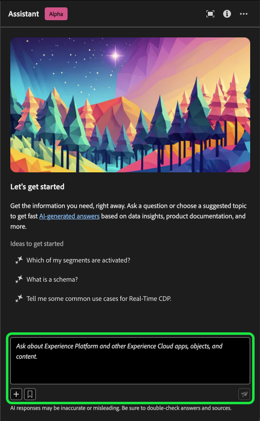

## Use case example: Use Assistant to expedite your schema creation process

>[!NOTE]
>
>The following workflow is an example that uses the experience event schema creation process to illustrate how you can use Assistant when using the Experience Platform UI.

Consider a use case in which you are creating a **Device Trade in Event Schema**. During the experience event schema creation process, you come across the `eventType` field. "At this point, you have the option to either exit your workflow and refer to the [basics of a schema composition](../xdm/schema/composition.md) documentation, or you can use Assistant to retrieve answers to your questions and find additional resources through the documentation links recommended by Assistant."

To begin, enter your question in the text box provided. In the example below, Assistant is provided the question: "**What is the eventType field in an ExperienceEvent schema?**"

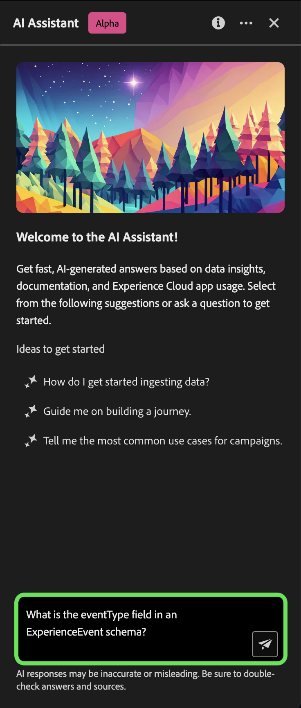

Assistant then queries its knowledge base and computes an answer. After a few moments, Assistant returns an answer and related suggestions that you can use as follow up prompts.

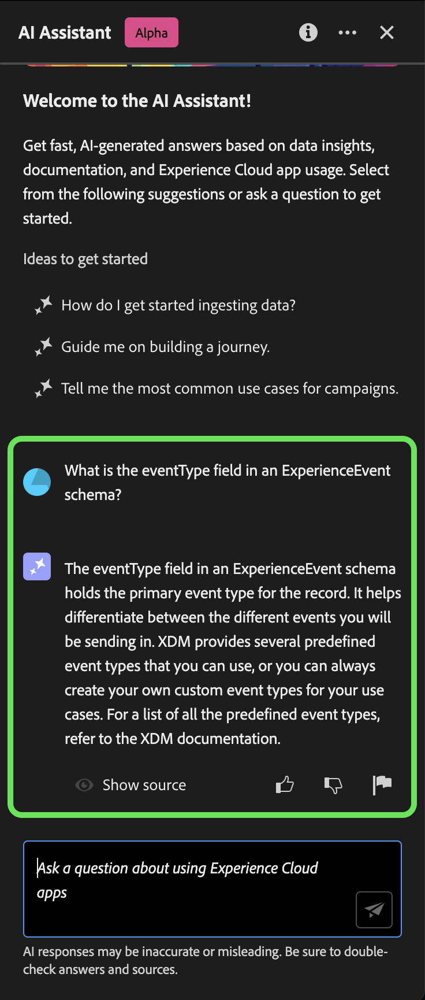

After receiving a response from Assistant, you can select from a number of options to decide how you want to proceed.

### Save your query {#save-your-query}

+++Select to view an example of how to save a query

To save your query, select the bookmark icon beside your question.

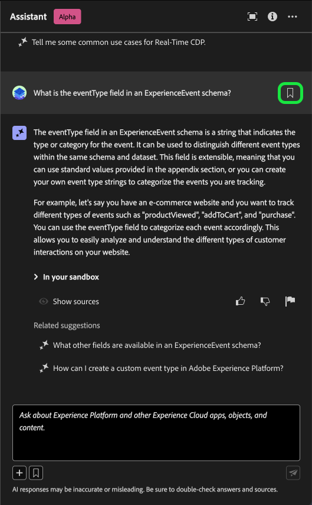

To access your saved queries, select the bookmark icon below the input box, then select the query you would like to run.

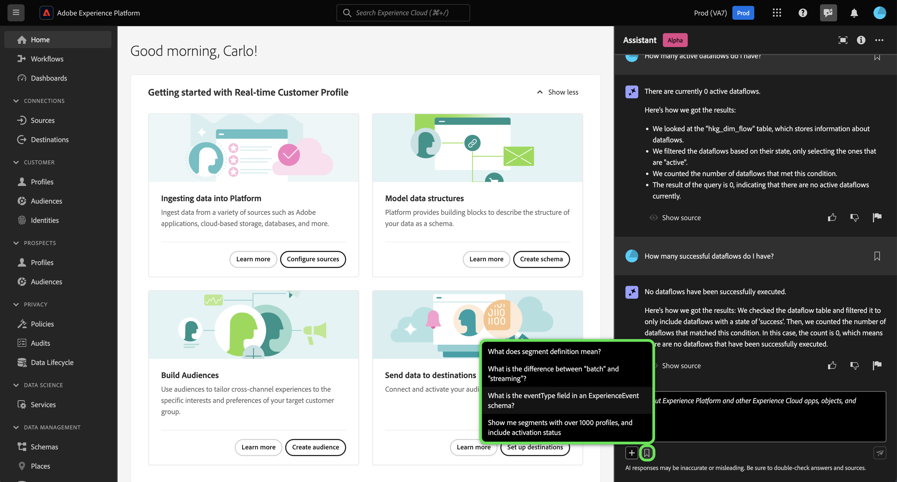

+++

### View data in your sandbox {#view-data-in-your-sandbox}

+++Select to view example

Depending on your query, Assistant provides additional information pertaining to the data in your sandbox. To view how the response to your query applies to your sandbox, select **[!UICONTROL In your sandbox].** 

During this step, Assistant may provide direct links to the UI pages of certain objects in question. In the example below, Assistant provides direct links to the [!UICONTROL Schemas] and [!UICONTROL Segments] UI pages.

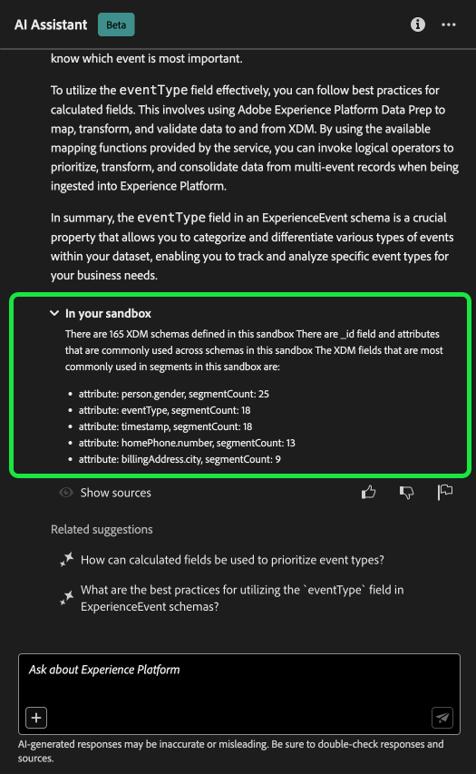

+++

### Verify the response {#verify-the-response}

+++Select to view an example of how to display sources

To view citations and validate Assistant's response, select **[!UICONTROL Show sources]**. Assistant provides links to documentation that corroborates its response. You can also use the queries that Assistant provides under [!UICONTROL Related suggestions] to further explore topics related to your original query.

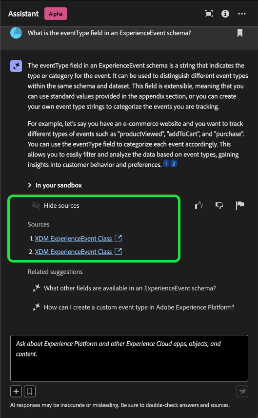

+++

### Data usage and visualization {#data-usage-and-visualization}

+++Select to view an example of data usage questions and data visualization

You can inquire with Assistant about your data usage. You must be in an active sandbox for Assistant to answer a data usage question regarding data in your organization.

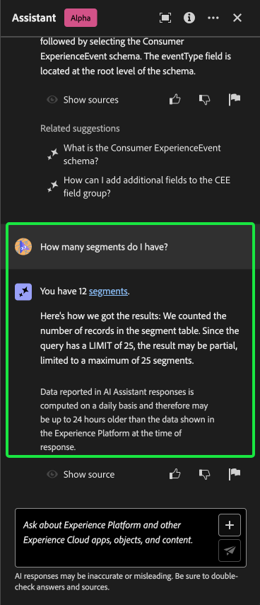

When prompted with a data usage question, Assistant also provides an explanation of how it computed the answer. In the example below, Assistant outlines the steps it took in order to display segments with over 1000 profiles and their respective activation statuses.

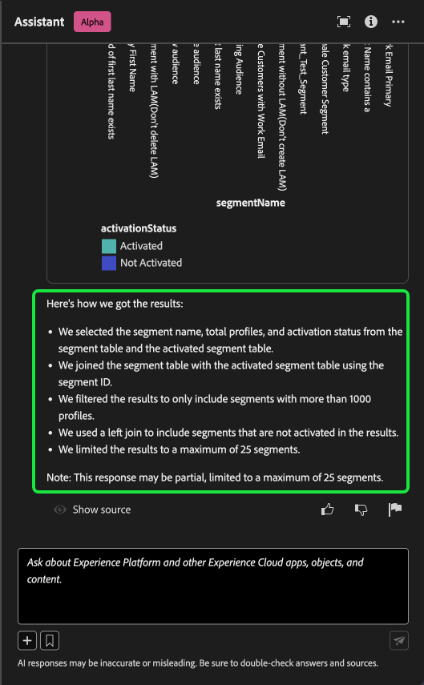

Furthermore, Assistant renders charts to visualize your data. You can also provide filters and modifications to your queries, and you can instruct Assistant to render its findings based on the filters that you include. For example, you can ask Assistant to show you a trend of the count segments in the order of their created date, remove segments with zero total profiles, and use month names instead of integers when displaying the data.

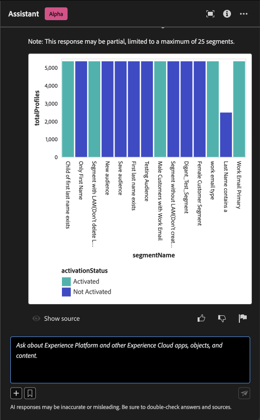

+++

### Use auto-complete {#use-auto-complete}

+++Select to view an example of auto-complete

You can use the autocomplete function to receive a list of data objects that exist in your sandbox. Autocomplete recommendations are available for the following domains: segments, schemas, datasets, sources, and destinations.

You can use autocomplete by including the plus symbol (**`+`**) in your query. As an alternative, you can also select the plus sign (**`+`**) located at the bottom of the text input box. A window appears with a list of recommended data objects from your sandbox.

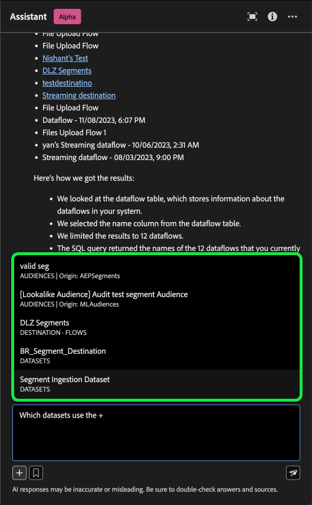

Next, select the data object that you want to query to complete your question and then submit your question.

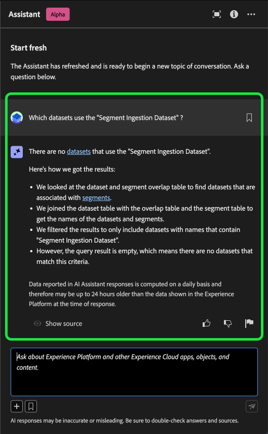

+++

### Use multi-turn {#use-multi-turn}

+++Select to view an example of multi-turn

You can use Assistant's multi-turn capabilities to have a more natural conversation during your experience. Assistant is able to answer follow-up questions, given. that context can be inferred from an earlier interaction.

In the example below, Assistant is asked for the total number of dataflows in the current organization.

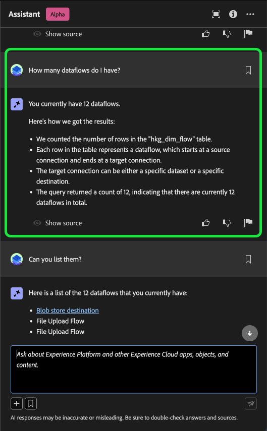

Next, Assistant receives another follow-up request. This time, Assistant responds by listing the dataflows that currently exist in your organization.

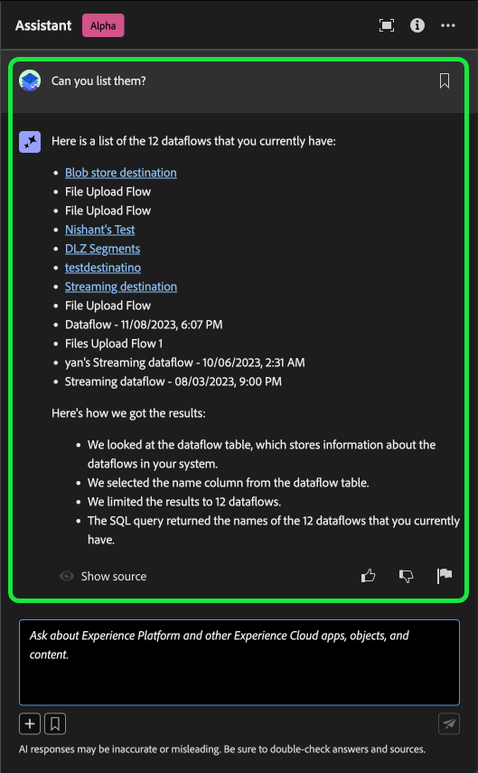

+++

## Scope {#scope}

Assistant can answer questions regarding Real-Time CDP and Experience Platform concepts, as well as data usage specific to your user account. Assistant can also infer context based on the UI page that you are in. It can identify:

* The user account that you are using.
* The organization that you belong to. 
* The page that you are viewing on your screen.
* The resource (including type and ID) that you are viewing on your screen.
* Given that you are in the process of a particular Experience Platform or Real-Time CDP workflow, Assistant can deduce your intent.

### Documentation {#documentation}

Currently, the documentation index covers Adobe Experience Platform (Real-Time CDP and Audiences). The index is updated periodically.

The documentation retrieval model is trained on Experience Platform (Real-Time CDP and Audiences). Questions outside the scope of Adobe Experience Platform such as, questions about other Adobe products like Adobe Target and the Creative Cloud suite cannot be answered.

### Data usage {#data-usage}

You can also ask Assistant questions about your data usage in the following domains: 

* Attributes
* Datasets
* Destinations _(Questions regarding accounts and some questions about dataflow cannot be answered at this time.)_
* Schemas _(Questions regarding field groups cannot be answered at this time.)_
* Segments
* Sources _(Questions regarding accounts cannot be answered at this time.)_

For usage data queries, answers may not reflect the current state of the UI. The data backing these questions is updated once every 24 hours. For example, changes that users make in Real-Time CDP during the daytime are synced with the data stores at night, and then they become available for user questions in the morning. You may need to format your questions as: "When was the segment with the title {TITLE} created?" instead of, "When was the {TITLE} segment created?"

You will need to log into a sandbox to inquire about specific data related to objects like schemas, datasets, attributes, destinations and segments.

### Example data usage questions {#example-data-usage-questions}

+++Select to see a list of example data usage questions

| Question type | Description | Examples |
| --- | --- | --- | 
| Data lineage | Track usage of one or multiple objects across other Experience Platform objects | <ul><li>Which dataset(s) use {SCHEMA_NAME} schema?</li><li>How many datasets have been ingested using the same schema?</li><li>Which datasets have been used in activated segments?</li><li>List the schemas which have attributes used in activated segments.</li><li>Show me the segments which are activated to {DESTINATION_ACCOUNT_NAME} and have more than 1000 profiles.</li><li>Show me the attributes which are used in the activated segments which have been modified after Jan 2023.</li><li>What are the datasets ingested via {SOURCE_NAME}?</li><li>Which dataflows are associated with {DATAFLOW_NAME}</li><li>List the schemas that are related to activated segments and were created in last 1 year.</li></ul> |
| Distribution and aggregations | Summary-based questions about Experience Platform object usage | <ul><li>What is the percentage of activated segments?</li><li>How many fields are used in segmentation?</li><li>Which segments are activated to the most number of destinations?</li><li>List duplicate segments.</li><li>Show me the segments activated to {DESTINATION_ACCOUNT_NAME} and rank them by profile size.</li><li>What is the percentage of the segments which have not been activated but have more than 100 profiles. Show me their names.</li><li>List the 3 source connectors ingesting data into my datasets.</li><li>List me the top 5 attributes used in activated segments based on their occurrence.</li></ul> |
| Object lookup | Retrieve or access an Experience Platform object or it's properties. | <ul><li>Which datasets do not have any schema associated with them</li><li>List the attributes used for {SEGMENT_NAME}?</li><li>Give me the list of schemas which are profile enabled but have not been modified since their creation.</li><li>Which segments have been modified in the last week?</li><li>List me the segments which have the same segment definitions along with their creation date.</li><li>Which datasets are profile enabled and also include how many segments have been created from each dataset.</li><li>Which source accounts are associated with dataset XYZ?</li><li>Show me the segment definition and modification date of {SEGMENT_NAME}.</li></ul>|

+++

## Provide feedback {#feedback}

>[!BEGINSHADEBOX]

**Your feedback is requested**

During this Alpha stage, you are invited to provide feedback on the responses that you receive from the Assistant. All responses and submitted feedback are reviewed in order to continue to improve the Assistant experience.

To provide feedback, select either thumbs up or thumbs down after receiving a response from the Assistant, and then input your feedback in the provided text box. Next, select **[!UICONTROL Submit feedback]** to submit.

>[!ENDSHADEBOX]

+++Provide feedback

>[!BEGINTABS]

>[!TAB Thumbs up]

Select the thumbs up icon to provide feedback on what went well with your experience with the Assistant.

>[!TAB Thumbs down]

Select the thumbs down icon to provide feedback on what could be improved upon based on your experience with the Assistant. During this step, you can also provide specific comments regarding your experience. Feedback provided in the comments is reviewed daily.

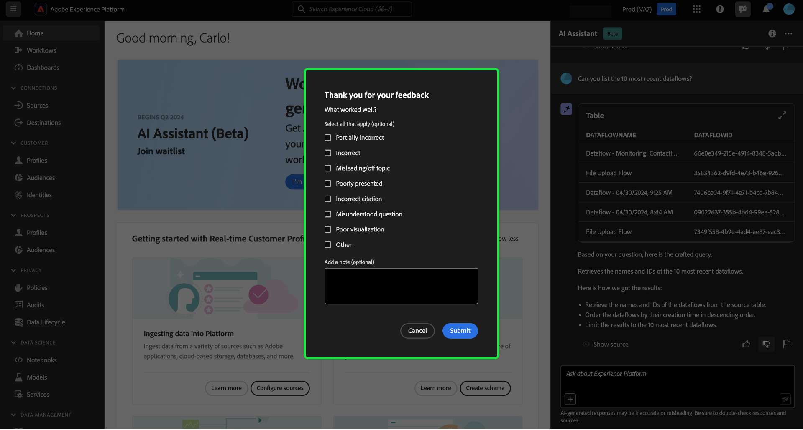

>[!TAB Flag]

Select the flag icon to provide further reports on your experience using the Assistant.

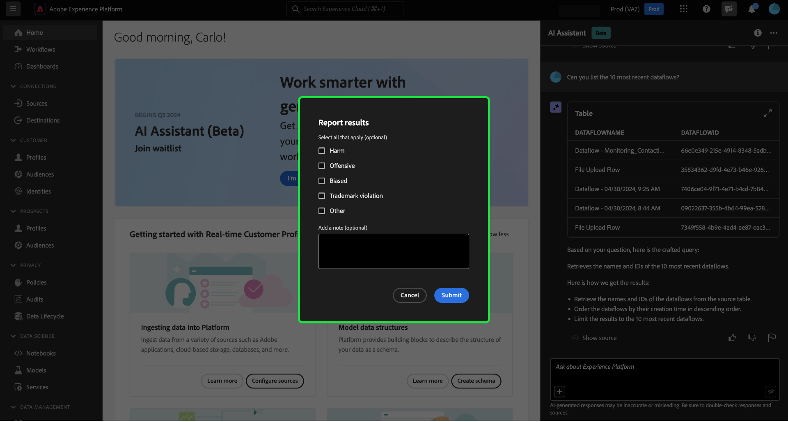

>[!ENDTABS]

+++

## Additional information {#additional-information}

Refer to this section for additional information on the Assistant for Experience Platform.

### Caveats and limitations {#caveats-and-limitations}

The following section outlines current caveats and limitations to considers when using Assistant.
<!-- 
#### Conversational experience

You must consider several nuances regarding the conversational experience when querying the Assistant.

>[!NOTE]
>
>These limitations are temporary and are being improved upon throughout the course of the alpha.

>[!BEGINTABS]

>[!TAB Unable to infer context from prior discussion]

The Assistant currently cannot reference prior discussions as context for a given question. See the table below for examples:

| Ambiguous question | Clear question | Note |
| --- | --- | --- |
| <ul><li>First question: "What is a segment?"</li><li>Follow up question: "Are there different types of them?"</li></ul>| <ul><li>First question: "What is a segment?"</li><li>Follow up question: "Are there different types of **segments**?"</li></ul> | The Assistant cannot infer what "them" means. |
| <ul><li>First question: "What is a segment?"</li><li>Follow up question: "Can you elaborate more?"</li></ul> | <ul><li>First question: "What is a segment?"</li><li>Follow up question: "Explain what a segment is in depth"</li></ul> | The Assistant cannot intelligently reference documentation based on "more". |
| <ul><li>First question: "What is a segment?"</li><li>Follow up question: "Can you give me an example of one?"</li></ul> | <ul><li>First question: "What is a segment?"</li><li>Follow up question: "Can you give me an example of a segment?"</li></ul> | The Assistant cannot infer what you want an example of.|
| <ul><li>First question: "What is a batch segment?"</li><li>Follow up question: "How does it compare to a streaming segment?"</li></ul> | <ul><li>First question: "What is a batch segment?"</li><li>Follow up question: "Can you compare a streaming segment to a batch segment?"</li></ul> | The Assistant cannot infer what "it" is referring to and thus cannot compare the streaming segment. |
| <ul><li>First question: "How many segments do I have?"</li><li>Follow up question: "How many of them use Facebook as a destination?"</li></ul> | <ul><li>First question: "How many segments do I have?"</li><li>Follow up question: "How many of the segments that I have are using Facebook as a destination?"</li></ul> | The Assistant is cannot infer what "them" is referring to. |

{style="table-layout:auto"}

>[!TAB Unable to infer context from a page]

When asking the Assistant about a particular element of the Experience Platform UI page that you are on, you must clearly define the specific element within your question. 

| Ambiguous question | Clear question | Note |
| --- | --- | --- |
| "What does this do?" | "What does {PAGE_NAME} do? | The Assistant cannot infer what "this" is referring to. You must provide the specific page element that you are querying about. |
| "Why won't it save?" | "Why can't I save a new sandbox called {NAME}?" | The Assistant cannot infer what "it" is referring to and cannot know that you are having issues with an entity. |

{style="table-layout:auto"}

Furthermore, the Assistant can only answer questions regarding error messages, given that the error is documented in Experience League.

>[!TAB Ambiguity]

You must phrase your questions clearly and scope them within a product, application, or domain, as the Assistant currently cannot disambiguate questions.

| Ambiguous question | Clear question | Note |
| --- | --- | --- |
| "How do I create a filter? | How do I create a filter in Profile Query Language? | You must specify the feature that which you are filtering for because a variety of Experience Platform features support filtering. |
| "How do I get started? | How do I get started using destinations? | You must provide clarity on your goals and use case because overly broad concepts may result in generic or unnecessarily specific answers. |

{style="table-layout:auto"}

>[!ENDTABS] -->

#### Limited small talk

You can engage in small talk with the Assistant, but this capacity is currently limited.

#### Capability questions

The Assistant may give an inaccurate impression of what it can do. It may answer the following types of questions incorrectly:

| Example question | Note |
| --- | --- |
| "Can you answer questions on {ENTITY}?" | As long as the Assistant is able to find a single page referencing a given entity in its index, then it will respond yes. |
| "Do you know **x** language?" | The Assistant currently only supports English, but may answer "yes" due to the underlying model being able to support it. |
| "Can you do...?" | The Assistant may answer yes, even though it cannot. |

### Tips {#tips}

The following section outlines some tips and workarounds to consider when using Assistant.

#### Questions may be answered with the wrong information source

There are instances when your question about your usage data can result in an answer based on the documentation. This is because the Assistant can incorrectly route your question to the wrong information source. You can prevent this by:

* Rephrasing your question to use more SQL-like language
* Explicitly calling out the information source to use.

Read the table below for examples:

| Bad question | Good question | Notes |
| --- | --- | --- |
| What is my biggest segment? | What is my biggest segment? Using data. | Explicitly tell the Assistant that you want the answer to be based on data. |
| What is my biggest segment? | List my biggest segment. | There are instances where a "what..." question can be mistaken for a documentation-based question. Using a command like "list" is a stronger indicator that you are asking a question with data in context. |
| How many datasets do I have? | Count my datasets. | The original question works for segments, but it may not work with datasets. |
