# Authenticate and access Experience Platform APIs

This document provides a step-by-step tutorial for gaining access to an Adobe Experience Platform developer account in order to make calls to Experience Platform APIs. At the end of this tutorial, you will have generated or collected the following credentials that are required as headers in all Platform API calls:

* `{ACCESS_TOKEN}`
* `{API_KEY}`
* `{ORG_ID}`

>[!TIP]
>
>In addition to the three credentials above, many Platform APIs also require a valid `{SANDBOX_NAME}` to be provided as a header. See the [sandboxes overview](../sandboxes/home.md) for more information.

To maintain the security of your applications and users, all requests to Experience Platform APIs must be authenticated and authorized using standards such as OAuth.

This tutorial covers how to gather the required credentials to authenticate Platform API calls, as outlined in the flowchart below. You can gather most of the required credentials in the initial one-time setup. The access token, however, must be refreshed every 24-hours.

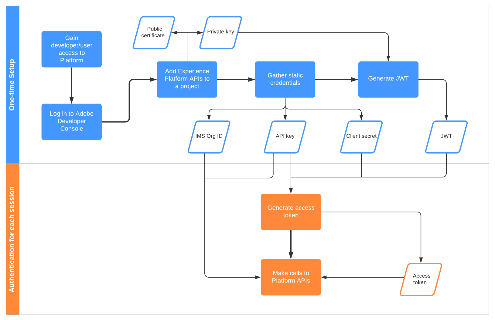

## Prerequisites {#prerequisites}

In order to successfully make calls to Experience Platform APIs, you must have the following:

* An organization with access to Adobe Experience Platform.
* An Admin Console administrator that is able to add you as a developer and a user for a product profile.

You must also have an Adobe ID to complete this tutorial. If you do not have an Adobe ID, you can create one using the following steps:

1. Go to [Adobe Developer Console](https://console.adobe.io).
2. Select **[!UICONTROL Create a new account]**.
3. Complete the sign-up process.

## Gain developer and user access for Experience Platform {#gain-developer-user-access}

Before creating integrations on Adobe Developer Console, your account must have developer and user permissions for an Experience Platform product profile in Adobe Admin Console.

### Gain developer access {#gain-developer-access}

Contact an [!DNL Admin Console] administrator in your organization to add you as a developer to an Experience Platform product profile using the [[!DNL Admin Console]](https://adminconsole.adobe.com/). See the [!DNL Admin Console] documentation for specific instructions on how to [manage developer access for product profiles](https://helpx.adobe.com/enterprise/admin-guide.html/enterprise/using/manage-developers.ug.html).

Once you are assigned as a developer, you can start creating integrations in [Adobe Developer Console](https://www.adobe.com/go/devs_console_ui). These integrations are a pipeline from external apps and services to Adobe APIs.

### Gain user access {#gain-user-access}

Your [!DNL Admin Console] administrator must also add you as a user to the same product profile. See the guide on [managing user groups in [!DNL Admin Console]](https://helpx.adobe.com/enterprise/admin-guide.html/enterprise/using/user-groups.ug.html) for more information.

## Generate an API key (client ID) and organization ID {#generate-credentials}

>[!NOTE]
>
>If you are following this document from the [Privacy Service API guide](../privacy-service/api/getting-started.md), you can now return to that guide to generate the access credentials unique to [!DNL Privacy Service].

After you have been given developer and user access to Platform through [!DNL Admin Console], the next step is to generate your `{ORG_ID}` and `{API_KEY}` credentials in Adobe Developer Console. These credentials only need to be generated once and can be reused in future Platform API calls.

### Add Experience Platform to a project {#add-platform-to-project}

Go to [Adobe Developer Console](https://www.adobe.com/go/devs_console_ui) and sign in with your Adobe ID. Next, follow the steps outlined in the tutorial on [creating an empty project](https://developer.adobe.com/developer-console/docs/guides/projects/projects-empty/) in the Adobe Developer Console documentation.

Once you have created a new project, select **[!UICONTROL Add API]** on the **[!UICONTROL Project Overview]** screen.

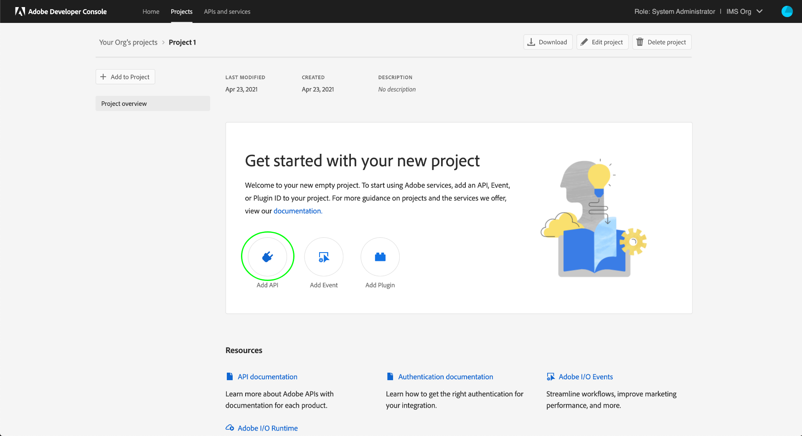

The **[!UICONTROL Add an API]** screen appears. Select the product icon for Adobe Experience Platform, then choose **[!UICONTROL Experience Platform API]** before selecting **[!UICONTROL Next]**.

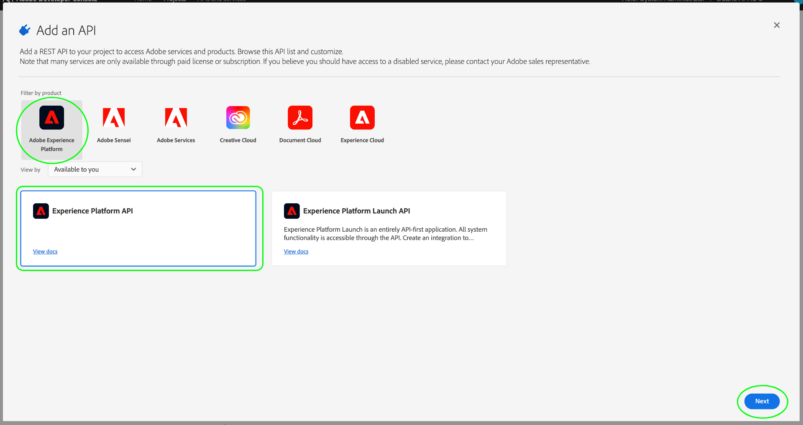

>[!TIP]
>
>Select the **[!UICONTROL View docs]** option to navigate in a separate browser window to the complete [Experience Platform API reference documentation](https://developer.adobe.com/experience-platform-apis/).

Next, select the authentication type to generate access tokens and access the Experience Platform API.

>[!IMPORTANT]
>
>Select the OAuth Server-to-Server method as this is the only method supported moving forward. The Service Account (JWT) method is deprecated. Get more information in the section [(DEPRECATED) Generate a JSON Web Token (JWT)](#jwt).
>Select the OAuth Server-to-Server method as this is the only method supported moving forward.

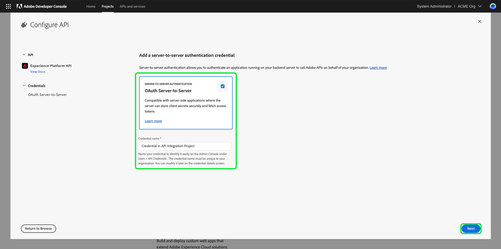

<!--

From here, follow the steps outlined in the tutorial on [adding an API to a project using a service account (JWT)](https://www.adobe.io/apis/experienceplatform/console/docs.html#!AdobeDocs/adobeio-console/master/services-add-api-jwt.md) (starting from the "Configure API" step) to finish the process.

>[!IMPORTANT]
>
>At this point, the tutorial linked to instructions how to get an access token by using the JWT mechanism. This option is now deprecated and all new integrations must be created using the OAuth mechanism. Read the following important documentation:
> 
> * [Migration guide for your applications from JWT to OAuth](https://developer.adobe.com/developer-console/docs/guides/authentication/ServerToServerAuthentication/migration/)
> [Implementation guide for new and old applications with OAuth](https://developer.adobe.com/developer-console/docs/guides/authentication/ServerToServerAuthentication/implementation/)

-->

Next, select the product profiles that should apply to your integration.
Your integration's service account will gain access to granular features through the product profiles selected here.

>[!TIP]
>
>If you are expecting to see a certain product profile here, contact your system administrator. System administrators can view and manage API credentials in the Permissions view. For more information, refer to the section [Add developers to product profile](#add-developers-to-product-profile).

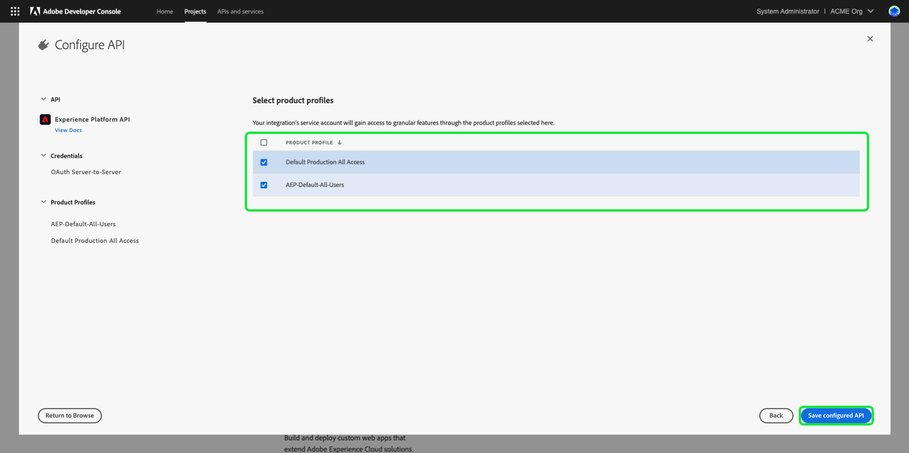

Select **Save configured API** when you are ready.

Next, select the product profiles that should apply to your integration.
Your integration's service account will gain access to granular features through the product profiles selected here.

>[!TIP]
>
>If you are expecting but cannot see a certain product profile here, contact your system administrator. System administrators can view and manage API credentials in the Permissions view. For more information, refer to the section [Add developers to product profile](#add-developers-to-product-profile).


Select **Save configured API** when you are ready.

### Gather credentials {#gather-credentials}

Once the API has been added to the project, the **[!UICONTROL Experience Platform API]** page for the project displays the following credentials that are required in all calls to Experience Platform APIs:

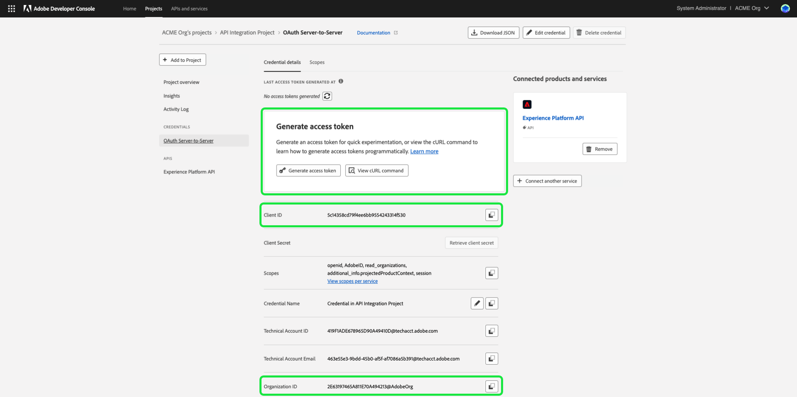

* `{API_KEY}` ([!UICONTROL Client ID])
* `{ORG_ID}` ([!UICONTROL Organization ID])

<!--

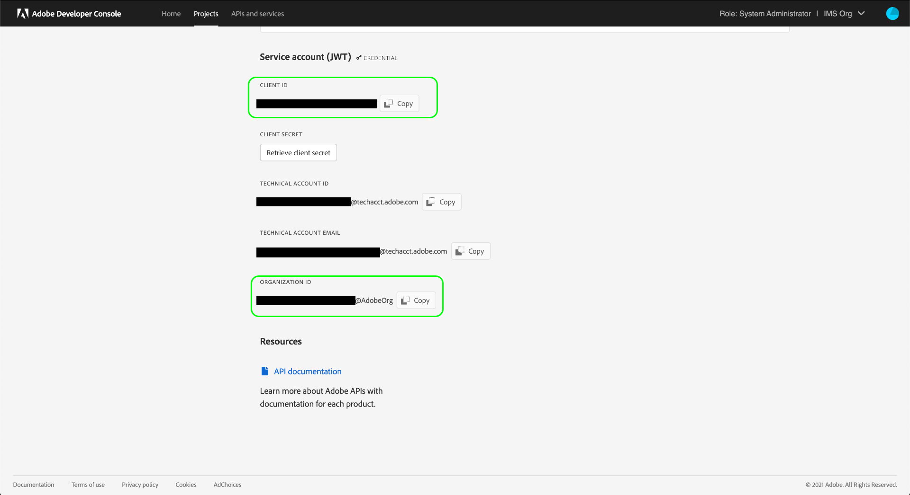

<!--

In addition to the above credentials, you also need the generated **[!UICONTROL Client Secret]** for a future step. Select **[!UICONTROL Retrieve client secret]** to reveal the value, and then copy it for later use.

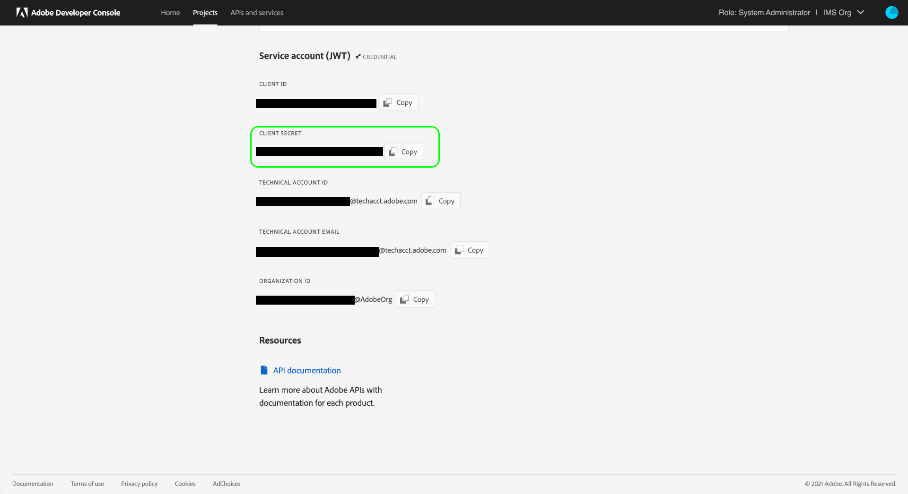

-->

## Generate an access token {#generate-access-token}

The next step is to generate an `{ACCESS_TOKEN}` credential for use in Platform API calls. Unlike the values for `{API_KEY}` and `{ORG_ID}`, a new token must be generated every 24 hours to continue using Platform APIs. Select **[!UICONTROL Generate access token]**, as shown below.

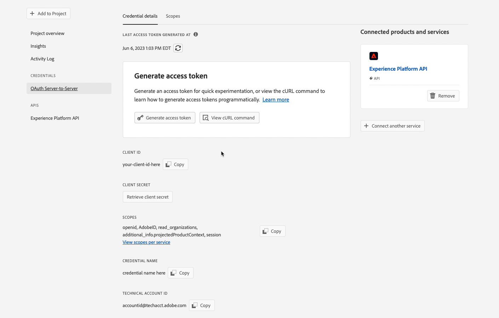

## (DEPRECATED) Generate a JSON Web Token (JWT) {#jwt}

>[!WARNING]
>
>The JWT method to generate access tokens has been deprecated. All new integrations must be created using the OAuth method. Adobe also recommends that you migrate your existing integrations to the OAuth method. Read the following important documentation:
> 
> * [Migration guide for your applications from JWT to OAuth](https://developer.adobe.com/developer-console/docs/guides/authentication/ServerToServerAuthentication/migration/)
>* [Implementation guide for new and old applications with OAuth](https://developer.adobe.com/developer-console/docs/guides/authentication/ServerToServerAuthentication/implementation/)
>* [Advantages of using the OAuth Server-to-Server credentials method](https://developer.adobe.com/developer-console/docs/guides/authentication/ServerToServerAuthentication/migration/#why-oauth-server-to-server-credentials)

+++ View deprecated information 

The next step is to generate a JSON Web Token (JWT) based on your account credentials. This value is used to generate your `{ACCESS_TOKEN}` credential for use in Platform API calls, which must be regenerated every 24 hours.

>[!IMPORTANT]
>
>For the purposes of this tutorial, the steps below outline how to generate a JWT within Developer Console. However, this generation method should only be used for testing and evaluation purposes.
>
>For regular use, the JWT must be generated automatically. For more information on how to programmatically generate JWTs, see the [service account authentication guide](https://www.adobe.io/developer-console/docs/guides/authentication/JWT/) on Adobe Developer.

Select **[!UICONTROL Service Account (JWT)]** in the left navigation, then select **[!UICONTROL Generate JWT]**.

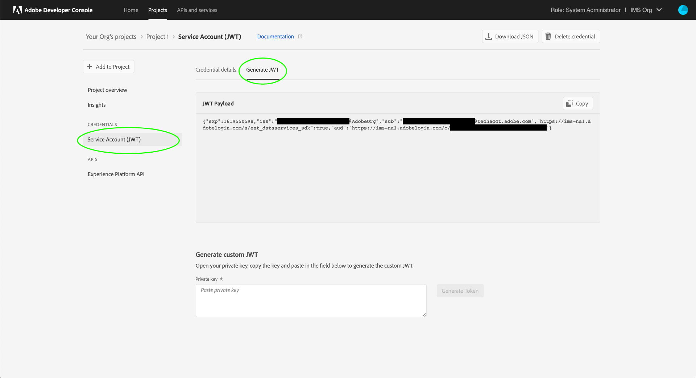

In the textbox provided under **[!UICONTROL Generate custom JWT]**, paste the contents of the private key that you previously generated when adding the Platform API to your service account. Then, select **[!UICONTROL Generate Token]**.

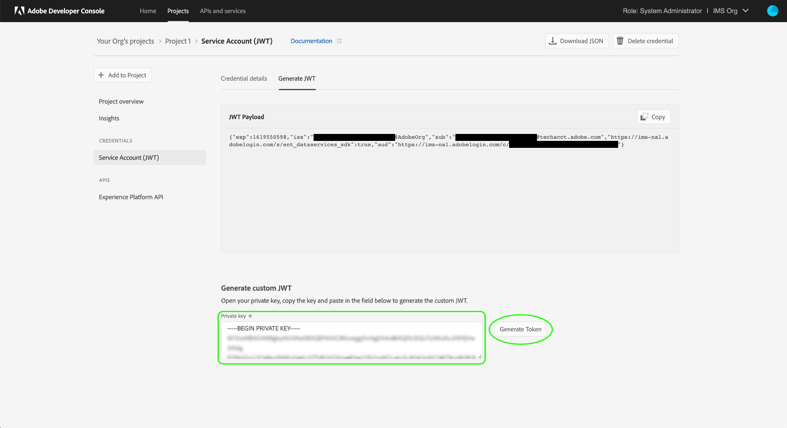

The page updates to show the generated JWT, along with a sample cURL command that allows you to generate an access token. For the purposes of this tutorial, select **[!UICONTROL Copy]** next to **[!UICONTROL Generated JWT]** to copy the token to your clipboard.

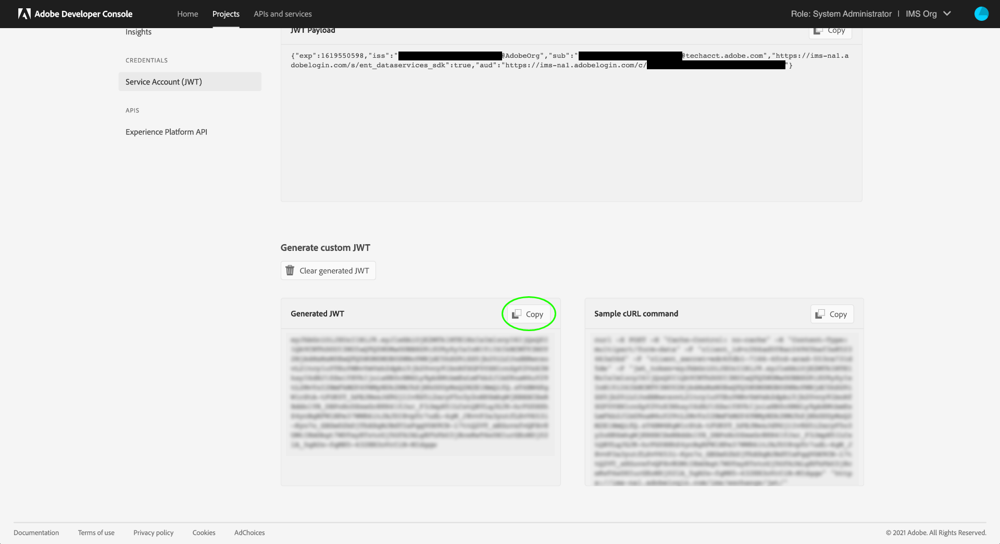

**Generate an access token**

Once you have generated a JWT, you can use it in an API call to generate your `{ACCESS_TOKEN}`. Unlike the values for `{API_KEY}` and `{ORG_ID}`, a new token must be generated every 24 hours to continue using Platform APIs.

**Request**

The following request generates a new `{ACCESS_TOKEN}` based on the credentials provided in the payload. This endpoint only accepts form data as its payload, and therefore it must be given a `Content-Type` header of `multipart/form-data`.

```shell
curl -X POST https://ims-na1.adobelogin.com/ims/exchange/jwt \
  -H 'Content-Type: multipart/form-data' \
  -F 'client_id={API_KEY}' \
  -F 'client_secret={SECRET}' \
  -F 'jwt_token={JWT}'
```

| Property | Description |
| --- | --- |
| `{API_KEY}` | The `{API_KEY}` ([!UICONTROL Client ID]) that you retrieved in a [previous step](#api-ims-secret). |
| `{SECRET}` | The client secret that you retrieved in a [previous step](#api-ims-secret). |
| `{JWT}` | The JWT that you generated in a [previous step](#jwt). |

>[!NOTE]
>
>You can use the same API key, client secret, and JWT to generate a new access token for each session. This allows you to automate access token generation in your applications.

**Response**

```json
{
  "token_type": "bearer",
  "access_token": "{ACCESS_TOKEN}",
  "expires_in": 86399992
}
```

| Property | Description |
| --- | --- |
| `token_type` | The type of token being returned. For access tokens, this value is always `bearer`. |
| `access_token` | The generated `{ACCESS_TOKEN}`. This value, prefixed with the word `Bearer`, is required as the `Authentication` header for all Platform API calls. |
| `expires_in` | The number of milliseconds remaining until the access token expires. Once this value reaches 0, a new access token must be generated to continue using Platform APIs. |

+++

## Test access credentials {#test-credentials}

Once you have gathered all three required credentials - access token, API key, and Organization ID - , you can try to make the following API call. This call lists all standard [!DNL Experience Data Model] (XDM) classes available to your organization. Import and execute the call in [Postman](#use-postman).

>[!BEGINSHADEBOX]

**Request**

```SHELL
curl -X GET https://platform.adobe.io/data/foundation/schemaregistry/global/classes \
  -H 'Accept: application/vnd.adobe.xed-id+json' \
  -H 'Authorization: Bearer {{ACCESS_TOKEN}}' \
  -H 'x-api-key: {{API_KEY}}' \
  -H 'x-gw-ims-org-id: {{IMS_ORG}}'
```

**Response**

If your response is similar to the one shown below, then your credentials are valid and working. (This response has been truncated for space.)

```JSON
{
  "results": [
    {
        "title": "XDM ExperienceEvent",
        "$id": "https://ns.adobe.com/xdm/context/experienceevent",
        "meta:altId": "_xdm.context.experienceevent",
        "version": "1"
    },
    {
        "title": "XDM Individual Profile",
        "$id": "https://ns.adobe.com/xdm/context/profile",
        "meta:altId": "_xdm.context.profile",
        "version": "1"
    }
  ]
}
```

>[!ENDSHADEBOX]

>[!IMPORTANT]
>
>While the call above is sufficient to test your access credentials, be aware that you will not be able to access or modify several resources without having the right Attribute-based access control permissions. Read more in th section [Get the necessary Attribute-based access control permissions](#get-abac-permissions).

## Use Postman to authenticate and test API calls {#use-postman}

[Postman](https://www.postman.com/) is a popular tool that allows developers to explore and test RESTful APIs.

<!--
This [Medium post](https://medium.com/adobetech/using-postman-for-jwt-authentication-on-adobe-i-o-7573428ffe7f) describes how you can set up Postman to automatically perform JWT authentication and use it to consume Platform APIs.
-->

## Get the necessary Attribute-based access control permissions {#get-abac-permissions}

To access or modify several resources within Experience Platform, you must have the appropriate access control permissions. Administrators can grant you the [permissions you need](/help/access-control/ui/permissions.md). 

## Use pre-configured Postman environments to speed up your work

You can download and import preconfigured environments into Postman. This way, you do not need to manually update your header values for every API call that you make. To import and use Postman environments: 

1. In Developer console, navigate to APIs > Experience Platform API
  
2. In Postman, import the environment as shown below and set it as default environment in the dropdown selector:
  

## System administrators: Grant developer and API access control with Experience Platform permissions

>[!NOTE]
>
>Only system administrators have the ability to view and manage API credentials in Permissions.

Before creating integrations on Adobe Developer Console, your account must have developer and user permissions for an Experience Platform product profile in Adobe Admin Console.

### Add developers to product profile {#add-developers-to-product-profile}

Go to [[!DNL Admin Console]](https://adminconsole.adobe.com/) and sign in with your Adobe ID.

Select **[!UICONTROL Products]**, then select **[!UICONTROL Adobe Experience Platform]** from the list of products.

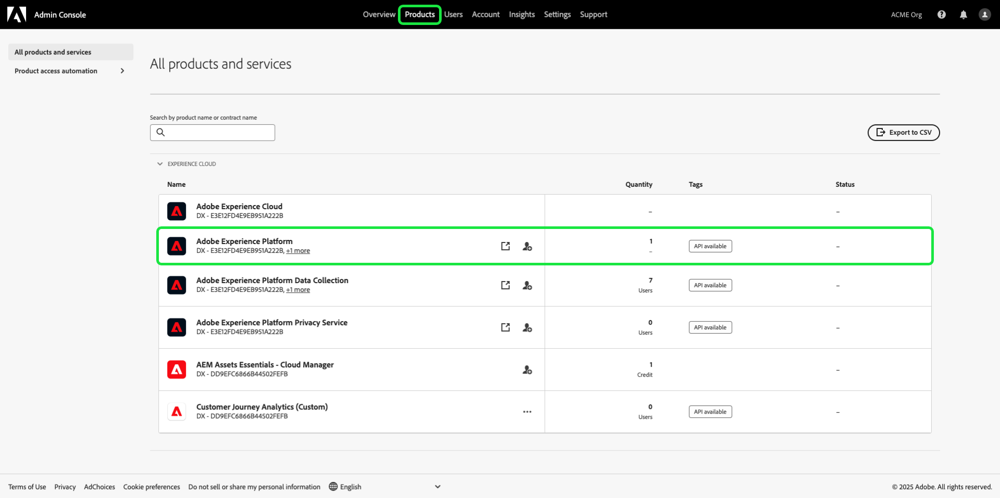

From the **[!UICONTROL Product Profiles]** tab, select **[!UICONTROL AEP-Default-All-Users]**. Alternatively, use the search bar to search for the product profile by entering the name.

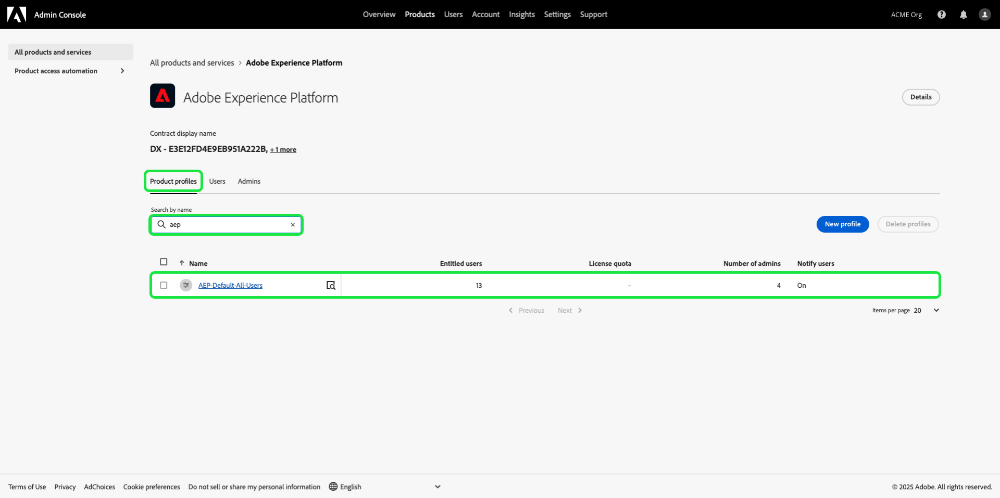

Select the **[!UICONTROL Developers]** tab, then select **[!UICONTROL Add Developer]**.

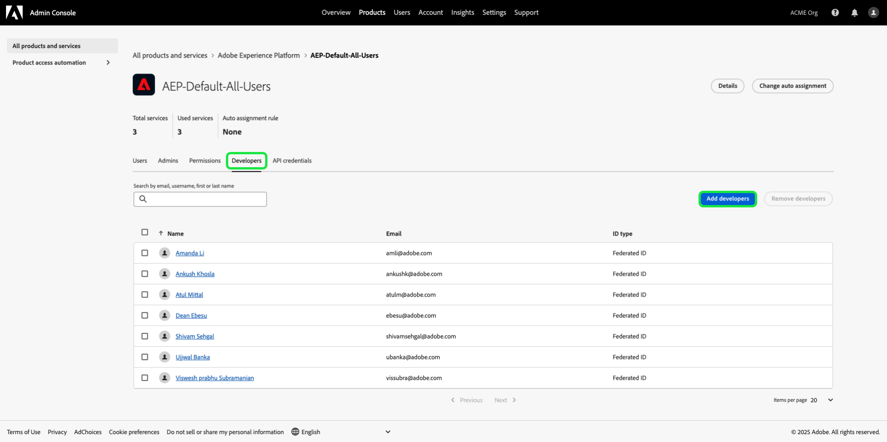

Enter the developer's **[!UICONTROL Email or username]**. A valid [!UICONTROL Email or username] will display the developer details. Select **[!UICONTROL Save]**.

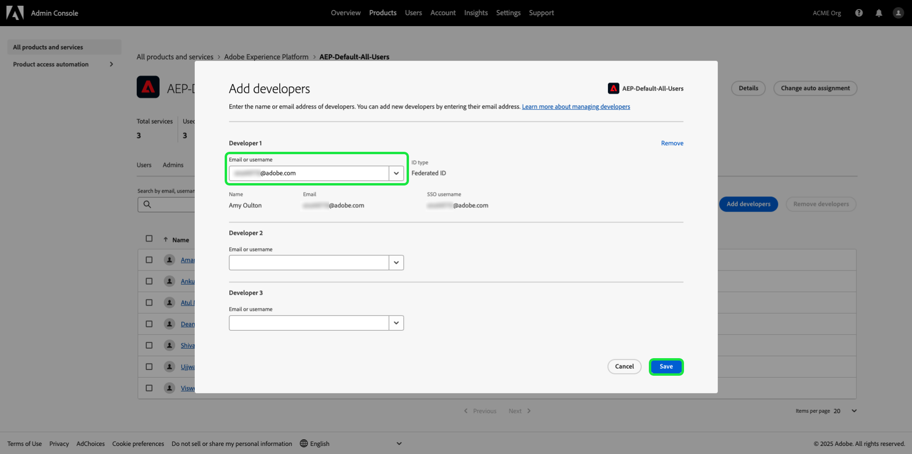

The developer has been successfully added and appears on the [!UICONTROL Developers] tab.

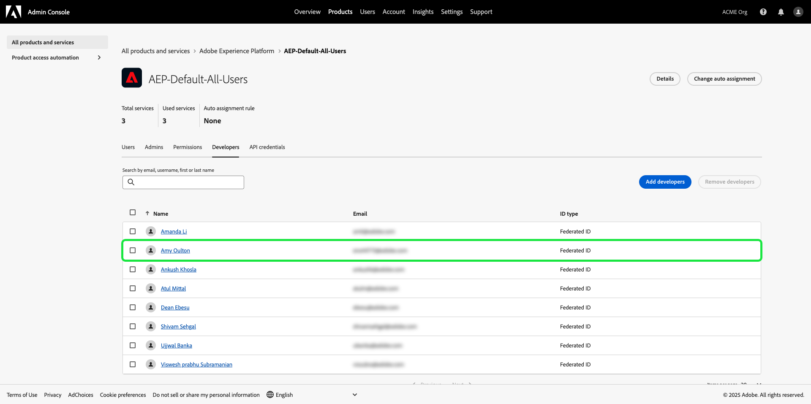

### Set up an API

A developer can add and configure an API within a project in the Adobe Developer Console.

Select your project, then select **[!UICONTROL Add API]**.


In the **[!UICONTROL Add an API]** dialog box select **[!UICONTROL Adobe Experience Platform]**, then select **[!UICONTROL Experience Platform API]**.

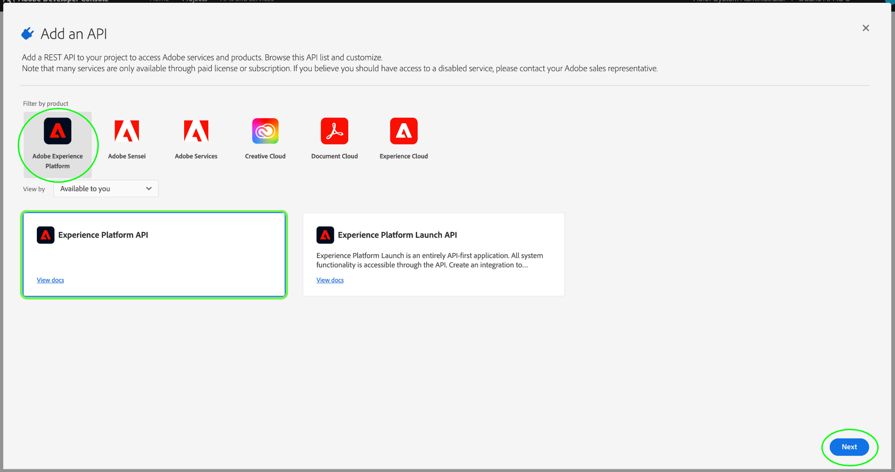

In the **[!UICONTROL Configure API]** screen, select **[!UICONTROL AEP-Default-All-Users]**.

### Assign API to a role

A system admin can assign APIs to roles in the Experience Platform UI.

Select **[!UICONTROL Permissions]** and the role you want to add the API to. Select the **[!UICONTROL API credentials]** tab, then select **[!UICONTROL Add API credentials]**.

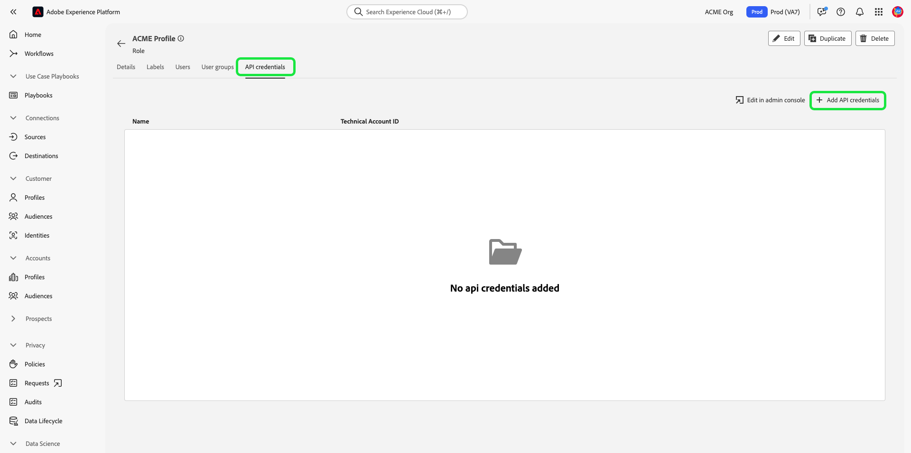

Select the API you would like to add to the role then select **[!UICONTROL Save]**.

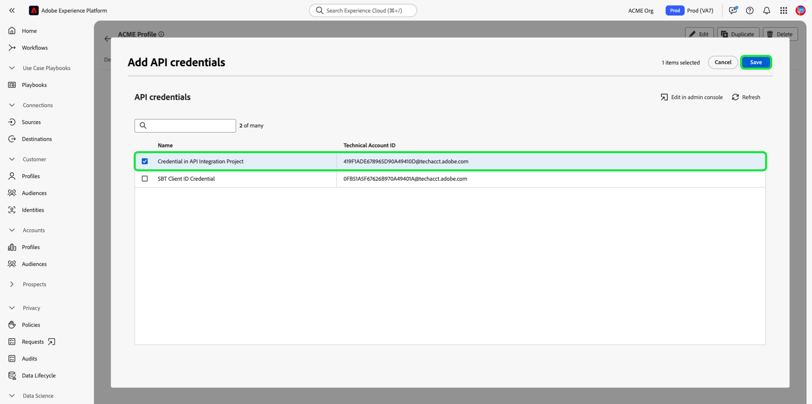

You are returned to the [!UICONTROL API credentials] tab, where the newly added API is listed.

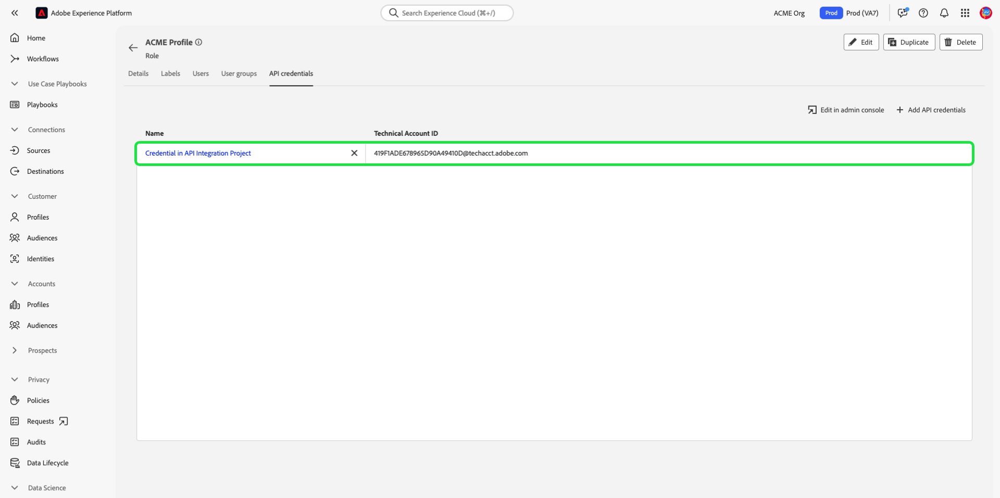

## Next steps

By reading this document, you have gathered and successfully tested your access credentials for Platform APIs. You can now follow along with the example API calls provided throughout the [documentation](../landing/documentation/overview.md).

In addition to the authentication values you have gathered in this tutorial, many Platform APIs also require a valid `{SANDBOX_NAME}` to be provided as a header. See the [sandboxes overview](../sandboxes/home.md) for more information.