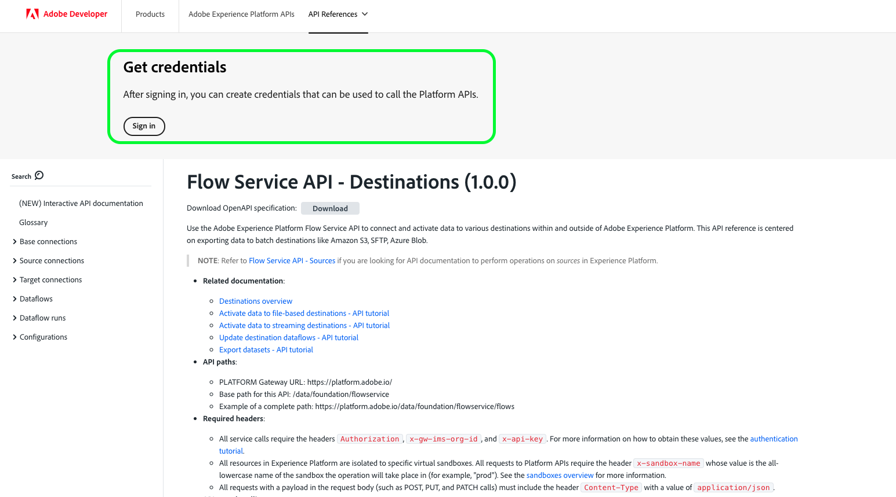
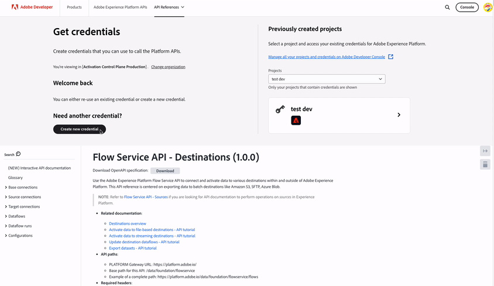
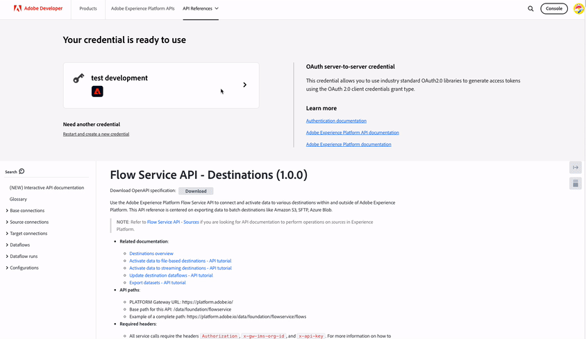

# Authenticate and access Experience Platform APIs

This document provides a step-by-step tutorial for gaining access to an Adobe Experience Platform developer account in order to make calls to Experience Platform APIs. At the end of this tutorial, you will have generated or collected the following credentials that are required as headers in all Experience Platform API calls:

* `{ACCESS_TOKEN}`
* `{API_KEY}`
* `{ORG_ID}`

>[!TIP]
>
>In addition to the three credentials above, many Experience Platform APIs also require a valid `{SANDBOX_NAME}` to be provided as a header. See the [sandboxes overview](../sandboxes/home.md) for more information about sandboxes and the [sandbox management endpoint](/help/sandboxes/api/sandboxes.md#list) documentation for information about listing the sandboxes available to your organization.

To maintain the security of your applications and users, all requests to Experience Platform APIs must be authenticated and authorized using standards such as OAuth.

This tutorial covers how to gather the required credentials to authenticate Experience Platform API calls, as outlined in the flowchart below. You can gather most of the required credentials in the initial one-time setup. The access token, however, must be refreshed every 24-hours.


## Prerequisites {#prerequisites}

In order to successfully make calls to Experience Platform APIs, you must have the following:

* An organization with access to Adobe Experience Platform.
* An Admin Console administrator that is able to add you as a developer and a user for a product profile.
* An Experience Platform system administrator who can grant you the necessary attribute based access controls to perform read or write operations on different parts of Experience Platform through APIs.

You must also have an Adobe ID to complete this tutorial. If you do not have an Adobe ID, you can create one using the following steps:

1. Go to [Adobe Developer Console](https://console.adobe.io).
2. Select **[!UICONTROL Create a new account]**.
3. Complete the sign-up process.

## Gain developer and user access for Experience Platform {#gain-developer-user-access}

Before creating integrations on Adobe Developer Console, your account must have developer and user permissions for an Experience Platform product profile in Adobe Admin Console.

### Gain developer access {#gain-developer-access}

Contact an Admin Console administrator in your organization to add you as a developer to an Experience Platform product profile. See the Admin Console documentation for specific instructions on how to [manage developer access for product profiles](https://helpx.adobe.com/enterprise/admin-guide.html/enterprise/using/manage-developers.ug.html).

Once you are assigned as a developer, you can start creating integrations in [Adobe Developer Console](https://www.adobe.com/go/devs_console_ui). These integrations are a pipeline from external apps and services to Adobe APIs.

### Gain user access {#gain-user-access}

Your Admin Console administrator must also add you as a user to the same product profile. With user access, you can see in the UI the outcome of the API operations that you perform. 

See the guide on [managing user groups in Admin Console](https://helpx.adobe.com/enterprise/admin-guide.html/enterprise/using/user-groups.ug.html) for more information.

## Generate an API key (client ID) and organization ID {#generate-credentials}

>[!NOTE]
>
>If you are following this document from the [Privacy Service API guide](../privacy-service/api/getting-started.md), you can now return to that guide to generate the access credentials unique to [!DNL Privacy Service].

After you have been given developer and user access to Platform through Admin Console, the next step is to generate your `{ORG_ID}` and `{API_KEY}` credentials in Adobe Developer Console. These credentials only need to be generated once and can be reused in future Experience Platform API calls.

>[!TIP]
>
>Instead of going to Developer Console, you can get all the authentication credentials that you need to work with Experience Platform APIs directly from the API reference documentation pages. [Read more](#get-credentials-functionality) about the functionality.

### Add Experience Platform to a project {#add-platform-to-project}

Go to [Adobe Developer Console](https://www.adobe.com/go/devs_console_ui) and sign in with your Adobe ID. Next, follow the steps outlined in the tutorial on [creating an empty project](https://developer.adobe.com/developer-console/docs/guides/projects/projects-empty/) in the Adobe Developer Console documentation.

Once you have created a new project, select **[!UICONTROL Add API]** on the **[!UICONTROL Project Overview]** screen.

>[!TIP]
>
>If you are provisioned for several organizations, use the organization selector in the upper right corner of the interface to make sure that you are in the organization you need.


The **[!UICONTROL Add an API]** screen appears. Select the product icon for **[!UICONTROL Adobe Experience Platform]**, then choose **[!UICONTROL Experience Platform API]** before selecting **[!UICONTROL Next]**.


>[!TIP]
>
>Select the **[!UICONTROL View docs]** option to navigate in a separate browser window to the complete [Experience Platform API reference documentation](https://developer.adobe.com/experience-platform-apis/).

### Select the [!UICONTROL OAuth Server-to-Server] authentication type {#select-oauth-server-to-server}

Next, select the **[!UICONTROL OAuth Server-to-Server]** authentication type to generate access tokens and access the Experience Platform API. Give your credential a meaningful name in the **[!UICONTROL Credential name]** text field before selecting **[!UICONTROL Next]**.

>[!IMPORTANT]
>
>The **[!UICONTROL OAuth Server-to-Server]** method is the only token generation method supported moving forward. The formerly supported **[!UICONTROL Service Account (JWT)]** method is deprecated and cannot be selected for new integrations. While existing integrations using the JWT authentication method will continue to work until June 30th, 2025, Adobe strongly recommends that you migrate existing integrations to the new [!UICONTROL OAuth Server-to-Server] method before that date. Get more information in the section [!BADGE Deprecated]{type=negative} [Generate a JSON Web Token (JWT)](#jwt).


### Select the product profiles for your integration {#select-product-profiles}

In the **[!UICONTROL Configure API]** screen, select **[!UICONTROL AEP-Default-All-Users]** along with any additional product profiles you wish to gain access to.

>[!IMPORTANT]
>
>To get access to certain features in Platform, you also need a system administrator to grant you the necessary attribute-based access control permissions. Read more in the section [Get the necessary attribute-based access control permissions](#get-abac-permissions).


Select **[!UICONTROL Save configured API]** when you are ready.

A walkthrough of the steps described above to set up an integration with the Experience Platform API is also available in the video tutorial below:

>[!VIDEO](https://video.tv.adobe.com/v/28832/?learn=on)

### Gather credentials {#gather-credentials}

Once the API has been added to the project, the **[!UICONTROL OAuth Server-to-Server]** page for the project displays the following credentials that are required in all calls to Experience Platform APIs:


* `{API_KEY}` ([!UICONTROL Client ID])
* `{ORG_ID}` ([!UICONTROL Organization ID])

<!--


<!--

In addition to the above credentials, you also need the generated **[!UICONTROL Client Secret]** for a future step. Select **[!UICONTROL Retrieve client secret]** to reveal the value, and then copy it for later use.


-->

## Generate an access token {#generate-access-token}

The next step is to generate an `{ACCESS_TOKEN}` credential for use in Experience Platform API calls. Unlike the values for `{API_KEY}` and `{ORG_ID}`, a new token must be generated every 24 hours to continue using Experience Platform APIs. Select **[!UICONTROL Generate access token]** which produces your access token, as shown below.


>[!TIP]
>
>You can also use a Postman environment and collection to generate access tokens. For more information, read the section about [using Postman to authenticate and test API calls](#use-postman).

## Create and retrieve authentication credentials directly in the API reference documentation {#get-credentials-functionality}

Starting with the November 2024 release of Experience Platform, you can get credentials to use the Experience Platform APIs directly from the API reference pages, without needing to go to [!UICONTROL Developer Console]. View the example below from the [Flow Service API - Destinations page](https://developer.adobe.com/experience-platform-apis/references/destinations/).



To get credentials to call Experience Platform APIs, navigate to any Experience Platform API reference page and select **[!UICONTROL Sign in]** at the top of the page. Sign in with your **[!UICONTROL Personal Account]** or **[!UICONTROL Company or School Account]**.  

After signing in, select **[!UICONTROL Create new credential]** to create a new set of credentials to access Experience Platform APIs. 



Next, use the dropdown selector to open the credentials window, generate an access token, and get your API key and organization ID. Copy the credentials into the [**[!UICONTROL Try it]**](/help/release-notes/2024/may-2024.md#interactive-api-documentation) blocks on the API reference pages to start working with Experience Platform APIs.



>[!TIP]
>
>The top-of-page credentials block remains displayed as you navigate between different endpoint pages in the Experience Platform API reference documentation.

## [!BADGE Deprecated]{type=negative} Generate a JSON Web Token (JWT) {#jwt}

>[!WARNING]
>
>The JWT method to generate access tokens has been deprecated. All new integrations must be created using the [OAuth Server-to-Server authentication method](#select-oauth-server-to-server). Adobe also requires that you migrate your existing integrations to the OAuth method by June 30th, 2025 for your integrations to continue to work. Read the following important documentation:
> 
> * [Migration guide for your applications from JWT to OAuth](https://developer.adobe.com/developer-console/docs/guides/authentication/ServerToServerAuthentication/migration/)
> * [Implementation guide for new and old applications with OAuth](https://developer.adobe.com/developer-console/docs/guides/authentication/ServerToServerAuthentication/implementation/)
> * [Advantages of using the OAuth Server-to-Server credentials method](https://developer.adobe.com/developer-console/docs/guides/authentication/ServerToServerAuthentication/migration/#why-oauth-server-to-server-credentials)

+++ View deprecated information 

The next step is to generate a JSON Web Token (JWT) based on your account credentials. This value is used to generate your `{ACCESS_TOKEN}` credential for use in Experience Platform API calls, which must be regenerated every 24 hours.

>[!IMPORTANT]
>
>For the purposes of this tutorial, the steps below outline how to generate a JWT within Developer Console. However, this generation method should only be used for testing and evaluation purposes.
>
>For regular use, the JWT must be generated automatically. For more information on how to programmatically generate JWTs, see the [service account authentication guide](https://www.adobe.io/developer-console/docs/guides/authentication/JWT/) on Adobe Developer.

Select **[!UICONTROL Service Account (JWT)]** in the left navigation, then select **[!UICONTROL Generate JWT]**.


In the textbox provided under **[!UICONTROL Generate custom JWT]**, paste the contents of the private key that you previously generated when adding the Experience Platform API to your service account. Then, select **[!UICONTROL Generate Token]**.


The page updates to show the generated JWT, along with a sample cURL command that allows you to generate an access token. For the purposes of this tutorial, select **[!UICONTROL Copy]** next to **[!UICONTROL Generated JWT]** to copy the token to your clipboard.


**Generate an access token**

Once you have generated a JWT, you can use it in an API call to generate your `{ACCESS_TOKEN}`. Unlike the values for `{API_KEY}` and `{ORG_ID}`, a new token must be generated every 24 hours to continue using Experience Platform APIs.

**Request**

The following request generates a new `{ACCESS_TOKEN}` based on the credentials provided in the payload. This endpoint only accepts form data as its payload, and therefore it must be given a `Content-Type` header of `multipart/form-data`.

```shell
curl -X POST https://ims-na1.adobelogin.com/ims/exchange/jwt \
  -H 'Content-Type: multipart/form-data' \
  -F 'client_id={API_KEY}' \
  -F 'client_secret={SECRET}' \
  -F 'jwt_token={JWT}'
```

| Property | Description |
| --- | --- |
| `{API_KEY}` | The `{API_KEY}` ([!UICONTROL Client ID]) that you retrieved in a [previous step](#api-ims-secret). |
| `{SECRET}` | The client secret that you retrieved in a [previous step](#api-ims-secret). |
| `{JWT}` | The JWT that you generated in a [previous step](#jwt). |

>[!NOTE]
>
>You can use the same API key, client secret, and JWT to generate a new access token for each session. This allows you to automate access token generation in your applications.

**Response**

```json
{
  "token_type": "bearer",
  "access_token": "{ACCESS_TOKEN}",
  "expires_in": 86399992
}
```

| Property | Description |
| --- | --- |
| `token_type` | The type of token being returned. For access tokens, this value is always `bearer`. |
| `access_token` | The generated `{ACCESS_TOKEN}`. This value, prefixed with the word `Bearer`, is required as the `Authentication` header for all Experience Platform API calls. |
| `expires_in` | The number of milliseconds remaining until the access token expires. Once this value reaches 0, a new access token must be generated to continue using Experience Platform APIs. |

+++

## Test access credentials {#test-credentials}

Once you have gathered all three required credentials - access token, API key, and Organization ID - , you can try to make the following API call. This call lists all standard [!DNL Experience Data Model] (XDM) classes available to your organization. Import and execute the call in [Postman](#use-postman).

>[!BEGINSHADEBOX]

**Request**

```SHELL
curl -X GET https://platform.adobe.io/data/foundation/schemaregistry/global/classes \
  -H 'Accept: application/vnd.adobe.xed-id+json' \
  -H 'Authorization: Bearer {{ACCESS_TOKEN}}' \
  -H 'x-api-key: {{API_KEY}}' \
  -H 'x-gw-ims-org-id: {{ORG_ID}}'
```

**Response**

If your response is similar to the one shown below, then your credentials are valid and working. (This response has been truncated for space.)

```JSON
{
  "results": [
    {
        "title": "XDM ExperienceEvent",
        "$id": "https://ns.adobe.com/xdm/context/experienceevent",
        "meta:altId": "_xdm.context.experienceevent",
        "version": "1"
    },
    {
        "title": "XDM Individual Profile",
        "$id": "https://ns.adobe.com/xdm/context/profile",
        "meta:altId": "_xdm.context.profile",
        "version": "1"
    }
  ]
}
```

>[!ENDSHADEBOX]

>[!IMPORTANT]
>
>While the call above is sufficient to test your access credentials, be aware that you will not be able to access or modify several resources without having the right attribute-based access control permissions. Read more in the **Get the necessary attribute-based access control permissions** section below.

## Get the necessary attribute-based access control permissions {#get-abac-permissions}

To access or modify several resources within Experience Platform, you must have the appropriate access control permissions. System administrators can grant you the [permissions you need](/help/access-control/ui/permissions.md). Get more information in the section about [managing API credentials for a role](/help/access-control/abac/ui/permissions.md#manage-api-credentials-for-role).

Detailed information about how a system administrator can grant the required permissions to access Platform resources through the API is also available in the video tutorial below:

>[!VIDEO](https://video.tv.adobe.com/v/28832/?learn=on&t=159)

## Use Postman to authenticate and test API calls {#use-postman}

[Postman](https://www.postman.com/) is a popular tool that allows developers to explore and test RESTful APIs. You can use Experience Platform Postman collections and environments to speed up your work with Experience Platform APIs. Read more about [using Postman in Experience Platform](/help/landing/postman.md) and getting started with collections and environments.

Detailed information about using Postman with Experience Platform collections and environments is also available in the video tutorials below:

**Download and import a Postman environment to use with Experience Platform APIs**

>[!VIDEO](https://video.tv.adobe.com/v/28832/?learn=on&t=106)

**Use a Postman collection to generate access tokens**

Download the [Identity Management Service Postman collection](https://github.com/adobe/experience-platform-postman-samples/tree/master/apis/ims) and watch the video below to learn how to generate access tokens.

>[!VIDEO](https://video.tv.adobe.com/v/29698/?learn=on)

**Download Experience Platform API Postman collections and interact with the APIs**

>[!VIDEO](https://video.tv.adobe.com/v/29704/?learn=on)

<!--
This [Medium post](https://medium.com/adobetech/using-postman-for-jwt-authentication-on-adobe-i-o-7573428ffe7f) describes how you can set up Postman to automatically perform JWT authentication and use it to consume Experience Platform APIs.
-->

## System administrators: Grant developer and API access control with Experience Platform permissions {#grant-developer-and-api-access-control}

Before you can create integrations on Adobe Developer Console, your account must have developer and user permissions for an Experience Platform product profile.

>[!NOTE]
>
>Only system administrators have the ability to view and manage API credentials in Permissions.

### Add developers to product profile {#add-developers-to-product-profile}

Navigate to the [Admin Console](https://adminconsole.adobe.com/) and sign in with your Adobe ID.

Select **[!UICONTROL Products]** from the navigation bar and then select **[!UICONTROL Adobe Experience Platform]** from the list of products.


From the **[!UICONTROL Product Profiles]** tab, select **[!UICONTROL AEP-Default-All-Users]**. Alternatively, use the search bar to search for the product profile by entering the name.


Select the **[!UICONTROL Developers]** tab, then select **[!UICONTROL Add Developer]**.


The **[!UICONTROL Add developers]** dialog appears. Enter the developer's **[!UICONTROL Email or username]**. A valid [!UICONTROL Email or username] displays the developer details. Select **[!UICONTROL Save]**.


The developer has been successfully added and appears on the **[!UICONTROL Developers]** tab.


### Assign API credentials to a role

>[!NOTE]
>
> Only a system administrator can assign APIs to roles in the Experience Platform UI.

To use and perform operations on Experience Platform APIs, a system administrator needs to add the API credentials in addition to a role's given set of permissions. Get more information in the section about [managing API credentials for a role](../access-control/abac/ui/permissions.md#manage-api-credentials-for-a-role).

A walkthrough of the steps described above for adding developers to product profiles and assigning APIs to roles is also available in the video tutorial below:

>[!VIDEO](https://video.tv.adobe.com/v/3426407/?learn=on)

## Additional resources {#additional-resources}

Refer to the additional resources linked below for further help getting started with Experience Platform APIs

* [Authenticate and access Experience Platform APIs](https://experienceleague.adobe.com/docs/platform-learn/tutorials/platform-api-authentication.html) video tutorials page
* [Identity Management Service Postman Collection](https://github.com/adobe/experience-platform-postman-samples/tree/master/apis/ims) for generating access tokens
* [Experience Platform API Postman Collections](https://github.com/adobe/experience-platform-postman-samples/tree/master/apis/experience-platform)

## Next steps {#next-steps}

By reading this document, you have gathered and successfully tested your access credentials for Experience Platform APIs. You can now follow along with the example API calls provided throughout the [documentation](../landing/documentation/overview.md).

In addition to the authentication values you have gathered in this tutorial, many Experience Platform APIs also require a valid `{SANDBOX_NAME}` to be provided as a header. See the [sandboxes overview](../sandboxes/home.md) for more information.
