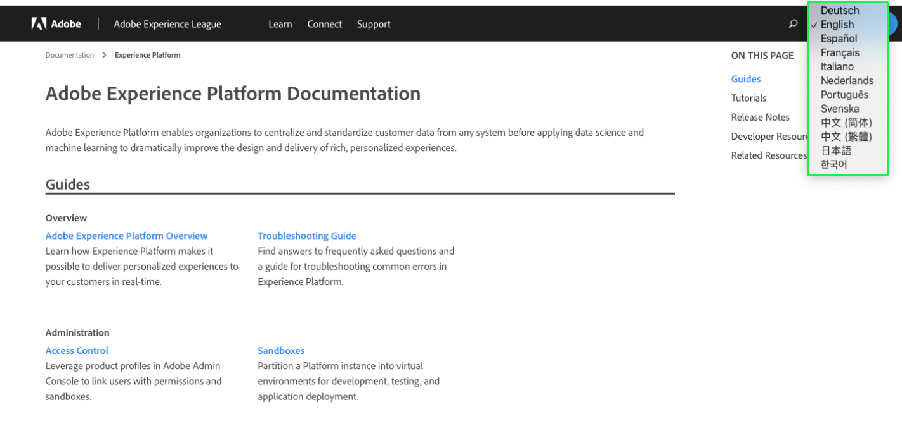

# Experience Platform documentation language support

Adobe Experience Platform documentation is available in multiple languages. 

To change the language in which documentation is presented, select the language icon in the top navigation.

When the language dropdown opens, choose the language in which you would like to view the documentation.

