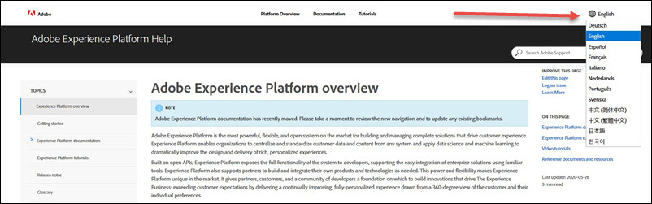

# Platform documentation language support

Adobe Experience Platform documentation is available in several languages. To change language, select the language dropdown and choose the desired language from the list.

## [!DNL Experience Platform] documentation

To learn more about the types of documentation that are available, please visit the [Platform documentation types overview](overview.md). 

To learn more about a specific [!DNL Platform] feature or service, select a guide from the [Experience Platform documentation landing page](https://experienceleague.adobe.com/docs/experience-platform.html).