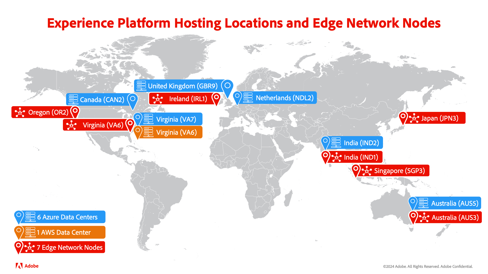

# Edge Network and hub comparison

Adobe Experience Platform is the most powerful, flexible, and open system on the market for building and managing complete solutions that drive customer experience. You can use Experience Platform to centralize and standardize customer data and content from any system and apply data science and machine learning to dramatically improve the design and delivery of rich, personalized experiences. As a result, Platform has multiple ways to process your data, letting you evaluate your data in the best way possible.

## Server types

On Platform, data can be be processed in two different paths: Adobe Experience Platform hub for batch and streaming workflows and Edge Network for real-time experiences.

### Adobe Experience Platform hub

Hub is a main data center that is centrally located and contains all the historical data and rich profile context that has been collected in Adobe Experience Platform. This allows you to send and receive more robust and complete data to your downstream services. As a result, hub should be used in scenarios where the **thoroughness** of the data is more important.

Available services on hub include the following:

- Batch segmentation
- Streaming segmentation
- Profiles
- Destinations
- Identity Graph
- Data Distiller - Query Service
- Source connectors

### Experience Platform Edge Network

Edge Network is a server that is physically located closer to different geographic locations. These data centers process all the data collected through the SDK extensions and Edge Network APIs. The only data that lives on the Edge Network are the audience memberships, profile identities, and attributes necessary for personalization.

Edge Network lets you send and receive data to your customers more quickly due to their closer proximity to the end user. Additionally, you can use Edge Network to process event forwarding requests and tag management requests. However, Edge Network only processes **behavioral** data. As a result, Edge Network should be used in scenarios where the **speed** of the data is more important. 

Available services on Edge Network include the following:

- Edge segmentation
- Edge profiles
- Edge destinations
- Data collection
- SDK extensions

## Locations

The following section lists the locations for both hub and Edge Network.

**Hub**

- VA7 (Virginia, USA)
- NLD2 (The Netherlands)
- AUS5 (Australia)
- CAN2 (Canada)
- GBR9 (United Kingdom)
- IND1 (India)

**Edge Network**

- OR2 (Oregon, USA)
- VA6 (Virginia, USA)
- IRL1 (Ireland)
- IND1 (India)
- SGP3 (Singapore)
- AUS3 (Australia)
- JPN3 (Japan)

More detailed information about the available server locations can be found in the [multi-cloud overview](./multi-cloud.md#available-cloud-regions).

## Next steps

After reading this overview, you now understand the differences between processing data on Adobe Experience Platform hub and Adobe Experience Platform Edge Network.

## Appendix

The following section lists supplemental information about processing data on Adobe Experience Platform.

### Frequently asked questions

The following section lists frequently asked questions about hub and Edge Network:

#### What scenarios are most appropriate for hub?

Hub is best suited in scenarios where the **thoroughness** of the data is more important. For example, let's say you want to create a marketing campaign to target all customers who have abandoned carts. In that use case, you could use batch segmentation, creating an audience that matches the abandoned cart users, and export it to a batch destination.

#### What scenarios are most appropriate for Edge Network?

Edge Network is best suited for scenarios where **speed** of the data is more important. For example, let's say you need to create a limited flash sale to target a customer who's browsing your site with a product in their cart. In that use case, you could use edge segmentation, letting you immediately target and send a personalized notification to users with a product in their cart with a "flash sale".

#### What data goes from hub to Edge Network?

Only data that is needed to deliver real-time experiences on the edge is loaded from hub to Edge Network. This data is automatically sent from hub to Edge Network to keep it eventually consistent, and is only retained for up to 14 days. However, this does **not** mean that data is kept perfectly in sync with data in hub. As a result, there may be differences in available data between hub and Edge Network.
