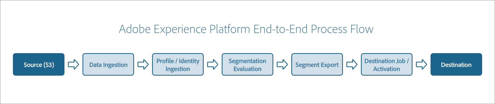

# Adobe Experience Platform end-to-end example workflow

Adobe Experience Platform is the most powerful, flexible, and open system on the market for building and managing complete solutions that drive customer experience. Platform enables organizations to centralize and standardize customer data and content from any system and apply data science and machine learning to dramatically improve the design and delivery of rich, personalized experiences.

Built on RESTful APIs, Platform exposes the full functionality of the system to developers, supporting the easy integration of enterprise solutions using familiar tools. Platform lets you derive a holistic view of your customers by ingesting your customer data, segmenting your data to the audiences you want to target, and activating these audiences to an external destination. The following tutorial shows an end-to-end workflow, showing all the steps from ingestion via sources to audience activation via destinations.

## Getting started

This end-to-end workflow uses multiple Adobe Experience Platform services. The following is a list of the services that are used in this workflow with links to their overviews:

- [[!DNL Experience Data Model (XDM)]](../xdm/home.md): The standardized framework by which [!DNL Platform] organizes customer experience data. To best make use of Segmentation, please ensure your data is ingested as profiles and events according to the [best practices for data modeling](../xdm/schema/best-practices.md).
- [[!DNL Identity Service]](../identity-service/home.md): Provides you with a comprehensive view of your customers and their behavior by bridging identities across devices and systems.
- [Sources](../sources/home.md): [!DNL Experience Platform] allows data to be ingested from various sources while providing you with the ability to structure, label, and enhance incoming data using [!DNL Platform] services.
- [[!DNL Segmentation Service]](../segmentation/home.md): [!DNL Segmentation Service] allows you to divide data stored in [!DNL Experience Platform] that relates to individuals (such as customers, prospects, users, or organizations) into smaller groups.
- [[!DNL Real-Time Customer Profile]](../profile/home.md): Provides a unified, real-time consumer profile based on aggregated data from multiple sources.
- [Datasets](../catalog/datasets/overview.md): The storage and management construct for data persistence in [!DNL Experience Platform].
- [Destinations](../destinations/home.md): Destinations are pre-built integrations with commonly used applications that allow for the seamless activation of data from Platform for cross-channel marketing campaigns, email campaigns, targeted advertising, and many other use cases.

## Create an XDM schema

Before you ingest data into Platform, you must first create an XDM schema to describe the structure of that data. When you ingest your data in the next step, you will map your incoming data to this schema. To learn how to create an example XDM schema, please read the tutorial on [creating a schema using the Schema Editor](../xdm/tutorials/create-schema-ui.md).

The above tutorial shows how to set identity fields for your schemas. An identity field represents a field that can be used to identify an individual person related to a record or time-series event. Identity fields are a crucial component in how customer identity graphs are constructed in Platform, which ultimately affects how Real-Time Customer Profile merges disparate data fragments together to gain a complete view of the customer. For more details on how to view identity graphs in Platform, see the tutorial on [how to use the identity graph viewer](../identity-service/ui/identity-graph-viewer.md).

You need to enable your schema for use in Real-Time Customer Profile so that customer profiles can be constructed from the data based on your schema. See the section on [enabling a schema for Profile](../xdm/ui/resources/schemas.md#profile) in the schemas UI guide for more information.

## Ingest your data into Platform

Once you have created an XDM schema, you can start bringing your data into the system. 

All data brought into Platform is stored to individual datasets upon ingestion. A dataset is a collection of data records that map to a specific XDM schema. Before your data can be used by [!DNL Real-Time Customer Profile], the dataset in question has to be specifically configured. For complete instructions on how to enable a dataset for Profile, see the [Datasets UI guide](../catalog/datasets/user-guide.md#enable-profile) and the [dataset configuration API tutorial](../profile/tutorials/dataset-configuration.md). Once the dataset has been configured, you can start ingesting data into it.

Platform allows data to be ingested from external sources while providing you with the ability to structure, label, and enhance incoming data using Platform services. You can ingest data from a variety of sources such as Adobe applications, cloud-based storages, databases, and many others. For instance, you can ingest your data by using [Amazon S3](../sources/tutorials/api/create/cloud-storage/s3.md). A full list of available sources can be found in the [source connectors overview](../sources/home.md).

If you use Amazon S3 as your source connector, you can follow the instructions in either the API tutorial on [creating an Amazon S3 connector](../sources/tutorials/api/create/cloud-storage/s3.md) or the UI tutorial on [creating an Amazon S3 connector](../sources/tutorials/ui/create/cloud-storage/s3.md) to learn how to create, connect to, and ingest data within the connector.

For more detailed instructions on source connectors, please read the [source connectors overview](../sources/home.md). To learn more about Flow Service, the API which sources are based off of, please read the [Flow Service API reference](https://www.adobe.io/experience-platform-apis/references/flow-service/).

Once your data is brought into Platform through the source connector and stored in your Profile-enabled dataset, customer profiles are automatically created based on the identity data you configured in your XDM schema.

When uploading data to a new dataset for the first time, or when setting up a new ETL process or data source, it is recommended to carefully check the data to ensure it has been uploaded correctly and that the generated profiles contain the data you expect. For more information on how to access customer profiles in the Platform UI, see the [Real-Time Customer Profile UI guide](../profile/ui/user-guide.md). For the details on how to access profiles using the Real-Time Customer Profile API, see the guide on [using the entities endpoint](../profile/api/entities.md).

## Evaluate your data

Once you have successfully generated profiles from your ingested data, you can evaluate your data by using segmentation. Segmentation is the process of defining specific attributes or behaviors shared by a subset of individuals from your profile store, in order to distinguish a marketable group of people from your customer base. To learn more about segmentation, please read the [segmentation service overview](../segmentation/home.md).

### Create a segment definition

To get started, you must create a segment definition to cluster your customers to create your target audience. A segment definition is a collection of rules that you can use to define the audience you want to target. To create a segment definition, you can follow the instructions in either the UI guide on using the [Segment Builder](../segmentation/ui/segment-builder.md) or the API tutorial on [creating a segment](../segmentation/tutorials/create-a-segment.md).

Once you've created a segment definition, ensure that you keep note of the segment definition ID.

### Evaluate your segment definition

After creating your segment definition, you can either create a segment job to evaluate the segment as a one-time instance or create a schedule to evaluate the segment on an ongoing basis.

To evaluate a segment definition on demand, you can create a segment job. A segment job is an asynchronous process that creates a new audience segment based on the referred segment definition and merge policies. A merge policy is a set of rules that Platform uses to determine what data will be used to create customer profiles, and which data will be prioritized when there are discrepancies between sources. To learn how to work with merge policies, see the [merge policies UI guide](../profile/merge-policies/ui-guide.md).

Once the segment job is created and evaluated, you can get information about the segment, such as the size of your audience or errors that may have occurred during processing. To learn how to create a segment job, including all the details you need to provide, please read the [segment job developer guide](../segmentation/api/segment-jobs.md).

To evaluate a segment definition on an ongoing basis, you can create and enable a schedule. A schedule is a tool that can be used to automatically run a segment job once a day at a specified time. To learn how to create and enable a schedule, you can follow the instructions in the API guide on the [schedules endpoint](../segmentation/api/schedules.md).

## Export your evaluated data

After creating your one-time segment job or your ongoing schedule, you can either create a segment export job to export the results to a dataset or export the results to a destination. The following sections provide guidance on both of these options.

### Export your evaluated data to a dataset

After either creating your one-time segment job or your ongoing schedule, you can export the results by creating a segment export job. A segment export job is an asynchronous task that sends information about the evaluated audience to a dataset.

Before creating an export job, you must first create a dataset to export the data to. To learn how to create a dataset, please read the section on [creating a target dataset](../segmentation/tutorials/evaluate-a-segment.md#create-dataset) in the tutorial on evaluating a segment, ensuring you note the dataset ID after creation. After creating a dataset, you can create an export job. To learn how to create an export job, you can follow the instructions in the API guide on the [export jobs endpoint](../segmentation/api/export-jobs.md).

### Export your evaluated data to a destination

Alternatively, after creating your one-time segment job or your ongoing schedule, you can export the results to a destination. A destination is an endpoint, such as an Adobe application on an external service, where an audience can be activated and delivered. A full list of available destinations can be found in the [destinations catalog](../destinations/catalog/overview.md).

For instructions on how to activate data to batch or email marketing destinations, see the tutorial on [how to activate audience data to batch profile export destinations using the Platform UI](../destinations/ui/activate-batch-profile-destinations.md) and the [guide on how to connect to batch destinations and activate data using the Flow Service API](../destinations/api/connect-activate-batch-destinations.md).

## Monitor your Platform data activities

Platform allows you to track how data is being processed through the use of dataflows, which are representations of jobs that move data across Platform's various components. These dataflows are configured across different services, helping move data from source connectors to target datasets, where it is then utilized by [!DNL Identity Service] and [!DNL Real-Time Customer Profile] before ultimately being activated to destinations. The monitoring dashboard provides you with a visual representation of the journey of a dataflow. To learn how to monitor dataflows within the Platform UI, see the tutorials on [monitoring dataflows for sources](../dataflows/ui/monitor-sources.md) and [monitoring dataflows for destinations](../dataflows/ui/monitor-destinations.md).

You can also monitor Platform activities through the use of statistical metrics and event notifications by using [!DNL Observability Insights]. You can subscribe to alert notifications through Platform UI or send them to a configured webhook. For more details on how to view, enable, disable, and subscribe to available alerts from the Experience Platform UI, see the [[!UICONTROL Alerts] UI guide](../observability/alerts/ui.md). For details on how to receive alerts through webhooks, see the guide on [subscribing to Adobe I/O Event notifications](../observability/alerts/subscribe.md).

## Next steps

By reading this tutorial, you have been given a basic introduction to a simple end-to-end flow for Platform. To learn more about Adobe Experience Platform, please read the [Platform overview](./home.md). To learn more about using the Platform UI and the Platform API, please read the [Platform UI guide](./ui-guide.md) and the [Platform API guide](./api-guide.md) respectively.
