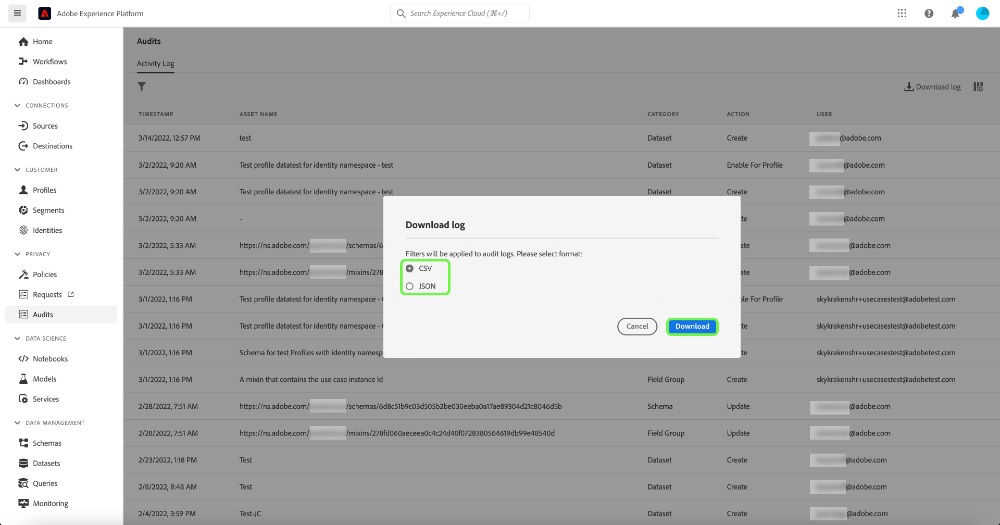

# Audit logs {#audit-logs}

>[!CONTEXTUALHELP]
>id="platform_audits_privacyconsole_actions"
>title="Top Actions"
>abstract="This widget shows the top kinds of actions that have been taken in Experience Platform within the selected timeframe. To see the full list of recorded actions in Platform, select **Audits** in the left navigation."

>[!CONTEXTUALHELP]
>id="platform_audits_privacyconsole_users"
>title="Top Users"
>abstract="This widget shows the users that have executed the most actions in Experience Platform within the selected timeframe. To see the full list of recorded actions in Platform, select **Audits** in the left navigation."

>[!CONTEXTUALHELP]
>id="platform_privacyConsole_audits_description"
>title="Monitor user activities in Platform"
>abstract="<h2>Description</h2>
You can monitor user activity for various Platform services and capabilities in the form of audit logs. These logs form an audit trail that records <b>who</b> performed <b>what</b> action and <b>when</b>. Audit logs can help with troubleshooting issues on Platform and help your business effectively comply with corporate data stewardship policies and regulatory requirements.
"

In order to increase the transparency and visibility of activities performed in the system, Adobe Experience Platform allows you to audit user activity for various services and capabilities in the form of "audit logs". These logs form an audit trail that can help with troubleshooting issues on Platform, and help your business effectively comply with corporate data stewardship policies and regulatory requirements.

In a basic sense, an audit log tells **who** performed **what** action, and **when**. Each action recorded in a log contains metadata that indicates the action type, date and time, the email ID of the user who performed the action, and additional attributes relevant to the action type.

This document covers audit logs in Platform, including how to view and manage them in UI or API.

## Event types captured by audit logs {#category}

The following table outlines which actions on which resources are recorded by audit logs:

| Resource | Actions |
| --- | --- |
| [Access control policy (attribute based access control)](../../../access-control/home.md) | <ul><li>Create</li><li>Update</li><li>Delete</li></ul> |
| [Account (Adobe)](../../../sources/connectors/tutorials/ui/../../../tutorials/ui/update.md) | <ul><li>Create</li><li>Update</li><li>Delete</li></ul> |
| [Attribution AI instance](../../../intelligent-services/attribution-ai/overview.md) | <ul><li>Create</li><li>Update</li><li>Delete</li><li>Enable</li><li>Disable</li></ul> |
| [Audit logs](../../../landing/governance-privacy-security/audit-logs/overview.md) | <ul><li>Export</li></ul> |
| [Class](../../../xdm/schema/composition.md#class) | <ul><li>Create</li><li>Update</li><li>Delete</li></ul> |
| [Computed attribute](../../../profile/computed-attributes/overview.md) | <ul><li>Create</li><li>Update</li><li>Delete</li></ul> |
| [Customer AI instance](../../../intelligent-services/customer-ai/overview.md) | <ul><li>Create</li><li>Update</li><li>Delete</li><li>Enable</li><li>Disable</li></ul> |
| [Dataset](../../../catalog/datasets/overview.md) | <ul><li>Create</li><li>Update</li><li>Delete</li><li>Enable for [Real-Time Customer Profile](../../../profile/home.md)</li><li>Disable for Profile</li><li>Add data</li><li>Delete batch</li></ul> |
| [Datastream](../../../edge/datastreams/overview.md) | <ul><li>Create</li><li>Update</li><li>Delete</li><li>Enable</li><li>Disable</li><li>[Edit Mapping](../../../edge/datastreams/data-prep.md)</li></ul> |
| [Data types](../../../xdm/schema/composition.md#data-type) | <ul><li>Create</li><li>Update</li><li>Delete</li></ul> |
| [Destination](../../../destinations/home.md) | <ul><li>Create</li><li>Update</li><li>Delete</li><li>Enable</li><li>Disable</li><li>Dataset Activate</li><li>Dataset Remove</li><li>Profile Activate</li><li>Profile Remove</li></ul> |
| [Field group](../../../xdm/schema/composition.md#field-group) | <ul><li>Create</li><li>Update</li><li>Delete</li></ul> |
| [Identity graph](../../../identity-service/ui/identity-graph-viewer.md) | <ul><li>View</li></ul> |
| [Identity namespace](../../../identity-service/ui/identity-graph-viewer.md) | <ul><li>Create</li><li>Update</li></ul> |
| [Merge policy](../../../profile/merge-policies/overview.md) | <ul><li>Create</li><li>Update</li><li>Delete</li></ul> |
| [Product profile](../../../access-control/home.md) | <ul><li>Create</li><li>Update</li><li>Delete</li></ul> |
| [Query](../../../query-service/ui/overview.md) | <ul><li>Execute</li></ul> |
| [Query template](../../../query-service/ui/overview.md) | <ul><li>Create</li><li>Update</li><li>Delete</li></ul> |
| [Role (attribute based access control)](../../../access-control/home.md) | <ul><li>Create</li><li>Update</li><li>Delete</li><li>Add user</li><li>Remove user</li></ul> |
| [Sandbox](../../../sandboxes/home.md) | <ul><li>Create</li><li>Update</li><li>Reset</li><li>Delete</li></ul> |
| [Scheduled query](../../../query-service/ui/overview.md) | <ul><li>Create</li><li>Update</li><li>Delete</li></ul> |
| [Schema](../../../xdm/schema/composition.md) | <ul><li>Create</li><li>Update</li><li>Delete</li><li>Enable for Profile</li></ul> |
| [Segment](../../../segmentation/home.md) | <ul><li>Create</li><li>Delete</li><li>Segment Activate</li><li>Segment Remove</li></ul> |
| [Source data flow](../../../sources/connectors/tutorials/ui/../../../tutorials/ui/update.md) | <ul><li>Create</li><li>Update</li><li>Delete</li><li>Enable</li><li>Disable</li><li>Dataset activate</li><li>Dataset remove</li><li>Profile ativate</li><li>Profile remove</li></ul> |
| [Work order](../../../hygiene/home.md) | <ul><li>Create</li></ul> |

## Access to audit logs

When the feature is enabled for your organization, audit logs are automatically collected as activity occurs. You do not need to manually enable log collection.

In order to view and export audit logs, you must have the **[!UICONTROL View User Activity Log]** access control permission granted (found under the [!UICONTROL Data Governance] category). To learn how to manage individual permissions for Platform features, please refer to the [access control documentation](../../../access-control/home.md).

## Managing audit logs in the UI {#managing-audit-logs-in-the-ui}

>[!CONTEXTUALHELP]
>id="platform_privacyConsole_audits_instructions"
>title="Instructions"
>abstract="<ul><li>Select <b>Audits</b> in the left navigation. The Audits workspace shows a list of recorded logs, by default sorted from most recent to least recent.</li>&nbsp;&nbsp;&nbsp;<li> NOTE: Audit logs are retained for 365 days after which they will be deleted from the system. Therefore, you can only go back for a maximum period of 365 days. If you need to look back on data older than 365 days, you should export logs at a regular cadence to meet your internal policy requirements. </li><li>Select an event from the list to view its details in the right rail. </li><li>Select the funnel icon to display a List of filter controls to help narrow the results. Only the last 1000 records are displayed, regardless of the filters selected. </li><li>To export the current list of audit logs, select **Download log**.</li><li>For more help with this feature, see the <a href="https://experienceleague.adobe.com/docs/experience-platform/landing/governance-privacy-security/audit-logs/overview.html">audit logs overview</a> on Experience League.</li></ul>"

You can view audit logs for different Experience Platform features within the **[!UICONTROL Audits]** workspace in the Platform UI. The workspace shows a list of recorded logs, by default sorted from most recent to least recent.

Audit logs are retained for 365 days after which they will be deleted from the system. Therefore, you can only go back for a maximum period of 365 days. If you require data of more than 365 days, you should export logs at a regular cadence to meet your internal policy requirements.

Select an event from the list to view its details in the right rail.

### Filter audit logs

>[!NOTE]
>
>Since this a new feature, the data displayed only goes back to March 2022. Depending on the resource selected, earlier data may be available from January 2022.

Select the funnel icon () to display a list of filter controls to help narrow results. Only the last 1000 records are displayed irrespective of the various filters selected.

The following filters are available for audit events in the UI:

| Filter | Description |
| --- | --- |
| [!UICONTROL Category] | Use the dropdown menu to filter displayed results by [category](#category). |
| [!UICONTROL Action] | Filter by action. Currently only [!UICONTROL Create] and [!UICONTROL Delete] actions can be filtered. |
| [!UICONTROL User] | Enter the complete user ID (for example, `johndoe@acme.com`) to filter by user. |
| [!UICONTROL Status] | Filter by whether the action was allowed (completed) or denied due to lack of [access control](../../../access-control/home.md) permissions. |
| [!UICONTROL Date] | Select a start date and/or an end date to define a date range to filter results by. Data can be exported with a 90-day lookback period (for example, 2021-12-15 to 2022-03-15). This can differ by event type. |

To remove a filter, select the "X" on the pill icon for the filter in question, or select **[!UICONTROL Clear all]** to remove all filters.

### Export audit logs

To export the current list of audit logs, select **[!UICONTROL Download log]**.

In the dialog that appears, select your preferred format (either **[!UICONTROL CSV]** or **[!UICONTROL JSON]**), then select **[!UICONTROL Download]**. The browser downloads the generated file and saves it to your machine.

## Managing audit logs in the API

All actions that you can perform in the UI can also be done using API calls. See the [API reference document](https://www.adobe.io/experience-platform-apis/references/audit-query/) for more information.

## Managing audit logs for Adobe Admin Console

To learn how to manage audit logs for activities in Adobe Admin Console, refer to the following [document](https://helpx.adobe.com/enterprise/using/audit-logs.html).

## Next steps and additional resources

This guide covered how to manage audit logs in Experience Platform. For more information on how to monitor Platform activities, see the documentation on [Observability Insights](../../../observability/home.md) and [monitoring data ingestion](../../../ingestion/quality/monitor-data-ingestion.md).

To reinforce your understanding of audit logs in Experience Platform, watch the following video:

>[!VIDEO](https://video.tv.adobe.com/v/341450?quality=12&learn=on)
