# Configure a dataset to capture consent and preference data

In order for Adobe Experience Platform to process your customer consent/preference data, that data must be sent to a dataset whose schema contains fields related to consents and other permissions. Specifically, this dataset must be based on the [!DNL XDM Individual Profile] class, and enabled for use in [!DNL Real-time Customer Profile].

This document provides steps for configuring a dataset to process consent data in Experience Platform. For an overview of the full workflow for processing consent/preference data in Platform, refer to the [consent processing overview](./overview.md).

>[!IMPORTANT]
>
>The examples in this guide use a standardized set of fields to represent customer consent values, as defined by the [[!UICONTROL Consent and Preference Details] schema field group](../../../../xdm/field-groups/profile/consents.md). The structure of these fields is intended to provide an efficient data model to cover many common consent-collection use cases.
>
>However, you can also define your own field groups to represent consent according to your own data models. Please consult with your legal team to get approval for a consent data model that fits your business needs, based on the following options:
>
>* The standardized consent field group
>* A custom consent field group created by your organization
>* A combination of the standardized consent field group and additional fields provided by a custom consent field group

## Prerequisites

This tutorial requires a working understanding of the following components of Adobe Experience Platform:

* [Experience Data Model (XDM)](../../../../xdm/home.md): The standardized framework by which [!DNL Experience Platform] organizes customer experience data.
    * [Basics of schema composition](../../../../xdm/schema/composition.md): Learn about the basic building blocks of XDM schemas.
* [Real-time Customer Profile](../../../../profile/home.md): Consolidates customer data from disparate sources into a complete, unified view while offering an actionable, timestamped account of every customer interaction.

>[!IMPORTANT]
>
>This tutorial assumes that you know the [!DNL Profile] schema in Platform that you want to use to capture customer attribute information. Regardless of the method you use to collect consent data, this schema must be [enabled for Real-time Customer Profile](../../../../xdm/ui/resources/schemas.md#profile). In addition, the schema's primary identity cannot be a directly identifiable field that is prohibited from use in interest-based advertising, such as an email address. Consult your legal counsel if you are unsure which fields are restricted.

## [!UICONTROL Consent and Preference Details] field group structure {#structure}

The [!UICONTROL Consent and Preference Details] field group provides standardized consent fields to a schema. Currently, this field group is only compatible with schemas based on the [!DNL XDM Individual Profile] class.

The field group provides a single object-type field, `consents`, whose sub-properties capture a set of standardized consent fields. The following JSON is an example of the kind of data `consents` expects upon data ingestion:

```json
{
  "consents": {
    "collect": {
      "val": "y",
    },
    "share": {
      "val": "y",
    },
    "personalize": {
      "content": {
        "val": "y"
      }
    },
    "marketing": {
      "preferred": "email",
      "any": {
        "val": "y"
      },
      "push": {
        "val": "n",
        "reason": "Too Frequent",
        "time": "2019-01-01T15:52:25+00:00"
      }
    },
    "idSpecific": {
      "email": {
        "jdoe@example.com": {
          "marketing": {
            "email": {
              "val": "n"
            }
          }
        }
      }
    }
  },
  "metadata": {
    "time": "2019-01-01T15:52:25+00:00"
  }
}
```

>[!NOTE]
>
>For more information on the structure and meaning of the sub-properties in `consents`, see the overview on the [[!UICONTROL Consent and Preference Details] field group](../../../../xdm/field-groups/profile/consents.md).

## Add required field groups to your [!DNL Profile] schema {#add-field-group}

In order to collect consent data using the Adobe standard, you must have a Profile-enabled schema that contains the following two field groups:

* [!UICONTROL Consent and Preference Details]
* [!UICONTROL IdentityMap] (required if using the Platform Web or Mobile SDK to send consent signals)

In the Platform UI, select **[!UICONTROL Schemas]** in the left navigation, then select the **[!UICONTROL Browse]** tab to display a list of existing schemas. From here, select the name of the [!DNL Profile]-enabled schema that you want to add consent fields to. The screenshots in this section use the "Loyalty Members" schema built in the [schema creation tutorial](../../../../xdm/tutorials/create-schema-ui.md) as an example.

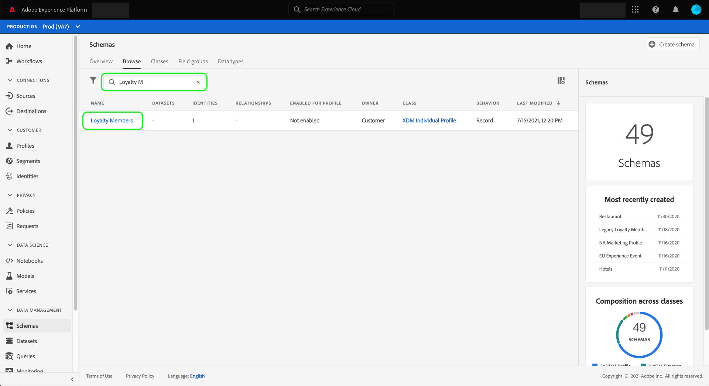

>[!TIP]
>
>You can use the workspace's search and filtering capabilities to help find your schema easier. See the guide on [exploring XDM resources](../../../../xdm/ui/explore.md) for more information.

The [!DNL Schema Editor] appears, showing the structure of the schema in the canvas. On the left side of the canvas, select **[!UICONTROL Add]** under the **[!UICONTROL Field groups]** section.

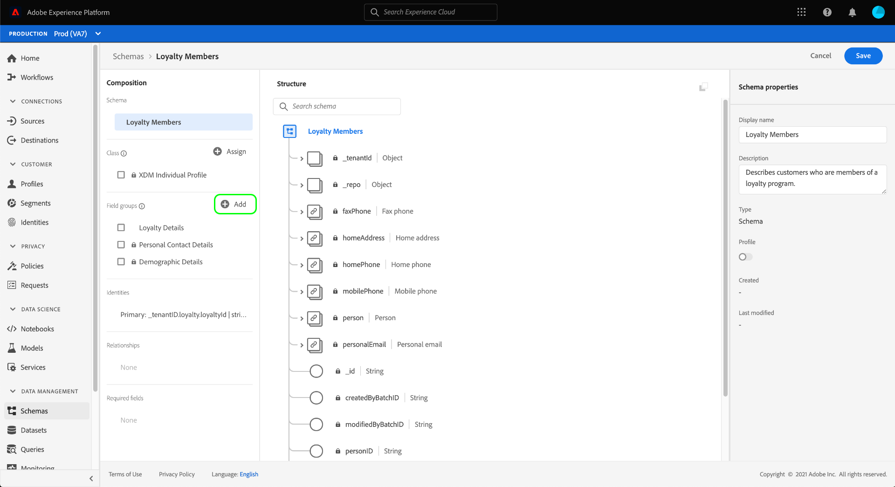

The **[!UICONTROL Add field group]** dialog appears. From here, select **[!UICONTROL Consent and Preference Details]** from the list. You can optionally use the search bar to narrow down results to locate the field group easier.

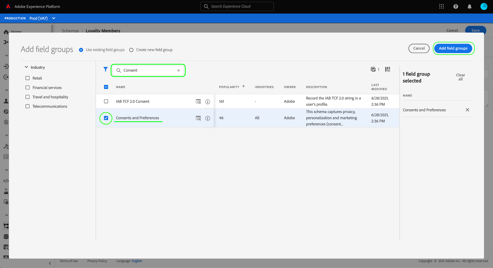

Next, find the **[!UICONTROL IdentityMap]** field group from the list and select it as well. Once both field groups are listed in the right rail, select **[!UICONTROL Add field groups]**.

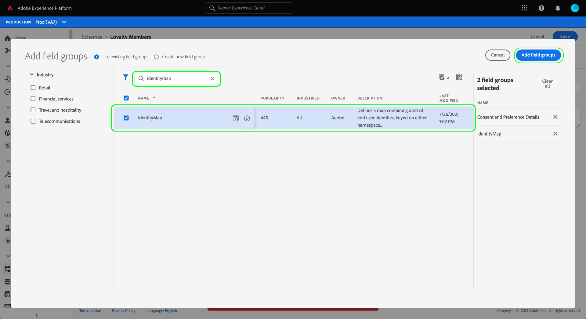

The canvas reappears, showing that the `consents` and `identityMap` fields have been added to the schema structure. If you require additional consent and preference fields not captured by the standard field group, see the appendix section on [adding custom consent and preference fields to the schema](#custom-consent). Otherwise, select **[!UICONTROL Save]** to finalize the changes to the schema.

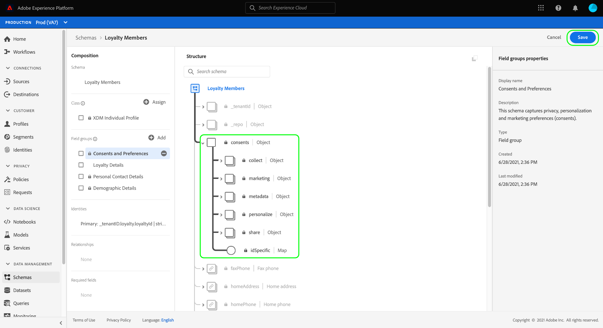

>[!IMPORTANT]
>
>If you are creating a new schema, or editing an existing schema that has not been enabled for Profile, you must [enable the schema for Profile](../../../../xdm/ui/resources/schemas.md#profile) before saving.

If the schema you edited is used by the [!UICONTROL Profile Dataset] specified in your Platform Web SDK datastream, that dataset will now include the new consent fields. You can now return to the [consent processing guide](./overview.md#merge-policies) to continue the process of configuring Experience Platform to process consent data. If you have not created a dataset for this schema, follow the steps in the next section.

## Create a dataset based on your consent schema {#dataset}

Once you have created a schema with consent fields, you must create a dataset that will ultimately ingest your customers' consent data. This dataset must be enabled for [!DNL Real-time Customer Profile].

To begin, select **[!UICONTROL Datasets]** in the left navigation, then select **[!UICONTROL Create dataset]** in the top-right corner.

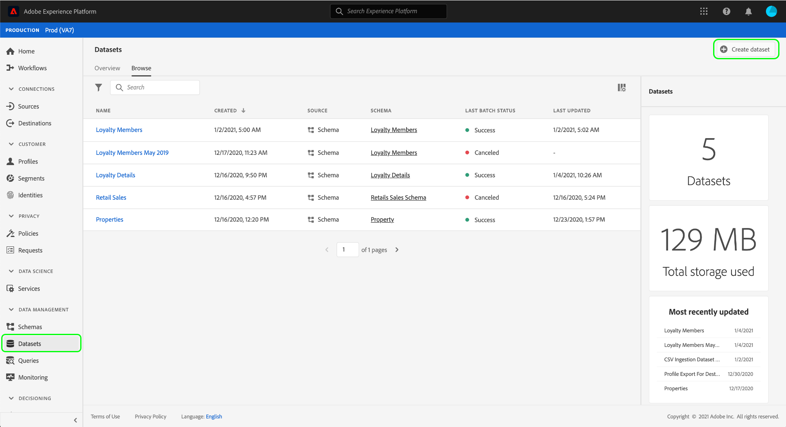

On the next page, select **[!UICONTROL Create dataset from schema]**.

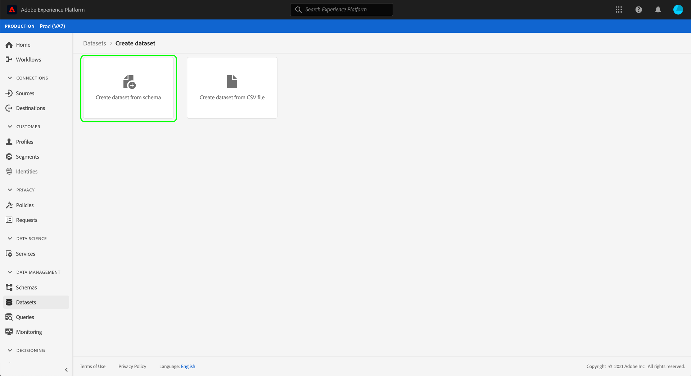

The **[!UICONTROL Create dataset from schema]** workflow appears, starting at the **[!UICONTROL Select schema]** step. In the provided list, locate one of the consent schemas that you created earlier. You can optionally use the search bar to narrow down results and locate your schema easier. Select the radio button next to the desired schema, then select **[!UICONTROL Next]** to continue.

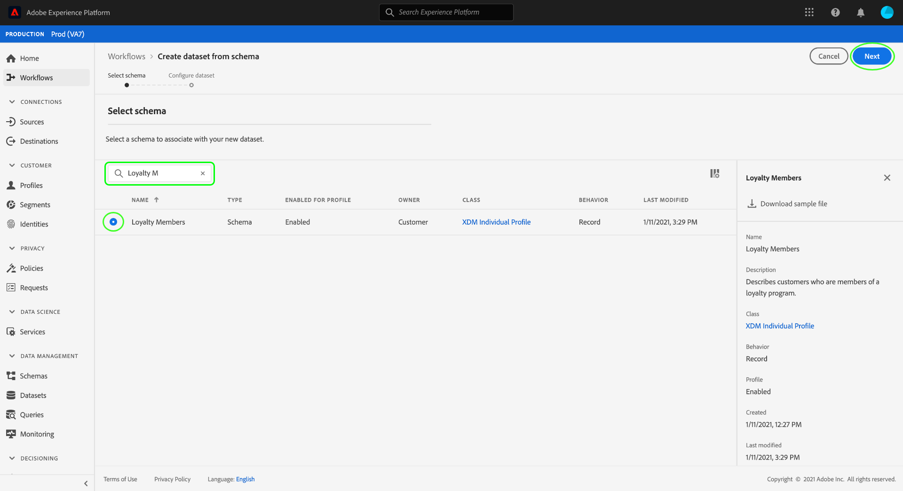

The **[!UICONTROL Configure dataset]** step appears. Provide a unique, easily identifiable name and description for the dataset before selecting **[!UICONTROL Finish]**.

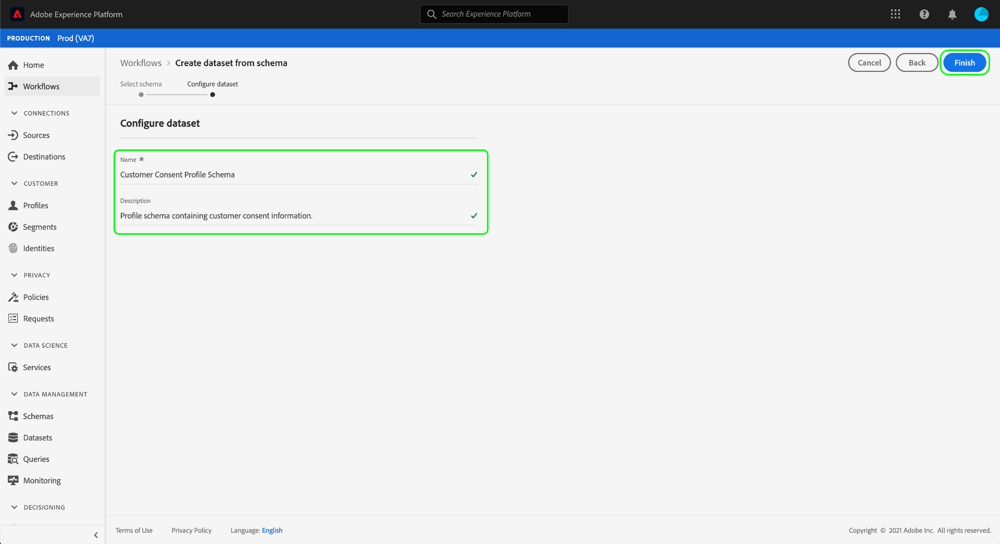

The details page for the newly created dataset appears. If the dataset is based on your time-series schema, then the process is complete. If the dataset is based on your record schema, the final step in the process is to enable the dataset for use in [!DNL Real-time Customer Profile].

In the right rail, select the **[!UICONTROL Profile]** toggle.

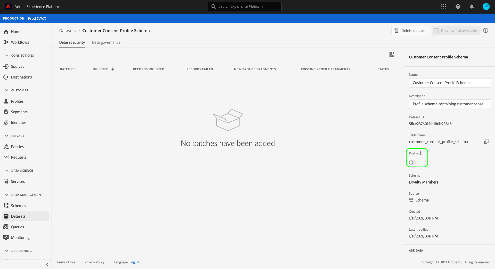

Finally, select **[!UICONTROL Enable]** in the confirmation popover to enable the schema for [!DNL Profile].


The dataset is now saved and enabled for use in [!DNL Profile]. If you are planning using the Platform Web SDK to send consent data to Profile, you must select this dataset as the [!UICONTROL Profile Dataset] when setting up your [datastream](../../../../edge/datastreams/overview.md).

## Next steps

By following this tutorial, you have added consent fields to a [!DNL Profile]-enabled schema, whose dataset will be used to ingest consent data using the Platform Web SDK or direct XDM ingestion.

You can now return to the [consent processing overview](./overview.md#merge-policies) to continue configuring Experience Platform to process consent data.

## Appendix

The following section contains additional information about creating a dataset to ingest customer consent and preference data.

### Add custom consent and preference fields to the schema {#custom-consent}

If you need to capture additional consent signals outside of those represented by the standard [!UICONTROL Consent and Preference Details] field group, you can use custom XDM components to enhance your consent schema to suit your particular business needs. This section outlines the basic principles of how to customize your consent schema in order to ingest these signals into Profile.

>[!IMPORTANT]
>
>The Platform Web and Mobile SDKs do not support custom fields in their consent-change commands. Currently the only way to ingest custom consent fields into Profile is through [batch ingestion](../../../../ingestion/batch-ingestion/overview.md) or a [source connection](../../../../sources/home.md).

It is highly recommended that you use the [!UICONTROL Consent and Preference Details] field group as a baseline for the structure of your consent data and add additional fields as needed, rather than attempting to create the entire structure from scratch.

To add custom fields to the structure of a standard field group, you must first create a custom field group. After adding the [!UICONTROL Consent and Preference Details] field group to the schema, select the **plus (+)** icon in the **[!UICONTROL Field groups]** section, and then select **[!UICONTROL Create new field group]**. Provide a name and optional description for the field group, and then select **[!UICONTROL Add field group]**.

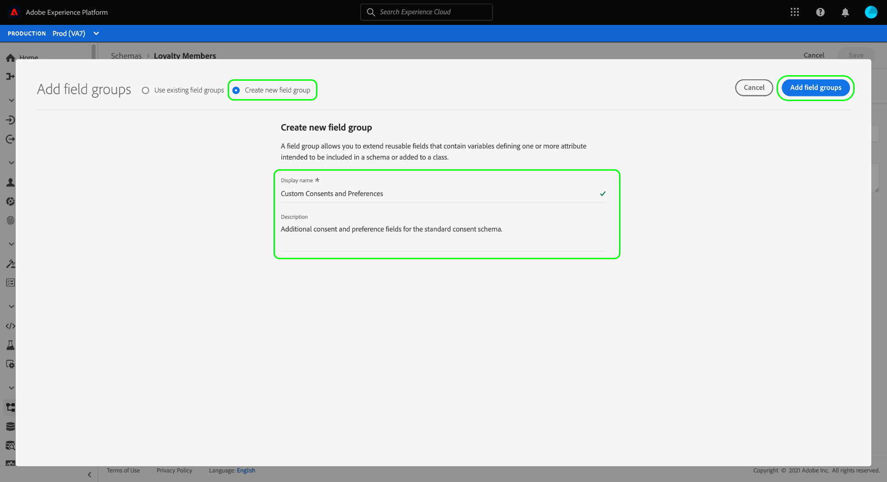

The [!DNL Schema Editor] reappears with the new custom field group selected in the left rail. In the canvas, controls appear that allow you to add custom fields to the schema structure. To add a new consent or preference field, select the **plus (+)** icon next to the `consents` object.

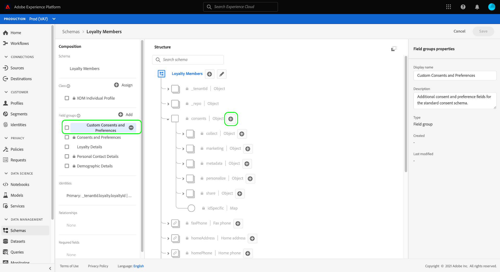

A new field appears within the `consents` object. Since you are adding a custom field to a standard XDM object, the new field is created under an object that is namespaced to your tenant ID.

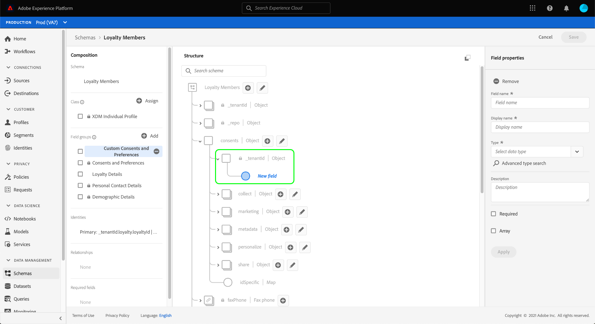

In the right rail under **[!UICONTROL Field properties]**, provide a name and description for the field. When selecting the field's **[!UICONTROL Type]**, you must use the appropriate standard data type for a custom consent or preference field:

* [[!UICONTROL Generic Consent Field]](../../../../xdm/data-types/consent-field.md)
* [[!UICONTROL Generic Marketing Preference Field]](../../../../xdm/data-types/marketing-field.md)
* [[!UICONTROL Generic Marketing Preference Field with Subscriptions]](../../../../xdm/data-types/marketing-field-subscriptions.md)
* [[!UICONTROL Generic Personalization Preference Field]](../../../../xdm/data-types/personalization-field.md)

When finished, select **[!UICONTROL Apply]**.

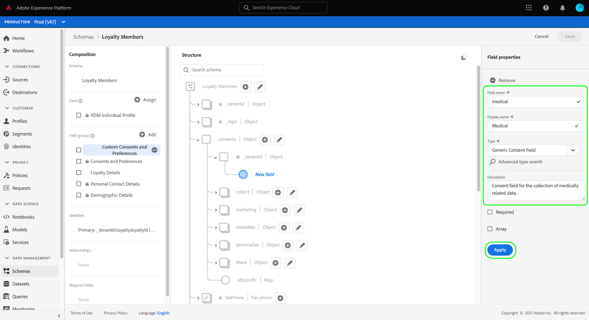

The consent or preference field is added to the schema structure. Note that the [!UICONTROL Path] displayed in the right rail contains the `_tenantId` namespace. This namespace must be included whenever you reference the path to this field in your data operations.

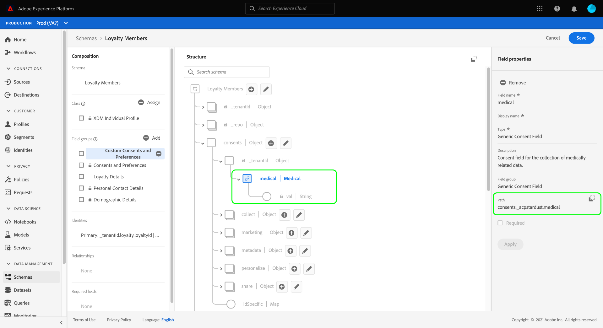

Follow the steps above to continue adding the consent and preference fields that you require. When finished, select **[!UICONTROL Save]** to confirm your changes.

If you have not created a dataset for this schema, continue to the section on [creating a dataset](#dataset).
