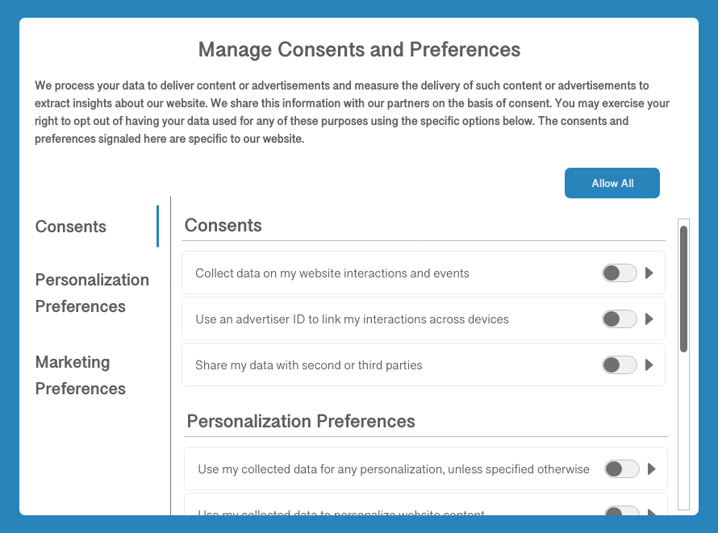

# Consent processing in Adobe Experience Platform

Adobe Experience Platform allows you to process the consent data you have collected from your customers and integrate it into your stored customer profiles. This consent data can then be used by a consent-management platform (CMP) or your own downstream processes to determine whether data collection occurs for a specific customer, or whether their profiles are included in exported audience segments.

This document provides an overview of how to configure your Platform data operations to ingest customer consent data generated by your CMP and integrate that data into customer profiles for downstream use cases.

>[!NOTE]
>
>This document focuses on processing consent data using the Adobe standard. If you are processing consent data in compliance with the IAB Transparency and Consent Framework (TCF) 2.0, see the guide on [TCF 2.0 support in Real-time Customer Data Platform](../iab/overview.md).

## Prerequisites

This guide requires a working understanding of the various Experience Platform services involved in processing consent data:

* [Experience Data Model (XDM)](../../../../xdm/home.md): The standardized framework by which Experience Platform organizes customer experience data.
* [Adobe Experience Platform Identity Service](../../../../identity-service/home.md): Solves the fundamental challenge posed by the fragmentation of customer experience data by bridging identities across devices and systems.
* [Real-time Customer Profile](../../../../profile/home.md): Leverages [!DNL Identity Service] to create detailed customer profiles from your datasets in real-time. Real-time Customer Profile pulls data from the Data Lake and persists customer profiles in its own separate data store.
* [Adobe Experience Platform Web SDK](../../../../edge/home.md): A client-side JavaScript library that allows you to integrate various Platform services into your customer-facing website.
    * [SDK consent commands](../../../../edge/consent/supporting-consent.md): A use-case overview of the consent-related SDK commands shown in this guide.
* [Adobe Experience Platform Segmentation Service](../../../../segmentation/home.md): Allows you to divide Real-time Customer Profile data into groups of individuals that share similar traits and will respond similarly to marketing strategies.

## Consent processing flow summary {#summary}

The following describes how consent data is processed after the system has been properly configured:

1. A customer provides their consent preferences for data collection through a dialog on your website.
1. On each page load (or when your CMP detects a change in consent preferences), a custom script on your site maps the current preferences to a standard XDM schema before passing it to the Platform Web SDK `setConsent` command.
1. When `setConsent` is called, the Platform Web SDK checks whether the consent values are different from those it last received. If the values are different (or there is no previous value), the structured consent/preference data is sent to Adobe Experience Platform.
1. The consent/preference data is ingested into a [!DNL Profile]-enabled dataset whose schema contains consent/preference fields.

In addition to SDK commands triggered by CMP consent-change hooks, consent data can also flow into Experience Platform through any customer-generated XDM data that is uploaded directly to a [!DNL Profile]-enabled dataset.

## Determine how to generate customer consent data within your CMP {#consent-data}

Since each CMP system is unique, you must determine the best way to allow your customers to provide consent as they interact with your service. A common way to achieve this is through the use of a cookie consent dialog, similar to the following example:



This dialog should allow the customer to opt in or out of specific marketing and personalization use cases for their data. These consents and preferences should conform to the data model that you define for the [!DNL Profile]-enabled dataset in the next step.

## Add standardized consent fields to a [!DNL Profile]-enabled dataset {#dataset}

Customer consent data must be sent to a [!DNL Profile]-enabled dataset whose schema contains consent fields. These fields should be included in the same schema and dataset that you use to capture attribute information about individual customers.

Refer to the tutorial on [configuring a dataset for capturing consent data](./dataset.md) for detailed steps on how to add these required fields to a [!DNL Profile]-enabled dataset before continuing with this guide.

## Update [!DNL Profile] merge policies to include consent data {#merge-policies}

Once you have created a [!DNL Profile]-enabled dataset for processing consent data, you must ensure that your merge policies have been configured to always include consent fields in each customer profile. This involves setting dataset precedence so that your consent dataset is prioritized over other potentially conflicting datasets.

For more information on how to work with merge policies, refer to the [merge policies user guide](../../../../profile/ui/merge-policies.md). When setting up your merge policies, you must ensure that your profiles include all the required consent attributes provided by the Consents & Preferences mixin, as outlined in the guide on [dataset preparation](./dataset.md).

## Bring consent data into Platform

Once you have your datasets and merge policies to represent the required consent fields in your customer profiles, the next step is to bring the consent data itself into Platform.

Primarily, you should be using the Adobe Experience Platform Web SDK to send consent-change signals to Platform whenever they occur on your website. If you already have consent data stored elsewhere, however, you can also opt to ingest your collected consent data directly by mapping it to your consent dataset's XDM schema and sending it to Platform through batch ingestion.

Refer to the sections below for details on each of these methods:

* [Integrate the SDK to process customer consent data](#sdk)
* [Ingest XDM-compliant consent data directly](#batch)

### Integrate the Experience Platform Web SDK to process customer consent data {#sdk}

Once you have configured your CMP to listen for consent-change events on your website, you can integrate the Experience Platform Web SDK to receive the updated consent settings and send them to Platform whenever a consent-change event occurs. The SDK provides two commands that can be used to send consent data to Platform (explained in the subsections below), and should be used when a customer provides consent information for the first time, and anytime that consent changes thereafter.

**The SDK does not interface with any CMPs out of the box**. It is up to you to determine how to integrate the SDK into your website, listen for consent changes in the CMP, and call the appropriate command. The sections below provide general guidance on how to integrate your CMP with the Platform Web SDK.

#### Set up an edge configuration

In order for the SDK to send data to Experience Platform, you must have an existing edge configuration for Platform set up in Adobe Experience Platform Launch. In addition, the [!UICONTROL Profile Dataset] you select for the configuration must contain standardized consent fields. Specific steps for how to create a new configuration are provided in the [SDK documentation](../../../../edge/fundamentals/edge-configuration.md).

After creating a new configuration or selecting an existing one to edit, select the toggle button next to **[!UICONTROL Adobe Experience Platform]**. Next, use the following values to complete the rest of the form:

| Edge configuration field | Value |
| --- | --- |
| [!UICONTROL Sandbox] | The name of the Platform [sandbox](../../../../sandboxes/home.md) that contains the required streaming connection and datasets to set up the edge configuration. |
| [!UICONTROL Streaming Inlet] | A valid streaming connection for Experience Platform. See the tutorial on [creating a streaming connection](../../../../ingestion/tutorials/create-streaming-connection-ui.md) if you do not have an existing streaming inlet. |
| [!UICONTROL Event Dataset] | An [!DNL XDM ExperienceEvent] dataset that you plan on sending event data to using the SDK. While you are required to provide an event dataset in order to create a Platform edge configuration, please note that sending consent data directly via events is not currently supported. |
| [!UICONTROL Profile Dataset] | The [!DNL Profile]-enabled dataset with customer consent fields that you created earlier. |


When finished, select **[!UICONTROL Save]** at the bottom of the screen and continue following any additional prompts to complete the configuration.

#### Making consent-change commands

Once you have created the edge configuration described in the previous section, you can start using the Platform Web SDK `setConsent` command to send consent data to Platform. 

There are two scenarios where `setConsent` should be called on your site:

1. When consent is loaded on the page (in other words, on every page load)
1. As part of a CMP hook or event listener that detects changes in consent settings

>[!NOTE]
>
>For an introduction to the common syntax for Platform SDK commands, see the document on [executing commands](../../../../edge/fundamentals/executing-commands.md).

The `setConsent` command expects two arguments:

1. A string that indicates the command type (in this case, `"setConsent"`)
1. A payload object that contains a single array-type property: `consent`. The `consent` array must contain at least one object that provides the required consent fields for the Adobe standard.

The required consent fields for the Adobe standard are shown in the following example `setConsent` call:

```js
alloy("setConsent", {
  consent: [{
    standard: "Adobe",
    version: "2.0",
    value: {
      collect: {
        val: "y"
      },
      share: {
        val: "y"
      },
      personalize: {
        content: {
          val: "y"
        }
      },
      metadata: {
        time: "2020-10-12T15:52:25+00:00"
      }
    }
  }]
});
```

| Payload property | Description |
| --- | --- |
| `standard` | The consent standard being used. For the Adobe standard, this value must be set to `Adobe`. |
| `version` | The version number of the consent standard indicated under `standard`. This value must be set to `2.0` for Adobe-standard consent processing. |
| `value` | The customer's updated consent information, provided as an XDM object that conforms to the structure of the Profile-enabled dataset's consent fields. |

>[!NOTE]
>
>If you are using additional consent standards in conjunction with `Adobe` (such as `IAB TCF`), you can add additional objects to the `consent` array for each standard. Each object must contain appropriate values for `standard`, `version`, and `value` for the consent standard they represent.

The following JavaScript provides an example of how you may define a function that handles consent preference changes on your site, to be used as a callback in an event listener or a CMP hook:

```js
var handleConsentChange = function () {
  // Retrieve the consent data and generate a timestamp
  var categories = getConsentData();
  var d = new Date();
  var collectedAt = d.toISOString();

  //  Map the consent values and timestamp to XDM
  var consentXDM = {
    collect: {
      val: categories.collect !== -1 ? "y" : "n"
    },
    personalize: {
      content: {
        val: categories.personalizeContent !== -1 ? "y" : "n"
      }
    },
    share: {
      val: categories.share !== -1 ? "y" : "n"
    },
    metadata: {
      time: collectedAt
    }
  };

  // Pass the XDM object to the Platform Web SDK
  alloy("setConsent", {
    consent: [{
      standard: "Adobe",
      version: "2.0",
      value: consentXDM
    }]
  });
});
```

#### Handling SDK responses

All [!DNL Platform SDK] commands return promises that indicate whether the call succeeded or failed. You can then use these responses for additional logic such as displaying confirmation messages to the customer. See the section on [handling success or failure](../../../../edge/fundamentals/executing-commands.md#handling-success-or-failure) in the guide on executing SDK commands for specific examples.

### Ingest XDM-compliant consent data directly {#batch}

You can ingest XDM-compliant consent data from a CSV file by using batch ingestion. This can be useful if you have a backlog of previously collected consent data that has yet to be integrated into your customer profiles.

Follow the tutorial on [mapping a CSV file to XDM](../../../../ingestion/tutorials/map-a-csv-file.md) to learn how to convert your data fields to XDM and ingest them into Platform. When selecting the [!UICONTROL Destination] for the mapping, ensure that you select the **[!UICONTROL Use existing dataset]** option and choose the [!DNL Profile]-enabled consent dataset you created earlier.

## Test your implementation {#test-implementation}

After you have ingested customer consent data into your [!DNL Profile]-enabled dataset, you can check your updated profiles to see whether they contain consent attributes.

>[!IMPORTANT]
>
>In order to view the attributes of an existing profile in the UI, you must know at least one identity value (and its corresponding namespace) associated with that profile.
>
>If you do not have access to this information, you can opt to ingest your own test consent data and associate it with an identity value/namespace that is known to you instead.

See the section on [browsing profiles by identity](../../../../profile/ui/user-guide.md#browse) in the [!DNL Profile] UI guide for specific steps on how to look up the details of a profile.

Note that the new consent attributes will not appear on a profile's dashboard by default, and therefore you must navigate to the **[!UICONTROL Attributes]** tab on the details page of a profile in order to confirm that they have been ingested as expected. See the guide on the [profile dashboard](../../../../profile/ui/profile-dashboard.md) to learn how to customize the dashboard to suit your needs.

<!-- (To be included once CJM is GA)
## Handling consent in Customer Journey Management

If you are using Customer Journey Management, after confirming that your profiles and segments contain consent data, you can start honoring customer [marketing preferences](../../../../xdm/data-types/consents.md#marketing) when pulling segments from Platform. Specifically, profiles who have opted out of the email marketing preference should not be included in segments that are targeted for email campaigns.

Customer Journey Management can also send consent-change signals back to Platform. When a customer selects an "unsubscribe" link in an email message, the updated consent preference is sent to Platform and the appropriate profile attributes are updated accordingly.
-->

## Next steps

This guide covered how to configure your Platform operations to process customer consent data using the Adobe standard, and have those attributes represented in customer profiles. You can now integrate customer consent preferences as a determining factor in segment qualification and other downstream use cases.

For more information on Experience Platform's privacy-related capabilities, see the overview on [governance, privacy, and security in Platform](../../overview.md).