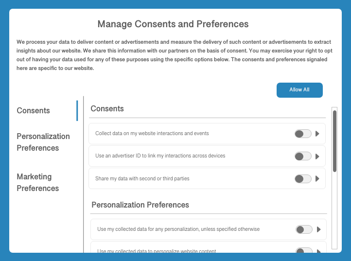

# Consent processing in Adobe Experience Platform

Adobe Experience Platform allows you to process the consent data you have collected from your customers and integrate it into your stored customer profiles. This data can then be used by downstream processes to determine whether data collection occurs for a specific customer, or whether their profiles are used for specific purposes. For example, the consent data for a particular profile can determine whether it can be included in an exported audience segment, or whether it can participate in specific marketing channels such as email, text messages, or push notifications.

This document provides an overview of how to configure your Platform data operations to ingest customer consent data generated by a consent-management platform (CMP) and integrate that data into customer profiles for downstream use cases.

>[!NOTE]
>
>This document focuses on processing consent data using the Adobe standard. If you are processing consent data in compliance with the IAB Transparency and Consent Framework (TCF) 2.0, see the guide on [TCF 2.0 support in Adobe Real-Time Customer Data Platform](../iab/overview.md).

## Prerequisites

This guide requires a working understanding of the various Experience Platform services involved in processing consent data:

* [Experience Data Model (XDM)](../../../../xdm/home.md): The standardized framework by which Experience Platform organizes customer experience data.
* [Adobe Experience Platform Identity Service](../../../../identity-service/home.md): Solves the fundamental challenge posed by the fragmentation of customer experience data by bridging identities across devices and systems.
* [Real-Time Customer Profile](../../../../profile/home.md): Uses [!DNL Identity Service] capabilities to create detailed customer profiles from your datasets in real time. Real-Time Customer Profile pulls data from the Data Lake and persists customer profiles in its own separate data store.
* [Adobe Experience Platform Web SDK](../../../../edge/home.md): A client-side JavaScript library that allows you to integrate various Platform services into your customer-facing website.
    * [SDK consent commands](../../../../edge/consent/supporting-consent.md): A use-case overview of the consent-related SDK commands shown in this guide.
* [Adobe Experience Platform Segmentation Service](../../../../segmentation/home.md): Allows you to divide Real-Time Customer Profile data into groups of individuals that share similar traits and will respond similarly to marketing strategies.

## Consent processing flow summary {#summary}

The following describes how consent data is processed after the system has been properly configured:

1. A customer provides their consent preferences for data collection through a dialog on your website.
1. On each page load (or when your CMP detects a change in consent preferences), a custom script on your site maps the current preferences to a standard XDM object. This object is then passed to the Platform Web SDK `setConsent` command.
1. When `setConsent` is called, the Platform Web SDK checks whether the consent values are different from those it last received. If the values are different (or there is no previous value), the structured consent/preference data is sent to Adobe Experience Platform.
1. The consent/preference data is ingested into a [!DNL Profile]-enabled dataset whose schema contains consent/preference fields.

In addition to SDK commands triggered by CMP consent-change hooks, consent data can also flow into Experience Platform through any customer-generated XDM data that is uploaded directly to a [!DNL Profile]-enabled dataset.

### Consent enforcement

In the current release of consent processing support in Platform, only the data collection permission (`collect.val`) is automatically enforced by the Platform Web SDK. While more granular consents and preferences can be collected and persisted in customer profiles, these additional signals must be manually enforced in your own downstream processes.

>[!NOTE]
>
>For more information on the structure of the XDM consent fields mentioned above, refer to the guide on the [[!UICONTROL Consents and Preferences] data type](../../../../xdm/data-types/consents.md).

Once the system has been configured, the Platform Web SDK interprets the data collection consent value for the current user to determine if the data should be sent to the Adobe Experience Platform Edge Network, dropped from the client, or persisted until the data collection permission is set to either yes or no.

## Determine how to generate customer consent data within your CMP {#consent-data}

Since each CMP system is unique, you must determine the best way to allow your customers to provide consent as they interact with your service. A common way to achieve this is by using a cookie consent dialog, similar to the following example:

This dialog should allow the customer to opt in or out of specific marketing and personalization use cases for their data. These consents and preferences should conform to the data model that you define for the [!DNL Profile]-enabled dataset in the next step.

## Add standardized consent fields to a [!DNL Profile]-enabled dataset {#dataset}

Customer consent data must be sent to a [!DNL Profile]-enabled dataset whose schema contains consent fields. These fields must be included in the same schema and dataset that you use to capture attribute information about individual customers.

Refer to the tutorial on [configuring a dataset for capturing consent data](./dataset.md) for detailed steps on how to add these required fields to a [!DNL Profile]-enabled dataset before continuing with this guide.

## Update [!DNL Profile] merge policies to include consent data {#merge-policies}

Once you have created a [!DNL Profile]-enabled dataset for processing consent data, you must ensure that your merge policies have been configured to always include consent fields in each customer profile. This involves setting dataset precedence so that your consent dataset is prioritized over other potentially conflicting datasets.

>[!NOTE]
>
>If you do not have any conflicting datasets, you should set timestamp precedence for your merge policy instead. This helps ensure that the latest consent specified by a customer is the consent setting that is used.

For more information on how to work with merge policies, begin by reading the [merge policies overview](../../../../profile/merge-policies/overview.md). When setting up your merge policies, you must ensure that your profiles include all the required consent attributes provided by the [!UICONTROL Consents and Preferences] schema field group, as outlined in the guide on [dataset preparation](./dataset.md).

## Bring consent data into Platform

Once you have your datasets and merge policies to represent the required consent fields in your customer profiles, the next step is to bring the consent data itself into Platform.

Primarily, you should be using the Adobe Experience Platform Web SDK to send consent data to Platform whenever consent-change events are detected by your CMP. If you are collecting consent data on a mobile platform, you should use the Adobe Experience Platform Mobile SDK. You can also opt to ingest your collected consent data directly by mapping it to your consent dataset's XDM schema and sending it to Platform through batch ingestion.

Details for each of these methods are provided in the subsections below.

### Configure the Experience Platform Web SDK to process consent data {#web-sdk}

Once you have configured your CMP to listen for consent-change events on your website, you can integrate the Experience Platform Web SDK to receive the updated consent settings and send them to Platform on every page load and whenever consent-change events occurs. See the guide on [configuring the Web SDK to process customer consent data](../sdk.md) for more information.

### Configure the Experience Platform Mobile SDK to process consent data {#mobile-sdk}

If customer consent preferences are required in your mobile application, you can integrate the Experience Platform Mobile SDK to retrieve and update consent settings, sending them to Platform whenever the Consent API is called.

See the Mobile SDK documentation for [configuring the Consent mobile extension](https://developer.adobe.com/client-sdks/documentation/consent-for-edge-network/) and [using the Consent API](https://developer.adobe.com/client-sdks/documentation/consent-for-edge-network/api-reference/). For more details on how to handle privacy concerns using the Mobile SDK, please refer to the section [Privacy and GDPR](https://developer.adobe.com/client-sdks/resources/privacy-and-gdpr/). 

### Ingest XDM-compliant consent data directly {#batch}

You can ingest XDM-compliant consent data from a CSV file by using batch ingestion. This can be useful if you have a backlog of previously collected consent data that has yet to be integrated into your customer profiles.

Follow the tutorial on [mapping a CSV file to XDM](../../../../ingestion/tutorials/map-csv/overview.md) to learn how to convert your data fields to XDM and ingest them into Platform. When selecting the [!UICONTROL Destination] for the mapping, ensure that you select the **[!UICONTROL Use existing dataset]** option and choose the [!DNL Profile]-enabled consent dataset you created earlier.

## Test your implementation {#test-implementation}

After you have ingested customer consent data into your [!DNL Profile]-enabled dataset, you can check your updated profiles to see whether they contain consent attributes.

>[!IMPORTANT]
>
>In order to view the attributes of an existing profile in the UI, you must know at least one identity value (and its corresponding namespace) associated with that profile.
>
>If you do not have access to this information, you can opt to ingest your own test consent data and associate it with an identity value/namespace that is known to you instead.

See the section on [browsing profiles by identity](../../../../profile/ui/user-guide.md#browse) in the [!DNL Profile] UI guide for specific steps on how to look up the details of a profile.

The new consent attributes will not appear on a profile's dashboard by default. Therefore, you must navigate to the **[!UICONTROL Attributes]** tab on the details page of a profile in order to confirm that they have been ingested as expected. See the guide on the [profile dashboard](../../../../profile/ui/profile-dashboard.md) to learn how to customize the dashboard to suit your needs.

<!-- (To be included once CJM is GA)
## Handling consent in Customer Journey Management

If you are using Customer Journey Management, after confirming that your profiles and segments contain consent data, you can start honoring customer [marketing preferences](../../../../xdm/data-types/consents.md#marketing) when pulling segments from Platform. Specifically, profiles who have opted out of the email marketing preference should not be included in segments that are targeted for email campaigns.

Customer Journey Management can also send consent-change signals back to Platform. When a customer selects an "unsubscribe" link in an email message, the updated consent preference is sent to Platform and the appropriate profile attributes are updated accordingly.
-->

## Next steps

This guide covered how to configure your Platform operations to process customer consent data using the Adobe standard, and have those attributes represented in customer profiles. You can now integrate customer consent preferences as a determining factor in segment qualification and other downstream use cases.

For more information on Experience Platform's privacy-related capabilities, see the overview on [governance, privacy, and security in Platform](../../overview.md).
