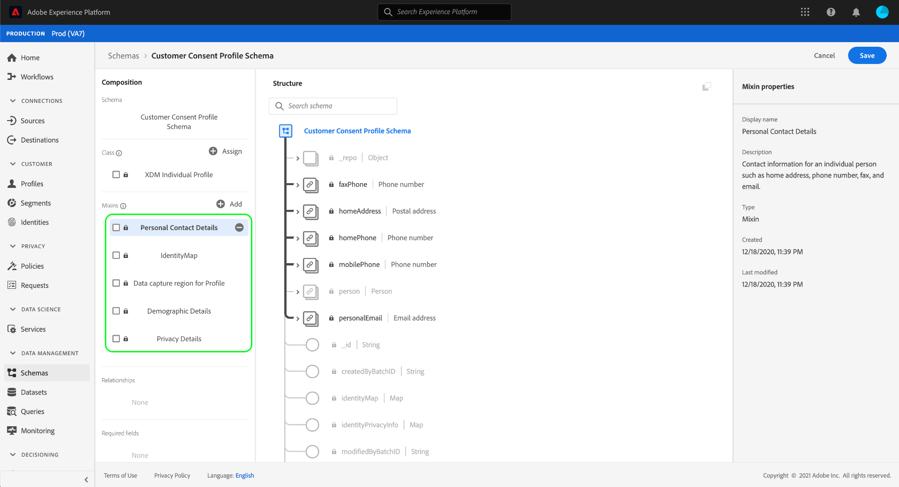

# Create datasets for capturing IAB TCF 2.0 consent data

In order for Adobe Experience Platform to process customer consent data in accordance with the IAB [!DNL Transparency & Consent Framework] (TCF) 2.0, that data must be sent to datasets whose schemas contain TCF 2.0 consent fields.

Specifically, two datasets are required for capturing TCF 2.0 consent data:

* A dataset based on the [!DNL XDM Individual Profile] class, enabled for use in [!DNL Real-time Customer Profile].
* A dataset based on the [!DNL XDM ExperienceEvent] class.

This document provides steps for setting up these two datasets to collect IAB TCF 2.0 consent data. For an overview of the full workflow to configure your Platform data operations for TCF 2.0, refer to the [IAB TCF 2.0 compliance overview](./overview.md).

## Prerequisites

This tutorial requires a working understanding of the following components of Adobe Experience Platform:

* [Experience Data Model (XDM)](../../../../xdm/home.md): The standardized framework by which [!DNL Experience Platform] organizes customer experience data.
    * [Basics of schema composition](../../../../xdm/schema/composition.md): Learn about the basic building blocks of XDM schemas.
* [Adobe Experience Platform Identity Service](../../../../identity-service/home.md): Allows you to bridge customer identities from your disparate data sources across devices and systems.
    * [Identity namespaces](../../../../identity-service/namespaces.md): Customer identity data must be provided under a specific identity namespace recognized by Identity Service.
* [Real-time Customer Profile](../../../../profile/home.md): Leverages [!DNL Identity Service] to let you create detailed customer profiles from your datasets in real-time. [!DNL Real-time Customer Profile] pulls data from the Data Lake and persists customer profiles in its own separate data store.

## [!UICONTROL Privacy Details] mixin structure {#structure}

The [!UICONTROL Privacy Details] mixin provides customer consent fields that are required for TCF 2.0 support. There are two versions of this mixin: one compatible with the [!DNL XDM Individual Profile] class, and the other with the [!DNL XDM ExperienceEvent] class.

The sections below explain the structure of each of these mixins, including the data they expect during ingestion.

### Profile mixin {#profile-mixin}

For schemas based on [!DNL XDM Individual Profile], the [!UICONTROL Privacy Details] mixin provides a single map-type field, `xdm:identityPrivacyInfo`, which maps customer identities to their TCF consent preferences. The following JSON is an example of the kind of data `xdm:identityPrivacyInfo` expects upon data ingestion:

```json
{
  "xdm:identityPrivacyInfo": {
      "ECID": {
        "13782522493631189": {
          "xdm:identityIABConsent": {
            "xdm:consentTimestamp": "2020-04-11T05:05:05Z",
            "xdm:consentString": {
              "xdm:consentStandard": "IAB TCF",
              "xdm:consentStandardVersion": "2.0",
              "xdm:consentStringValue": "BObdrPUOevsguAfDqFENCNAAAAAmeAAA.PVAfDObdrA.DqFENCAmeAENCDA",
              "xdm:gdprApplies": true,
              "xdm:containsPersonalData": false
            }
          }
        }
      }
    }
}
```

As the example shows, each root-level key of `xdm:identityPrivacyInfo` corresponds with an identity namespace recognized by Identity Service. In turn, each namespace property must have at least one sub-property whose key matches the customer's corresponding identity value for that namespace. In this example, the customer is identified with an Experience Cloud ID (`ECID`) value of `13782522493631189`.

>[!NOTE]
>
>While the above example uses a single namespace/value pair to represent the customer's identity, you can add additional keys for other namespaces, and each namespace can have multiple identity values, each with their own set of TCF consent preferences.

Within the identity value object is a single field, `xdm:identityIABConsent`. This object captures the customer's TCF consent values for the specified identity namespace and value. The sub-properties contained in this field are listed below:

| Property | Description |
| --- | --- |
| `xdm:consentTimestamp` | An [ISO 8601](https://www.ietf.org/rfc/rfc3339.txt) timestamp of when the TCF consent values changed. |
| `xdm:consentString` | An object containing the customer's updated consent data and other contextual information. See the section on [consent string properties](#consent-string) to learn about this object's required sub-properties. |

### Event mixin {#event-mixin}

For schemas based on [!DNL XDM ExperienceEvent], the [!UICONTROL Privacy Details] mixin provides a single array-type field: `xdm:consentStrings`. Each item in this array must be an object that contains the necessary properties for a TCF consent string, similar to the `xdm:consentString` field in the profile mixin. For more information on these sub-properties, see the [next section](#consent-string).

```json
{
  "xdm:consentStrings": [
    {
      "xdm:consentStandard": "IAB TCF",
      "xdm:consentStandardVersion": "2.0",
      "xdm:consentStringValue": "BObdrPUOevsguAfDqFENCNAAAAAmeAAA.PVAfDObdrA.DqFENCAmeAENCDA",
      "xdm:gdprApplies": true,
      "xdm:containsPersonalData": false
    }
  ]
}
```

### Consent string properties {#consent-string}

Both versions of the [!UICONTROL Privacy Details] mixin require at least one object that captures the necessary fields that describe the TCF consent string for the customer. These properties are explained below:

| Property | Description |
| --- | --- |
| `xdm:consentStandard` | The consent framework that the data applies to. For TCF compliance, the value must be `IAB TCF`. |
| `xdm:consentStandardVersion` | The version number of the consent framework indicated by `xdm:consentStandard`. For TCF 2.0 compliance, the value must be `2.0`. |
| `xdm:consentStringValue` | The consent string that was generated by the consent management platform (CMP) based on the customer's selected settings. |
| `xdm:gdprApplies` | A boolean value indicating whether or not the GDPR applies to this customer. The value must be set to `true` in order for TCF 2.0 enforcement to occur. Defaults to `true` if not included. |
| `xdm:containsPersonalData` | A boolean value indicating whether or not the consent update contains personal data. Defaults to `false` if not included. |

## Create customer consent schemas {#create-schemas}

In order to create datasets that captures consent data, you must first create XDM schemas to base those datasets on.

In the Platform UI, select **[!UICONTROL Schemas]** in the left navigation to open the [!UICONTROL Schemas] workspace. From here, follow the steps in the sections below to create each required schema.

>[!NOTE]
>
>If you have existing XDM schemas that you want to use to capture consent data instead, you can edit those schemas instead of creating new ones. However, if an existing schema has been enabled for use in Real-time Customer Profile, its primary identity cannot be a directly identifiable field that is prohibited from use in interest-based advertising, such as an email address. Consult your legal counsel if you are unsure which fields are restricted.
>
>Additionally, when editing existing schemas, only additive (non-breaking) changes can be made. See the section on the [principles of schema evolution](../../../../xdm/schema/composition.md#evolution) for more information.

### Create a record-based consent schema {#profile-schema}

In the **[!UICONTROL Schemas]** workspace, select **[!UICONTROL Create schema]**, then choose **[!UICONTROL XDM Individual Profile]** from the dropdown.


The [!DNL Schema Editor] appears, showing the structure of the schema in the canvas. Use the right rail to provide a name and description for the schema, then select **[!UICONTROL Add]** under the **[!UICONTROL Mixins]** section on the left side of the canvas.


The **[!UICONTROL Add mixin]** dialog appears. From here, select **[!UICONTROL Privacy Details]** from the list. You can optionally use the search bar to narrow down results to locate the mixin easier. Once the mixin is selected, select **[!UICONTROL Add mixin]**.


The canvas reappears, showing that the `identityPrivacyInfo` field has been added to the schema structure.


From here, repeat the above steps to add the following additional mixins to the schema:

* [!UICONTROL IdentityMap]
* [!UICONTROL Data capture region for Profile]
* [!UICONTROL Demographic Details]
* [!UICONTROL Personal Contact Details]



If you are editing an existing schema that has already been enabled for use in [!DNL Real-time Customer Profile], select **[!UICONTROL Save]** to confirm your changes before skipping ahead to the section on [creating a dataset based on your consent schema](#dataset). If you are creating a new schema, continue following the steps outlined in the subsection below.

#### Enable the schema for use in [!DNL Real-time Customer Profile]

In order for Platform to associate the consent data it receives to specific customer profiles, the consent schema must be enabled for use in [!DNL Real-time Customer Profile].

>[!NOTE]
>
>The example schema shown in this section uses its `identityMap` field as its primary identity. If you wish to set another field as a primary identity, ensure that you are using an indirect identifier like a cookie ID, and not a directly identifiable field that is prohibited from use in interest-based advertising, such as an email address. Consult your legal counsel if you are unsure which fields are restricted.
>
>Steps on how to set a primary identity field for a schema can be found in the [schema creation tutorial](../../../../xdm/tutorials/create-schema-ui.md#identity-field).

To enable the schema for [!DNL Profile], select the schema's name in the left-hand rail to open the **[!UICONTROL Schema properties]** dialog in the right-hand rail. From here, select the **[!UICONTROL Profile]** toggle button.


A popover appears, indicating a missing primary identity. Select the checkbox for using an alternate primary identity, as the primary identity will be contained in the `identityMap` field.


Finally, select **[!UICONTROL Save]** to confirm your changes.


### Create a time-series-based consent schema {#event-schema}

In the **[!UICONTROL Schemas]** workspace, select **[!UICONTROL Create schema]**, then choose **[!UICONTROL XDM ExperienceEvent]** from the dropdown.


The [!DNL Schema Editor] appears, showing the structure of the schema in the canvas. Use the right rail to provide a name and description for the schema, then select **[!UICONTROL Add]** under the **[!UICONTROL Mixins]** section on the left side of the canvas.


The **[!UICONTROL Add mixin]** dialog appears. From here, select **[!UICONTROL Privacy Details]** from the list. You can optionally use the search bar to narrow down results to locate the mixin easier. Once you have chosen a mixin, select **[!UICONTROL Add mixin]**.


The canvas reappears, showing that the `consentStrings` array has been added to the schema structure.


From here, repeat the above steps to add the following additional mixins to the schema:

* [!UICONTROL IdentityMap]
* [!UICONTROL Environment Details]
* [!UICONTROL Web Details]
* [!UICONTROL Implementation Details]

Once the mixins have been added, finish by selecting **[!UICONTROL Save]**.


## Create datasets based on your consent schemas {#datasets}

For each of the required schemas described above, you must create a dataset that will ultimately ingest your customers' consent data. The dataset based on the record schema must be enabled for [!DNL Real-time Customer Profile], while the dataset based on the time-series schema **should not** be [!DNL Profile]-enabled.

To begin, select **[!UICONTROL Datasets]** in the left navigation, then select **[!UICONTROL Create dataset]** in the top-right corner.


On the next page, select **[!UICONTROL Create dataset from schema]**.


The **[!UICONTROL Create dataset from schema]** workflow appears, starting at the **[!UICONTROL Select schema]** step. In the provided list, locate one of the consent schemas that you created earlier. You can optionally use the search bar to narrow down results and locate your schema easier. Select the radio button next to the desired schema, then select **[!UICONTROL Next]** to continue.


The **[!UICONTROL Configure dataset]** step appears. Provide a unique, easily identifiable name and description for the dataset before selecting **[!UICONTROL Finish]**.


The details page for the newly created dataset appears. If the dataset is based on your time-series schema, then the process is complete. If the dataset is based on your record schema, the final step in the process is to enable the dataset for use in [!DNL Real-time Customer Profile].

In the right-hand rail, select the **[!UICONTROL Profile]** toggle, then select **[!UICONTROL Enable]** in the confirmation popover to enable the schema for [!DNL Profile].


Follow the above steps again to create the other required dataset for TCF 2.0 compliance.

## Next steps

By following this tutorial, you have created two datasets that can now be used to collect customer consent data:

* A record-based dataset that is enabled for use in Real-time Customer Profile.
* A time-series-based dataset that is not enabled for [!DNL Profile].

You can now return to the [IAB TCF 2.0 overview](./overview.md#merge-policies) to continue the process of configuring Platform for TCF 2.0 compliance.