# Create datasets for capturing IAB TCF 2.0 consent data

In order for Adobe Experience Platform to process customer consent data in accordance with the IAB [!DNL Transparency & Consent Framework] (TCF) 2.0, that data must be sent to datasets whose schemas contain TCF 2.0 consent fields.

Specifically, two datasets are required for capturing TCF 2.0 consent data:

* A dataset based on the [!DNL XDM Individual Profile] class, enabled for use in [!DNL Real-Time Customer Profile].
* A dataset based on the [!DNL XDM ExperienceEvent] class.

>[!IMPORTANT]
>
>Platform only enforces the TCF strings collected in the Individual Profile dataset. While an ExperienceEvent dataset is still required to create a datastream as part of this workflow, you only need to ingest data into the profile dataset. The ExperienceEvent dataset can still be used if you wish to track consent change events over time, but these values are not used in when enforcing on segment activation.

This document provides steps for setting up these two datasets. For an overview of the full workflow to configure your Platform data operations for TCF 2.0, refer to the [IAB TCF 2.0 compliance overview](./overview.md).

## Prerequisites

This tutorial requires a working understanding of the following components of Adobe Experience Platform:

* [Experience Data Model (XDM)](../../../../xdm/home.md): The standardized framework by which [!DNL Experience Platform] organizes customer experience data.
    * [Basics of schema composition](../../../../xdm/schema/composition.md): Learn about the basic building blocks of XDM schemas.
* [Adobe Experience Platform Identity Service](../../../../identity-service/home.md): Allows you to bridge customer identities from your disparate data sources across devices and systems.
    * [Identity namespaces](../../../../identity-service/namespaces.md): Customer identity data must be provided under a specific identity namespace recognized by Identity Service.
* [Real-Time Customer Profile](../../../../profile/home.md): Leverages [!DNL Identity Service] to let you create detailed customer profiles from your datasets in real time. [!DNL Real-Time Customer Profile] pulls data from the Data Lake and persists customer profiles in its own separate data store.

## TCF 2.0 field groups {#field-groups}

The [!UICONTROL IAB TCF 2.0 Consent Details] schema field group provides customer consent fields that are required for TCF 2.0 support. There are two versions of this field group: one compatible with the [!DNL XDM Individual Profile] class, and the other with the [!DNL XDM ExperienceEvent] class.

The sections below explain the structure of each of these field groups, including the data they expect during ingestion.

### Profile field group {#profile-field-group}

For schemas based on [!DNL XDM Individual Profile], the [!UICONTROL IAB TCF 2.0 Consent Details] field group provides a single map-type field, `identityPrivacyInfo`, which maps customer identities to their TCF consent preferences. This field group must be included in a record-based schema that is enabled for Real-Time Customer Profile in order for automatic enforcement to take place.

See the [reference guide](../../../../xdm/field-groups/profile/iab.md) for this field group to learn more about its structure and use case.

### Event field group {#event-field-group}

If you want to track consent-change events over time, you can add the [!UICONTROL IAB TCF 2.0 Consent Details] field group to your [!UICONTROL XDM ExperienceEvent] schema.

If you do not plan on tracking consent change events over time, you do not need to include this field group in your event schema. When automatically enforcing TCF consent values, Experience Platform only uses the latest consent information ingested into the [profile field group](#profile-field-group). Consent values captured by events do not participate in automatic enforcement workflows.

See the [reference guide](../../../../xdm/field-groups/event/iab.md) for this field group for more information on its structure and use case.

## Create customer consent schemas {#create-schemas}

In order to create datasets that capture consent data, you must first create XDM schemas to base those datasets on.

As mentioned in the previous section, a schema that uses the [!UICONTROL XDM Individual Profile] class is required in order to enforce consent in downstream Platform workflows. You can also optionally create a separate schema based on [!UICONTROL XDM ExperienceEvent] if you wish to track consent changes over time. Both schemas must contain an `identityMap` field and an appropriate TCF 2.0 field group.

In the Platform UI, select **[!UICONTROL Schemas]** in the left navigation to open the [!UICONTROL Schemas] workspace. From here, follow the steps in the sections below to create each required schema.

>[!NOTE]
>
>If you have existing XDM schemas that you want to use to capture consent data instead, you can edit those schemas instead of creating new ones. However, if an existing schema has been enabled for use in Real-Time Customer Profile, its primary identity cannot be a directly identifiable field that is prohibited from use in interest-based advertising, such as an email address. Consult your legal counsel if you are unsure which fields are restricted.
>
>Additionally, when editing existing schemas, only additive (non-breaking) changes can be made. See the section on the [principles of schema evolution](../../../../xdm/schema/composition.md#evolution) for more information.

### Create a profile consent schema {#profile-schema}

Select **[!UICONTROL Create schema]**, then choose **[!UICONTROL XDM Individual Profile]** from the dropdown menu.

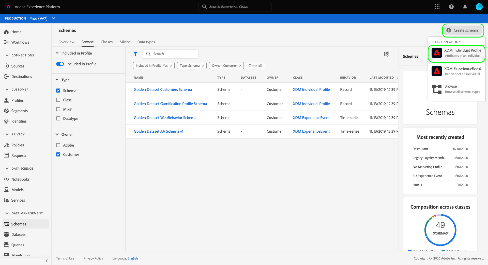

The **[!UICONTROL Add field groups]** dialog appears, allowing you to start adding field groups to the schema right away. From here, select **[!UICONTROL IAB TCF 2.0 Consent Details]** from the list. You can optionally use the search bar to narrow down results to locate the field group easier.

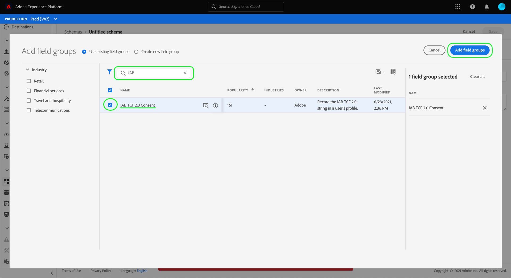

Next, find the **[!UICONTROL IdentityMap]** field group from the list and select it as well. Once both field groups are listed in the right rail, select **[!UICONTROL Add field groups]**.

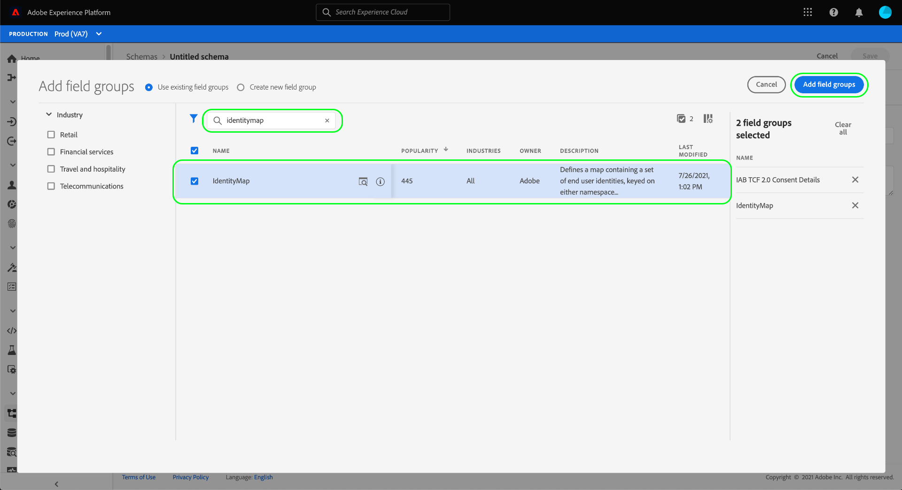

The canvas reappears, showing that the `identityPrivacyInfo` and `identityMap` fields have been added to the schema structure.

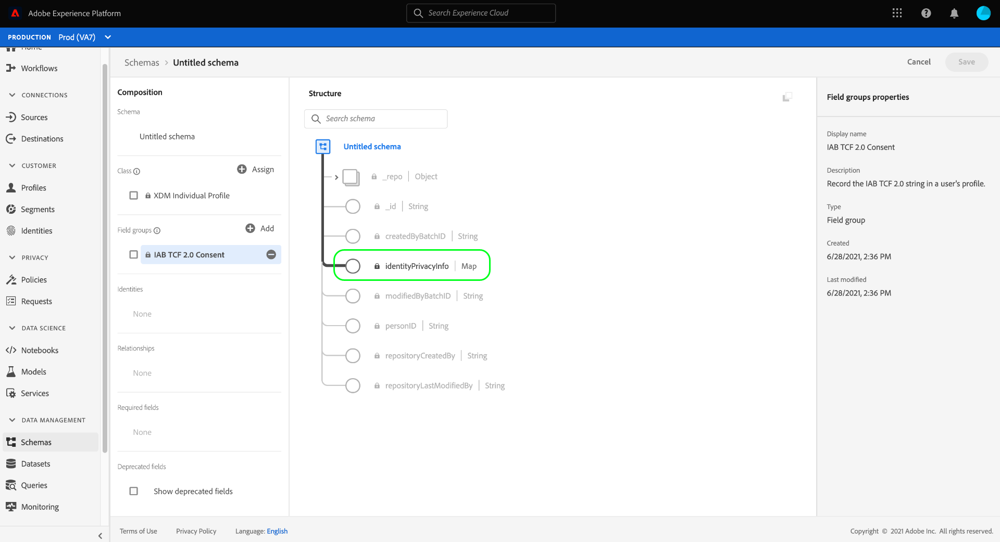

Before adding more fields to the schema, select the root field to reveal **[!UICONTROL Schema properties]** in the right rail, where you can provide a name and description for the schema.

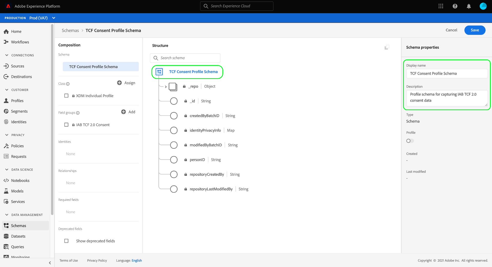

After you've provided a name and description, you can optionally add more fields to the schema by selecting **[!UICONTROL Add]** under the **[!UICONTROL Field groups]** section on the left side of the canvas.

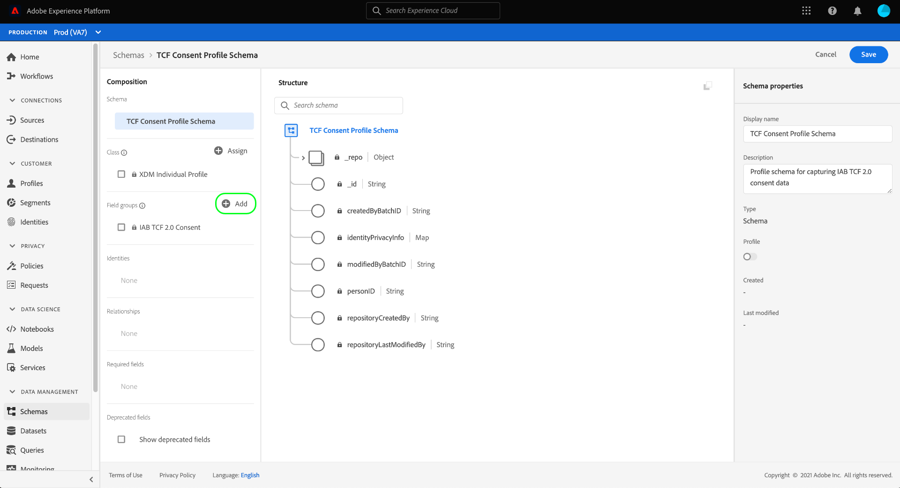

If you are editing an existing schema that has already been enabled for use in [!DNL Real-Time Customer Profile], select **[!UICONTROL Save]** to confirm your changes before skipping ahead to the section on [creating a dataset based on your consent schema](#dataset). If you are creating a new schema, continue following the steps outlined in the subsection below.

#### Enable the schema for use in [!DNL Real-Time Customer Profile]

In order for Platform to associate the consent data it receives to specific customer profiles, the consent schema must be enabled for use in [!DNL Real-Time Customer Profile].

>[!NOTE]
>
>The example schema shown in this section uses its `identityMap` field as its primary identity. If you wish to set another field as a primary identity, ensure that you are using an indirect identifier like a cookie ID, and not a directly identifiable field that is prohibited from use in interest-based advertising, such as an email address. Consult your legal counsel if you are unsure which fields are restricted.
>
>Steps on how to set a primary identity field for a schema can be found in the [[!UICONTROL Schemas] UI guide](../../../../xdm/ui/fields/identity.md).

To enable the schema for [!DNL Profile], select the schema's name in the left rail to open the **[!UICONTROL Schema properties]** section. From here, select the **[!UICONTROL Profile]** toggle button.

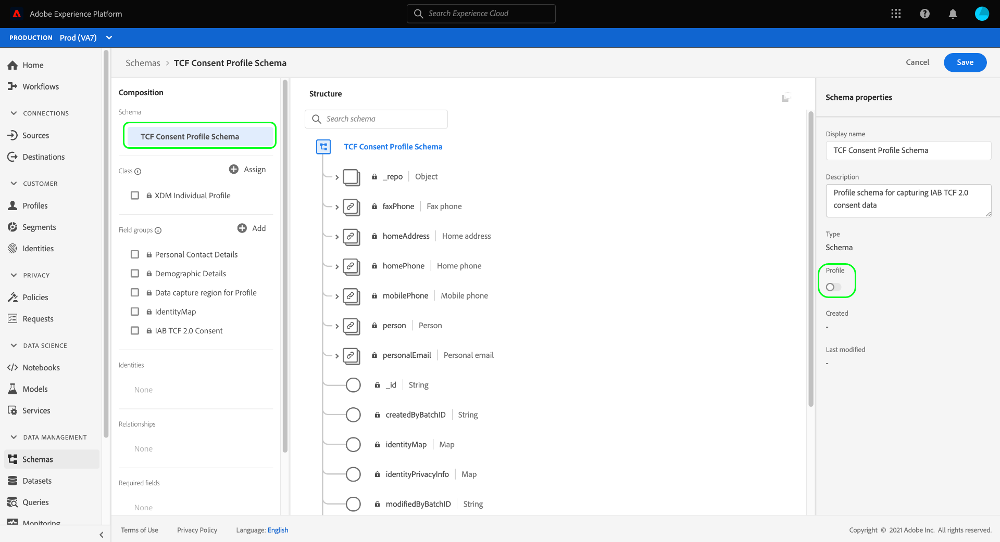

A popover appears, indicating a missing primary identity. Select the checkbox for using an alternate primary identity, as the primary identity will be contained in the `identityMap` field.

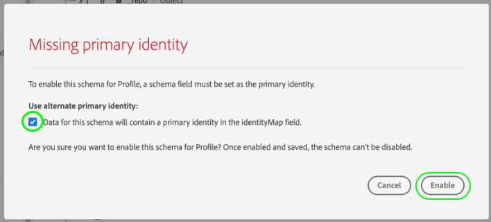

Finally, select **[!UICONTROL Save]** to confirm your changes.

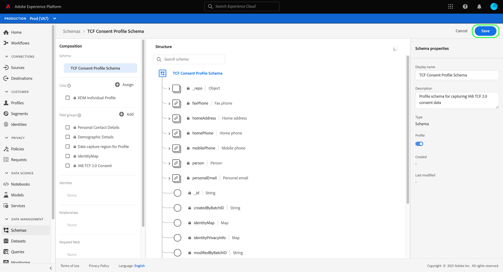

### Create an event consent schema {#event-schema}

>[!NOTE]
>
>Event consent schemas are only used to track consent change events over time, and do not participate in downstream enforcement workflows. If you do not wish to track consent changes over time, you can skip ahead to the next section on [creating consent datasets](#datasets).

In the **[!UICONTROL Schemas]** workspace, select **[!UICONTROL Create schema]**, then choose **[!UICONTROL XDM ExperienceEvent]** from the dropdown.

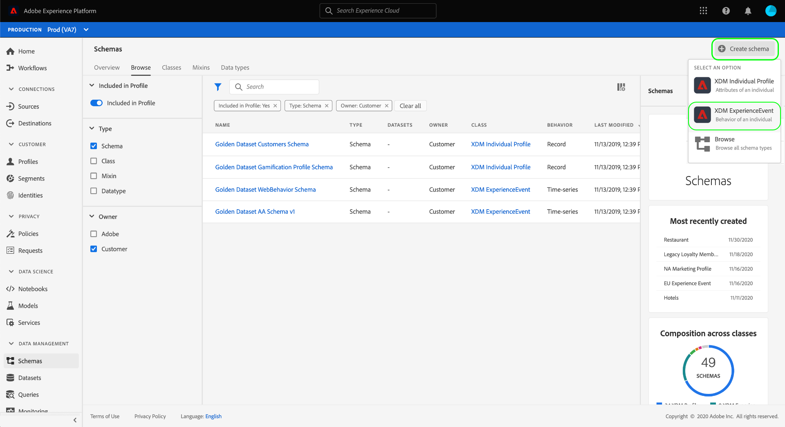

The **[!UICONTROL Add field groups]** dialog appears. From here, select **[!UICONTROL IAB TCF 2.0 Consent Details]** from the list. You can optionally use the search bar to narrow down results to locate the field group easier.

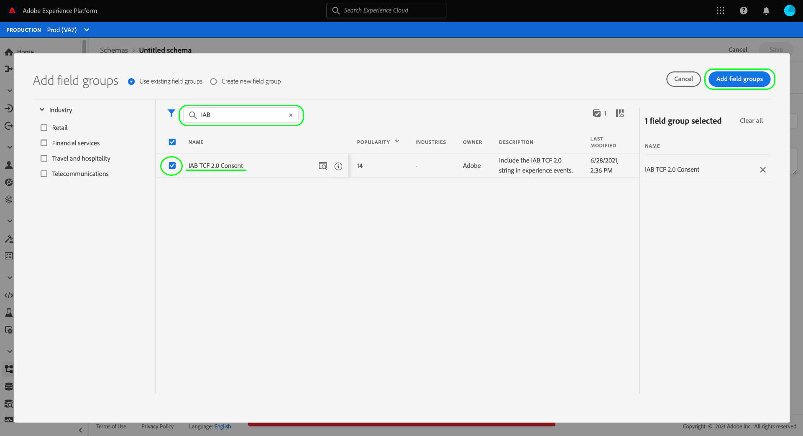

Next, find the **[!UICONTROL IdentityMap]** field group from the list and select it as well. Once both field groups are listed in the right rail, select **[!UICONTROL Add field groups]**.

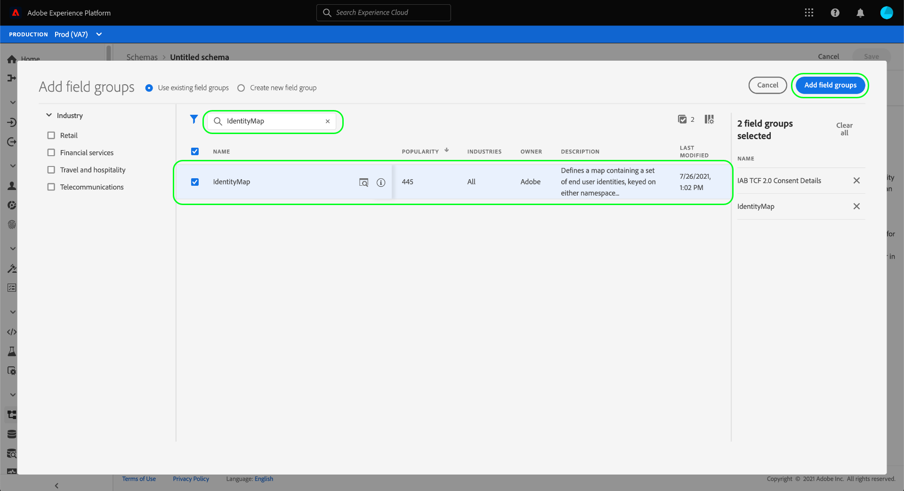

The canvas reappears, showing that the `consentStrings` and `identityMap` fields have been added to the schema structure.

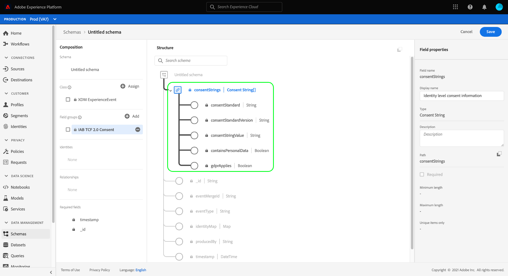

Before adding more fields to the schema, select the root field to reveal **[!UICONTROL Schema properties]** in the right rail, where you can provide a name and description for the schema.

After you've provided a name and description, you can optionally add more fields to the schema by selecting **[!UICONTROL Add]** under the **[!UICONTROL Field groups]** section on the left side of the canvas.

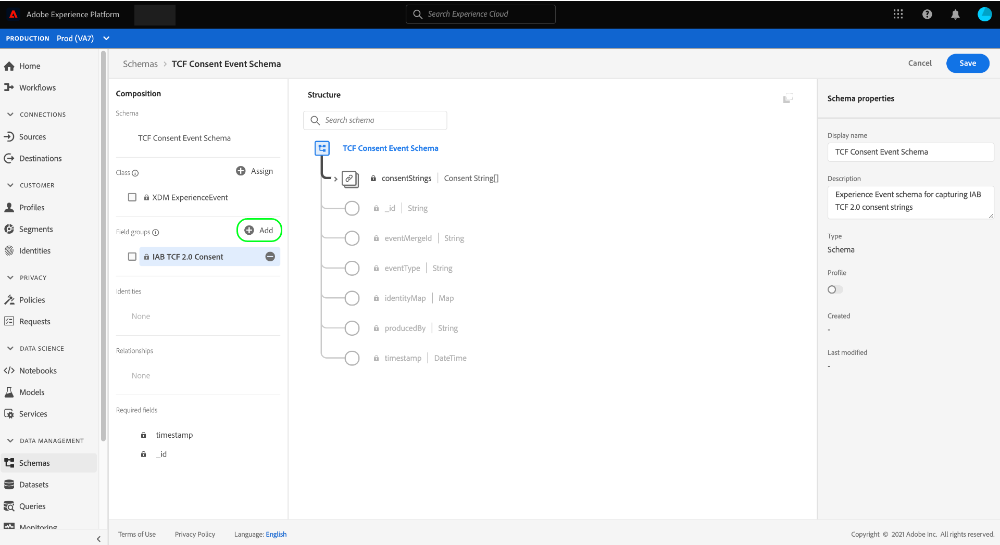

Once the field groups that you require have been added, finish by selecting **[!UICONTROL Save]**.

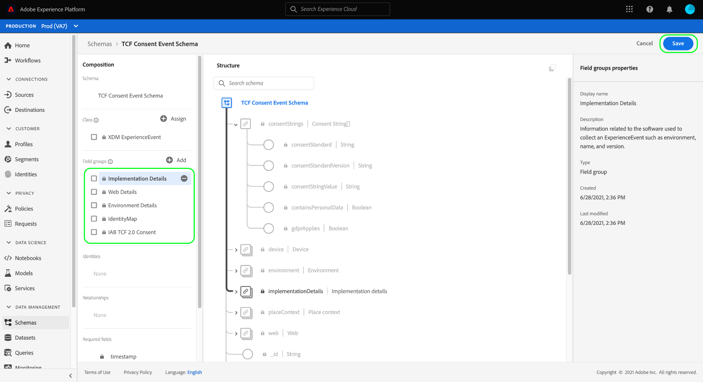

## Create datasets based on your consent schemas {#datasets}

For each of the required schemas described above, you must create a dataset that will ultimately ingest your customers' consent data. The dataset based on the record schema must be enabled for [!DNL Real-Time Customer Profile], while the dataset based on the time-series schema **should not** be [!DNL Profile]-enabled.

To begin, select **[!UICONTROL Datasets]** in the left navigation, then select **[!UICONTROL Create dataset]** in the top-right corner.

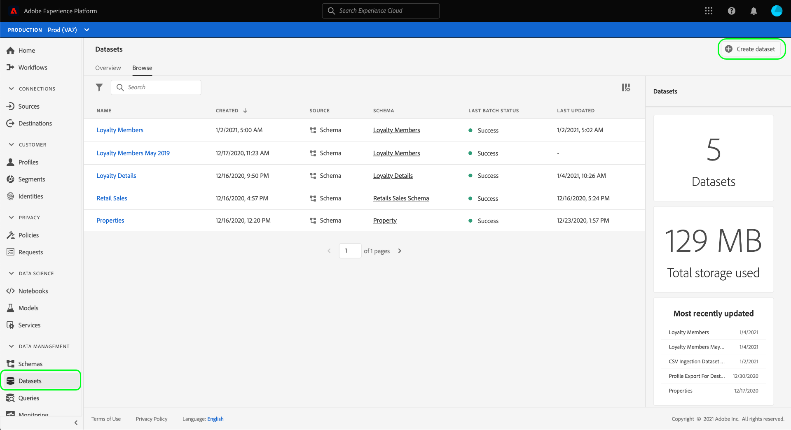

On the next page, select **[!UICONTROL Create dataset from schema]**.

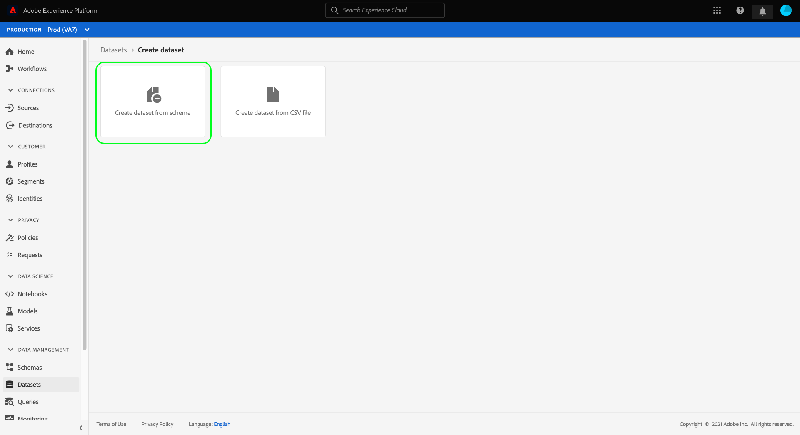

The **[!UICONTROL Create dataset from schema]** workflow appears, starting at the **[!UICONTROL Select schema]** step. In the provided list, locate one of the consent schemas that you created earlier. You can optionally use the search bar to narrow down results and locate your schema easier. Select the radio button next to the desired schema, then select **[!UICONTROL Next]** to continue.

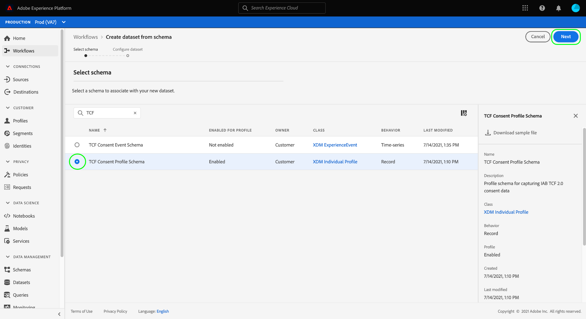

The **[!UICONTROL Configure dataset]** step appears. Provide a unique, easily identifiable name and description for the dataset before selecting **[!UICONTROL Finish]**.

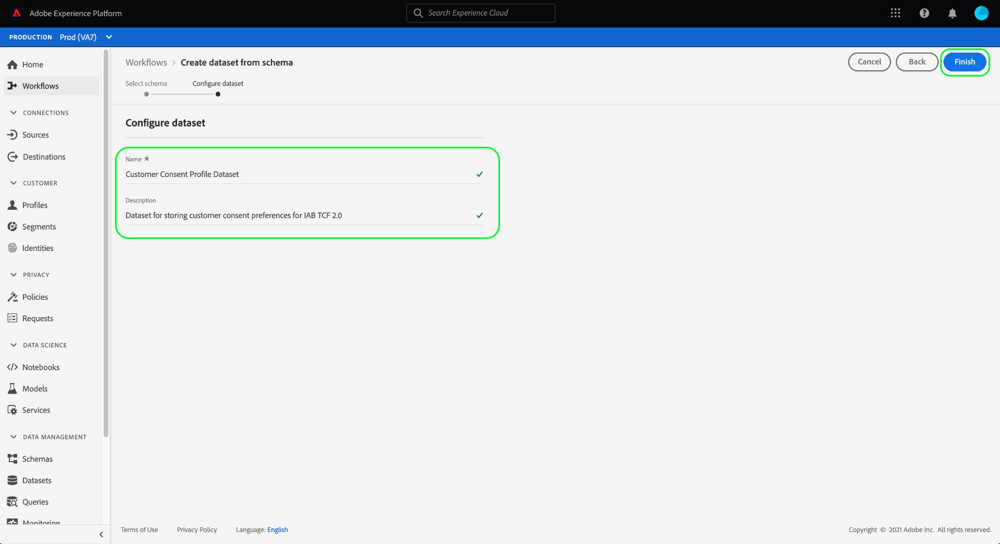

The details page for the newly created dataset appears. If the dataset is based on your time-series schema, then the process is complete. If the dataset is based on your record schema, the final step in the process is to enable the dataset for use in [!DNL Real-Time Customer Profile].

In the right rail, select the **[!UICONTROL Profile]** toggle, then select **[!UICONTROL Enable]** in the confirmation popover to enable the schema for [!DNL Profile].

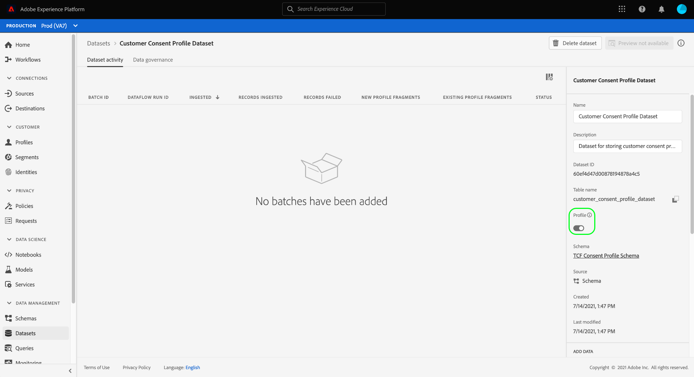

Follow the above steps again to create an event-based dataset if you created a schema for it.

## Next steps

By following this tutorial, you have created at least one dataset that can now be used to collect customer consent data:

* A record-based dataset that is enabled for use in Real-Time Customer Profile. **(Required)**
* A time-series-based dataset that is not enabled for [!DNL Profile]. (Optional)

You can now return to the [IAB TCF 2.0 overview](./overview.md#merge-policies) to continue the process of configuring Platform for TCF 2.0 compliance.
