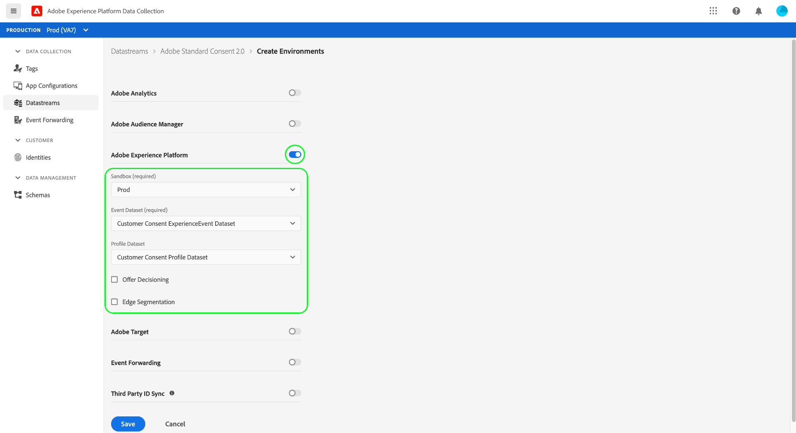
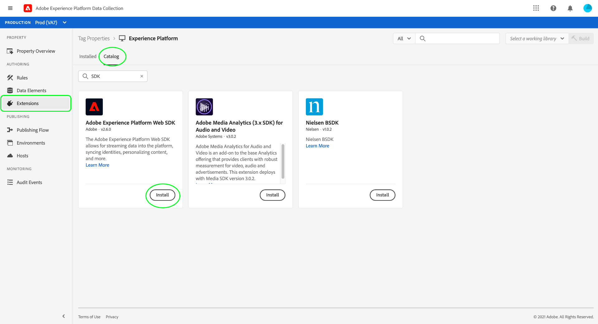
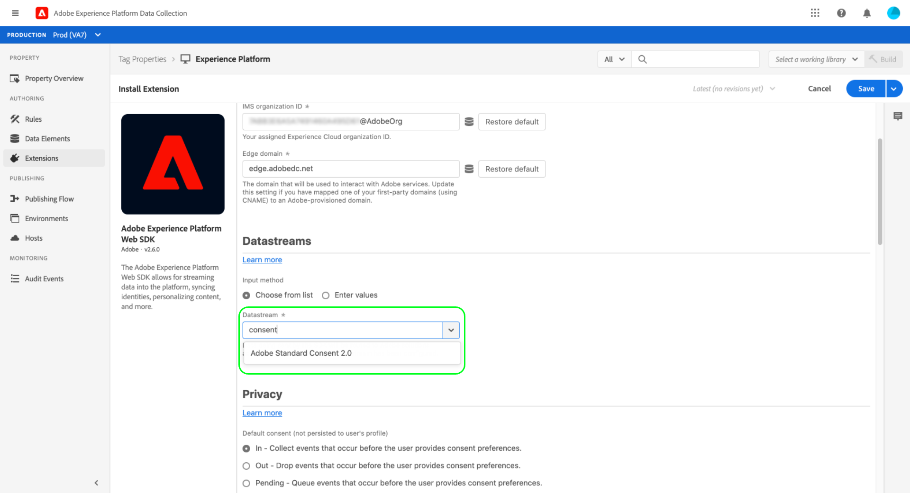
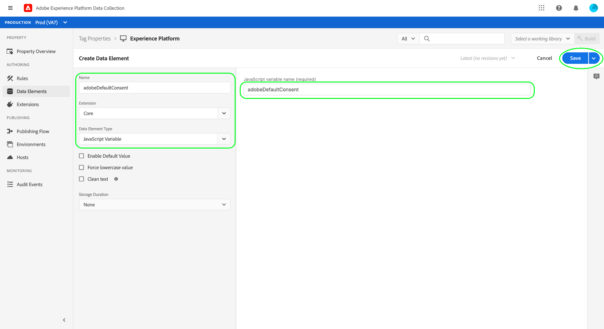
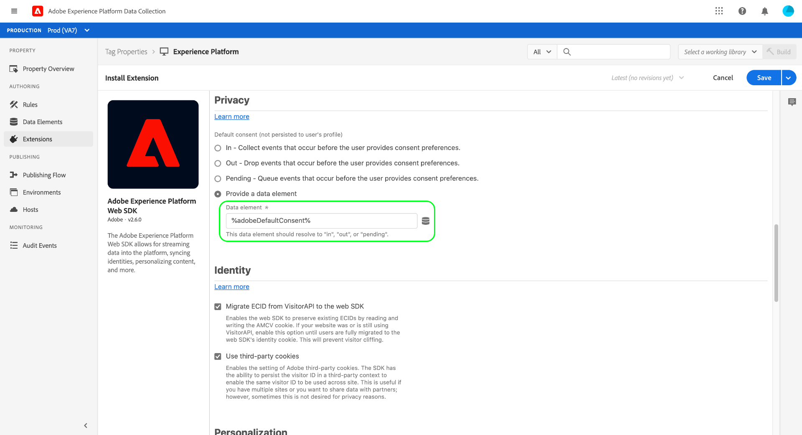

# Integrate the Platform Web SDK to process customer consent data

The Adobe Experience Platform Web SDK allows you to retrieve customer consent signals generated by Consent Management Platforms (CMPs) and send them to Adobe Experience Platform whenever a consent-change event occurs.

**The SDK does not interface with any CMPs out of the box**. It is up to you to determine how to integrate the SDK into your website, listen for consent changes in the CMP, and call the appropriate command. This document provides general guidance on how to integrate your CMP with the Platform Web SDK.

## Prerequisites {#prerequisites}

This tutorial assumes that you have already determined how to generate consent data within your CMP, and have created a dataset containing consent fields that conform to the Adobe standard or the IAB Transparency and Consent Framework (TCF) 2.0 standard. If you have not created this dataset yet, refer to the following tutorials before returning to this guide:

* [Create a dataset using the Adobe standard](./adobe/dataset.md)
* [Create a dataset using the TCF 2.0 standard](./iab/dataset.md)

This guide follows the workflow for setting up the SDK using the tag extension in the UI. If you do not want to use the extension and would prefer to directly embed the standalone version of the SDK on your site, please refer to the following docs instead of this guide:

* [Configure a datastream](../../../edge/datastreams/overview.md)
* [Install the SDK](../../../edge/fundamentals/installing-the-sdk.md)
* [Configure the SDK for consent commands](../../../edge/consent/supporting-consent.md)

The installation steps in this guide require a working understanding of tag extensions and how they are installed in web applications. Refer to the following documentation for more information:

* [Tags overview](../../../tags/home.md)
* [Quickstart guide](../../../tags/quick-start/quick-start.md)
* [Publishing overview](../../../tags/ui/publishing/overview.md)

## Set up a datastream

In order for the SDK to send data to Experience Platform, you must first configure a datastream. In the Data Collection UI or Experience Platform UI, select **[!UICONTROL Datastreams]** in the left navigation.

After creating a new datastream or selecting an existing one to edit, select the toggle button next to **[!UICONTROL Adobe Experience Platform]**. Next, use the values listed below to complete the form.



| Datastream field | Value |
| --- | --- |
| [!UICONTROL Sandbox] | The name of the Platform [sandbox](../../../sandboxes/home.md) that contains the required streaming connection and datasets to set up the datastream. |
| [!UICONTROL Streaming Inlet] | A valid streaming connection for Experience Platform. See the tutorial on [creating a streaming connection](../../../ingestion/tutorials/create-streaming-connection-ui.md) if you do not have an existing streaming inlet. |
| [!UICONTROL Event Dataset] | An [!DNL XDM ExperienceEvent] dataset that you plan on sending event data to using the SDK. While you are required to provide an event dataset in order to create a Platform datastream, please note that consent data sent via events is not honored in downstream enforcement workflows. |
| [!UICONTROL Profile Dataset] | The [!DNL Profile]-enabled dataset with customer consent fields that you created [earlier](#prerequisites). |

When finished, select **[!UICONTROL Save]** at the bottom of the screen and continue following any additional prompts to complete the configuration.

## Install and configure the Platform Web SDK

Once you have created a datastream as described in the previous section, you must then configure the Platform Web SDK extension that you will ultimately deploy on your site. If you do not have the SDK extension installed on your tag property, select **[!UICONTROL Extensions]** in the left navigation, followed by the **[!UICONTROL Catalog]** tab. Then, select **[!UICONTROL Install]** under the Platform SDK extension within the list of available extensions.



When configuring the SDK, under **[!UICONTROL Edge Configurations]**, select the datastream you created in the previous step.



Select **[!UICONTROL Save]** to install the extension.

### Create a data element to set default consent

With the SDK extension installed, you have the option to create a data element to represent the default data collection consent value (`collect.val`) for your users. This can be useful if you want to have different default values depending on the user, such as `pending` for European Union users and `in` for North American users.

In this use case, you could implement the following to set default consent based on the user's region:

1. Determine the user's region on the web server.
1. Before the `script` tag (embed code) on the web page, render a separate `script` tag that sets an `adobeDefaultConsent` variable based on the user's region.
1. Set up a data element that uses the `adobeDefaultConsent` JavaScript variable, and use this data element as the default consent value for the user.

If the user's region is determined by a CMP, you can use the following steps instead:

1. Handle the "CMP loaded" event on the page.
1. In the event handler, set an `adobeDefaultConsent` variable based on the user's region, and then load the tag library script using JavaScript.
1. Set up a data element that uses the `adobeDefaultConsent` JavaScript variable, and use this data element as the default consent value for the user.

To create a data element in the UI, select **[!UICONTROL Data Elements]** in the left navigation, then select **[!UICONTROL Add Data Element]** to navigate to the data element creation dialog. 

From here, you must create a [!UICONTROL JavaScript Variable] data element based on `adobeDefaultConsent`. Select **[!UICONTROL Save]** when finished.



Once the data element is created, navigate back to the Web SDK extension config page. Under the [!UICONTROL Privacy] section, select **[!UICONTROL Provided by data element]**, and use the provided dialog to select the default consent data element you created earlier.



### Deploy the extension on your website

Once you have finished configuring the extension, it can be integrated into your website. Refer to the [publishing guide](../../../tags/ui/publishing/overview.md) in the tags documentation for detailed information on how to deploy your updated library build.

## Making consent-change commands {#commands}

Once you have integrated the SDK extension into your website, you can start using the Platform Web SDK `setConsent` command to send consent data to Platform.

The `setConsent` command performs two actions: 

1. Updates the user's profile attributes directly in the Profile store. This does not send any data to the data lake.
1. Creates an [Experience Event](../../../xdm/classes/experienceevent.md) that records a timestamped account of the consent change event. This data is sent directly to the data lake and can be used to keep track of consent preference changes over time.

### When to call `setConsent`

There are two scenarios where `setConsent` should be called on your site:

1. When consent is loaded on the page (in other words, on every page load)
1. As part of a CMP hook or event listener that detects changes in consent settings

### `setConsent` syntax

>[!NOTE]
>
>For an introduction to the common syntax for Platform SDK commands, see the document on [executing commands](../../../edge/fundamentals/executing-commands.md).

The `setConsent` command expects two arguments:

1. A string that indicates the command type (in this case, `"setConsent"`)
1. A payload object that contains a single array-type property: `consent`. The `consent` array must contain at least one object that provides the required consent fields for the Adobe standard.

The required consent fields for the Adobe standard are shown in the following example `setConsent` call:

```js
alloy("setConsent", {
  consent: [{
    standard: "Adobe",
    version: "2.0",
    value: {
      collect: {
        val: "y"
      },
      share: {
        val: "y"
      },
      personalize: {
        content: {
          val: "y"
        }
      },
      metadata: {
        time: "2020-10-12T15:52:25+00:00"
      }
    }
  }]
});
```

| Payload property | Description |
| --- | --- |
| `standard` | The consent standard being used. For the Adobe standard, this value must be set to `Adobe`. |
| `version` | The version number of the consent standard indicated under `standard`. This value must be set to `2.0` for Adobe-standard consent processing. |
| `value` | The customer's updated consent information, provided as an XDM object that conforms to the structure of the Profile-enabled dataset's consent fields. |

>[!NOTE]
>
>If you are using other consent standards in conjunction with `Adobe` (such as `IAB TCF`), you can add additional objects to the `consent` array for each standard. Each object must contain appropriate values for `standard`, `version`, and `value` for the consent standard they represent.

The following JavaScript provides an example of a function that handles consent preference changes on a website, which can used as a callback in an event listener or a CMP hook:

```js
var setConsent = function () {

  // Retrieve the current consent data.
  var categories = getConsentData();

  // If the script is running on a consent change, generate a new timestamp.
  // If the script is running on page load, set the timestamp to when the consent values last changed.
  var now = new Date();
  var collectedAt = consentChanged ? now.toISOString() : categories.collectedAt;

  //  Map the consent values and timestamp to XDM
  var consentXDM = {
    collect: {
      val: categories.collect !== -1 ? "y" : "n"
    },
    personalize: {
      content: {
        val: categories.personalizeContent !== -1 ? "y" : "n"
      }
    },
    share: {
      val: categories.share !== -1 ? "y" : "n"
    },
    metadata: {
      time: collectedAt
    }
  };

  // Pass the XDM object to the Platform Web SDK
  alloy("setConsent", {
    consent: [{
      standard: "Adobe",
      version: "2.0",
      value: consentXDM
    }]
  });
});
```

## Handling SDK responses

All [!DNL Platform SDK] commands return promises that indicate whether the call succeeded or failed. You can then use these responses for additional logic such as displaying confirmation messages to the customer. See the section on [handling success or failure](../../../edge/fundamentals/executing-commands.md#handling-success-or-failure) in the guide on executing SDK commands for specific examples.

Once you have successfully made `setConsent` calls with the SDK, you can use the profile viewer in the Platform UI to verify whether data is landing in the Profile store. See the section on [browsing profiles by identity](../../../profile/ui/user-guide.md#browse-identity) for more information.

## Next steps

By following this guide, you have configured the Platform Web SDK extension to send consent data to Experience Platform. For guidance on testing your implementation, refer to the documentation for the consent standard that you are implementing:

* [Adobe standard](./adobe/overview.md#test)
* [TCF 2.0 standard](./iab/overview.md#test)
