# Customer-managed keys in Adobe Experience Platform

Data stored on Adobe Experience Platform is encrypted at rest using system-level keys. If you are using an application built on top of Platform, you can opt to use your own encryption keys instead, giving you greater control over your data security.

This document covers the process for enabling the customer-managed keys (CMK) feature in Platform.

## Process summary

CMK is included in the Healthcare Shield and the Privacy and Security Shield offerings from Adobe. After your organization purchases a license for one of these offerings, you can begin a one-time process for setting up the feature.

>[!WARNING]
>
>After setting up CMK, you cannot revert to system-managed keys. You are responsible for securely managing your keys and providing access to your Key Vault, Key, and CMK app within [!DNL Azure] to prevent losing access to your data.

The process is as follows:

1. [Configure an [!DNL Microsoft Azure] Key Vault](#create-key-vault) based on your organization's policies, then [generate an encryption key](#generate-a-key) that will ultimately be shared with Adobe.
1. Use API calls to [set up the CMK app](#register-app) with your [!DNL Azure] tenant. 
1. Use API calls to [send your encryption key ID to Adobe](#send-to-adobe) and start the enablement process for the feature.
1. [Check the status of the configuration](#check-status) to verify whether CMK has been enabled.

Once the setup process is complete, all data onboarded into Platform across all sandboxes will be encrypted using your [!DNL Azure] key setup. To use CMK, you will leverage [!DNL Microsoft Azure] functionality that may be part of their [public preview program](https://azure.microsoft.com/en-ca/support/legal/preview-supplemental-terms/).

## Configure an [!DNL Azure] Key Vault {#create-key-vault}

CMK only supports keys from a [!DNL Microsoft Azure] Key Vault. To get started, you must work with [!DNL Azure] to create a new enterprise account, or use an existing enterprise account  and follow the steps below to create the Key Vault.

>[!IMPORTANT]
>
>Only the Premium and Standard service tiers for [!DNL Azure] Key Vault are supported. [!DNL Azure Managed HSM], [!DNL Azure Dedicated HSM] and [!DNL Azure Payments HSM] are not supported. Refer to the [[!DNL Azure] documentation](https://learn.microsoft.com/en-us/azure/security/fundamentals/key-management#azure-key-management-services) for more information on offered key management services.

>[!NOTE]
>
>The documentation below only covers the basic steps to create the key vault. Outside of this guidance, you should configure the key vault as per your organization's policies.

Log in to the [!DNL Azure] portal and use the search bar to locate **[!DNL Key vaults]** under the list of services.


The **[!DNL Key vaults]** page appears after selecting the service. From here, select **[!DNL Create]**.

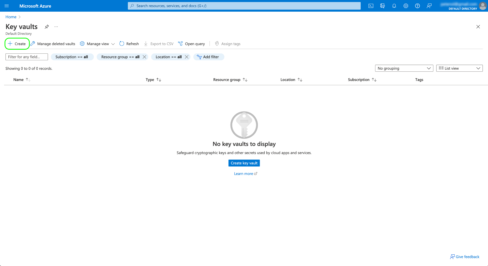

Using the provided form, fill in the basic details for the key vault, including a name and an assigned resource group.

>[!WARNING]
>
>While most options can be left as their default values, **make sure that you enable the soft-delete and purge protection options**. If you do not turn these features on, you could risk losing access to your data if the key vault is deleted.
>
>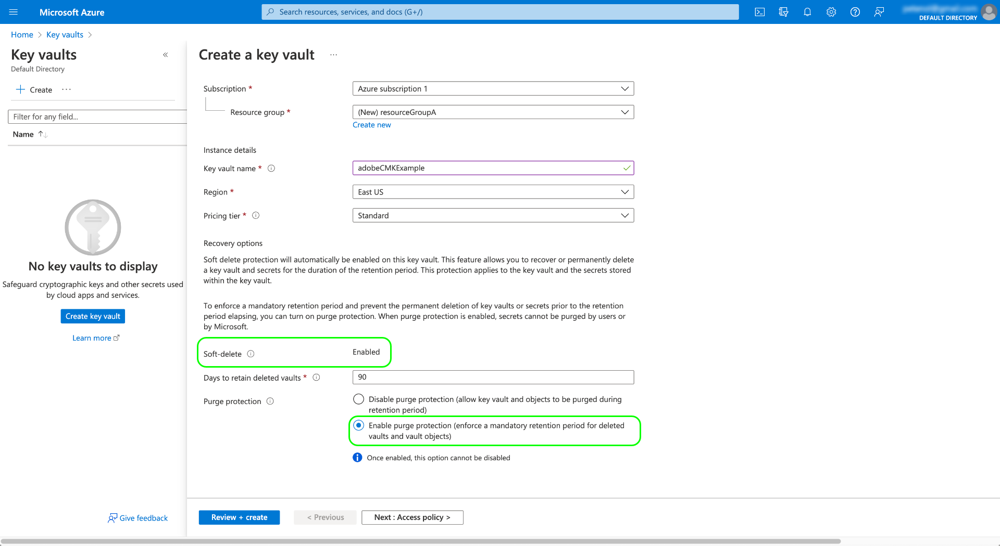

From here, continue going through the key vault creation workflow and configure the different options according to your organization's policies.

Once you arrive at the **[!DNL Review + create]** step, you can review the details of the key vault while it goes through validation. Once validation passes, select **[!DNL Create]** to complete the process.

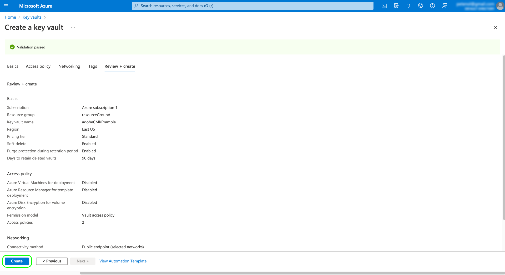

### Configure networking options

If your key vault is configured to restrict public access to certain virtual networks or disable public access entirely, you must grant Microsoft a firewall exception.

Select **[!DNL Networking]** in the left navigation. Under **[!DNL Firewalls and virtual networks]**, select the checkbox **[!DNL Allow trusted Microsoft services to bypass this firewall]**, then select **[!DNL Apply]**.

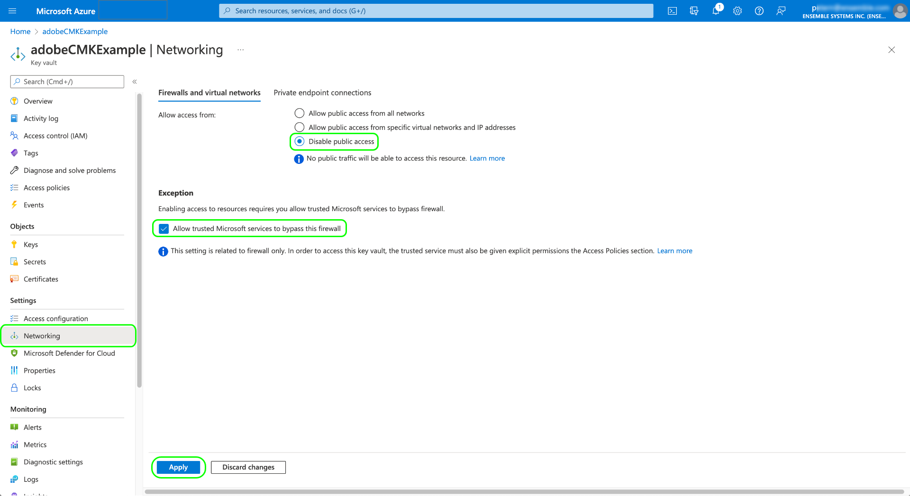

### Generate a key {#generate-a-key}

Once you have created a key vault, you can generate a new key. Navigate to the **[!DNL Keys]** tab and select **[!DNL Generate/Import]**.

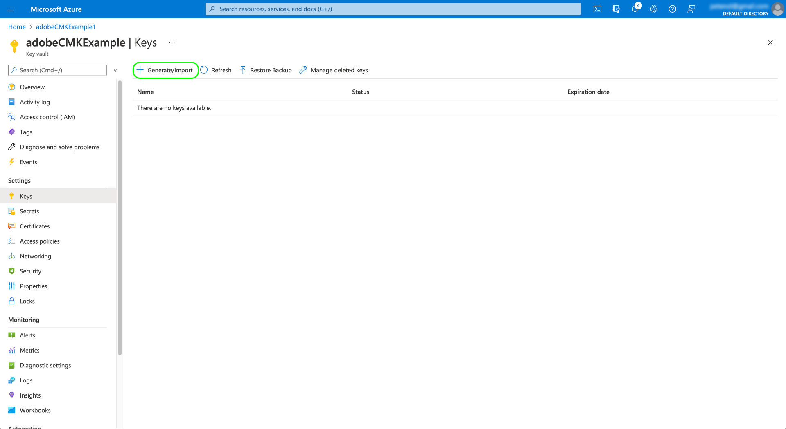

Use the provided form to provide a name for the key, and select **RSA** for the key type. At a minimum, the the **[!DNL RSA key size]** must be at least **3072** bits as required by [!DNL Cosmos DB]. [!DNL Azure Data Lake Storage] is also compatible with RSA 3027.

>[!NOTE]
>
>Remember the name you provide for the key, as it will be used in later step when [sending the key to Adobe](#send-to-adobe).

Use the remaining controls to configure the key you want to generate or import as desired. When finished, select **[!DNL Create]**.

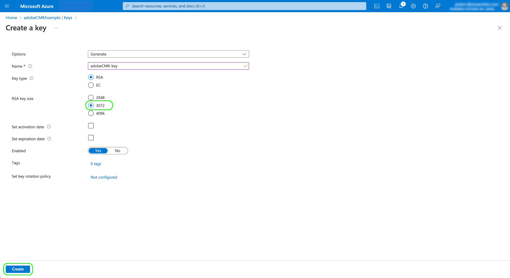

The configured key appears in the list of keys for the vault.

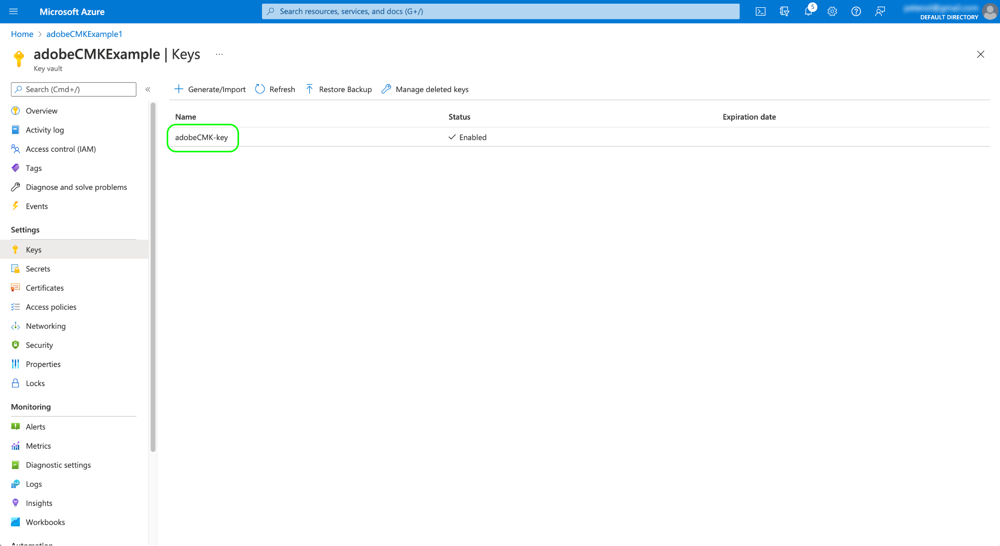

## Set up the CMK app {#register-app}

Once you have your key vault configured, the next step is to register for the CMK application that will link to your [!DNL Azure] tenant.

>[!NOTE]
>
>Registering the CMK app requires you to make calls to Platform APIs. For details on how to gather the required authentication headers to make these calls, see the [Platform API authentication guide](../../landing/api-authentication.md).
>
>While the authentication guide provides instructions on how to generate your own unique value for the required `x-api-key` request header, all API operations in this guide use the static value `acp_provisioning` instead. You must still provide your own values for `{ACCESS_TOKEN}` and `{ORG_ID}`, however.

### Fetch an authentication URL

To start the registration process, make a GET request to the app registration endpoint to fetch the required authentication URL for your organization.

**Request**

```shell
curl -X GET \
  https://platform.adobe.io/data/infrastructure/manager/byok/app-registration \ 
  -H 'Authorization: Bearer {ACCESS_TOKEN}' \
  -H 'x-api-key: acp_provisioning' \
  -H 'x-gw-ims-org-id: {ORG_ID}'
```

**Response**

A successful response returns an `applicationRedirectUrl` property, containing the authentication URL.

```json
{
    "id": "byok",
    "name": "acpebae9422Caepcmkmultitenantapp",
    "applicationUri": "https://adobe.com/acpebae9422Caepcmkmultitenantapp",
    "applicationId": "e463a445-c6ac-4ca2-b36a-b5146fcf6a52",
    "applicationRedirectUrl": "https://login.microsoftonline.com/common/oauth2/authorize?response_type=code&client_id=e463a445-c6ac-4ca2-b36a-b5146fcf6a52&redirect_uri=https://adobe.com/acpebae9422Caepcmkmultitenantapp&scope=user.read"
}
```

Copy and paste the `applicationRedirectUrl` address into a browser to open an authentication dialog. Select **[!DNL Accept]** to add the CMK app service principal to your [!DNL Azure] tenant.

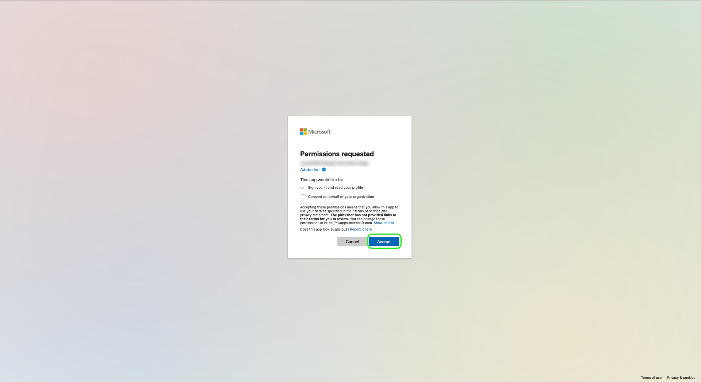

### Assign the CMK app to a role {#assign-to-role}

After completing the authentication process, navigate back to your [!DNL Azure] Key Vault and select **[!DNL Access control]** in the left navigation. From here, select **[!DNL Add]** followed by **[!DNL Add role assignment]**.

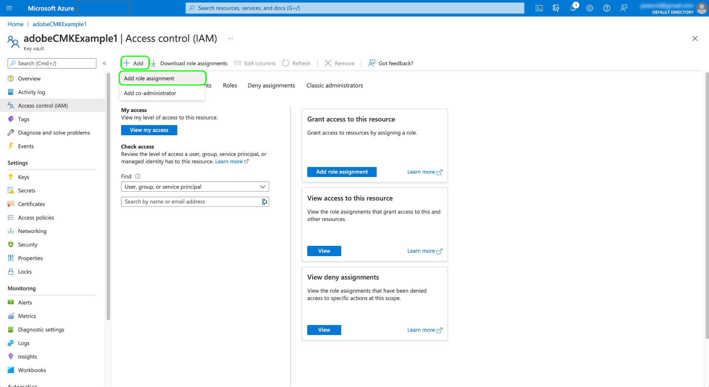

The next screen prompts you to choose a role for this assignment. Select **[!DNL Key Vault Crypto Service Encryption User]** before selecting **[!DNL Next]** to continue.

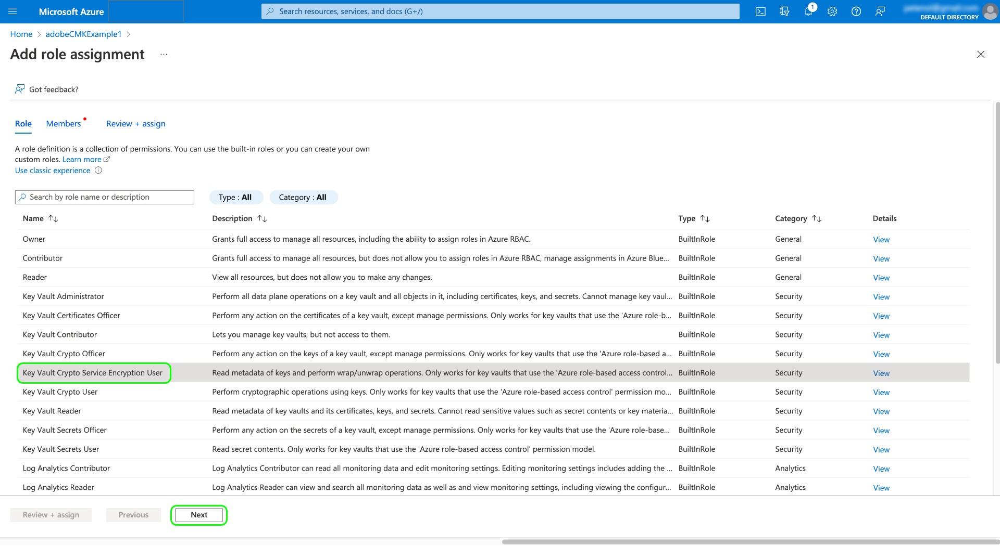

On the next screen, choose **[!DNL Select members]** to open a dialog in the right rail. Use the search bar to locate the service principal for the CMK application and select it from the list. When finished, select **[!DNL Save]**.

>[!NOTE]
>
>If you cannot find your application in the list, then your service principal has not been accepted into your tenant. Please work with your [!DNL Azure] administrator or representative to ensure that you have correct privileges.

## Enable the encryption key configuration on Experience Platform {#send-to-adobe}

After installing the CMK app on [!DNL Azure], you can send your encryption key identifier to Adobe. Select **[!DNL Keys]** in the left navigation, followed by the name of the key you want to send.


Select the latest version of the key and its details page appears. From here you can optionally configure the permitted operations for the key. At a minimum, the key must be granted the **[!DNL Wrap Key]** and **[!DNL Unwrap Key]** permissions.

The **[!UICONTROL Key Identifier]** field displays the URI identifier for the key. Copy this URI value for use in the next step.

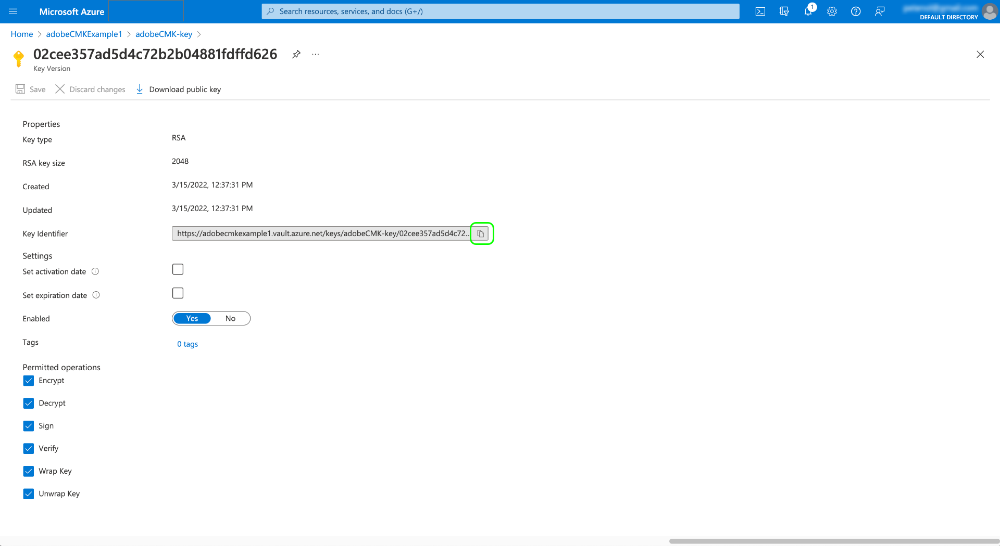

Once you have obtained the key vault URI, you can send it using a POST request to the CMK configuration endpoint.

>[!NOTE]
>
>Only the key vault and key name are stored with Adobe, not the key version.

**Request**

```shell
curl -X POST \
  https://platform.adobe.io/data/infrastructure/manager/customer/config \ 
  -H 'Authorization: Bearer {ACCESS_TOKEN}' \
  -H 'x-api-key: acp_provisioning' \
  -H 'x-gw-ims-org-id: {ORG_ID}' \
  -d '{
        "name": "Config1",
        "type": "BYOK_CONFIG",
        "imsOrgId": "{ORG_ID}",
        "configData": {
          "providerType": "AZURE_KEYVAULT",
          "keyVaultIdentifier": "https://adobecmkexample.vault.azure.net/keys/adobeCMK-key/7c1d50lo28234cc895534c00d7eb4eb4"
        }
      }'
```

| Property | Description |
| --- | --- |
| `name` | A name for the configuration. Ensure that you remember this value as it will be required to check the configuration's status at a [later step](#check-status). The value is case-sensitive. |
| `type` | The configuration type. Must be set to `BYOK_CONFIG`. |
| `imsOrgId` | Your IMS Organization ID. This must be the same value as provided under the `x-gw-ims-org-id` header. |
| `configData` | Contains the following details about the configuration:<ul><li>`providerType`: Must be set to `AZURE_KEYVAULT`.</li><li>`keyVaultIdentifier`: The key vault URI that you copied [earlier](#send-to-adobe).</li></ul> |

**Response**

A successful response returns the details of the configuration job.

```json
{
  "id": "4df7886b-a122-4391-880b-47888d5c5b92",
  "config": {
    "configData": {
      "keyVaultUri": "https://adobecmkexample.vault.azure.net",
      "keyVaultKeyIdentifier": "https://adobecmkexample.vault.azure.net/keys/adobeCMK-key/7c1d50lo28234cc895534c00d7eb4eb4",
      "keyVersion": "7c1d50lo28234cc895534c00d7eb4eb4",
      "keyName": "Config1",
      "providerType": "AZURE_KEYVAULT"
    },
    "name": "acpcf978863Aaepcmkmultitenantapp",
    "type": "BYOK_CONFIG",
    "imsOrgId": "{IMS_ORG}",
    "status": "NEW"
  },
  "status": "CREATED"
}
```

The job should should complete processing within a few minutes.

## Verify the configuration's status {#check-status}

To check the status of the configuration request, you can make a GET request.

**Request**

You must append the `name` of the configuration you want to check to the path (`config1` in the example below) and include a `configType` query parameter set to `BYOK_CONFIG`.

```shell
curl -X GET \
  https://platform.adobe.io/data/infrastructure/manager/customer/config/config1?configType=BYOK_CONFIG \ 
  -H 'Authorization: Bearer {ACCESS_TOKEN}' \
  -H 'x-api-key: acp_provisioning' \
  -H 'x-gw-ims-org-id: {ORG_ID}'
```

**Response**

A successful response returns the status of the job.

```json
{
  "name": "acpcf978863Aaepcmkmultitenantapp",
  "type": "BYOK_CONFIG",
  "status": "COMPLETED",
  "configData": {
    "keyVaultUri": "https://adobecmkexample.vault.azure.net",
    "keyVaultKeyIdentifier": "https://adobecmkexample.vault.azure.net/keys/adobeCMK-key/7c1d50lo28234cc895534c00d7eb4eb4",
    "keyVersion": "7c1d50lo28234cc895534c00d7eb4eb4",
    "keyName": "Config1",
    "providerType": "AZURE_KEYVAULT"
  },
  "imsOrgId": "{IMS_ORG}",
  "subscriptionId": "cf978863-7325-47b1-8fd9-554b9fdb6c36",
  "id": "4df7886b-a122-4391-880b-47888d5c5b92",
  "rowType": "BYOK_KEY"
}
```

The `status` attribute can have one of four values with the following meanings:

1. `RUNNING`: Validates that Platform has the ability to access the key and key vault.
1. `UPDATE_EXISTING_RESOURCES`: The system is adding the key vault and key name to the datastores across all sandboxes in your organization.
1. `COMPLETED`: The key vault and key name have been added to the datastores.
1. `FAILED`: A problem occurred, primarily related to the key, key vault, or multi-tenant app setup.

## Next steps

By completing the above steps, you have successfully enabled CMK for your organization. Data that is ingested into Platform will now be encrypted and decrypted using the key(s) in your [!DNL Azure] Key Vault. If you want to revoke Platform access to your data, you can remove the user role associated with the application from the key vault within [!DNL Azure].

After disabling access to the application, it can take anywhere from a few minutes to 24 hours for data to no longer be accessible in Platform. The same time delay applies for data to become available again when re-enabling access to the application.

>[!WARNING]
>
>Once the Key Vault, Key, or CMK app is disabled and data is no longer accessible in Platform, any downstream operations related to that data will no longer be possible. Ensure that you understand the downstream impacts of revoking Platform access to your data before you make any changes to your configuration.
