# Set up and Configure Customer Managed Keys with AWS using the Platform UI

Use this guide to enable Customer Managed Keys (CMK) for Platform instances hosted on AWS through the Platform UI. 

>[!IMPORTANT]
>
>Before you continue with this guide, make sure you have completed the setup detailed in the ['Configure AWS KMS for CMK'](./configure-kms.md) document.

## Update the AWS key policy to integrate the key with Experience Platform

To integrate your AWS key with Experience Platform, you must edit the JSON in the **[!DNL Key Policy]** section of the KMS workspace. A default key policy looks similar to the JSON below.

<!-- The AWS ID below is fake. Q) Can I refer to it simply as AWS_ACCOUNT_ID ? Is that suitable? -->

```JSON
{
  "Id": "key-consolepolicy-3",
  "Version": "2012-10-17",
  "Statement": [
    {
      "Sid": "Enable IAM User Permissions",
      "Effect": "Allow",
      "Principal": {
        "AWS": "arn:aws:iam::123464903283:root" // this is a mock AWS Principal ID, your ID will differ
      },
      "Action": "kms:*",
      "Resource": "*"
    }
  ]
}
```

In the example above, all resources (`"Resource": "*"`) within the same account (`Principal.AWS`) can access the key. This policy allows services in the account to perform encryption and decryption operations, restricted to the specified account. To grant your Platform single-tenant account access to this key, add new statements to the default AWS policy. You can obtain the required JSON policy from the Platform UI and apply it to your AWS KMS key to establish a secure connection with Adobe Experience Platform.

In the Platform UI, go to the **[!UICONTROL Administration]** section in the left navigation rail, and select **[!UICONTROL Encryption]**. In the [!UICONTROL Encryption Configuration] workspace, select **[!UICONTROL Configure]** in the [!UICONTROL Customer Managed Keys] card.

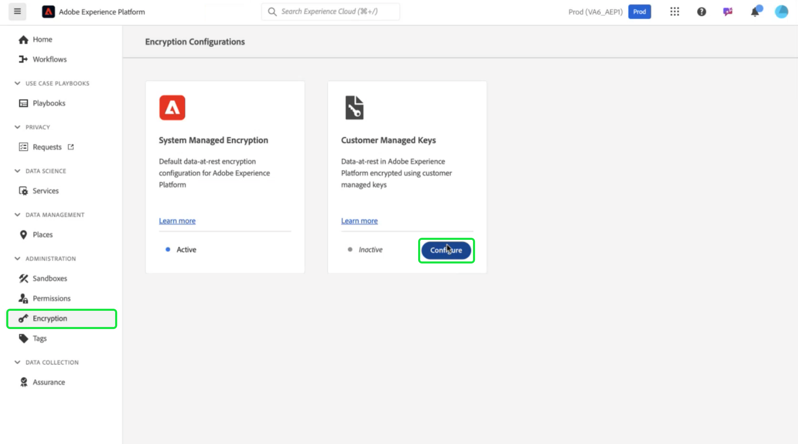

The [!UICONTROL Customer Managed Keys configuration] appears. Copy the `statement` object form the CMK KMS policy displayed in the [!UICONTROL Customer Managed Keys] [!UICONTROL Encryption Configuration].

<!-- Select the copy icon () to copy the CMK KMS policy to your clipboard. A green pop-up notification confirms that the policy was copied.  -->

<!-- I cannot add the 'and the copy icon highlighted.' to the alt text below as i do not have access to this UI. -->


<!-- This part of the workflow was in contention at the time of the demo.  -->

Next, return to the AWS KMS workspace and update the key policy shown below.

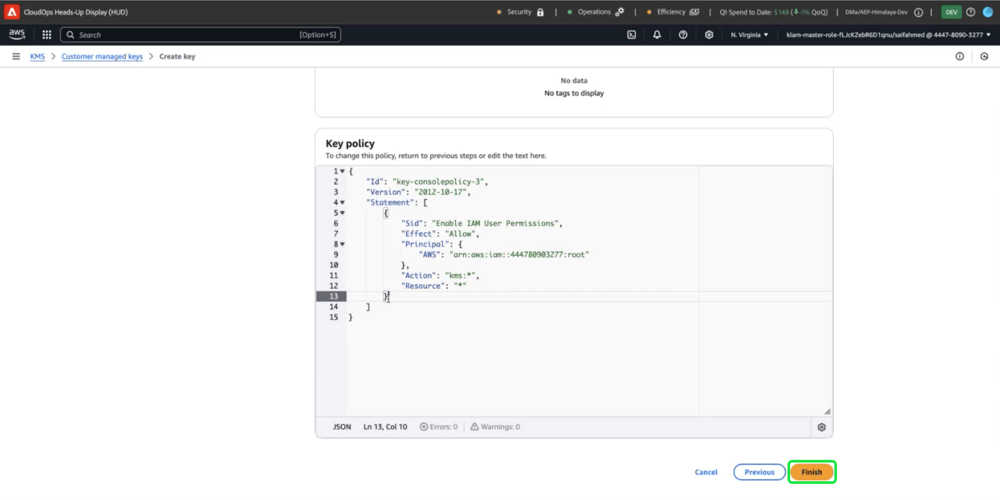

Add to the default policy the four statements from the [!UICONTROL Platform Encryption Configuration] workspace, as seen below: `Enable IAM User Permissions`, `CJA Flow IAM User Permissions`, `CJA Integrity IAM User Permissions`, `CJA Oberon IAM User Permissions`.

```json

{
    "Version": "2012-10-17",
    "Id": "key-consolepolicy",
    "Statement": [
        {
            "Sid": "Enable IAM User Permissions",
            "Effect": "Allow",
            "Principal": {
                "AWS": "arn:aws:iam::975049898882:root" // this is a mock AWS Principal ID, your ID will differ
            },
            "Action": [
                "kms:Decrypt",
                "kms:Encrypt",
                "kms:ReEncrypt*",
                "kms:GenerateDataKey*",
                "kms:DescribeKey",
                "kms:CreateGrant"
            ],
            "Resource": "*",
            "Condition": {
                "StringEquals": {
                    "aws:PrincipalAccount": "975049898882" // this is a mock AWS Principal ID, your ID will differ
                }
            }
        },
        {
            "Sid": "CJA Flow IAM User Permissions",
            "Effect": "Allow",
            "Principal": {
                "AWS": "arn:aws:iam::767397686373:root"
            },
            "Action": [
                "kms:Decrypt",
                "kms:Encrypt",
                "kms:ReEncrypt*",
                "kms:GenerateDataKey*",
                "kms:DescribeKey",
                "kms:CreateGrant"
            ],
            "Resource": "*",
            "Condition": {
                "StringEquals": {
                    "aws:PrincipalAccount": "767397686373"
                }
            }
        },
        {
            "Sid": "CJA Integrity IAM User Permissions",
            "Effect": "Allow",
            "Principal": {
                "AWS": "arn:aws:iam::730335345392:root"
            },
            "Action": [
                "kms:Decrypt",
                "kms:Encrypt",
                "kms:ReEncrypt*",
                "kms:GenerateDataKey*",
                "kms:DescribeKey",
                "kms:CreateGrant"
            ],
            "Resource": "*",
            "Condition": {
                "StringEquals": {
                    "aws:PrincipalAccount": "730335345392"
                }
            }
        },
        {
            "Sid": "CJA Oberon IAM User Permissions",
            "Effect": "Allow",
            "Principal": {
                "AWS": "arn:aws:iam::891377157113:root"
            },
            "Action": [
                "kms:Decrypt",
                "kms:Encrypt",
                "kms:ReEncrypt*",
                "kms:GenerateDataKey*",
                "kms:DescribeKey",
                "kms:CreateGrant"
            ],
            "Resource": "*",
            "Condition": {
                "StringEquals": {
                    "aws:PrincipalAccount": "891377157113"
                }
            }
        }
    ]
}

```

Select **[!DNL Finish]** to confirm the updated policy and create the key. The configuration now includes five statements, enabling your AWS account to communicate with Adobe Experience Platform. The changes take effect immediately.

The updated [!DNL Customer Managed Keys] workspace of the AWS [!DNL Key Management Service] appears.

### Add AWS encryption key details to Platform 

Next, to enable encryption, add the key's Amazon Resource Name (ARN) to your Platform [!UICONTROL Customer Managed Keys configuration]. From the [!DNL Customer Managed Keys] section of AWS, select the alias of your new key from the list in the [!DNL Key Management Service]. 

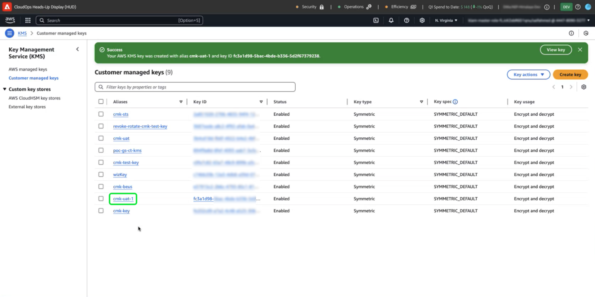

The details of your key are displayed. Everything in AWS has an Amazon Resource Name (ARN) which 
is a unique identifier used to specify resources across AWS services. It follows a standardized format: `arn:partition:service:region:account-id:resource`.

Select the copy icon to copy your ARN. A confirmation dialog appears. 

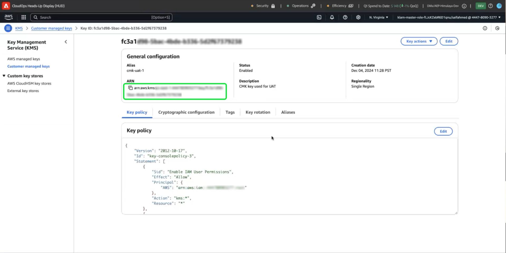

Now, navigate back to the Platform [!UICONTROL Customer Managed Keys configuration] UI. In the **[!UICONTROL Add AWS encryption key details]** section, add a **[!UICONTROL Configuration name]** and the **[!UICONTROL KMS key ARN]** you copied from the AWS UI.

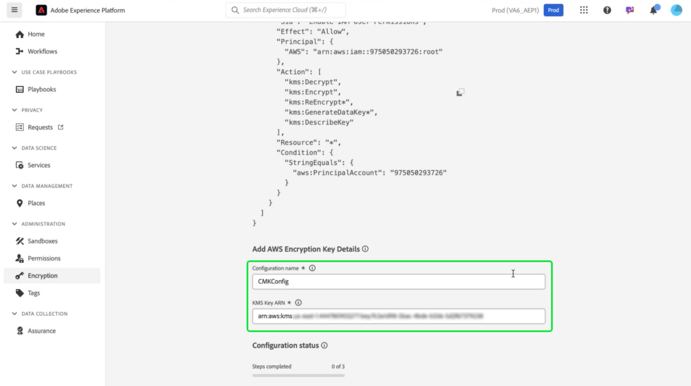

Next, select **[!UICONTROL SAVE]** to submit the configuration name, the KMS key ARN, and begin validation of the key.

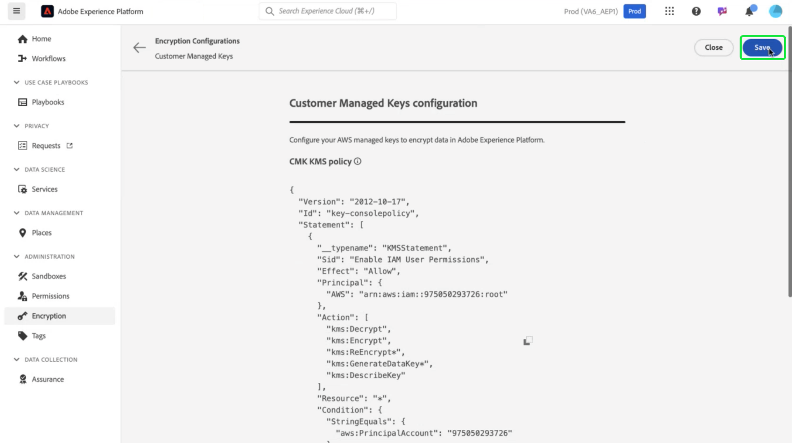

You are returned to the [!UICONTROL Encryption Configurations] workspace. The status of the encryption configuration is displayed on the bottom of the **[!UICONTROL Customer Managed Keys]** card. 

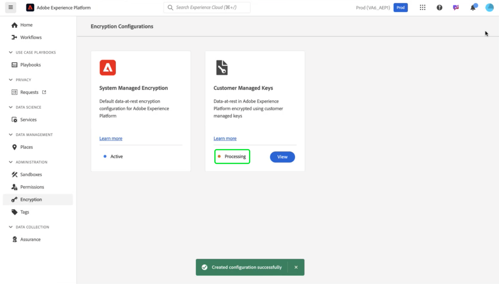

Once the key is validated, the key vault identifiers are added to the data lake and profile datastores for all sandboxes.

>[!NOTE]
>
>The duration of the process depends on your data size. Typically, the process is completed in less than 24 hours. Each sandbox is usually updated in two to three minutes.

## Key revocation {#key-revocation}

>[!IMPORTANT]
>
>Understand the implications of key revocation on downstream applications before you revoke any access. 

The following are key considerations for key revocation:

- Revoking or disabling the key will make your Platform data inaccessible. This action is irreversible and should be performed with caution.
- Consider the propagation timelines when access to encryption keys is revoked. Primary data stores become inaccessible within a few minutes to 24 hours. Cached or transient data stores becomes inaccessible within seven days.

To revoke a key, navigate to the AWS KMS workspace. The **[!DNL Customer managed keys]** section displays all the available keys for your AWS account. Select the alias of your key from the list. 


The details of your key are displayed. To disable the key, select **[!DNL Key actions]**, then **[!DNL Disable]** from the dropdown menu.

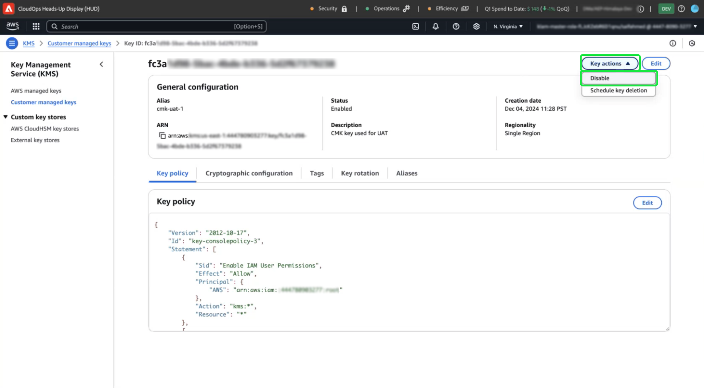

A confirmation dialog appears. Select **[!DNL Disable key]** to confirm your choice. The impact of disabling the key should be reflected in Platform applications and the UI within approximately five minutes.

>[!NOTE]
>
>Once you have disabled the key, you can enable the key again using the same method described above should you need to. This option is available from the **[!DNL Key actions]** dropdown.

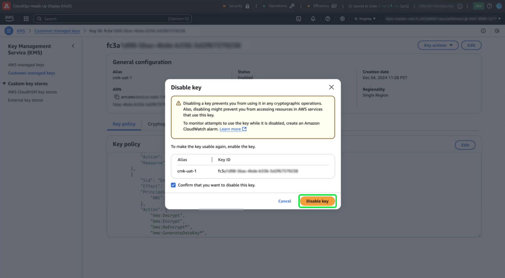

Alternatively, if your key is used across other services, you can remove access for Experience Platform directly from the key policy. Select **[!UICONTROL Edit]** in the **[!DNL Key Policy]** section. 

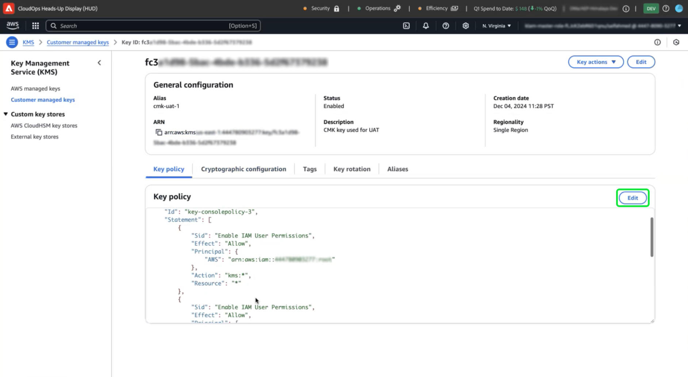

The **[!DNL Edit key policy]** page appears. Highlight and delete the policy statement, copied form the Platform UI, to remove the permissions for the Customer Managed Keys app. Then, select **[!DNL Save changes]** to complete the process. 


## Key rotation {#key-rotation}

AWS offers automatic and on-demand key rotation. To reduce the risk of key compromise or meet security compliance requirements, you can automatically generate new encryption keys on demand, or at regular intervals. Schedule automatic key rotation to limit the lifespan of a key and ensure that if a key is compromised, it becomes unusable after rotation. While modern encryption algorithms are highly secure, key rotation is an important security compliance measure and demonstrates adherence to security best practices.

### Automatic key rotation {#automatic-key-rotation}

Automatic key rotation is disabled by default. To schedule automatic key rotation from the KMS workspace, select the **[!DNL Key rotation]** tab, followed by **[!DNL Edit]** in the **[!DNL Automatic key rotation section]**.

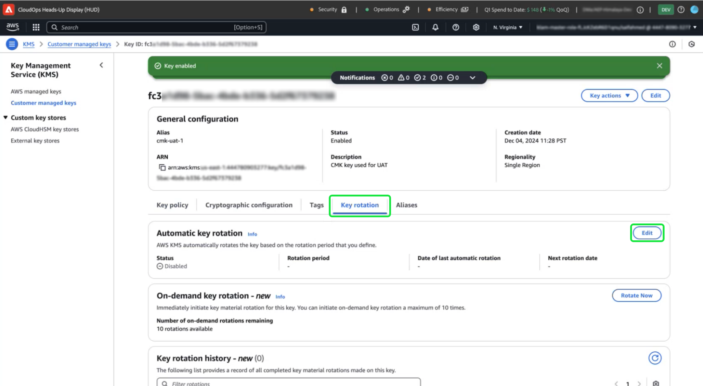

The **[!DNL Edit automatic key rotation]** workspace appears. From here, select the radio button to enable or disable automatic key rotation. Then use the text input field, or the dropdown menu, to choose a time period for the key rotation. Select **[!DNL Save]** to confirm your settings and return to the key details workspace.

>[!NOTE]
>
>The minimum key rotation period is 90 days, and the maximum is 2560 days.

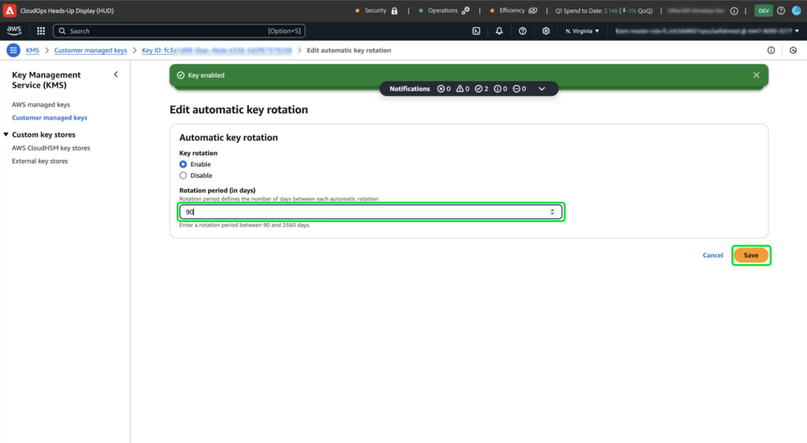

### On-demand key rotation {#on-demand-key-rotation}

Select **[!DNL Rotate Now]** to perform an immediate key rotation if the current key is compromised. AWS limits this feature to 10 rotations. For regular maintenance, schedule automatic key rotations instead.

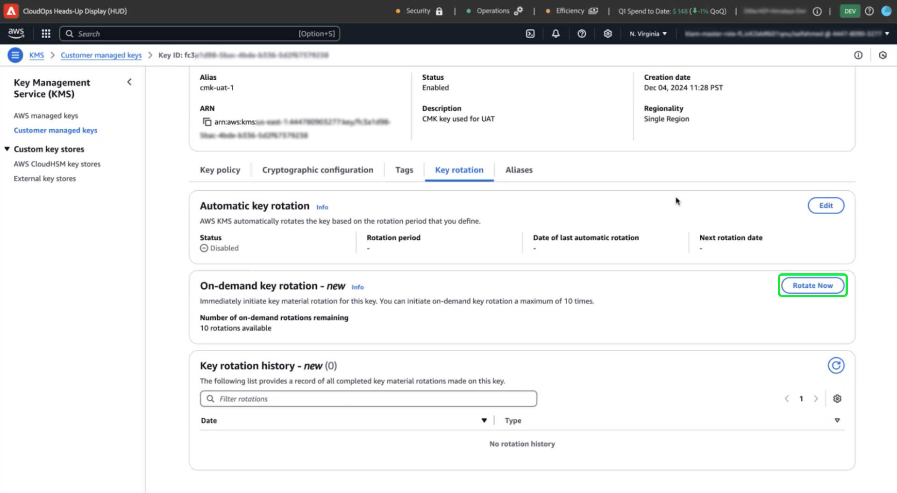

## Next steps

After reading this document, you have learned how to create, configure, and manage encryption keys in AWS KMS for Adobe Experience Platform. Next, review your organization's security and compliance policies to implement best practices, such as scheduling key rotations and ensuring secure key storage.
