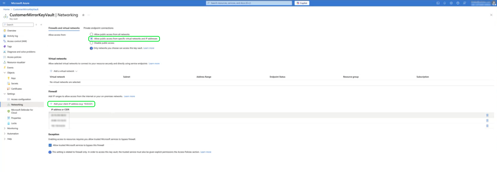

# Configure alerts and IP allowlist for Azure CMK

For organizations managing sensitive data or operating under strict compliance requirements, it is best practice to restrict access to your Azure Key Vault to trusted IP addresses. Enabling network restrictions reduces the risk of unauthorized access and supports a stronger security posture.

>[!IMPORTANT]
>
>If you have disabled public network access or configured your Azure Key Vault to allow only selected networks, you must add Adobe's static IP address to your allowlist. This step is required to ensure that Adobe services can continue to access your key vault without interruption.

## Allowlist Adobe's static IP in Azure Key Vault

To allow Adobe access while maintaining your network restrictions, navigate to your **[!DNL Azure Key Vault]** > **[!DNL Networking settings]**. In the **[!DNL Firewalls and virtual networks]** section, select **[!DNL Allow public access from specific virtual networks and IP addresses]**.

Next, in the **[!DNL Firewall]** section, select **[!DNL Add your current IP address]**. Enter the Adobe-provided static IP address for your Production or Stage environment. Adobe uses a fixed IP address that must be allowlisted to ensure uninterrupted access to your Key Vault in restricted network configurations.

>[!NOTE]
>
>After you add or update the static IP address in your Azure Key Vault settings, allow up to 10 minutes for the change to take effect. A background process runs every 10 minutes to check key accessibility and apply any updates.

Once Adobe's static IP address is added to your Azure Key Vault firewall settings, Experience Platform can maintain a secure connection and monitor for access issues. If Adobe services are unable to reach your Key Vault, for example, due to misconfigured firewall rules or removal of the IP address, you will receive platform alerts in your Experience Platform notifications. These alerts give you the visibility needed to quickly resolve access issues. The next section outlines the types of alerts you may receive and how to respond.

## Monitor alerts

Platform alerts indicate issues such as **[!UICONTROL Key access failure]** or **[!UICONTROL Key disablement]**. A key access failure typically means that Adobe's IP is no longer allowlisted or that networking restrictions are misconfigured. In such cases, review your Azure firewall settings and re-add the required IP if necessary.

Subscribe to Adobe I/O event notifications to receive real-time alerts about key access issues. You can integrate Experience Platform alerts—such as key access failures or disablement events—into your organization's existing monitoring systems. For setup guidance, see [Subscribe to Adobe I/O Event notifications]().

## Next steps

You've now configured IP allowlisting for Adobe services and learned how to interpret platform alerts for Customer Managed Key access issues. To complete the CMK setup process for Azure-hosted environments, continue with the following guides:

- [Configure an Azure Key Vault](./azure-key-vault-config.md)  
- [Use the API to set up CMK](./api-set-up.md)  
- [Use the UI to set up CMK](./ui-set-up.md)
