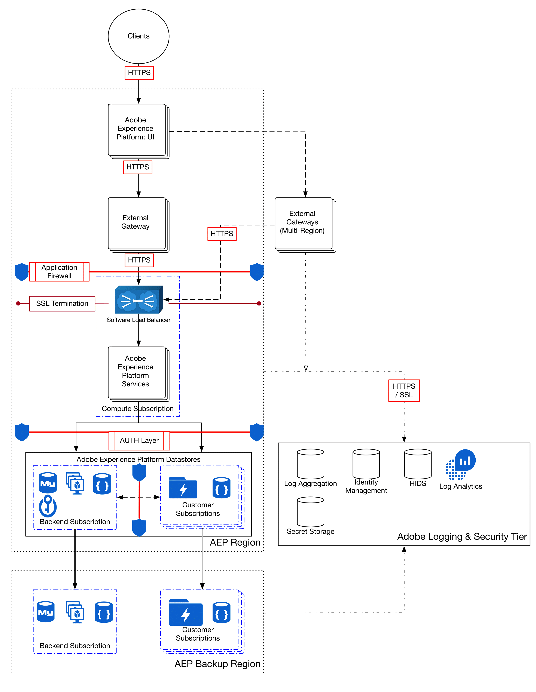

# Data encryption in Adobe Experience Platform

Adobe Experience Platform is a powerful and extensible system that centralizes and standardizes customer experience data across enterprise solutions. All data utilized by Platform is encrypted in transit and at rest to keep your data secure. This document describes Platform's encryption processes at a high level.

The following process flow diagram illustrates how data is ingested, encrypted, and persisted by [!DNL Experience Platform]:

## Data in transit {#in-transit}

All data in transit between Platform and any external component is conducted over secure, encrypted connections using HTTPS [TLS v1.2](https://datatracker.ietf.org/doc/html/rfc5246).

In general, data is brought into Platform in three ways:

* [Data collection](../../collection/home.md) capabilities allow websites and mobile applications to send data to the Platform Edge Network for staging and preparation for ingestion.
* [Source connectors](../../sources/home.md) stream data directly to Platform from Adobe Experience Cloud applications and other enterprise data sources.
* Non-Adobe ETL (extract, transform, load) tools send data to the [batch ingestion API](../../ingestion/batch-ingestion/overview.md) for consumption.

After data has been brought into the system and [encrypted at rest](#at-rest), it can then be enriched by Platform services and brought out of the system in the following ways:

* [Destinations](../../destinations/home.md) allow you to activate data to Adobe applications and partner applications.
* Native Platform applications such as [Customer Journey Analytics](https://experienceleague.adobe.com/docs/analytics-platform/using/cja-overview/cja-overview.html) and [Adobe Journey Optimizer](https://experienceleague.adobe.com/docs/journey-optimizer/using/ajo-home.html) can also make use of the data.

## Data at rest {#at-rest}

Data that is ingested and used by Platform is stored in the data lake, a highly granular data store containing all data managed by the system, regardless of origin or file format. All data persisted in the data lake is encrypted, stored, and managed in an isolated [[!DNL Microsoft Azure Data Lake] Storage](https://docs.microsoft.com/en-us/azure/storage/blobs/data-lake-storage-introduction) instance that is unique to your organization.

For details on how data at rest is encrypted in Azure Data Lake Storage, see the [official Azure documentation](https://learn.microsoft.com/en-us/azure/storage/common/storage-service-encryption).

## Next steps

This document provided a high-level overview of how data is encrypted in Platform. For more information on security procedures in Platform, see the overview on [governance, privacy, and security](./overview.md) on Experience League, or take a look at the [Platform security whitepaper](https://www.adobe.com/content/dam/cc/en/security/pdfs/AEP_SecurityOverview.pdf).
