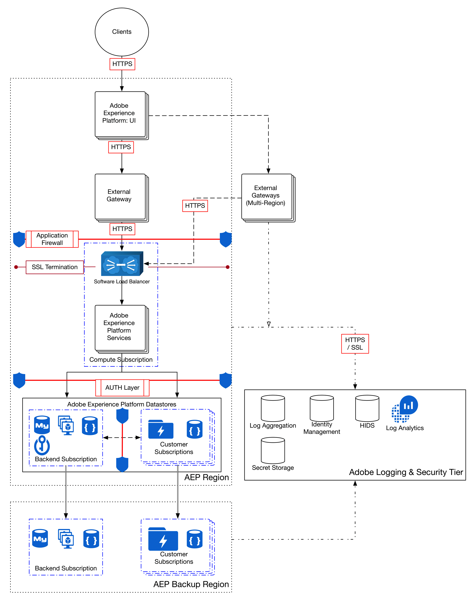

# Data encryption in Adobe Experience Platform

Adobe Experience Platform is a powerful and extensible system that centralizes and standardizes customer experience data across enterprise solutions. All data used by Experience Platform is encrypted in transit and at rest to keep your data secure. This document describes Experience Platform's encryption processes at a high level.

The following process flow diagram illustrates how Experience Platform ingests, encrypts, and persists data:

## Data in transit {#in-transit}

All data in transit between Experience Platform and any external component is conducted over secure, encrypted connections using HTTPS [TLS v1.2](https://datatracker.ietf.org/doc/html/rfc5246).

In general, data is brought into Experience Platform in three ways:

- [Data collection](../../collection/home.md) capabilities allow websites and mobile applications to send data to the Experience Platform Edge Network for staging and preparation for ingestion.
- [Source connectors](../../sources/home.md) stream data directly to Experience Platform from Adobe Experience Cloud applications and other enterprise data sources.
- Non-Adobe ETL (extract, transform, load) tools send data to the [batch ingestion API](../../ingestion/batch-ingestion/overview.md) for consumption.

After data has been brought into the system and [encrypted at rest](#at-rest), Experience Platform services enrich and export the data in the following ways:

- [Destinations](../../destinations/home.md) allow you to activate data to Adobe applications and partner applications.
- Native Experience Platform applications such as [Customer Journey Analytics](https://experienceleague.adobe.com/docs/analytics-platform/using/cja-overview/cja-overview.html) and [Adobe Journey Optimizer](https://experienceleague.adobe.com/en/docs/journey-optimizer/using/ajo-home) can also make use of the data.

### mTLS protocol support {#mtls-protocol-support}

You can now use Mutual Transport Layer Security (mTLS) to ensure enhanced security in outbound connections to the [HTTP API destination](../../destinations/catalog/streaming/http-destination.md) and Adobe Journey Optimizer [custom actions](https://experienceleague.adobe.com/en/docs/journey-optimizer/using/orchestrate-journeys/about-journey-building/using-custom-actions). mTLS is an end-to-end security method for mutual authentication that ensures that both parties sharing information are who they claim to be before data is shared. mTLS includes an additional step compared to TLS, in which the server also asks for the client's certificate and verifies it at their end.

If you want to [use mTLS with Adobe Journey Optimizer custom actions](https://experienceleague.adobe.com/en/docs/journey-optimizer/using/configuration/configure-journeys/action-journeys/about-custom-action-configuration) and Experience Platform HTTP API destination workflows, the server address you put into the Adobe Journey Optimizer customer action UI or the Destinations UI must have TLS protocols disabled and only mTLS enabled. If the TLS 1.2 protocol is still enabled on that endpoint, no certificate is sent for the client authentication. This means that to use mTLS with these workflows, your "receiving" server endpoint must be an mTLS **only** enabled connection endpoint.

>[!IMPORTANT]
>
>No additional configuration is required in your Adobe Journey Optimizer custom action or HTTP API destination to activate mTLS; this process occurs automatically when an mTLS-enabled endpoint is detected. The Common Name (CN) and Subject Alternative Names (SAN) for each certificate are available in the documentation as part of the certificate and can be used as an additional layer of ownership validation if you wish to do so.
>
>RFC 2818, published in May 2000, deprecates the use of the Common Name (CN) field in HTTPS certificates for subject name verification. Instead, it recommends using the "Subject Alternative Name" extension (SAN) of the "dns name" type.

### Download certificates {#download-certificates}

>[!NOTE]
>
>You are responsible for ensuring that your systems use a valid public certificate. Regularly review your certificates, especially as the expiration date approaches. Use the API to retrieve and update certificates before they expire.

Direct download links for public mTLS certificates are no longer provided. Instead, use the [public certificate endpoint](../../data-governance/mtls-api/public-certificate-endpoint.md) to retrieve certificates. This is the only supported method for accessing current public certificates. It ensures that you always receive valid, up-to-date certificates for your integrations.

Integrations that rely on certificate-based encryption must update their workflows to support automated certificate retrieval using the API. Relying on static links or manual updates may result in the use of expired or revoked certificates, leading to failed integrations.

#### Certificate lifecycle automation {#certificate-lifecycle-automation}

Adobe now automates the certificate lifecycle for mTLS integrations to improve reliability and prevent service disruptions. Public certificates are:

- Reissued 60 days before expiration.
- Revoked 30 days before expiration.

These intervals will continue to shorten in line with [evolving CA/B Forum guidelines](https://www.digicert.com/blog/tls-certificate-lifetimes-will-officially-reduce-to-47-days) which aim to reduce certificate lifetimes to a maximum of 47 days.

If you previously used links on this page to download certificates, update your process to retrieve them exclusively through the API.

## Data at rest {#at-rest}

Data that is ingested and used by Experience Platform is stored in the data lake, a highly granular data store containing all data managed by the system, regardless of origin or file format. All data persisted in the data lake is encrypted, stored, and managed in an isolated [[!DNL Microsoft Azure Data Lake] Storage](https://docs.microsoft.com/en-us/azure/storage/blobs/data-lake-storage-introduction) instance that is unique to your organization.

For details on how data at rest is encrypted in Azure Data Lake Storage, see the [official Azure documentation](https://learn.microsoft.com/en-us/azure/storage/common/storage-service-encryption).

## Next steps

This document provided a high-level overview of how data is encrypted in Experience Platform. For more information on security procedures in Experience Platform, see the overview on [governance, privacy, and security](./overview.md) on Experience League, or take a look at the [Experience Platform security whitepaper](https://www.adobe.com/content/dam/cc/en/security/pdfs/AEP_SecurityOverview.pdf).
