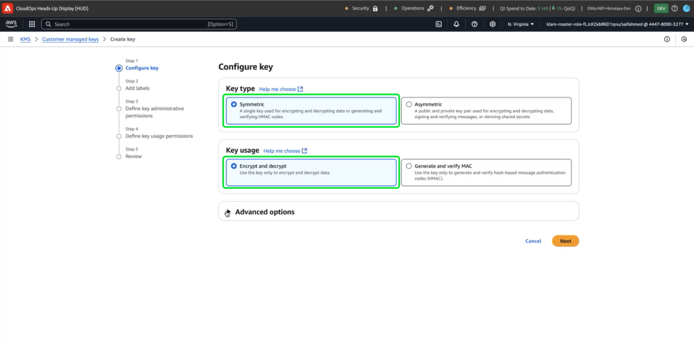
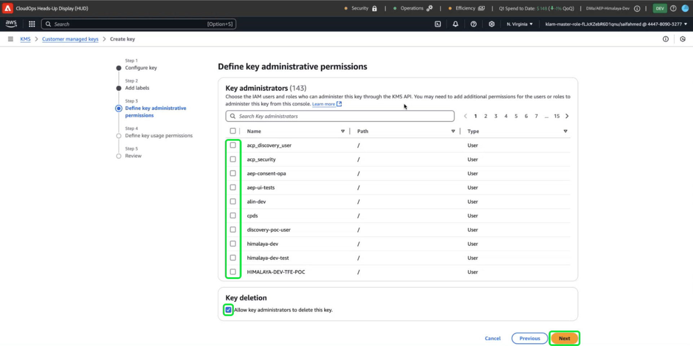
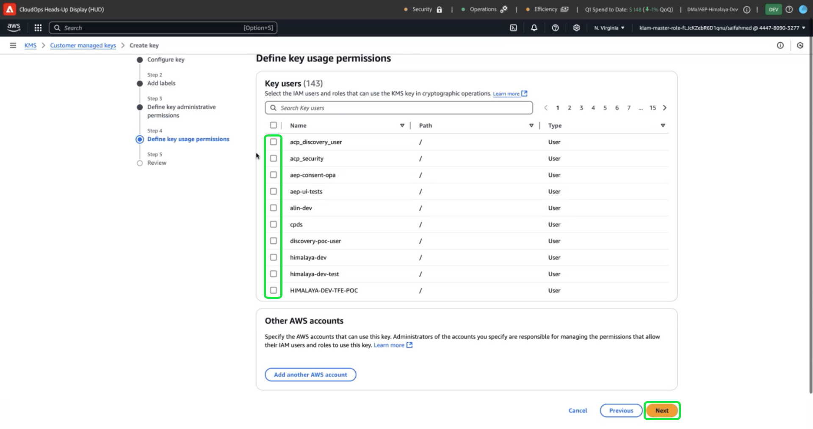
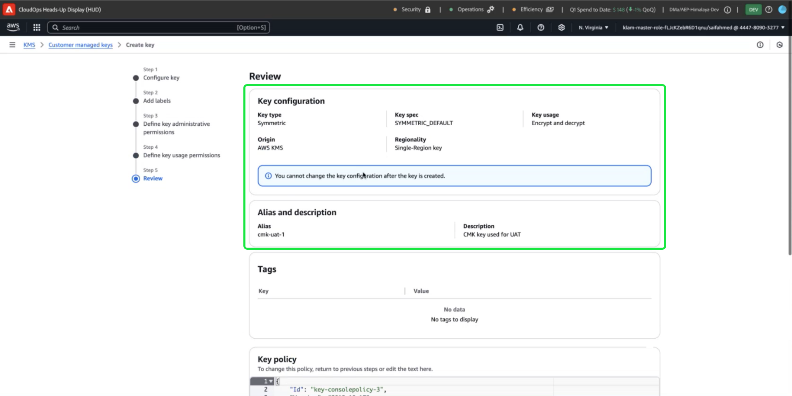

# How to use the Amazon Web Services Key Management Service for Adobe Experience Platform data encryption

>[!AVAILABILITY]
>
>This document applies to implementations of Experience Platform running on Amazon Web Services (AWS). Experience Platform running on AWS is currently available to a limited number of customers. To learn more about the supported Experience Platform infrastructure, see the [Experience Platform multi-cloud overview](https://experienceleague.adobe.com/en/docs/experience-platform/landing/multi-cloud).
>[Customer Managed Keys](../customer-managed-keys/overview.md) (CMK) on AWS are supported for Privacy and Security Shield but are not available for Healthcare Shield. CMK on Azure are supported for both Privacy and Security Shield as well as Healthcare Shield.

Use this guide to secure your data with Amazon Web Services (AWS) Key Management Service (KMS) by creating, managing, and controlling encryption keys for Adobe Experience Platform. This integration simplifies compliance, streamlines operations through automation, and eliminates the need to maintain your own key management infrastructure.

For Customer Journey Analytics-specific instructions, refer to the [Customer Journey Analytics CMK documentation](https://experienceleague.adobe.com/en/docs/analytics-platform/using/cja-privacy/cmk)

>[!IMPORTANT]
>
>Adobe Experience Platform encrypts data at rest by default using system-managed keys. By enabling Customer Managed Keys (CMK), you take full control of your data security. However, this change is irreversible, once CMK is enabled, you cannot revert to system-managed keys. You are responsible for securely managing your keys to ensure uninterrupted access to your data and prevent potential inaccessibility.

This guides details the process to create and manage encryption keys in AWS Key Management Service (KMS) to secure your data in Experience Platform.

## Prerequisites {#prerequisites}

Before continuing with this document, you should have a good understanding of the following key concepts and capabilities:

- **AWS Key Management Service (KMS)**: Understand the fundamentals of AWS KMS, including how to create, manage, and rotate encryption keys. Refer to the [official KMS documentation](https://docs.aws.amazon.com/kms/) to learn more.
- **Identity and Access Management (IAM) policies in AWS**: IAM is a service that enables you to manage access to AWS services and resources securely. Use IAM to:
  - Define which users, groups, and roles have access to specific resources.
  - Specify what actions users are allowed or denied performing.
  - Implement fine-grained access control by assigning permissions using IAM policies.
Refer to the [IAM Policies for AWS KMS official documentation](https://docs.aws.amazon.com/kms/latest/developerguide/iam-policies.html) for more information.
- **Data Security in Experience Platform**: Explore how Platform ensures data security and integrates with external services like AWS KMS for encryption. Platform protects data with HTTPS TLS v1.2 for transit, cloud-provider encryption at rest, isolated storage, and customizable authentication and encryption options. See the [governance, privacy, and security overview](../overview.md), or the document on [data encryption in Platform](../encryption.md) for more information on how your data is kept secure.
- **AWS Management Console**: A central hub where you can access and manage all your AWS services from one web-based application. Use the search bar to quickly find tools, check notifications, manage your account and billing, and customize your settings. Refer to the [official AWS management console documentation](https://docs.aws.amazon.com/awsconsolehelpdocs/latest/gsg/what-is.html) for more information.

## Get started {#get-started}

This guide requires that you already have access to an Amazon Web Services account and access to the management console. Follow the steps below to get started:

1. **Verify permissions**: Ensure that you have the necessary AWS Identity and Access Management (IAM) permissions to create, manage, and use encryption keys within KMS. To verify your permissions:
   1. Access the [IAM Policy Simulator](https://policysim.aws.amazon.com/).
   1. Select your user account or role.
   1. Simulate KMS actions like `kms:CreateKey` or `kms:Encrypt`.
If the simulation returns an error or you are unsure about your permissions, consult your AWS administrator for assistance.

1. **Check your AWS account configuration**: Confirm that your AWS account is enabled to use AWS KMS services. Most accounts have KMS access enabled by default, but you can review your account setup by visiting the [AWS Management Console](https://aws.amazon.com/console/). For more details, see the [AWS Key Management Service Developer guide](https://docs.aws.amazon.com/kms/latest/developerguide/overview.html).

1. **Select a supported region**: AWS KMS is available in specific regions. Make sure you are operating in a region where KMS is supported. You can view a complete list of supported regions in the [AWS KMS endpoints and quotas list](https://aws.amazon.com/about-aws/global-infrastructure/regional-product-services/). 

### Navigate to AWS KMS to begin key setup

>[!IMPORTANT]
>
>Ensure the secure storage, access, and availability of the encryption keys. You are responsible for managing your keys and preventing disruptions to Platform operations.

To begin setting up and managing your encryption key, log in to your AWS account and navigate to AWS Key Management Service (KMS). From the AWS Management Console and select **Key Management Service (KMS)** from the services menu.


## Create a new key {#create-a-key}

The [!DNL Key Management Service (KMS)] workspace appears. Select **[!DNL Create a key]**.


## Configure key settings {#configure-key}

The [!DNL Configure Key] workflow appears. By default, the key type is set to **[!DNL Symmetric]**, and the key usage is set to **[!DNL Encrypt and Decrypt]**. Ensure that these options are selected before proceeding.



Expand the **[!DNL Advanced options]** dropdown menu. You are recommended to use the **[!DNL KMS]** option, which allows AWS to create and manage the key material. The [!DNL KMS] option is selected by default.
 
>[!NOTE]
>
>If you already have an existing key, you can import external key material or use the AWS [!DNL CloudHSM] key store. These options are not covered in the scope of this document.

Next, select the [!DNL Regionality] setting, which specifies the region scope of the key. Select **[!DNL Single-Region key]**, followed by **[!DNL Next]** to proceed onto step two.

>[!IMPORTANT]
>
>AWS enforces region restrictions for KMS keys. This region restriction means that the key must be in the same region as your Adobe account. Adobe can only access KMS keys located within your account's region. Ensure that the region you select matches the region of your Adobe single-tenant account.


## Label and tag your key {#add-labels-and-tags-to-key}

The second, [!DNL Add labels] stage of the workflow appears. Here, you configure the [!DNL Alias] and [!DNL Tags] fields to help you manage and locate your encryption key from the AWS KMS console.

Enter a descriptive label for your key in the **[!DNL Alias]** input field. The alias acts as a user-friendly identifier, to quickly locate the key using the search bar in the AWS KMS console. To prevent confusion, choose a meaningful name that reflects the key's purpose, such as "Adobe-AEP-Key" or "Customer-Encryption-Key." You can also include a description of the key if the key alias is insufficient to describe its purpose.

Finally, assign metadata to your key by adding key-value pairs in the [!DNL Tags] section. This step is optional, but you should add tags to categorize and filter AWS resources for easier management. For example, if your organization uses multiple Adobe-related resources, you can tag them with "Adobe" or "Experience-Platform." This extra step makes it simple to search for and manage all your associated resources in the AWS Management Console. Select **[!DNL Add tag]** to begin the process.

<!-- I do not have an AWS account with which to document the Add tag process as yet. -->

When you are satisfied with your settings, select **[!DNL Next]** to continue the workflow.


## Define key administrative permissions {#define-key-admins}

Step three of the key creation workflow appears. To ensure secure and controlled access, you can choose which of the IAM users and roles can manage the key. There are two options at this stage, [!DNL Key administrators] and [!DNL Key deletion]. In the **[!DNL Key administrators]** section, select one or more checkboxes next to the name of any user, or role, that you want to grant administrator permissions for this key. 

>[!NOTE]
>
>You cannot create administrators at this stage of the workflow.

In the **[!DNL Key deletion]** section, enable the checkbox to allow key administrators the right to delete this key. If you do not check the checkbox, administrative users are not allowed to perform that operation.

Select **[!DNL Next]** to continue the workflow.



## Grant access to key users {#assign-key-users}

In step four of the workflow, you can [!DNL Define key usage permissions]. From the **[!DNL Key users]** list, select the checkboxes for all IAM users and roles that you want to have permission to use this key. 

From this view, you can also [!DNL Add another AWS account]; however, adding other AWS accounts is strongly discouraged. Adding another account can introduce risks and complicate permission management for encryption and decryption operations. By keeping the key associated with a single AWS account, Adobe ensures secure integration with AWS KMS, minimizing risks and ensuring reliable operation.

Select **[!DNL Next]** to continue the workflow.



## Review key configuration {#review}

The review stage of the key configuration appears. Verify the key details in the [!DNL Key configuration] and [!DNL Alias and description] sections.

>[!NOTE]
>
>Ensure that the key region is the same as the AWS account.



### Update the key policy to integrate the key with Experience Platform

Next edit the JSON in the **[!DNL Key Policy]** section to integrate the key with Experience Platform. A default key policy looks similar to the JSON below.

<!-- The AWS ID below is fake. Q) Can I refer to it simply as AWS_ACCOUNT_ID ? Is that suitable? -->

```JSON
{
  "Id": "key-consolepolicy-3",
  "Version": "2012-10-17",
  "Statement": [
    {
      "Sid": "Enable IAM User Permissions",
      "Effect": "Allow",
      "Principal": {
        "AWS": "arn:aws:iam::435764903283:root"
      },
      "Action": "kms:*",
      "Resource": "*"
    }
  ]
}
```

All the resources (`"Resource": "*"`) in the same account (`Principal.AWS`) can access this example key. The policy allows other services in the same account, to use the key to do encryption and decryption. The services only have permission with this account.

Next, grant your Platform single tenant account access this key by adding a new statement to this policy. You can obtain the JSON policy from the Platform UI and apply it to your AWS KMS key to link it to the platform securely.

Navigate to the Platform UI, in the **[!UICONTROL Administration]** section of the left navigation rail, select **[!UICONTROL Encryption]**. The [!UICONTROL Encryption Configuration] workspace appears. Select **[!UICONTROL Configure]** in the [!UICONTROL Customer Managed Keys] card.


The [!UICONTROL Customer Managed Keys configuration] appears. Select the copy icon () to copy the CMK KMS policy to your clipboard. A green pop-up notification confirms that the policy was copied. 


<!-- This part of the workflow was in contention at the time of the demo.  -->

Next, return to the AWS KMS workspace and update the key policy. Overwrite the entire default policy with the policy that you copied from the [!UICONTROL Platform Encryption Configuration] workspace. Select **[!DNL Finish]** to confirm your key details with your updated policy and create the key. The key and policy have now been configured to allow your AWS account to communicate with your Experience Platform account. The effect is instantaneous.


The [!DNL Customer managed keys] workspace of the AWS [!DNL Key Management Service] appears. 

### Add AWS encryption key details to Platform 

Next, to enable encryption, add the key's Amazon Resource Name (ARN) to your Platform [!UICONTROL Customer Managed Keys configuration]. From the [!DNL Customer Managed Keys] section of AWS, select the alias of your new key from the list in the [!DNL Key Management Service]. 


The details of your key are displayed. Everything in AWS has an Amazon Resource Name (ARN) which 
is a unique identifier used to specify resources across AWS services. It follows a standardized format: `arn:partition:service:region:account-id:resource`.

Select the copy icon to copy your ARN. A confirmation dialog appears. 


Now, navigate back to the Platform [!UICONTROL Customer Managed Keys configuration] UI. In the **[!UICONTROL Add AWS encryption key details]** section, add a **[!UICONTROL Configuration name]** and the **[!UICONTROL KMS key ARN]** you copied from the AWS UI.


Next, select **[!UICONTROL SAVE]** to submit the configuration name, the KMS key ARN, and begin validation of the key.


You are returned to the [!UICONTROL Encryption Configurations] workspace. The status of the encryption configuration is displayed on the bottom of the **[!UICONTROL Customer Managed Keys]** card. 


Once the key is validated, the key vault identifiers are added to the data lake and profile datastores for all sandboxes.

>[!NOTE]
>
>The duration of the process depends on your data size. Typically, the process is completed in less than 24 hours. Each sandbox is usually updated in two to three minutes.

## Key revocation {#key-revocation}

>[!IMPORTANT]
>
>Understand the implications of key revocation on downstream applications before you revoke any access. 

The following are key considerations for key revocation:

- Revoking or disabling the key will make your Platform data inaccessible. This action is irreversible and should be performed with caution.
- Consider the propagation timelines when access to encryption keys is revoked. Primary data stores become inaccessible within a few minutes to 24 hours. Cached or transient data stores becomes inaccessible within seven days.

To revoke a key, navigate to the AWS KMS workspace. The Customer managed keys section displays all the available keys for your AWS account. Select the alias of your key from the list. 


The details of your key are displayed. To disable the key, select **[!DNL Key actions]**, then **[!DNL Disable]** from the dropdown menu.


A confirmation dialog appears. Select **[!DNL Disable key]** to confirm your choice. The impact of disabling the key should be reflected in Platform applications and the UI within approximately five minutes.

>[!NOTE]
>
>Once you have disabled the key, you can enable the key again using the same method described above should you need to. This option is available from the **[!DNL Key actions]** dropdown.


Alternatively, if your key is used across other services, you can remove access for Experience Platform directly from the key policy. Select **[!UICONTROL Edit]** in the **[!DNL Key Policy]** section. 


The **[!DNL Edit key policy]** page appears. Highlight and delete the policy statement, copied form the Platform UI, to remove the permissions for the Customer Managed Keys app. Then, select **[!DNL Save changes]** to complete the process. 


## Key rotation {#key-rotation}

AWS offers automatic and on-demand key rotation. To reduce the risk of key compromise or meet security compliance requirements, you can automatically generate new encryption keys on demand, or at regular intervals. Schedule automatic key rotation to limit the lifespan of a key and ensure that if a key is compromised, it becomes unusable after rotation. While modern encryption algorithms are highly secure, key rotation is an important security compliance measure and demonstrates adherence to security best practices.

### Automatic key rotation {#automatic-key-rotation}

Automatic key rotation is disabled by default. To schedule automatic key rotation from the KMS workspace, select the **[!DNL Key rotation]** tab, followed by **[!DNL Edit]** in the **[!DNL Automatic key rotation section]**.


The **[!DNL Edit automatic key rotation]** workspace appears. From here, select the radio button to enable or disable automatic key rotation. Then use the text input field, or the dropdown menu, to choose a time period for the key rotation. Select **[!DNL Save]** to confirm your settings and return to the key details workspace.

>[!NOTE]
>
>The minimum key rotation period is 90 days, and the maximum is 2560 days.


### On-demand key rotation {#on-demand-key-rotation}

If the current key is compromised, select **[!DNL Rotate Now]** to rotate it immediately. AWS only permits 10 on-demand rotations. Use a scheduled key rotation unless security has already been compromised.


## Next Steps

After reading this document, you have learned how to create, configure, and manage encryption keys in AWS KMS for use with Adobe Experience Platform. As a next step, consider reviewing your organization's security and compliance policies to ensure proper key management practices, such as scheduled key rotation and secure key storage. 
