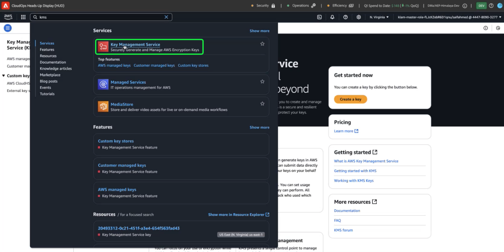
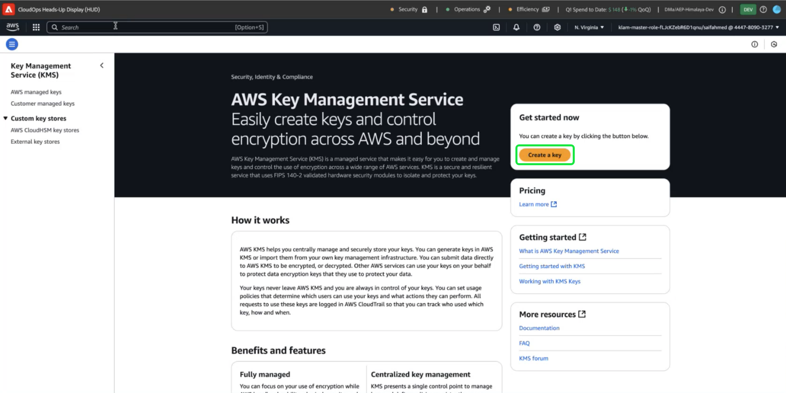
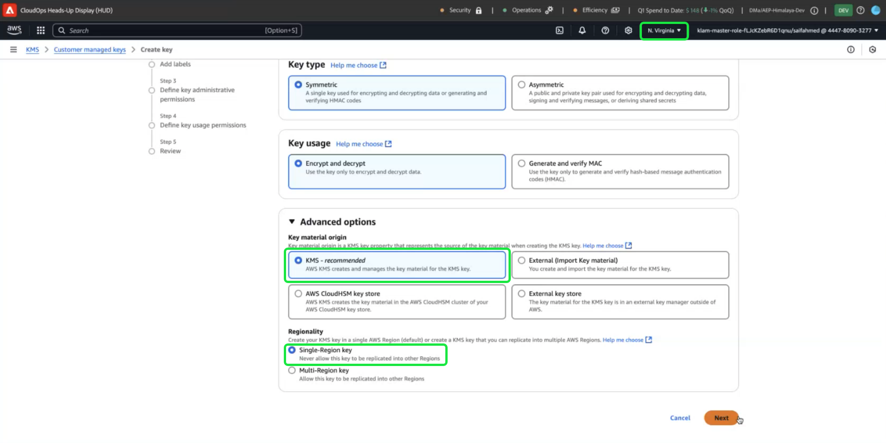
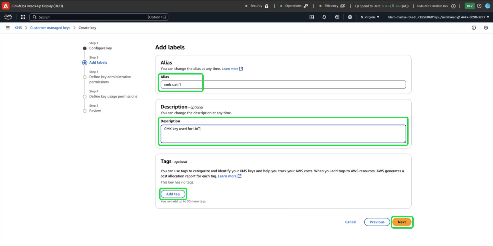

# How to use Amazon Web Services Key Management Service for Adobe Experience Platform data encryption

>[!AVAILABILITY]
>
>Customer-Managed Keys (CMK) on AWS are supported for Privacy and Security Shield but are not available for Healthcare Shield.
>CMK on Azure are supported for both Privacy and Security Shield as well as Healthcare Shield. See the [Customer Managed Keys overview](../customer-managed-keys/overview.md) for more information.

Enhance your security with Amazon Web Services Key Management Service (KMS). Use KMS to create, manage, and control encryption keys seamlessly across AWS services. Simplify compliance, streamline operations with automation, and eliminate the need to maintain your own key management infrastructure.

>[!IMPORTANT]
>
>Adobe Experience Platform encrypts data at rest by default using system-managed keys. You gain greater control over your data security by enabling customer-managed keys,however, this is a one-way configuration. Once CMK is enabled, you cannot revert to system-managed keys. It is your responsibility to securely manage your keys to ensure uninterrupted access to your data and prevent potential inaccessibility.

This guides details the process to create and manage encryption keys in AWS Key Management Service (KMS) to secure your data in Adobe Experience Platform.

## Prerequisites {#prerequisites}

Before continuing with this document, you should have a good understanding of the following key concepts and capabilities. They are described below:

- **AWS Key Management Service (KMS)**: Understand the fundamentals of AWS KMS, including how to create, manage, and rotate encryption keys. RTefer to the [official KMS documentation](https://docs.aws.amazon.com/kms/) to learn more.
- **Identity and Access Management (IAM) Policies in AWS**: IAM is a service that enables you to manage access to AWS services and resources securely. Use IAM to:
  - Define which users, groups, and roles have access to specific resources.
  - Specify what actions they are allowed or denied to perform.
  - Implement fine-grained access control by assigning permissions using IAM policies.
Refer to the [IAM Policies for AWS KMS official documentation](https://docs.aws.amazon.com/kms/latest/developerguide/iam-policies.html) for more information.
- **Data Security in Adobe Experience Platform**: Explore how Platform ensures data security and integrates with external services like AWS KMS for encryption. Platform protects data with HTTPS TLS v1.2 for transit, cloud-provider encryption at rest, isolated storage, and customizable authentication and encryption options. See the [governance, privacy, and security overview](../overview.md), or the document on [data encryption in Adobe Experience Platform](../encryption.md) for more information on how your data is kept secure.
- **AWS Management Console**: A central hub where you can access and manage all your AWS services from one web-based application. From here you can use the search bar to quickly find tools, check notifications, manage your account and billing, and customize your settings. Refer to the [official AWS management console documentation](https://docs.aws.amazon.com/awsconsolehelpdocs/latest/gsg/what-is.html) for more information.

## Get started {#get-started}

This guide requires that you already have access to an Amazon Web Services account and access to the management console. Follow the steps below to get started:

1. **Verify Permissions**: Ensure that you have the necessary AWS Identity and Access Management (IAM) permissions to create, manage, and use encryption keys within KMS. To verify your permissions:
   - First, access the [IAM Policy Simulator](https://policysim.aws.amazon.com/).
   - Select your user account or role.
   - Simulate KMS actions like `kms:CreateKey` or `kms:Encrypt`.
If the simulation returns an error or you are unsure about your permissions, consult your AWS administrator for assistance.

1. **Check your AWS account configuration**: Confirm that your AWS account is enabled to use AWS KMS services. Most accounts have KMS access enabled by default, but you can review your account setup by visiting the [AWS Management Console](https://aws.amazon.com/console/). For more details, see the [AWS Key Management Service Developer guide](https://docs.aws.amazon.com/kms/latest/developerguide/overview.html).

1. **Select a supported region**: AWS KMS is available in specific regions. Make sure you are operating in a region where KMS is supported. You can view a complete list of supported regions in the [AWS KMS endpoints and quotas list](https://aws.amazon.com/about-aws/global-infrastructure/regional-product-services/). 

<!--  -->

### Steps to Complete the Workflow:

<!-- Add into paragraph -->

<!-- Update important note below to mention region! Add a screenshot. -->

>[!IMPORTANT]
>
>Ensure the secure storage, access, and availability of the encryption keys. You are responsible for managing your keys and preventing disruptions to Platform operations.

1. **Log In to AWS Account**
   - Access your AWS account to begin managing your encryption keys.

2. **Navigate to AWS Key Management Service (KMS)**

Go to the AWS Management Console and select **Key Management Service (KMS)** from the services menu.

1. **Create a New Key**

The [!DNL Key Management Service (KMS)] workspace appears. Select **[!DNL Create a key]**.

## Configure your key {#configure-key}

The Configure Key workflow appears. The default settings are symetric key type and encrypt and decrypt key usage. Ensure that the **[!DNL Symmetric]** key type, and **[!DNL Encrypt and Decrypt]** key usage options are selected. 

Expand the **[!DNL Advanced options]** dropdown menu. You are recommended to use the **[!DNL KMS]** option as this allows AWS to create and mange the key material. The [!DNL KMS] option is selected by default.
 
>[!NOTE]
>
>If you already have an existing key, you can import external key material or use the AWS [!DNL CloudHSM] key store. These options are not covered in the scope of this document.

Next, select the [!DNL Regionality] setting. You must select **[!DNL Single-Region key]**, followed by **[!DNL Next]** to proceed onto step two.

>[!IMPORTANT]
>
>AWS enforces region restrictions for KMS keys. This means that the key must be in the same region as your Adobe account. Adobe can only access KMS keys located within your account's region. Ensure that the region you select matches the region of your Adobe single-tenant account.

## Add labels {#add-labels}

Next, configure the [!DNL Alias] and [!DNL Tags] fields to help you manage and locate your encryption key from the AWS KMS console.

Enter a descriptive label for your key in the **[!DNL Alias]** input field. The alias acts as a user-friendly identifier, to quickly locate the key using the search bar in the AWS KMS console. To prevent confusion, choose a meaningful name that reflects the key's purpose, such as "Adobe-AEP-Key" or "Customer-Encryption-Key,". You can also include a description of the key if the key alias is insufficient to describe its purpose.

Finally, assign metadata to your key by adding key-value pairs in the [!DNL Tags] section. This is an optional step, but you are recommended to add tags to categorize and filter your AWS resources. For example, if your organization uses multiple Adobe-related resources, you can tag them with "Adobe" or "Experience-Platform." This extra step makes it simple to search for and manage all your associated resources in the AWS Management Console. Select **[!DNL Add tag]** to being the process.

<!-- I do not have an AWS account with which to document the Add tag process as yet. -->

When you are satisfied with your settings, select **[!DNL Next]** to continue the workflow.

1. **Configure Key Details**
   - Provide the required details for the key, including a name, description, and key usage permissions.

2. **Define Key Permissions**
   - Assign users, roles, or AWS services with permission to use the key. This ensures secure and controlled access.

3. **Review and Complete Key Creation**
   - Verify the key details and permissions before completing the setup. Once done, your key will be ready for use.

4. **Integrate the Key with Adobe Experience Platform**
   - Obtain the JSON policy from the Adobe Experience Platform UI and apply it to your AWS KMS key to link it to the platform securely.

5. **Understand Key Revocation Behavior**
   - Be aware that revoking or disabling the key will make your Adobe Experience Platform data inaccessible. This action is irreversible and should be performed with caution.

6. **Monitor and Manage Key Rotation**
   - If required, set up automatic key rotation to enhance security. Note that rotation does not affect data availability in Adobe Experience Platform.

7.  **Acknowledge the Irreversible Nature of Customer-Managed Encryption**
    - Once customer-managed encryption is enabled, it cannot be reverted to system-managed encryption. This ensures you retain full control and accountability for your keys.

## Key revocation

<!-- Soon.... -->

<!-- 
Implications of Key Revocation:

Describe the propagation timelines when access to encryption keys is revoked:
 - Primary data stores: Data becomes inaccessible within a few minutes to 24 hours. - fact check this.
- Cached/Transient data stores: Inaccessibility occurs within up to 7 days.

NOTE: It is important to understand the downstream impact before you revoke key access.
 -->

## Next Steps

by reading this document, you have learned ...
