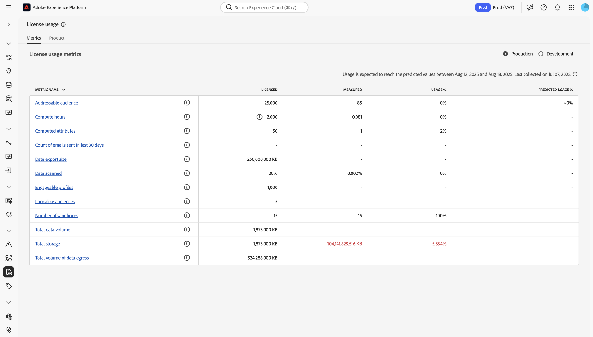
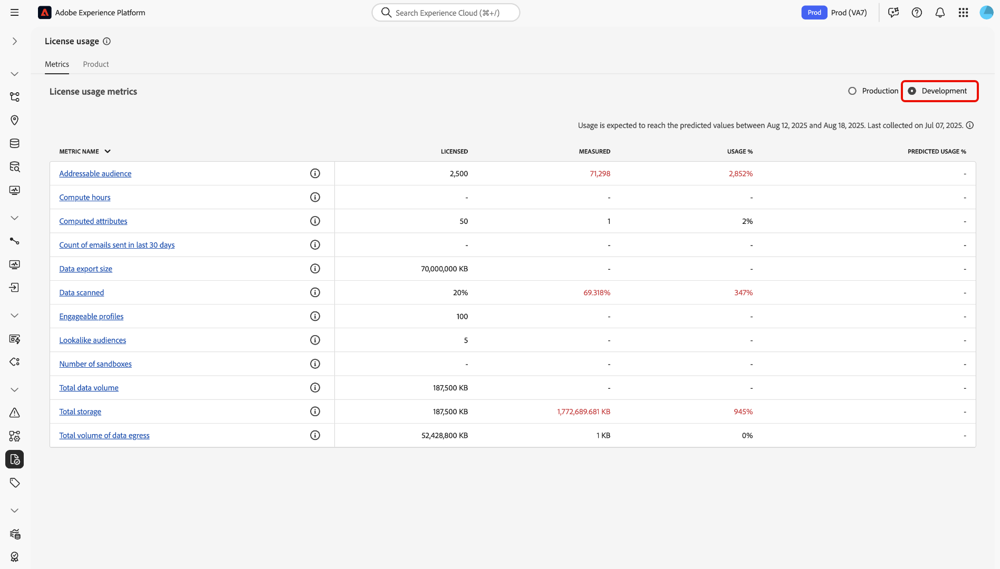
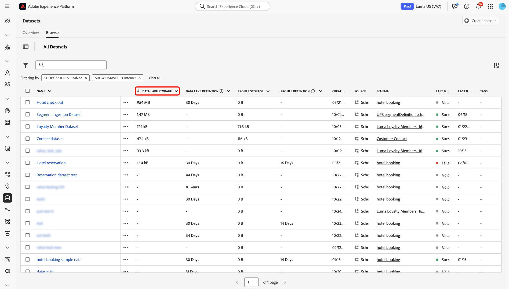
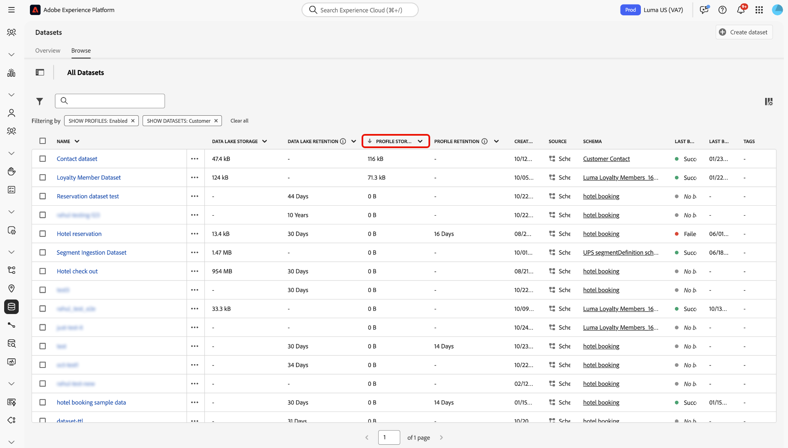
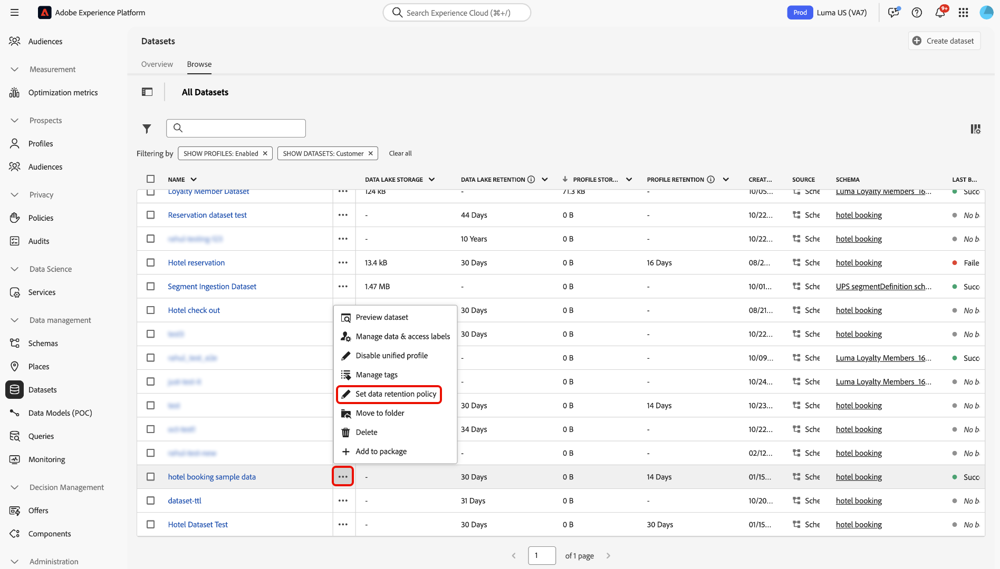
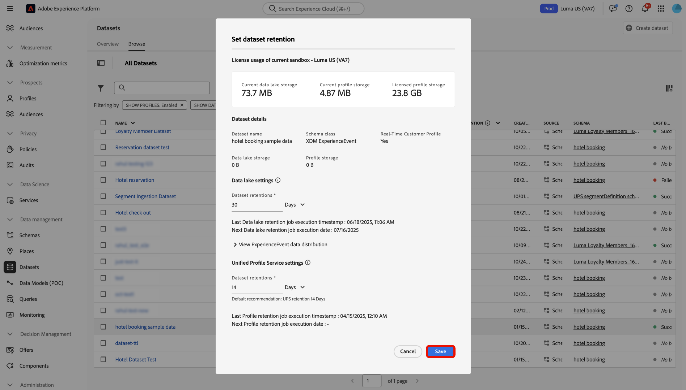
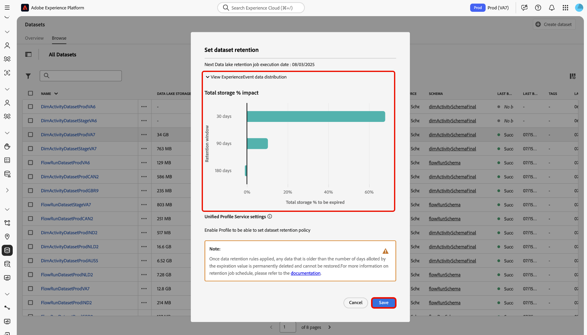

# Data management license entitlement best practices 

Adobe Experience Platform is an open system that transforms your data into robust customer profiles that update in real time and uses AI-driven insights to help you to deliver the right experiences across every channel. You can ingress data of varying types, volumes, and histories to Experience Platform using sources and then cater that data to use cases ranging from segmentation and personalization to analytics and machine learning.

Experience Platform offers licenses that establish the number of profiles that you can create and the amount of data that you can bring in. Given the capacity to bring in any source, volume, or history of data, it is possible to exceed your licensing entitlements as your data volumes grow.

Read this guide for best practices to follow and tools you can use to better manage your license entitlements with Experience Platform.

## Summary of features {#summary-of-features}

Use the best practices and tools outlined in this document to better manage your license entitlement usage within Experience Platform. This document is updated as additional features are released to help provide visibility and control to all Experience Platform customers.

The following table outlines the list of currently available features at your disposal, to better manage your license usage entitlement.

| Feature | Description |
| --- | --- |
| [Dataset UI - Experience Event data retention](../../catalog/datasets/user-guide.md#data-retention-policy) | Configure a fixed retention period for data in data lake and Profile store. Records are deleted as the configured retention period ends. |
| [Enable/Disable Datasets for Real-Time Customer Profile](../../catalog/datasets/user-guide.md) | Enable or disable dataset ingestion into Real-Time Customer Profile. |
| [Experience Event expirations in Profile store](../../profile/event-expirations.md) | Apply an expiration time for all events ingested into a Profile-enabled dataset. Please contact your Adobe account team or Customer Care to enable this feature. |
| [Adobe Analytics Data Prep filters](../../sources/tutorials/ui/create/adobe-applications/analytics.md#filtering-for-real-time-customer-profile) | Apply [!DNL Kafka] filters to exclude unnecessary data from ingestion. |
| [Adobe Audience Manager source connector filters](../../sources/tutorials/ui/create/adobe-applications/audience-manager.md) | Apply Audience Manager source connection filters to exclude unnecessary data from ingestion. |
| [Event forwarding data filters](../../tags/ui/event-forwarding/overview.md) | Apply server-side [!DNL Kafka] filters to exclude unnecessary data from ingestion.  See the documentation on [tag rules](../../tags/ui/managing-resources/rules.md) for additional information. |
| [License Usage Dashboard UI](../../dashboards/guides/license-usage.md#license-usage-dashboard-data) | Monitor your organization's consumption of Experience Platform products against licensed entitlements. Access daily usage snapshots, predictive trends, and detailed sandbox-level data to support proactive license management. |
| [Dataset Overlap Report API](../../profile/tutorials/dataset-overlap-report.md) | Outputs the datasets that contributes the most to your Addressable Audience. |
| [Identity Overlap Report API](../../profile/api/preview-sample-status.md#generate-the-identity-namespace-overlap-report) | Outputs the identity namespaces that contribute the most to your Addressable Audience. |
| [Pseudonymous Profile data expirations](../../profile/pseudonymous-profiles.md) | Configure data expiration times for Pseudonymous profiles and automatically remove data from the Profile store. |

{style="table-layout:auto"}

## Understanding Experience Platform data storage

Experience Platform is primarily composed of two data repositories: the data lake and the Profile store.

Data lake primarily serves the following purposes:

* Acts as the staging area for onboarding data into Experience Platform;
* Acts as the long-term data storage for all Experience Platform data;
* Enables use cases such as data analytics and data science.

The **Profile store** is where customer profiles are created and primarily serves the following purposes:

* Acts as a data storage for profiles that are used to support real-time experiences;
* Enables use cases such as segmentation, activation, and personalization.

>[!NOTE]
>
>Your access to the [!DNL data lake] can depend on the product SKU that you purchased. For more information on product SKUs, please speak with your Adobe representative.

## License usage {#license-usage}

When you license Experience Platform, you are provided with license usage entitlements that vary depending on SKU:

**[!DNL Addressable Audience]**: the total number of customer profiles that are contractually allowed in Experience Platform, including both known and pseudonymous profiles.

**[!DNL Total Data Volume]**: the total amount of data available for Real-Time Customer Profile to use in engagement workflows.

The availability of these metrics and the specific definition of each of these metrics varies depending on the licensing that your organization has purchased.

## License usage dashboard

The Adobe Experience Platform UI provides a dashboard through which you can view a snapshot of your organization's license-related data for Experience Platform. The data in the dashboard is displayed exactly as it appears at the specific point in time when the snapshot was taken. The snapshot is neither an approximation nor a sample of data, and the dashboard is not updating in real-time.

For more information, see the guide on [using the license usage dashboard on Experience Platform UI](../../dashboards/guides/license-usage.md#license-usage-dashboard-data).

## Data management best practices

The following sections outline best practices to follow to better manage your data.

### Understanding your data

Not all data is the same in Adobe Experience Platform. Some data may be dense, but low in value, while others may be sparse, but high in value. Some data may lose value as soon as its generated, while others may be valuable for months, if not years.

There are three dimensions to consider in understanding the value of your data:

| Dimension | Description | Example |
| --- | --- | --- |
| Volume | Represents the amount and totality of data ingested. | Web clicks - high in volume and moderate in fidelity. Value may diminish quickly. |
| Timespan | Represents the length of time that ingested data continues to stay valuable. | Offline purchases - moderate in volume and fidelity, but may be valuable for long periods of time. |
| Fidelity | Represents how rich the data is with information. | Customer accounts - low in volume, but high in fidelity. Can be valuable beyond the lifetime of a customer. |

### Data Management tools {#data-management-tools}

There are two central scenarios to consider when ensuring that your data usage remains within your license entitlement limits:

### What data to bring into Experience Platform?

Data can be ingested into one or multiple systems in Experience Platform, namely the [!DNL data lake] and/or the Profile store. This means that different data can exist in both systems for a variety of different use cases. For example, you may want to hold historical data in the [!DNL data lake], but not in the Profile store. You can select which data to send to the Profile store by enabling a dataset for Profile ingestion.

>[!NOTE]
>
>Your access to the [!DNL data lake] can depend on the product SKU that you purchased. For more information on product SKUs, please speak with your Adobe representative.

You must also decide whether to enable lookup datasets for Real-Time Customer Profile, in addition to using them for general lookup purposes. Follow the guidance below to avoid exceeding your license limits.

#### Profile enablement for lookup datasets {#profile-enablement-lookup-datasets}

A lookup dataset is a dataset you enable in Experience Platform so applications can reference it at runtime. Use lookup datasets to store relatively static, keyed information such as product details, store metadata, or offer configurations, rather than datasets whose primary purpose is to contribute profile attributes (for example, name, email, or loyalty tier) or experience events (for example, page views or purchases).

Experience Platform applications such as [!DNL Journey Optimizer] and other decisioning applications use these datasets to retrieve additional fields based on a key (for example, product ID or store ID) and to enrich personalization, decisioning, and orchestration workflows. Enabling lookup datasets for Real-Time Customer Profile affects your profile data volume, so use the following guidance to stay within your licensing entitlements.

When you configure datasets for lookup purposes, consider the two roles that a dataset can play in Experience Platform:

* **Lookup datasets**: Allow applications to retrieve reference data, for services like personalization and decisioning in [!DNL Journey Optimizer].
* **Profile-enabled datasets**: Contribute attributes and events to unified customer profiles in Real-Time Customer Profile. These datasets make their fields available for segmentation and activation use cases.

>[!IMPORTANT]
>
>Only enable a lookup dataset for Real-Time Customer Profile when you must use fields from that dataset in Real-Time Customer Profile (for example, for audience definitions, activation, or multi-entity segmentation). Enabling a lookup dataset for Real-Time Customer Profile increases your profile data volume. For more information, see the tutorial on [multi-entity segmentation](../../segmentation/tutorials/multi-entity-segmentation.md).

**When to enable datasets for Real-Time Customer Profile:**

Enable a dataset for Real-Time Customer Profile in the following cases:

* The dataset contains customer attributes that you need to unify into customer profiles (for example, loyalty tier, preferences, account information).
* The dataset contains experience events that contribute to customer behavior analysis and segmentation.
* The dataset contains reference or enrichment attributes (for example, product, store, or account attributes) that you must use in audience definitions, including multi-entity segmentation, or downstream activation.

**When NOT to enable datasets for Real-Time Customer Profile:**

Avoid enabling a dataset for Real-Time Customer Profile in the following cases:

* The dataset contains reference data such as product catalogs, SKU details, store locations, or other non-customer data, and you do not need these attributes in Real-Time Customer Profile for segmentation or activation, including multi-entity segmentation.
* The dataset contains enrichment data that is only used in lookups at run time and is not required as part of the customer identity or in audience definitions.

### What data to keep?

You can apply both data ingestion filters and expiration rules to remove data that has become obsolete for your use cases. Typically, behavioral data (such as Analytics data) consumes significantly more storage than record data (such as CRM data). For example, many Experience Platform users have upwards of up to 90% of profiles being populated by behavioral data alone, in comparison to that of record data. Therefore, managing your behavioral data is critical in ensuring compliance within your license entitlements.

There are a number of tools that you can leverage to stay within your license usage entitlements:

* [Ingestion filters](#ingestion-filters)
* [Profile store](#profile-service)

### Identity Service and addressable audience {#identity-service}

Identity graphs do not count towards your total addressable audience entitlement because addressable audience refers to your total count of customer profiles.

However, identity graph limits can affect your addressable audience due to splitting identities. For example, if the oldest ECID is removed from the graph, ECID will continue to exist in Real-Time Customer Profile as a pseudonymous profile. You can set [Pseudonymous profile data expirations](../../profile/pseudonymous-profiles.md) to circumvent this behavior. For more information, read the [guardrails for Identity Service data](../../identity-service/guardrails.md).

### Ingestion filters {#ingestion-filters}

Ingestion filters allow you to bring in only the data that is needed for your use cases and filters out all events that are not required.

| Ingestion filter | Description |
| --- | --- |
| Adobe Audience Manager source filtering | When you create an Adobe Audience Manager source connection, you can pick and choose which segments and traits to bring into the [!DNL data lake] and Real-Time Customer Profile, rather than ingesting the Audience Manager data in its entirety. See the guide on [creating an Audience Manager source connection](../../sources/tutorials/ui/create/adobe-applications/audience-manager.md) for more information. |
| Adobe Analytics Data Prep | You can use [!DNL Data Prep] functionalities when creating an Analytics source connection to filter out data that is not required for your use cases. Through [!DNL Data Prep], you can define which attributes/columns need to be published to Profile. You can also provide conditional statements to inform Experience Platform whether data is expected to be published to Profile, or just to the [!DNL data lake]. See the guide on [creating an Analytics source connection](../../sources/tutorials/ui/create/adobe-applications/analytics.md) for more information. |
| Support for enable/disable datasets for Profile | To ingest data into the Real-Time Customer Profile, you must enable a dataset for use in the Profile store. Doing so, adds to your [!DNL Addressable Audience] and [!DNL Total Data Volume] entitlements. Once a dataset is no longer required for customer profile use cases, you can disable that dataset's integration to Profile to ensure that your data remains license compliant. See the guide on [enabling and disabling datasets for Profile](../../catalog/datasets/enable-for-profile.md) for more information. |
| Web SDK and Mobile SDK data exclusion | There are two types of data collected by Web and Mobile SDK: data that is collected automatically and data that is explicitly collected by your developer. To better manage license compliance, you can disable automatic data collection in the configuration of the SDK through the context setting. Custom data can also be removed or not set by your developer. |
| Server-side forwarding data exclusion | If you are sending data to Experience Platform using server-side forwarding, you can exclude what data is sent by either removing the mapping in a rule action to exclude it across all events, or by adding conditions to the rule so that data only fires for certain events. See the documentation on [events and conditions](/help/tags/ui/managing-resources/rules.md#events-and-conditions-if) for more information. |
| Filter data at the source level | You can use logical and comparison operators to filter row-level data from your sources before creating a connection and ingesting data to Experience Platform. For more information, read the guide on [filtering row-level data for a source using the [!DNL Flow Service] API](../../sources/tutorials/api/filter.md). |

{style="table-layout:auto"}

### Profile store {#profile-service}

The Profile store is composed of the following components:

| Profile store component | Description |
| --- | --- |
| Profile fragments | Each customer profile is composed of multiple **profile fragments** that have been merged to form a single view of that customer. For example, if a customer interacts with your brand across several channels, your organization will have multiple **profile fragments** related to that single customer appearing in multiple datasets. When these fragments are ingested into Experience Platform, they are stitched together using the identity graph to create a single profile for that customer. **Profile fragments** consist of an identity namespace as the identifier, with associated record data and/or time-series data. |
| Record data (Attributes) | A profile is a representation of a subject, an organization or an individual, composed of many **Attributes** (also known as **record data**). For example, the profile of a product may include a SKU and description, whereas the profile of a person contains information like first name, last name, and email address. **Record data** is usually low/moderate in volume, but valuable for long periods of time. |
| Time-series data (Behavior) | **Time-series data** provides information about a user behavior. Represented by the standard schema class Experience Data Model (XDM) [!DNL ExperienceEvent], time-series data can describe events such as items being added to a cart, links being clicked, and videos viewed. The value of behavioral may diminish over time. |
| Identity namespace (identities) | As customer data comes together, it is merged into a single profile through the use of **identity namespaces**, and the ability to stich these identities together as more information becomes known about the user. See the [identity namespaces overview](../../identity-service/features/namespaces.md) for more information. |

{style="table-layout:auto"}

### Profile store Composition Reports

There are a number of reports available to help you understand the composition of the Profile store. These reports help you make informed decisions about how and where to set your Experience Event expirations to better optimize your license usage:

* **Dataset Overlap Report API**: Exposes the datasets that contribute the most to your Addressable Audience. You can use this report to identify which [!DNL ExperienceEvent] datasets to set an expiration for. See the tutorial on [generating the dataset overlap report](../../profile/tutorials/dataset-overlap-report.md) for more information.
* **Identity Overlap Report API**: Exposes the identity namespaces that contribute the most to your Addressable Audience. See the tutorial on [generating the identity overlap report](../../profile/api/preview-sample-status.md#generate-the-identity-namespace-overlap-report) for more information.
<!-- * **Unknown Profiles Report API**: Exposes the impact of applying pseudonymous expirations for different time thresholds. You can use this report to identify which pseudonymous expirations threshold to apply. See the tutorial on [generating the unknown profiles report](../../profile/api/preview-sample-status.md#generate-the-unknown-profiles-report) for more information.
-->

### Pseudonymous Profile data expirations {#pseudonymous-profile-expirations}

Use the Pseudonymous profiles data expiration capability to automatically remove data from that is no longer valid or useful for your use cases from the Profile store. Pseudonymous Profile data expiration removes both event and profile records. As a result, this setting will reduce Addressable Audience volumes. For more information on this feature, please read the [Pseudonymous Profile data expiration overview](../../profile/pseudonymous-profiles.md).

### Dataset UI - Experience Event Dataset retention {#data-retention}

Configure dataset expiration and retention settings to enforce a fixed retention period for your data in data lake and Profile store. Once the retention period ends, data is deleted. Experience Event data expiration only removes events and does not remove profile class data, which will reduce [total data volume](total-data-volume.md) in license usage metrics. For more information, read the guide on [setting data retention policy](../../catalog/datasets/user-guide.md#data-retention-policy).

### Profile Experience Event expirations {#event-expirations}

Configure expiration times to automatically remove behavioral data from your Profile-enabled dataset once they are no longer valuable for your use cases. Read the overview on [Experience Event expirations](../../profile/event-expirations.md) for more information.

## Summary of best practices for license usage compliancy {#best-practices}

The following is a list of some recommended best practices that you can follow to ensure better adherence to your license usage entitlement:

* Use the [license usage dashboard](../../dashboards/guides/license-usage.md) to track and monitor customer usage trends. This allows you to get ahead of any potential overages that may incur.
* Configure [ingestion filters](#ingestion-filters) by identifying the events required for your segmentation and personalization use cases. This allows you to send only important events required for your use cases.
* Ensure that you have only [enabled datasets for profile](#ingestion-filters) that are required for your segmentation and personalization use cases. 
* Configure [Experience Event expirations](../../catalog/datasets/user-guide.md#data-retention-policy) and [Pseudonymous Profile data expirations](../../profile/pseudonymous-profiles.md) for high-frequency data like web data.
* Configure [Time-to-Live (TTL) retention policies for Experience Event datasets](../../catalog/datasets/experience-event-dataset-retention-ttl-guide.md) in the data lake to automatically remove outdated records and optimize storage usage in line with your license entitlements.
* Periodically check the [Profile Composition Reports](#profile-store-composition-reports) to understand your Profile store composition. This allows you to understand the data sources contributing most to your license usage consumption.

## Use case: License Usage Compliance

### Why consider this use case

By ensuring your compliance with **license usage provisions** for both data lake and Profile storage, you can confidently prevent overages, optimize costs, and align your data retention policies with your business requirements.

### Prerequisites and planning

Consider the following prerequisites in your planning process:

* **Access and permissions**:
  * Ensure that you have the **Manage Datasets** permission to use Experience Event TTL.
  * Ensure that you have the **Manage Profile Settings** to use Pseudonymous Profile TTL.
* **Understanding of data retention policy**:
  * Organizational policies regarding data retention and compliance
  * Business needs for data analytics and segmentation lookback windows

### UI functionality, Experience Platform components, and Experience Cloud products that you will use

To successfully implement this use case, you must use multiple areas of Adobe Experience Platform. Ensure you have the necessary attribute-based access control permissions for all these areas, or ask your system administrator to grant them.

* License usage dashboard - View your current entitlement usage at the sandbox level.
* Dataset management - Monitor and manage dataset-level retention policies.
* Audiences (Real-Time Customer Profile) - Ensure segmentation rules look back window aligns with data retention windows.
* Monitoring and alerts - Track updates and receive insights on dataset retention operations.

### How to achieve the use case: Step-by-step instructions

Read through the sections below, which include links to further documentation, to complete each of the steps in the high-level overview above.

**Check your current license usage**

First, navigate to the **license usage dashboard** and review your entitlement usage at the sandbox level.

>[!BEGINTABS]

>[!TAB Production sandbox]

Use the [!UICONTROL Metrics] interface to view your license usage metrics. The interface displays information for your production sandbox by default.

>[!TAB Development sandbox]

Select [!UICONTROL Development] to view license usage metrics related to your development sandboxes.

>[!ENDTABS]

For more information, read the documentation on [using the license usage dashboard](../../dashboards/guides/license-usage.md).

**Analyze dataset-level storage usage**

Use the **Dataset browse view** to review your dataset usage metrics for both data lake and Real-Time Customer Profile. Select the column headers for either **[!UICONTROL Data Lake Storage]** or **[!UICONTROL Profile Storage]**, then select **[!UICONTROL Sort Descending]** from the pop up panel.

>[!BEGINTABS]

>[!TAB Data lake storage]

Your datasets in data lake are sorted by storage size. Use this feature to identify the largest consumers of storage in data lake.

>[!TAB Profile storage]

Your datasets in Profile are sorted by storage size. Use this feature to identify the largest consumers of storage in Profile.

>[!ENDTABS]

**Evaluate and configure retention rule**

Next, determine if your datasets have the appropriate retention policies based on license limits and business requirements for Analytics and Segmentation. To view a dataset's retention policy, select the ellipses (`...`) beside your dataset, then select **[!UICONTROL Set data retention policy]**.

The *[!UICONTROL Set dataset retention]* interface appears. Use this interface to configure a retention policy for your dataset. You can also use it to view how much storage space your dataset is consuming in either the data lake or Profile.

You can further analyze the retention impact of your dataset using the impact forecaster. Select **[!UICONTROL View ExperienceEvent data distribution]** to view a chart that displays your retention window and the total percentage of storage that is set to expire.

When finished, select **[!UICONTROL Save]**

**Validate retention changes**

Once you have applied your retention policies, you can use the following tools to validate your changes:

* [Dataset usage metrics](../../catalog/datasets/user-guide.md#enhanced-visibility-of-retention-periods-and-storage-metrics) in the dataset browse view.
* The [monitoring dashboard](../../dataflows/ui/monitor.md) to view and analyze impact of retention.
* The [license usage dashboard](../../dashboards/guides/license-usage.md) to view daily snapshots, predictive trends, and sandbox-level insights.
